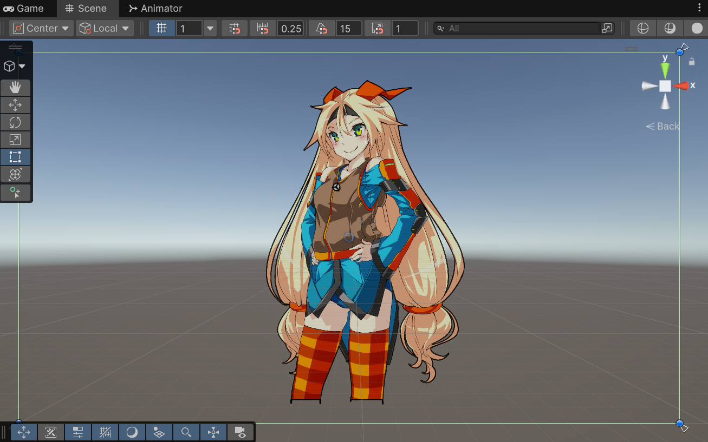
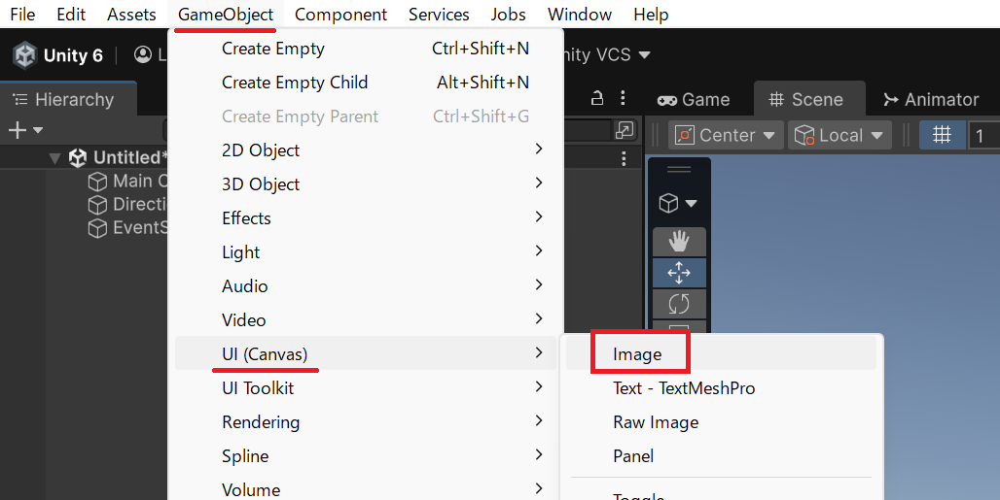
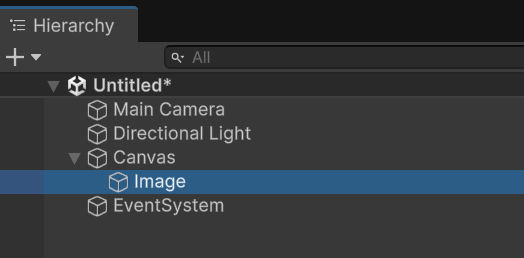
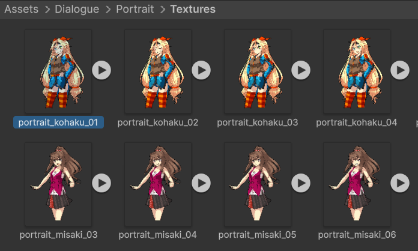
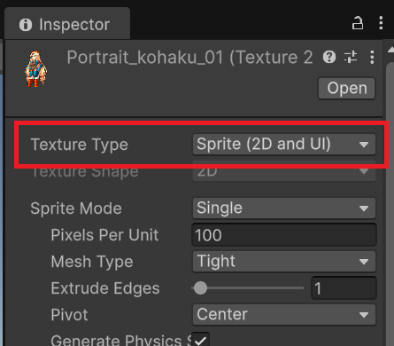
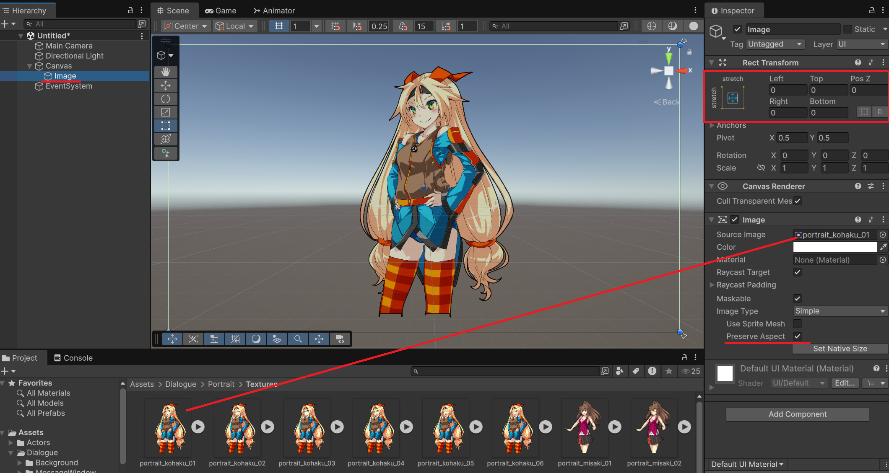

# キャラクター配置

会話シーンにキャラクターの立ち絵を表示します。Unity の UI Image コンポーネントを Canvas 上に配置し、スクリプトからアルファ値を制御してフェードイン・フェードアウトを実装します。



## 学習目標

このページを読み終えると、以下のことができるようになります。

- Canvas の下に Image を配置してキャラクター画像を表示できる
- スクリプトから `Image.color` を操作してアルファ値を変更できる
- `Update()` と `Time.deltaTime` を使ってなめらかなフェードを実装できる

## 前提知識

- [メッセージウィンドウ — 文字送り](/unity-csharp-learning/conversation-scenes/typewriter-animation/) を読んでいること（`Time.deltaTime` を使った時間制御を理解していること）

---

## Canvas に Image を配置する

まず、キャラクター画像を表示するための Image ゲームオブジェクトを Canvas の下に追加します。上部 GameObject メニューをクリックし、「UI(Canvas)」→「Image」を選択してください。



> 💡 **ポイント**: Canvas がまだシーンにない場合は、「GameObject」メニューから「UI」→「Image」を選択すると Canvas ごと自動的に作成されます。

Hierarchy ビューに Image ゲームオブジェクトが追加され、Canvas の子オブジェクトとして配置されます。



### Source Image を設定する

Inspector ビューで Image ゲームオブジェクトを選択すると、`Image` コンポーネントが表示されます。「Source Image」フィールドに、表示したいキャラクター画像のスプライトアセットを設定します。

まず、元となる PNG や JPG 形式の画像ファイルを Unity プロジェクトの Assets フォルダーにドラッグ&ドロップしてインポートします。



Project ビューでインポートした画像アセットを選択し、Inspector ビューで「Texture Type」を「Sprite (2D and UI)」に変更してください。



これで `Image` コンポーネントの Source Image としてキャラクター画像が設定できます。Project ビューの画像アセットをドラッグ&ドロップしてください。




### 位置とサイズを調整する

追加した Image ゲームオブジェクトのサイズも画像に合わせて整えましょう。Rect Transform コンポーネントで画像の位置とサイズを設定します。キャラクター立ち絵は画面左や右に配置することが多いため、Anchor を画面の左下や右下に合わせて調整してください。「Pos X」「Pos Y」「Width」「Height」に適切な値を入力します。

この場ではサンプルなので1画像のみ画面全体を使って表示してみましょう。Anchor Presets を水平・垂直方向ともに stretch に変更し、Left, Top, Right, Bottom を 0 に設定してください。これで Image ゲームオブジェクトの範囲が親 Canvas のサイズ全体に合わせられます。

### Preserve Aspect を有効にする

キャラクター画像のアスペクト比（縦横比）を維持したい場合は、Image コンポーネントの「Preserve Aspect」チェックボックスをオンにします。これにより、Rect Transform の矩形にあわせて画像が引き伸ばされることなく、元の縦横比を保ったまま表示されます。

---

## 最初のスクリプト — アルファ値を即座に切り替える

Image を表示・非表示にする一番シンプルな方法は、`Image.color` のアルファ値を直接 `0` か `1` に切り替えることです。まず、この最もシンプルな版を作りましょう。

Image ゲームオブジェクトに `CharacterView` という名前の C# スクリプトを新規作成して追加してください。

**`Image.color`** — Image が描画に使用する色（`Color` 型）を取得または設定するプロパティです。`Color` 型は赤（r）・緑（g）・青（b）・アルファ（a）の 4 成分を持ちます。アルファ値 `a` は `0` で完全に透明、`1` で完全に不透明です。<!-- [公式ドキュメント]() -->

**書式：Image.color プロパティ**
```csharp
Color Image.color { get; set; }
```

| 戻り値 / 代入値 | 型 | 説明 |
|---|---|---|
| `color` | `Color` | RGBA の 4 成分を持つ色の値 |

`Image.color` にアルファ値だけ変更した新しい `Color` を代入するには、次の 3 ステップを踏みます。

1. 現在の `Image.color` を一時変数に取り出す
2. 変数の `a` 成分（アルファ）だけ書き換える
3. 書き換えた変数を `Image.color` に代入し直す

> 💡 **なぜこの手順が必要？**: `Color` は**値型（struct）**であるため、`_image.color.a = 1f;` と直接書くことができません。一度変数にコピーして変更し、代入し直す必要があります。

以下は、マウスボタンを押すことで画像の表示・非表示を行うスクリプトです。左ボタンで表示・右ボタンで非表示になります。

```csharp
using UnityEngine;
using UnityEngine.EventSystems;
using UnityEngine.UI;

public class CharacterView : MonoBehaviour, IPointerClickHandler
{
    [SerializeField]
    private Image _image = default; // Inspector ビューから設定する

    public void OnPointerClick(PointerEventData eventData)
    {
        if (eventData.button == PointerEventData.InputButton.Left) // 左クリック
        {
            Show();
        }
        else if (eventData.button == PointerEventData.InputButton.Right) // 右クリック
        {
            Hide();
        }
    }

    public void Show()
    {
        var color = _image.color; // 現在の色を取り出す
        color.a = 1f;             // アルファだけ変更する
        _image.color = color;     // 代入し直す
    }

    public void Hide()
    {
        var color = _image.color;
        color.a = 0f;
        _image.color = color;
    }
}
```

Inspector ビューで `_image` フィールドに Image コンポーネントを設定してください。この時点では `Show()` / `Hide()` を呼ぶとアルファ値が瞬時に切り替わります。

---

## なめらかなフェードを実装する

瞬時の切り替えでは演出として味気ないため、時間をかけてなめらかにアルファ値が変化するフェードを実装します。

### 考え方 — 現在値・目標値・変化量

フェードを実現するには 3 つの値を組み合わせます。

| 値 | 役割 |
|---|---|
| **現在のアルファ**（`Image.color.a`） | 今フレームの実際の透明度 |
| **目標のアルファ**（`_targetAlpha`） | フェードイン後に到達したい値（`1f` or `0f`） |
| **1 秒あたりの変化量**（`_fadeSpeed`） | 毎フレームどれだけ目標に近づくかを決める係数 |

`Update()` が毎フレーム呼ばれるたびに、現在のアルファを目標アルファに向けて少しずつ動かすことでなめらかなフェードになります。

### Mathf.MoveTowards の紹介

フレームごとに「現在値を目標値に向けて一定量動かす」という処理には **`Mathf.MoveTowards`** が便利です。

**`Mathf.MoveTowards`** — 現在値を目標値に向けて、最大 `maxDelta` だけ近づけた値を返すメソッドです。目標値を超えることはありません。<!-- [公式ドキュメント]() -->

**書式：Mathf.MoveTowards メソッド**
```csharp
float Mathf.MoveTowards(float current, float target, float maxDelta);
```

| パラメータ | 型 | 説明 |
|---|---|---|
| `current` | `float` | 現在の値 |
| `target` | `float` | 近づきたい目標の値 |
| `maxDelta` | `float` | 1 ステップで近づける最大量 |

`maxDelta` に `_fadeSpeed * Time.deltaTime` を渡すことで、フレームレートによらず「1 秒あたり `_fadeSpeed` だけ変化する」という動きを実現できます。

### 完成版スクリプト

完成版では `if (_image == null) { return; }` という null チェックを追加しています。これは、Inspector ビューで `_image` フィールドの設定を忘れた場合でも、すぐに実行時エラーにならないようにするためです。学習用のシンプル版では説明を分かりやすくするため省いていましたが、実際に使うコードでは安全確認を入れておくと原因を切り分けやすくなります。

```csharp
using UnityEngine;
using UnityEngine.EventSystems;
using UnityEngine.UI;

public class CharacterView : MonoBehaviour, IPointerClickHandler
{
    [SerializeField]
    private Image _image = default;

    [SerializeField]
    private float _fadeSpeed = 1f; // 1 秒あたりのアルファ変化量

    private float _targetAlpha = 0f; // 目標のアルファ値

    private void Start()
    {
        SetAlpha(0f); // 最初は完全に透明にしておく
    }

    public void OnPointerClick(PointerEventData eventData)
    {
        if (eventData.button == PointerEventData.InputButton.Left) // 左クリック
        {
            FadeIn();
        }
        else if (eventData.button == PointerEventData.InputButton.Right) // 右クリック
        {
            FadeOut();
        }
    }

    private void Update()
    {
        if (_image == null) { return; }
        
        // 現在のアルファを目標のアルファに向けて近づける
        var a = Mathf.MoveTowards(_image.color.a, _targetAlpha, _fadeSpeed * Time.deltaTime);
        SetAlpha(a);
    }

    /// <summary>
    /// キャラクターをフェードインさせます。
    /// </summary>
    public void FadeIn()
    {
        _targetAlpha = 1f;
    }

    /// <summary>
    /// キャラクターをフェードアウトさせます。
    /// </summary>
    public void FadeOut()
    {
        _targetAlpha = 0f;
    }

    private void SetAlpha(float alpha)
    {
        if (_image == null) { return; }

        var color = _image.color;
        color.a = alpha;
        _image.color = color;
    }
}
```

`FadeIn()` / `FadeOut()` は `_targetAlpha` を変更するだけです。実際のアルファ値の更新は `Update()` に任せているので、どのタイミングで呼び出してもなめらかにフェードします。

`SetAlpha()` メソッドに切り出しているのは、**「Color を取り出す → a だけ変える → Image.color に戻す」** という同じ処理を何度も重複して書かないようにするためです。処理を 1 か所にまとめておくと、あとで修正するときも変更箇所が少なくなります。

---

## よくあるミス

```csharp
// ❌ NG: Color は値型なので直接プロパティを書き換えられない（コンパイルエラー）
_image.color.a = 1f;

// ✅ OK: 一時変数にコピーしてから代入し直す
var color = _image.color;
color.a = 1f;
_image.color = color;
```

```csharp
// ❌ NG: using UnityEngine.UI; がないと Image 型を認識できない
private Image _image = default;

// ✅ OK: ファイル先頭に using ディレクティブを追加する
using UnityEngine.UI;
// …
private Image _image = default;
```

---

## まとめ

- Canvas の下に Image を追加し、Source Image・Rect Transform・Preserve Aspect を設定してキャラクターの立ち絵を配置できる
- `Image.color` は `Color` 値型なので、一時変数に取り出して `a` だけ書き換え、代入し直す必要がある
- `_targetAlpha` フィールドで目標アルファを持ち、`Update()` 内で `Mathf.MoveTowards` を使って現在のアルファを毎フレーム近づけることでなめらかなフェードを実現できる
- `FadeIn()` / `FadeOut()` は目標値を変えるだけ、実際の描画更新は `Update()` が担うシンプルな設計

---

## 理解度チェック

以下の問いに答えられるか確認しましょう。

1. `_image.color.a = 1f;` と書くとコンパイルエラーになります。なぜですか？また、正しい書き方はどうなりますか？
2. `_fadeSpeed` を `2f` に設定した場合、フェードが完了するまでに何秒かかりますか？
3. `FadeIn()` を呼んだ直後に `FadeOut()` を呼ぶとどうなりますか？

<details markdown="1">
<summary>解答を見る</summary>

1. `Color` は値型（struct）のため、プロパティ経由で返された値を直接書き換えることができません。正しくは次のように書きます。
   ```csharp
   var color = _image.color;
   color.a = 1f;
   _image.color = color;
   ```

2. `_fadeSpeed = 2f` は「1 秒あたり `2f` 分アルファを変化させる」という意味なので、アルファが `0` から `1` に変わるまで約 **0.5 秒**かかります。

3. `_targetAlpha` がすぐに `0f` に上書きされるため、フェードインは始まらずそのままフェードアウトします。`FadeIn()` → `FadeOut()` の順に呼ぶと、目標値が `0f` のままフェードアウトが進みます。

</details>

---

## 次のステップ

立ち絵の表示とフェードができるようになりました。次の発展アイデアとして、以下のような機能に挑戦してみましょう。

- フェード演出が完了するまで待つ（フェードイン中にフェードアウトに切り替えられない）モードを追加する
- フェード演出中にクリックすると演出を省略して、即座に _targetAlpha を設定するモードを追加する
- キャラクターをスライドさせる移動アニメーションを実装する
