# メッセージウィンドウ — ページ送り

RPG やノベルゲームでよく見られる会話シーンのメッセージウィンドウを Unity で実装します。TextMesh Pro を使ってテキスト UI を構築し、クリックでページを次へ進めるページ送りの仕組みをスクリプトで実現します。

## 学習目標

このページを読み終えると、以下のことができるようになります。

- Unity の UI（Panel・TextMesh Pro）でメッセージウィンドウを構築できる
- スクリプトから `TMP_Text` コンポーネントのテキストを操作できる
- 文字列配列をシナリオデータとして、クリックで順にページを切り替えられる

## 前提知識

- [Unity 基礎](/unity-csharp-learning/unity/) の内容（Canvas・UI・スクリプトの基本）を理解していること
- [TextMesh Pro](/unity-csharp-learning/unity/textmesh-pro/) を読んでいること

---

## メッセージウィンドウの下地となるパネルを作る

最初に、メッセージウィンドウの基盤となる Panel ゲームオブジェクトを作りましょう。Panel は矩形領域と背景イメージを持つ UI オブジェクトです。「GameObject」メニューから「UI」→「Panel」を選択してください。

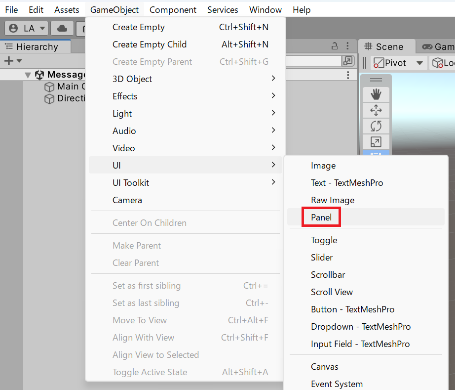

Panel ゲームオブジェクトが追加されます。

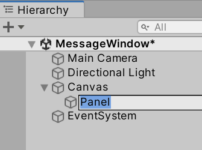

次に、メッセージウィンドウの大まかな配置を設定しましょう。Panel ゲームオブジェクトを選択し、Inspector ビューの Rect Transform コンポーネントの Anchor を設定します。ここでは水平方向に Stretch、垂直方向を Bottom に変更します。

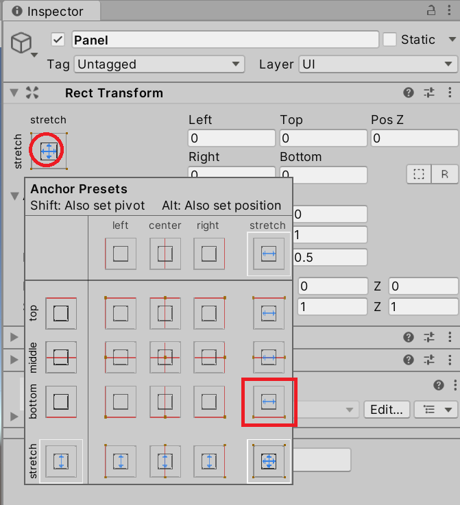

Anchor 設定をしたら、Rect Transform の矩形を変更します。この値は画面解像度やアスペクト比に合わせて設定してください。ここでは Full HD（1920×1080）を想定して、Left を 100、Pos Y を 40、Right を 100、Height を 300 に設定します。

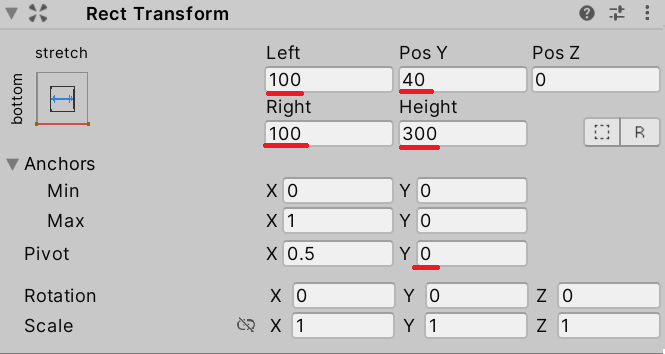

Game タブを表示すると、画面下部にメッセージ表示用のパネルの範囲を確認できます。

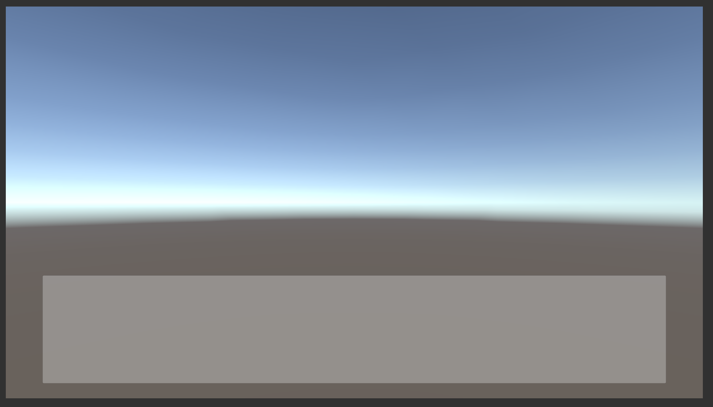

会話画面のメッセージウィンドウでよく見られる配置です。

---

## テキストコンポーネントの配置

Panel ゲームオブジェクトにテキストを表示するゲームオブジェクトを追加しましょう。「GameObject」メニューから「UI」→「Text - TextMeshPro」を選択してください。

> 💡 **ポイント**: 本チュートリアルはテキスト表示に TextMesh Pro を使います。TMP のインポートダイアログが表示された場合は「Import TMP Essentials」ボタンを押してください。

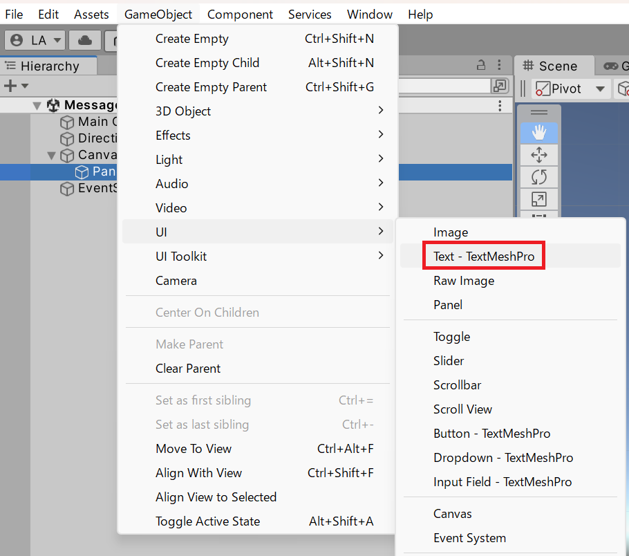

Hierarchy ビューに Text（TMP）ゲームオブジェクトが追加されたら、Panel ゲームオブジェクトにドラッグ&ドロップして子ゲームオブジェクトとして配置します。

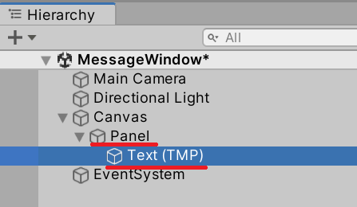

Text（TMP）ゲームオブジェクトの Rect Transform を設定します。Anchor をプリセットから水平・垂直方向ともに Stretch に変更して、親パネルと同じ領域に広げましょう。

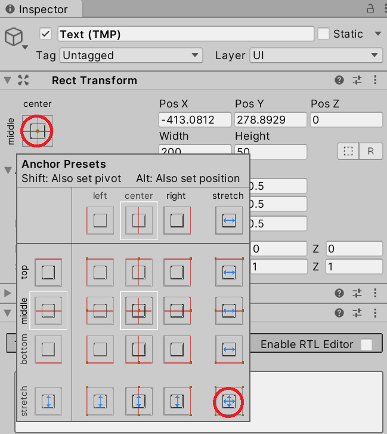

親パネルとぴったり同じ範囲だと余白がないため、適度な余白を取るようにしましょう。ここでは Left を 40、Top を 20、Right を 40、Bottom を 20 に設定します。

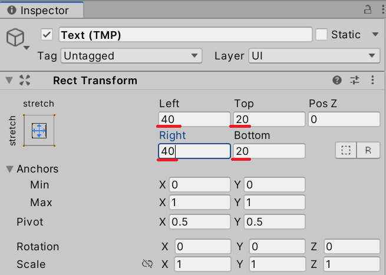

Game ビューに切り替えると、以下のような配置になっていることを確認できます。

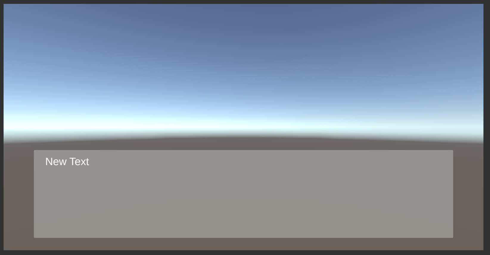

好みのデザインになるようにフォントやサイズ、テキストの色などを設定してください。たとえば Font Size を 42、Vertex Color を黒に変更します。

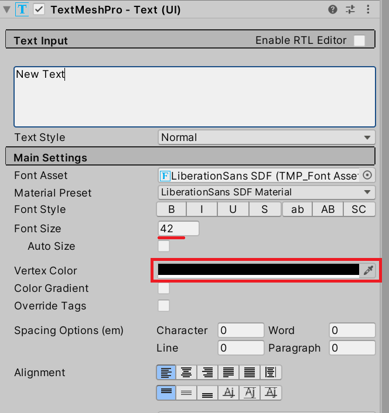

以上で Unity 側の UI ゲームオブジェクトの設置とコンポーネントの設定は終了です。

---

## スクリプトからテキストを操作する

メッセージウィンドウのテキストを制御するスクリプトを追加しましょう。Panel ゲームオブジェクトを選択した状態で Inspector ビュー下部の「Add Component」ボタンを押し、「MessageSequencer」と入力して「New script」を選択します。

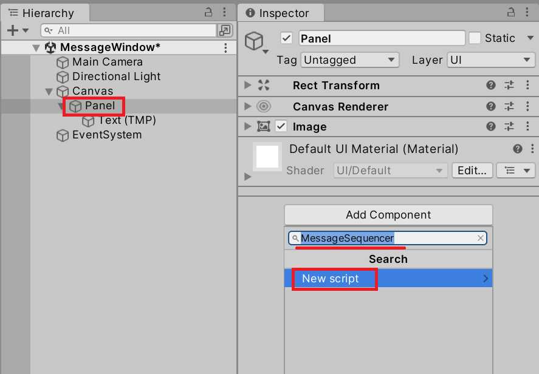

「Create and Add」ボタンを押してスクリプトを追加します。

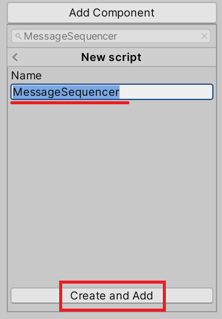

Assets フォルダー下に MessageSequencer.cs が追加されるので、これを開いてコードを編集します。まずは Panel の子ゲームオブジェクトとして配置したテキストをスクリプトから変更してみましょう。

**`TMP_Text`** — TextMesh Pro のテキスト表示コンポーネントの基底クラスです。`text` プロパティで表示文字列を設定・取得できます。<!-- [公式ドキュメント]() -->

```csharp
using TMPro;
using UnityEngine;

public class MessageSequencer : MonoBehaviour
{
    [SerializeField]
    private TMP_Text _textUi = default;

    private void Start()
    {
        _textUi.text = "Stand by Ready!";
    }
}
```

このスクリプトはメッセージ表示用のテキストを `_textUi` フィールドで受け取ります。`[SerializeField]` 属性を持つので、Unity の Inspector ビューから Text（TMP）コンポーネントを設定してください。

> 💡 **補足**: `= default` は参照型では `null` と同じ意味で、Inspector から値が設定される前の初期状態を表します。

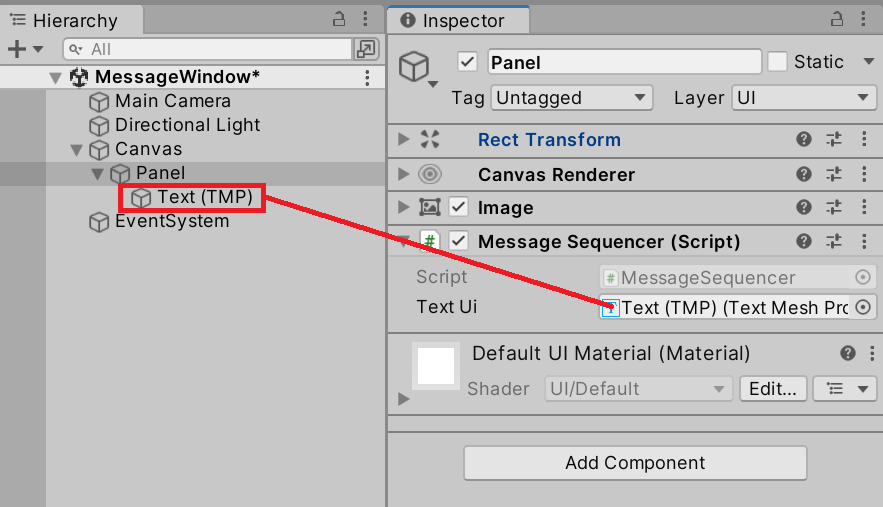

実行すると、テキストがスクリプトから代入した文字列に変化することを確認できます。

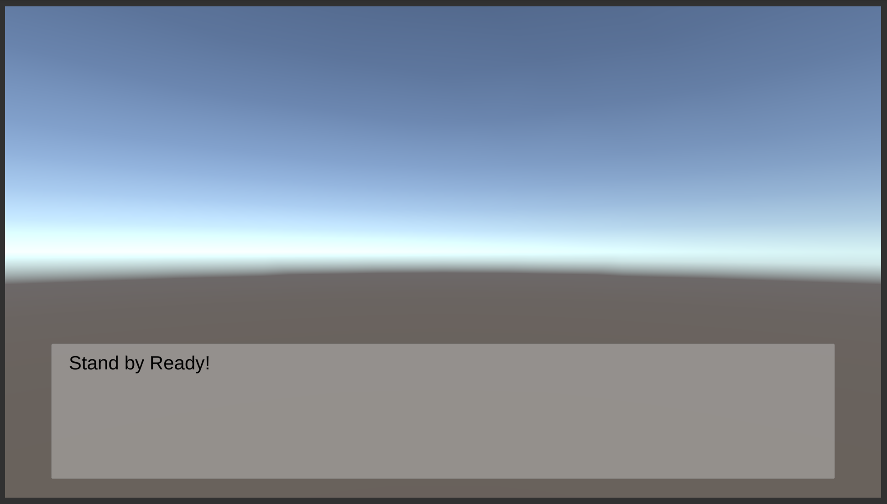

---

## 複数ページをクリックで順次表示する

複数ページに分かれたシナリオ文章をマウスクリックに反応して進める処理を考えてみましょう。ここでは単純な文字列配列をシナリオデータと見なして進めます。

```csharp
[SerializeField]
private string[] _messages = default;
```

`[SerializeField]` 属性を付けた文字列配列型のフィールドを用意すると、Unity の Inspector ビューから各ページのテキストを設定できます。

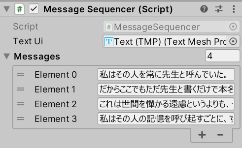

`MessageSequencer` は文字列配列の先頭から順にメッセージウィンドウに文字列を表示し、入力に反応して次の文字列へ進みます。配列のどの要素を表示するかは整数フィールドで管理します。

```csharp
private int _currentIndex = -1;
```

初期値の `-1` は「まだ何も表示していない」状態を表します。入力に反応して `_currentIndex` を進め、`_messages[_currentIndex]` をテキストとして表示するだけです。

**`Mouse.current.leftButton.wasPressedThisFrame`** — 左クリックがこのフレームで押されたかどうかを返すプロパティです。`UnityEngine.InputSystem` 名前空間が必要です。<!-- [公式ドキュメント]() -->

> ⚠️ **注意**: `UnityEngine.InputSystem` を使うには、Package Manager から **Input System** パッケージをインストールする必要があります。インストールされていない場合、`Mouse` クラスが見つからないというコンパイルエラーが発生します。「Window」→「Package Manager」→「Unity Registry」で「Input System」を検索してインストールしてください。

**書式：ButtonControl.wasPressedThisFrame プロパティ**
```csharp
bool ButtonControl.wasPressedThisFrame { get; }
```

| 戻り値 | 型 | 説明 |
|---|---|---|
| `wasPressedThisFrame` | `bool` | 左クリックがこのフレームで押された瞬間なら `true`、それ以外は `false` |

```csharp
using TMPro;
using UnityEngine;
using UnityEngine.InputSystem;

public class MessageSequencer : MonoBehaviour
{
    [SerializeField]
    private TMP_Text _textUi = default;

    [SerializeField]
    private string[] _messages = default;

    // _messages フィールドから表示する現在のメッセージのインデックス。
    // 何も指していない場合は -1 とする。
    private int _currentIndex = -1;

    private void Start()
    {
        MoveNext();
    }

    private void Update()
    {
        if (Mouse.current.leftButton.wasPressedThisFrame)
        {
            MoveNext();
        }
    }

    /// <summary>
    /// 次のページに進む。
    /// 次のページが存在しない場合は無視する。
    /// </summary>
    private void MoveNext()
    {
        if (_messages is null or { Length: 0 }) { return; }

        if (_currentIndex + 1 < _messages.Length)
        {
            _currentIndex++;
            ShowMessage(_messages[_currentIndex]);
        }
    }

    /// <summary>
    /// 指定のメッセージを表示する。
    /// </summary>
    /// <param name="message">テキストとして表示するメッセージ。</param>
    private void ShowMessage(string message)
    {
        if (_textUi == null) { return; }
        _textUi.text = message;
    }
}
```

> ※ `is null or { Length: 0 }` の `or` キーワードを使ったパターンマッチングは C# 9 から使えます。


`MoveNext()` メソッドは次のページへ進む処理を実行します。冒頭で有効なデータが存在するかを確認し、`_messages` フィールドにデータが含まれていない場合や次の要素が存在しない場合は何もしません。表示するべきメッセージが存在する場合、`ShowMessage()` メソッドに文字列を渡して表示します。

---

## まとめ

- Panel と TextMesh Pro を使ってメッセージウィンドウを構築した
- `[SerializeField]` を付けた `TMP_Text` フィールドで UI コンポーネントをスクリプトから操作できる
- 文字列配列をシナリオデータとして、インデックスで現在のページを管理した
- `Mouse.current.leftButton.wasPressedThisFrame` でマウスクリックを検知し、`MoveNext()` でページを進めた

---

## 理解度チェック

以下の問いに答えられるか確認しましょう。

1. `_currentIndex` の初期値を `-1` にしているのはなぜですか？
2. `MoveNext()` メソッドが冒頭で `_messages is null or { Length: 0 }` を確認している理由は何ですか？
3. （応用）文字が流れるように 1 文字ずつ表示されるアニメーション演出を追加するとしたら、どのようにスクリプトを変更しますか？

<details markdown="1">
<summary>解答を見る</summary>

1. `-1` は「まだ有効な要素を指していない」状態を表します。`MoveNext()` の最初の呼び出しで `_currentIndex` が `0` になり、配列の先頭要素を表示できます。
2. `_messages` が `null` または空の場合にインデックスアクセスを行うと実行時エラーが発生するためです。ガード節として先に確認することで、安全に処理を終了できます。
3. `ShowMessage()` メソッド内でテキストを一度に代入するのではなく、`Update()` で時間経過に応じて 1 文字ずつ追加する仕組みに変更します。詳しくは次のページで解説します。

</details>

---

## 次のステップ

[メッセージウィンドウ — 文字送り](/unity-csharp-learning/conversation-scenes/typewriter-animation/) では、テキストが 1 文字ずつ流れるように表示される文字送りアニメーションを実装します。
