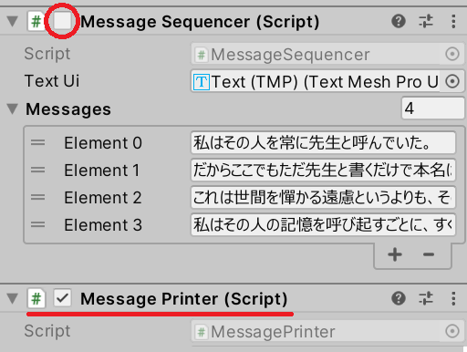
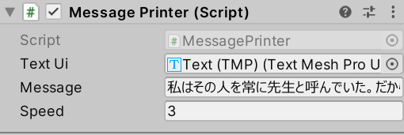

# メッセージウィンドウ — 文字送り

[メッセージウィンドウ — ページ送り](/unity-csharp-learning/conversation-scenes/message-window-pagination/) の続きです。テキストが 1 文字ずつ流れるように表示される**文字送りアニメーション**を実装します。単一責任の原則に基づいてコンポーネントを分離し、ページ送りと文字送りを組み合わせる設計を学びます。

## 学習目標

このページを読み終えると、以下のことができるようになります。

- 時間経過を使って文字列を 1 文字ずつ表示できる
- 単一責任の原則に基づいてコンポーネントを分離できる
- プロパティやメソッドを使ってコンポーネント間の連携を設計できる
- アニメーションの終了待ちとスキップ機能を実装できる

## 前提知識

- [メッセージウィンドウ — ページ送り](/unity-csharp-learning/conversation-scenes/message-window-pagination/) を読んでいること
- [Time クラスと時間制御](/unity-csharp-learning/unity/time-basics/) を読んでいること

---

## ページ送りと文字送りを分離する

前回のチュートリアルで作成した `MessageSequencer` クラスにはページ送りの機能が実装されています。文字送りアニメーションを追加するとき、同じクラスにすべての処理を詰め込みたくなりますが、異なる役割（責任）を 1 つのコンポーネントに混在させると、コードの複雑さが増しバグの原因にもなります。

このように **1 つのクラスには 1 つの役割だけを持たせる**考え方を**単一責任の原則**といいます。

そこで、文字送りを担当する `MessagePrinter` クラスを新しく作成します。前回と同様の手順で、Panel ゲームオブジェクトに `MessagePrinter` という名前の C# スクリプトを新規作成して追加してください。

テストを始める前に、Inspector ビューから `MessageSequencer` コンポーネントを一時的に無効化しておきましょう。



---

## MessagePrinter の基本実装

`MessagePrinter` クラスの役割は、**与えられた 1 つの文字列を先頭から時間経過で 1 文字ずつ表示すること**です。`MessageSequencer` のように複数の文字列を扱うことは考えません。

まず必要なフィールドを定義します。

```csharp
[SerializeField]
private TMP_Text _textUi = default;

[SerializeField]
private string _message = "";

[SerializeField]
private float _speed = 1.0f; // メッセージ全体を表示する時間（秒）
```

`_textUi` には前回と同様に Inspector ビューから Text（TMP）コンポーネントを設定してください。



時間経過で文字を表示するには、前の文字を表示してからの経過時間と 1 文字あたりの待ち時間が必要です。

```csharp
private float _elapsed = 0;   // 文字を表示してからの経過時間（秒）
private float _interval;      // 文字毎の待ち時間（秒）

// _message フィールドから表示する現在の文字インデックス。
// 何も指していない場合は -1 とする。
private int _currentIndex = -1;
```

`_interval` は実行時に文字数と全体の表示時間から計算できます。全体の表示時間（`_speed`）を文字数で割ると 1 文字あたりの待ち時間が求められます。

**`Time.deltaTime`** — 前フレームからの経過時間（秒）を返すプロパティです。`Update()` 内で加算することでゲーム時間を計測できます。<!-- [公式ドキュメント]() -->

**書式：Time.deltaTime プロパティ**
```csharp
float Time.deltaTime { get; }
```

| 戻り値 | 型 | 説明 |
|---|---|---|
| `deltaTime` | `float` | 前フレームからの経過時間を秒単位で返します |

```csharp
using TMPro;
using UnityEngine;

public class MessagePrinter : MonoBehaviour
{
    [SerializeField]
    private TMP_Text _textUi = default;

    [SerializeField]
    private string _message = "";

    [SerializeField]
    private float _speed = 1.0f; // メッセージ全体を表示する時間（秒）

    private float _elapsed = 0;   // 文字を表示してからの経過時間（秒）
    private float _interval;      // 文字毎の待ち時間（秒）

    // _message フィールドから表示する現在の文字インデックス。
    // 何も指していない場合は -1 とする。
    private int _currentIndex = -1;

    private void Start()
    {
        if (_textUi == null || _message is null or { Length: 0 }) { return; }

        _textUi.text = "";
        _interval = _speed / _message.Length;
    }

    private void Update()
    {
        if (_textUi == null || _message is null || _currentIndex + 1 >= _message.Length) { return; }

        _elapsed += Time.deltaTime;
        if (_elapsed > _interval)
        {
            _elapsed = 0;
            _currentIndex++;
            _textUi.text += _message[_currentIndex];
        }
    }
}
```

> ※ `is null or { Length: 0 }` の `or` キーワードを使ったパターンマッチングは C# 9 から使えます。これは「`null` である、または Length が 0 の空文字列であるなら true」という意味です。


`Update()` で `Time.deltaTime` を加算して経過時間を計測し、`_interval` を超えたら `_currentIndex` を進めて次の文字を追加します。

---

## 課題 1: ページ送りと文字送りを組み合わせる

`MessageSequencer` と `MessagePrinter` それぞれの単独動作を確認できたら、次はこの 2 つを組み合わせます。

現時点では両方のコンポーネントが独立して UI を書き換えるため共存できません。そこで `MessageSequencer` から `MessagePrinter` を参照して文字列を渡すように変更します。

まず `MessageSequencer` クラスから `_textUi` フィールドを削除し、代わりに `MessagePrinter` 型のフィールドを追加します。

```csharp
[SerializeField]
private MessagePrinter _printer = default;
```

次に `MessagePrinter` クラスへ、外部から表示する文字列を設定できる `ShowMessage()` メソッドを追加します。

```csharp
/// <summary>
/// 指定のメッセージを表示する。
/// </summary>
/// <param name="message">テキストとして表示するメッセージ。</param>
public void ShowMessage(string message)
{
    // TODO: ここにコードを書く
}
```

`ShowMessage()` を実装するときのポイントは次のとおりです。

- `_message` フィールドを受け取った文字列で更新する
- `_textUi.text` を空にリセットする
- `_currentIndex` と `_elapsed` を初期値に戻す
- `_interval` を新しい文字数で再計算する

`MessageSequencer` クラスも `ShowMessage()` の呼び出しを使うように修正します。

```csharp
using UnityEngine;
using UnityEngine.InputSystem;

public class MessageSequencer : MonoBehaviour
{
    [SerializeField]
    private MessagePrinter _printer = default;

    [SerializeField]
    private string[] _messages = default;

    // _messages フィールドから表示する現在のメッセージのインデックス。
    // 何も指していない場合は -1 とする。
    private int _currentIndex = -1;

    private void Start()
    {
        MoveNext();
    }

    private void Update()
    {
        if (Mouse.current.leftButton.wasPressedThisFrame)
        {
            MoveNext();
        }
    }

    /// <summary>
    /// 次のページに進む。
    /// 次のページが存在しない場合は無視する。
    /// </summary>
    private void MoveNext()
    {
        if (_messages is null or { Length: 0 } || _printer == null) { return; }

        if (_currentIndex + 1 < _messages.Length)
        {
            _currentIndex++;
            _printer.ShowMessage(_messages[_currentIndex]);
        }
    }
}
```

`ShowMessage()` が正しく実装できると、ページが切り替わるたびに文字送りアニメーションが始まります。


<details markdown="1">
<summary>ShowMessage() の参考実装を見る</summary>

```csharp
public void ShowMessage(string message)
{
    if (_textUi == null || message is null or { Length: 0 }) { return; }

    _message = message;
    _textUi.text = "";
    _currentIndex = -1;
    _elapsed = 0;
    _interval = _speed / _message.Length;
}
```

`_message` を新しい文字列に更新し、テキスト表示・インデックス・経過時間・インターバルをすべて初期状態に戻してからアニメーションを開始します。

</details>

ただし、この時点ではテキストが流れている途中にクリックすると全体の表示を待たずに次のページへ移動してしまいます。


これは一般的なゲームでは許容されない動作です。次の課題で解決しましょう。

---

## 課題 2: アニメーションの終了を待つ

この問題を解決するには、`MessagePrinter` がテキストアニメーション中かどうかを `MessageSequencer` から判断できる仕組みが必要です。

`MessagePrinter` クラスに以下のプロパティを実装しましょう。

```csharp
public bool IsPrinting { get; }
```

このプロパティはアニメーション中であれば `true`、表示が完了していれば `false` を返します。

`IsPrinting` が実装できたら、`MessageSequencer` の `Update()` を次のように変更します。

```csharp
private void Update()
{
    if (Mouse.current.leftButton.wasPressedThisFrame)
    {
        if (!_printer.IsPrinting) { MoveNext(); }
    }
}
```

`IsPrinting` が `true` の間はクリックを無視し、アニメーションが終わってから `MoveNext()` を呼ぶことで問題が解消されます。


<details markdown="1">
<summary>IsPrinting の参考実装を見る</summary>

```csharp
public bool IsPrinting
{
    get => _currentIndex + 1 < (_message?.Length ?? 0);
}
```

`_currentIndex + 1` がまだ表示していない文字の位置を示します。この値が文字列の長さより小さい間は表示途中（`true`）、それ以上になると表示完了（`false`）です。C# のゲッター専用プロパティはこのように `get =>` を使って 1 行で記述できます。

ここで使っている `?.` は「左側が `null` ならそこで止めて `null` を返す」書き方、`??` は「左側が `null` なら右側の値を使う」書き方です。つまり `_message?.Length ?? 0` は「`_message` があればその長さを使い、`null` なら 0 を使う」という意味になります。

</details>

---

## 課題 3: アニメーションのスキップ

文字が流れている途中でクリックすると全体を即座に表示するスキップ機能を実装しましょう。多くのゲームで採用されている一般的な動作です。

`MessagePrinter` クラスに以下のメソッドを実装します。

```csharp
public void Skip();
```

`Skip()` はアニメーションを省略して `_message` の全文字を即座に表示します（`_textUi.text = _message` を設定し、状態を「表示完了」にします）。

`MessageSequencer` の `Update()` を次のように変更します。

```csharp
private void Update()
{
    if (Mouse.current.leftButton.wasPressedThisFrame)
    {
        if (_printer.IsPrinting) { _printer.Skip(); }
        else { MoveNext(); }
    }
}
```

アニメーション中にクリックすれば全文字が表示され、表示完了後のクリックで次のページへ進みます。


<details markdown="1">
<summary>Skip() の参考実装を見る</summary>

```csharp
public void Skip()
{
    if (!IsPrinting) { return; }

    _textUi.text = _message;
    _currentIndex = _message.Length - 1;
}
```

`_textUi.text` に `_message` を直接代入して全文字を即座に表示し、`_currentIndex` を末尾に設定することで `IsPrinting` が `false` になり「表示完了」状態になります。

</details>

---

## 課題 Ex: 文字毎の演出

> この課題は上級者向けの発展課題です。TextMesh Pro の内部 API を扱うため、難易度が高くなります。

ここまでの実装では、文字がシンプルに追加されるだけです。さらなる挑戦として、**文字が浮かび上がるような演出**を考えてみましょう。


> 💡 **ヒント**: TextMesh Pro には文字単位でアルファや色を操作する機能があります。どのような設計でこの演出を実現するか考えてみてください。

---

## まとめ

- **単一責任の原則**に基づき、ページ送り（`MessageSequencer`）と文字送り（`MessagePrinter`）を分離した
- `Time.deltaTime` を使った時間計測で 1 文字ずつ表示するアニメーションを実装した
- `ShowMessage()` メソッドで外部から文字列を受け取り、アニメーションをリセット・開始できるようにした
- `IsPrinting` プロパティでアニメーション中かどうかを外部から判定できるようにした
- `Skip()` メソッドでアニメーションを省略して全文字を即座に表示できるようにした

---

## 理解度チェック

以下の問いに答えられるか確認しましょう。

1. 「単一責任の原則」とは何ですか？今回の実装ではどのように適用しましたか？
2. `MessagePrinter.Start()` で `_interval = _speed / _message.Length` と計算しています。`ShowMessage()` を呼ぶ際にも同じ計算が必要なのはなぜですか？
3. `IsPrinting` プロパティはどのような条件で `true` を返すべきですか？

<details markdown="1">
<summary>解答を見る</summary>

1. 1 つのクラスには 1 つの役割だけを持たせる設計原則です。今回は「ページを切り替える（`MessageSequencer`）」と「文字を 1 文字ずつ表示する（`MessagePrinter`）」という 2 つの役割を別クラスに分離しました。
2. `ShowMessage()` で新しいメッセージに切り替えるたびに文字数が変わるため、`_interval` を再計算する必要があります。`Start()` 時の計算だけでは初期設定のメッセージにしか対応できません。
3. `_currentIndex + 1 < _message.Length` が成立する間、つまりまだ表示していない文字が残っている間に `true` を返すのが自然です。

</details>

---

## 次のステップ

文字送りとページ送りを組み合わせることで、本格的な会話シーンが実現できます。次は [キャラクター配置](/unity-csharp-learning/conversation-scenes/character-placement/) で、会話シーンにキャラクターの立ち絵を追加しフェードイン・フェードアウトを実装します。
