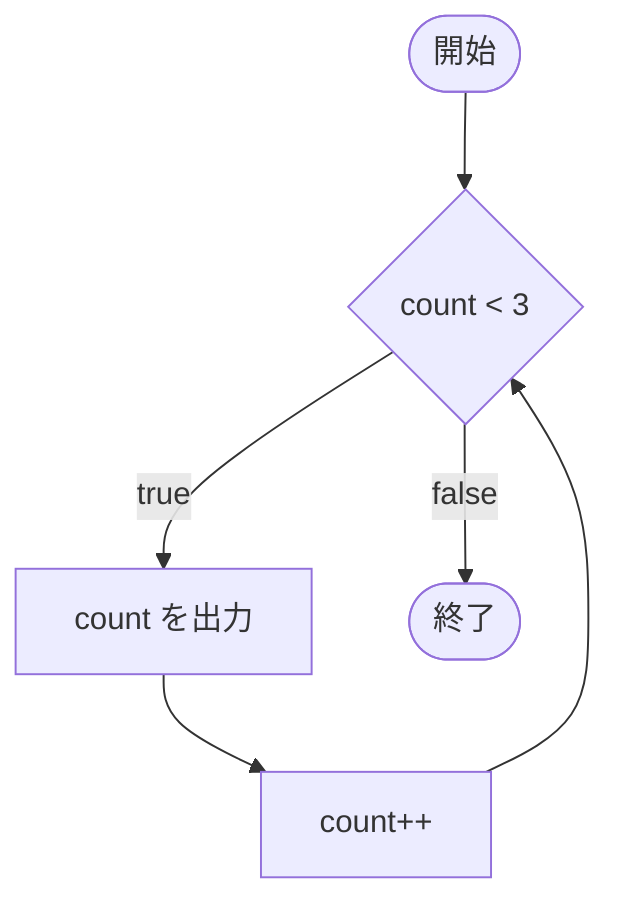

# ページタイトル

1〜2文でこのページの概要を説明します。キーワードは初出で **太字**（英語表記）にします。

## 学習目標

このページを読み終えると、以下のことができるようになります。

- 〇〇を理解できる
- 〇〇を書けるようになる

## 前提知識

- [前のページ名](/unity-csharp-learning/csharp/前のページ/) を読んでいること

---

## 1. 〇〇とは

概念を説明します。なぜこの文法が必要なのか（使わないと何が困るのか）から入ると理解しやすくなります。

---

## 2. 〇〇の書き方

<!-- 文法を初めて紹介するときのパターン: 擬似コードを言語指定なしのブロックで示し、要素を表で説明する -->
<!-- 書式ヘッダーは AGENTS.md の「公式ドキュメントリンクのルール」に従って C# 言語リファレンスへのリンクにする -->

**書式：[while 文](https://learn.microsoft.com/dotnet/csharp/language-reference/statements/iteration-statements#the-while-statement)**
```
while (条件式)
{
    // 条件式が true の間、繰り返す処理
}
```

| 要素 | 説明 |
|---|---|
| `while` | 繰り返しを表すキーワード |
| `条件式` | `bool` 型の式。繰り返しの前に毎回評価される |

<!-- コード例の直後に、言語指定なしのブロックで実行結果を示す。この組は dotnet run で検証される -->
<!-- 前のコード例の続きにする場合は、そのことが読者にわかるように書く -->

```csharp
int count = 0;
while (count < 3)
{
    Console.WriteLine($"count={count}");
    count++;
}
```

```
count=0
count=1
count=2
```

<!-- 図解（任意）: 制御の流れや構造が文章だけでは伝わりにくい場合に入れる。AGENTS.md の「図解のルール」を参照 -->
<!-- 流れ・順序は Mermaid で書く。分岐の条件はコードの条件と一致させる -->



<!-- メモリ上の並びやビット列など、配置に意味がある図は SVG をページと同じフォルダーに別ファイルで置く -->
<!--  -->

> 💡 **ポイント**: 重要な補足事項をここに書きます。

---

## 3. 〇〇メソッドを使う

<!-- .NET の API を初めて紹介するときのパターン: シグネチャを csharp ブロックで示し、パラメータを表で説明する -->
<!-- 書式ヘッダーは AGENTS.md の「公式ドキュメントリンクのルール」に従ってリンクにする -->

**`Array.Clear()`** — 配列の要素を既定値に戻します。

**書式：[Array.Clear メソッド](https://learn.microsoft.com/dotnet/api/system.array.clear)**
```csharp
public static void Clear(Array array, int index, int length);
```

| パラメータ | 説明 |
|---|---|
| `array` | 対象の配列 |
| `index` | クリアを始める位置 |
| `length` | クリアする要素数 |

```csharp
int[] nums = { 1, 2, 3, 4, 5 };
Array.Clear(nums, 1, 2);
Console.WriteLine(string.Join(", ", nums));
```

```
1, 0, 0, 4, 5
```

---

## よくあるミス

初心者がつまずきやすいポイントを紹介します。

<!-- NG 例のコメントには、実際に出るエラー（コンパイルエラーの番号や例外名）を書く。これも検証の対象になる -->

```csharp
// ❌ NG: 〇〇するとコンパイルエラーになる
// int x = "hello";  // CS0029

// ✅ OK: 正しい書き方
int x = 10;
```

なぜ NG なのかを説明します。

---

<!-- ## ワンポイントアドバイス（任意）: 関連機能や新しいバージョンの書き方など、知っておくと役立つ周辺知識を紹介する -->
<!--
## ワンポイントアドバイス

### C# 〇〇 以降の書き方

〇〇と合わせて知っておくと便利な機能や考え方を紹介します。

---
-->

## まとめ

- このページで学んだこと 1
- このページで学んだこと 2

---

## 理解度チェック

<!-- 「出力結果を答える」問題は単独で実行できるコードにする -->
<!-- クラス定義を含む場合、トップレベルのステートメントを先に、型の宣言を後ろに書く（逆にすると CS8803 になる） -->

1. 〇〇とは何ですか？
2. 次のコードを実行すると何が出力されますか？

   ```csharp
   // 問題のコードをここに書く
   ```

3. （応用）〇〇を使って△△を実現するにはどう書きますか？

<details markdown="1">
<summary>解答を見る</summary>

1. 〇〇の答え
2. `出力結果` が出力されます。理由を 1 文で説明します。
3. ```csharp
   // 解答コード
   ```

</details>

---

## 次のステップ

[次のページ名](/unity-csharp-learning/csharp/次のページ/) では、〇〇について学びます。
