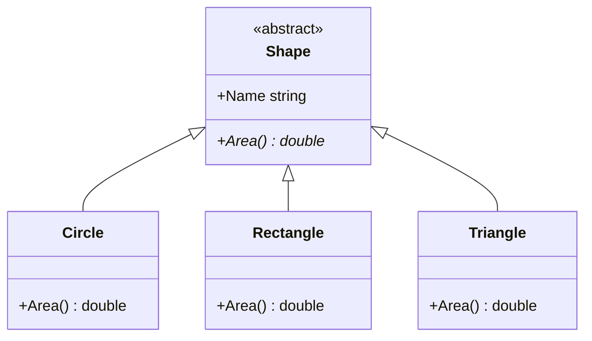

# 抽象クラスと抽象メソッド

「図形の面積を求める」のように、共通の操作として必ず用意したいけれど、中身は派生クラスごとにしか決められない、という場面があります。**抽象メソッド**（abstract method）は、本体を持たず、派生クラスで必ずオーバーライドしなければならないメソッドです。抽象メソッドを持てるのは **抽象クラス**（abstract class）だけで、抽象クラスのインスタンスは作れません。このページでは、`virtual` だけでは防げない誤りと、抽象クラス・抽象メソッドの書き方を学びます。

## 学習目標

このページを読み終えると、以下のことができるようになります。

- `virtual` のメソッドでは防げない誤りを説明できる
- `abstract class` と `abstract` のメソッドを定義し、派生クラスでオーバーライドできる
- 抽象クラスのインスタンスを作れない理由を説明できる
- `virtual` と `abstract` の違いを説明できる

## 前提知識

- [オーバーライドとポリモーフィズム](/unity-csharp-learning/csharp/polymorphism/) を読んでいること
- [メソッドの隠ぺいと sealed](/unity-csharp-learning/csharp/method-hiding/) を読んでいること

---

## 1. virtual で済ませると困ること

円・長方形・三角形などの図形を、基底クラス `Shape` から派生させます。どの図形も面積を求められるようにしたいので、`Shape` に `Area` メソッドを用意し、派生クラスでオーバーライドします。

しかし、「図形」というだけでは、面積の求め方は決まりません。`virtual` のメソッドには本体が必要なので、仮に `0` を返すことにします。

```csharp
Shape[] shapes = { new Circle(2), new Rectangle(3, 4), new Triangle(3, 4), new Shape("図形") };

foreach (Shape s in shapes)
{
    Console.WriteLine($"{s.Name} の面積: {s.Area():0.00}");
}

class Shape
{
    public string Name { get; }

    public Shape(string name)
    {
        Name = name;
    }

    public virtual double Area()
    {
        return 0;  // 図形というだけでは面積を決められない
    }
}

class Circle : Shape
{
    private double _radius;

    public Circle(double radius) : base("円")
    {
        _radius = radius;
    }

    public override double Area()
    {
        return Math.PI * _radius * _radius;
    }
}

class Rectangle : Shape
{
    private double _width;
    private double _height;

    public Rectangle(double width, double height) : base("長方形")
    {
        _width = width;
        _height = height;
    }

    public override double Area()
    {
        return _width * _height;
    }
}

class Triangle : Shape
{
    private double _base;
    private double _height;

    public Triangle(double baseLength, double height) : base("三角形")
    {
        _base = baseLength;
        _height = height;
    }

    // Area をオーバーライドし忘れた
}
```

```
円 の面積: 12.57
長方形 の面積: 12.00
三角形 の面積: 0.00
図形 の面積: 0.00
```

`{s.Area():0.00}` の `0.00` は、小数点以下 2 桁で表示する書式です。書式の書き方は、[文字列リテラルと書式（補足）](/unity-csharp-learning/csharp/string-literals/) で説明しています。

結果の 3 行目と 4 行目に、2 つの問題が表れています。

- `Triangle` で `Area` をオーバーライドし忘れたため、三角形の面積が `0` になっている。`virtual` のメソッドはオーバーライドしなくてもよいので、コンパイラーは何も指摘しない
- `new Shape("図形")` で、何の図形でもない `Shape` のインスタンスを作れてしまう。その面積は、仮に決めた `0` になる

どちらも、コンパイルは通り、実行しても例外にはなりません。間違った値が黙って使われるだけなので、気付きにくい誤りです。

---

## 2. 抽象クラスと抽象メソッドを定義する

メソッドに [abstract](https://learn.microsoft.com/dotnet/csharp/language-reference/keywords/abstract) を付けると、本体のない **抽象メソッド** になります。抽象メソッドを持つクラスには、`abstract` を付けて **抽象クラス** にします。

**書式：[抽象クラスと抽象メソッド](https://learn.microsoft.com/dotnet/csharp/language-reference/keywords/abstract)**
```
abstract class クラス名
{
    アクセス修飾子 abstract 戻り値の型 メソッド名(パラメータ);
}
```

| 要素 | 説明 |
|---|---|
| `abstract class` | 抽象クラス。インスタンスを作れず、継承して使う |
| `abstract` のメソッド | 抽象メソッド。本体の `{ }` を書かず、`;` で終える。抽象クラスの中にだけ書ける |

1 節の `Shape` を抽象クラスにし、`Area` を抽象メソッドにします。`Circle` と `Rectangle` は 1 節と同じもので、`Triangle` には `Area` のオーバーライドを追加します。

```csharp
Shape[] shapes = { new Circle(2), new Rectangle(3, 4), new Triangle(3, 4) };

foreach (Shape s in shapes)
{
    Console.WriteLine($"{s.Name} の面積: {s.Area():0.00}");
}

abstract class Shape
{
    public string Name { get; }

    public Shape(string name)
    {
        Name = name;
    }

    public abstract double Area();
}

class Circle : Shape
{
    private double _radius;

    public Circle(double radius) : base("円")
    {
        _radius = radius;
    }

    public override double Area()
    {
        return Math.PI * _radius * _radius;
    }
}

class Rectangle : Shape
{
    private double _width;
    private double _height;

    public Rectangle(double width, double height) : base("長方形")
    {
        _width = width;
        _height = height;
    }

    public override double Area()
    {
        return _width * _height;
    }
}

class Triangle : Shape
{
    private double _base;
    private double _height;

    public Triangle(double baseLength, double height) : base("三角形")
    {
        _base = baseLength;
        _height = height;
    }

    public override double Area()
    {
        return _base * _height / 2;
    }
}
```

```
円 の面積: 12.57
長方形 の面積: 12.00
三角形 の面積: 6.00
```

抽象メソッドは、`virtual` のメソッドと同じく、派生クラスで `override` を付けてオーバーライドします。`Shape` の型の配列から呼び出すと、実体の型の `Area` が実行されるのも同じです。



図の `<<abstract>>` は抽象クラスを、`Area()*` の `*` は抽象メソッドを表します。

### 1 節の誤りがコンパイルエラーになる

抽象クラスにすると、1 節の 2 つの誤りが、どちらもコンパイルエラーになります。

```csharp
// ❌ NG: Triangle が、Shape の抽象メソッド Area をオーバーライドしていない（CS0534）
// class Triangle : Shape
// {
//     public Triangle(double baseLength, double height) : base("三角形") { }
// }

// ❌ NG: 抽象クラスのインスタンスは作れない（CS0144）
// Shape s = new Shape("図形");
```

- 抽象ではないクラスは、基底クラスのすべての抽象メソッドをオーバーライドしなければなりません。オーバーライドし忘れると、コンパイラーが教えてくれます
- 抽象クラスは、中身の決まっていないメソッドを持っているので、インスタンスを作れません。何の図形でもない `Shape` は、作れなくなります

ただし、抽象クラスの型の変数や配列は作れます。上の例の `Shape[] shapes` のように、派生クラスのインスタンスを入れて使います。

---

## 3. 抽象クラスに書けるもの

抽象クラスは、インスタンスを作れないことを除けば、ふつうのクラスと同じように書けます。2 節の `Shape` にも、ふつうのプロパティ `Name` とコンストラクターがありました。抽象クラスのコンストラクターは、`new Shape(...)` では呼び出せませんが、派生クラスの `: base(...)` から呼び出されます。

抽象メソッドを使うふつうのメソッドも書けます。`Shape` に、名前と面積を表示する `Describe` メソッドを追加します。また、プロパティも `abstract` にできます。ここでは、図形の辺の数を表す `Sides` を抽象プロパティにします。

```csharp
Shape[] shapes = { new Rectangle(3, 4), new Triangle(3, 4) };

foreach (Shape s in shapes)
{
    s.Describe();
}

abstract class Shape
{
    public string Name { get; }

    public Shape(string name)
    {
        Name = name;
    }

    public abstract int Sides { get; }
    public abstract double Area();

    public void Describe()
    {
        Console.WriteLine($"{Name}（{Sides} 辺）の面積: {Area():0.00}");
    }
}

class Rectangle : Shape
{
    private double _width;
    private double _height;

    public Rectangle(double width, double height) : base("長方形")
    {
        _width = width;
        _height = height;
    }

    public override int Sides
    {
        get { return 4; }
    }

    public override double Area()
    {
        return _width * _height;
    }
}

class Triangle : Shape
{
    private double _base;
    private double _height;

    public Triangle(double baseLength, double height) : base("三角形")
    {
        _base = baseLength;
        _height = height;
    }

    public override int Sides
    {
        get { return 3; }
    }

    public override double Area()
    {
        return _base * _height / 2;
    }
}
```

```
長方形（4 辺）の面積: 12.00
三角形（3 辺）の面積: 6.00
```

`Describe` は `Shape` に 1 回書くだけで、すべての図形で同じ形式の表示ができます。`Describe` の中で呼び出している `Sides` と `Area` は、[オーバーライドとポリモーフィズム](/unity-csharp-learning/csharp/polymorphism/) で学んだように、実体の型でオーバーライドされたものが使われます。共通の処理の流れは抽象クラスに書き、図形ごとに違う部分だけを抽象メンバーとして派生クラスに任せる、という分担です。

---

## 4. virtual と abstract の違い

| | `virtual` | `abstract` |
|---|---|---|
| 本体 | 書く | 書かない |
| 派生クラスでのオーバーライド | してもしなくてもよい | 必ずする |
| 書ける場所 | ふつうのクラスと抽象クラス | 抽象クラスだけ |

`virtual` は「基底クラスの動作をそのまま使ってもよいし、書き換えてもよい」、`abstract` は「派生クラスが必ず書かなければならない」を表します。基底クラスで適切な動作を決められるなら `virtual`、決められないなら `abstract` にします。

```csharp
Dog d = new Dog();
d.Speak();
d.Sleep();

abstract class Animal
{
    public abstract void Speak();

    public virtual void Sleep()
    {
        Console.WriteLine("すやすや");
    }
}

class Dog : Animal
{
    public override void Speak()
    {
        Console.WriteLine("ワン");
    }
}
```

```
ワン
すやすや
```

鳴き声は動物ごとに違い、決まった動作を用意できないので、`Speak` は抽象メソッドにしています。`Dog` は `Speak` を必ずオーバーライドします。眠り方は多くの動物で同じなので、`Sleep` は `virtual` にして基底クラスに動作を書いています。`Dog` は `Sleep` をオーバーライドしていないので、`Animal` の `Sleep` が使われます。

---

## よくあるミス

### 抽象メソッドに本体を書く

```csharp
// ❌ NG: 抽象メソッドには本体を書けない
// abstract class Animal
// {
//     public abstract void Speak() { }  // CS0500
// }
```

基底クラスに動作を書きたいなら、`abstract` ではなく `virtual` にします。

### 抽象ではないクラスに抽象メソッドを書く

```csharp
// ❌ NG: 抽象メソッドは、抽象クラスの中にだけ書ける
// class Animal
// {
//     public abstract void Speak();  // CS0513
// }
```

抽象メソッドを持つクラスのインスタンスを作れてしまうと、本体のないメソッドを呼び出せることになるからです。クラスにも `abstract` を付けます。

---

## まとめ

- `virtual` のメソッドは、オーバーライドし忘れても、基底クラスのインスタンスを作っても、コンパイラーが指摘しない
- 抽象メソッドは本体を持たず、抽象ではない派生クラスで必ずオーバーライドする。忘れるとコンパイルエラー（CS0534）になる
- `abstract class` は、インスタンスを作れず、継承して使うクラス。抽象クラスの型の変数や配列には、派生クラスのインスタンスを入れられる
- 抽象クラスには、ふつうのプロパティやメソッド、コンストラクターも書ける。プロパティも `abstract` にできる
- `virtual` はオーバーライドしてもしなくてもよく、`abstract` は必ずオーバーライドする

---

## 理解度チェック

1. 抽象クラスのインスタンスを `new` で作ろうとすると、どうなりますか？
2. 次のコードを実行すると何が出力されますか？

   ```csharp
   Greeter[] greeters = { new Japanese(), new English() };
   foreach (Greeter g in greeters)
   {
       g.Greet();
   }

   abstract class Greeter
   {
       protected abstract string Hello();

       public void Greet()
       {
           Console.WriteLine($"{Hello()}!");
       }
   }

   class Japanese : Greeter
   {
       protected override string Hello() { return "こんにちは"; }
   }

   class English : Greeter
   {
       protected override string Hello() { return "Hello"; }
   }
   ```

3. 1 節のように `virtual` で `0` を返すメソッドにした場合と比べて、抽象メソッドにする利点を 2 つ挙げてください。
4. `virtual` のメソッドと `abstract` のメソッドは、それぞれどのような場面で使いますか？

<details markdown="1">
<summary>解答を見る</summary>

1. コンパイルエラー（CS0144）になります。
2. 次のように出力されます。`Greet` は `Greeter` のメソッドですが、中で呼び出す `Hello` は、実体の型でオーバーライドされたメソッドが実行されます。

   ```
   こんにちは!
   Hello!
   ```

3. 派生クラスがオーバーライドし忘れると、コンパイルエラー（CS0534）で気付けることです。また、基底クラスのインスタンスを作れなくなるので、仮の値を返す意味のないインスタンスが使われる心配がなくなることです。
4. 基底クラスで適切な動作を決められ、派生クラスがそのまま使ってもよい場合は `virtual` にします。基底クラスでは動作を決められず、派生クラスが必ず書かなければならない場合は `abstract` にします。

</details>

---

## 次のステップ

[インターフェイス](/unity-csharp-learning/csharp/interfaces/) では、継承の関係がないクラスどうしにも、共通の操作を持たせる仕組みを学びます。
