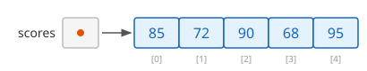
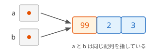

# Array クラスと配列の性質（補足）

このページは、[配列の基礎](/unity-csharp-learning/csharp/arrays/) の補足です。配列の変数を別の変数に代入したときに起きることと、配列の情報を調べるプロパティ、配列を並べ替えたりコピーしたりする [Array クラス](https://learn.microsoft.com/dotnet/api/system.array) のメソッドを学びます。

## 学習目標

このページを読み終えると、以下のことができるようになります。

- 配列の変数を代入すると、同じ配列を指すようになることを説明できる
- `Array.Copy` で、別の配列に要素をコピーできる
- `Length`・`Rank`・`GetLength` で、配列の情報を調べられる
- `Array.Sort`・`Array.Reverse`・`Array.IndexOf`・`Array.Clear` を使える

## 前提知識

- [配列の基礎](/unity-csharp-learning/csharp/arrays/) を読んでいること

---

## 1. 配列の変数に入っているもの

`int[] scores` のような配列の変数に入っているのは、配列そのものではなく、**配列がどこにあるかを示す情報**（**参照**）です。配列そのものは、`new` や配列初期化子で作ったときに、変数とは別の場所に作られます。



`new` や配列初期化子を書くたびに、新しい配列が作られます。

```csharp
int[] a = { 1, 2, 3 };
int[] b = { 1, 2, 3 };

b[0] = 99;
Console.WriteLine(a[0]);
Console.WriteLine(b[0]);
```

```
1
99
```

`a` と `b` は、中身が同じでも別々の配列です。`b[0]` を書き換えても、`a[0]` は変わりません。

### 代入すると同じ配列を指す

`b = a` と書くと、コピーされるのは **参照** です。新しい配列は作られず、`a` と `b` は **同じ配列** を指すようになります。



```csharp
int[] a = { 1, 2, 3 };
int[] b = a;

b[0] = 99;
Console.WriteLine(a[0]);
```

```
99
```

`b[0]` を書き換えると、同じ配列を指している `a` からも `99` が見えます。このように、変数に参照が入る型を **参照型** といいます。参照型については、[値型と参照型](/unity-csharp-learning/csharp/value-reference-types/) で詳しく学びます。

別々の配列として扱いたいときは、4 節の `Array.Copy` で要素をコピーします。

---

## 2. 配列の情報を調べる

C# の配列は、どの型の配列でも、`System.Array` という型が持つプロパティやメソッドを使えます。

| メンバー | 説明 |
|---|---|
| [Length プロパティ](https://learn.microsoft.com/dotnet/api/system.array.length) | すべての要素の数 |
| [Rank プロパティ](https://learn.microsoft.com/dotnet/api/system.array.rank) | 配列の次元の数。1 次元の配列は `1` |
| [GetLength メソッド](https://learn.microsoft.com/dotnet/api/system.array.getlength) | 指定した次元の要素の数 |

**書式：[Array.GetLength メソッド](https://learn.microsoft.com/dotnet/api/system.array.getlength)**
```csharp
public int GetLength(int dimension);
```

| パラメータ | 説明 |
|---|---|
| `dimension` | 要素の数を調べる次元（`0` から数える） |

```csharp
int[] arr = { 10, 20, 30, 40 };

Console.WriteLine(arr.Length);
Console.WriteLine(arr.Rank);
Console.WriteLine(arr.GetLength(0));
Console.WriteLine(arr.GetType());
```

```
4
1
4
System.Int32[]
```

1 次元の配列では、`GetLength(0)` は `Length` と同じ値です。`Rank` と `GetLength` は、次のページで学ぶ多次元配列で役に立ちます。`GetType()` の結果の `System.Int32[]` は、`int` の配列を表します。

---

## 3. 配列の中身をまとめて表示する

このページでは、配列の中身を確かめるために [string.Join メソッド](https://learn.microsoft.com/dotnet/api/system.string.join) を使います。`string.Join` は、配列の要素を、指定した区切り文字でつないだ 1 つの文字列にします。

```csharp
int[] nums = { 10, 20, 30 };
Console.WriteLine(string.Join(", ", nums));
```

```
10, 20, 30
```

---

## 4. Array クラスのメソッド

`Array` クラスには、配列を操作する **静的メソッド** が用意されています。静的メソッドは、`Array.Sort(配列)` のように、型名の後に `.` とメソッド名を書いて呼び出します（静的メソッドについては、[static メンバーと static クラス](/unity-csharp-learning/csharp/static-members/) で学びます）。

### Array.Sort — 小さい順に並べ替える

**書式：[Array.Sort メソッド](https://learn.microsoft.com/dotnet/api/system.array.sort)**
```csharp
public static void Sort(Array array);
```

[Array.Sort メソッド](https://learn.microsoft.com/dotnet/api/system.array.sort) は、配列の要素を小さい順（昇順）に並べ替えます。新しい配列を作るのではなく、渡した配列そのものを並べ替えます。

```csharp
int[] nums = { 40, 10, 30, 20 };
Array.Sort(nums);
Console.WriteLine(string.Join(", ", nums));

string[] names = { "Carol", "Alice", "Bob" };
Array.Sort(names);
Console.WriteLine(string.Join(", ", names));
```

```
10, 20, 30, 40
Alice, Bob, Carol
```

文字列の配列は、辞書の順に並べ替えられます。

### Array.Reverse — 順序を逆にする

**書式：[Array.Reverse メソッド](https://learn.microsoft.com/dotnet/api/system.array.reverse)**
```csharp
public static void Reverse(Array array);
```

[Array.Reverse メソッド](https://learn.microsoft.com/dotnet/api/system.array.reverse) は、配列の要素の順序を逆にします。これも、渡した配列そのものを書き換えます。

```csharp
int[] nums = { 10, 20, 30, 40 };
Array.Reverse(nums);
Console.WriteLine(string.Join(", ", nums));
```

```
40, 30, 20, 10
```

### Array.IndexOf — 要素を探す

**書式：[Array.IndexOf メソッド](https://learn.microsoft.com/dotnet/api/system.array.indexof)**
```csharp
public static int IndexOf(Array array, object? value);
```

| パラメータ | 説明 |
|---|---|
| `array` | 探す対象の配列 |
| `value` | 探す値 |

[Array.IndexOf メソッド](https://learn.microsoft.com/dotnet/api/system.array.indexof) は、指定した値が最初に見つかったインデックスを返します。見つからなかったときは `-1` を返します。

```csharp
string[] fruits = { "apple", "banana", "cherry" };
Console.WriteLine(Array.IndexOf(fruits, "banana"));
Console.WriteLine(Array.IndexOf(fruits, "grape"));
```

```
1
-1
```

### Array.Copy — 別の配列にコピーする

**書式：[Array.Copy メソッド](https://learn.microsoft.com/dotnet/api/system.array.copy)**
```csharp
public static void Copy(Array sourceArray, Array destinationArray, int length);
```

| パラメータ | 説明 |
|---|---|
| `sourceArray` | コピー元の配列 |
| `destinationArray` | コピー先の配列 |
| `length` | コピーする要素の数 |

[Array.Copy メソッド](https://learn.microsoft.com/dotnet/api/system.array.copy) は、コピー元の配列の要素を、コピー先の配列にコピーします。コピー先の配列は、あらかじめ `new` で作っておきます。

```csharp
int[] original = { 1, 2, 3 };
int[] copy = new int[original.Length];
Array.Copy(original, copy, original.Length);

copy[0] = 99;
Console.WriteLine(string.Join(", ", original));
Console.WriteLine(string.Join(", ", copy));
```

```
1, 2, 3
99, 2, 3
```

`original` と `copy` は別々の配列なので、`copy[0]` を書き換えても `original` は変わりません。1 節の `b = a` とは違う結果です。

![Array.Copy でコピーした場合、original と copy は別々の配列を指していて、copy[0] を 99 に書き換えても original は変わらない](copy-vs-assign.svg)

### Array.Clear — 要素を既定値に戻す

**書式：[Array.Clear メソッド](https://learn.microsoft.com/dotnet/api/system.array.clear)**
```csharp
public static void Clear(Array array, int index, int length);
```

| パラメータ | 説明 |
|---|---|
| `array` | 対象の配列 |
| `index` | 既定値に戻し始めるインデックス |
| `length` | 既定値に戻す要素の数 |

[Array.Clear メソッド](https://learn.microsoft.com/dotnet/api/system.array.clear) は、指定した範囲の要素を、型の既定値（数値なら `0`）に戻します。

```csharp
int[] nums = { 10, 20, 30, 40, 50 };
Array.Clear(nums, 1, 3);
Console.WriteLine(string.Join(", ", nums));
```

```
10, 0, 0, 0, 50
```

インデックス `1` から 3 つの要素（`1`・`2`・`3`）が `0` になりました。

---

## よくあるミス

### Array.IndexOf の -1 を確かめずに使う

```csharp
// ❌ NG: 見つからなかったときの -1 を、そのままインデックスに使っている
// string[] fruits = { "apple", "banana", "cherry" };
// int index = Array.IndexOf(fruits, "grape");
// Console.WriteLine(fruits[index]);  // IndexOutOfRangeException
```

`Array.IndexOf` は、見つからないと `-1` を返します。`-1` はインデックスとして使えないので、実行すると例外が発生します。戻り値が `-1` でないことを確かめてから使います。

```csharp
string[] fruits = { "apple", "banana", "cherry" };
int index = Array.IndexOf(fruits, "grape");

if (index != -1)
{
    Console.WriteLine(fruits[index]);
}
else
{
    Console.WriteLine("見つからなかった");
}
```

```
見つからなかった
```

---

## まとめ

- 配列の変数には、配列そのものではなく、配列の場所を示す参照が入る
- `b = a` では新しい配列は作られず、`a` と `b` は同じ配列を指す
- 別々の配列にしたいときは、`Array.Copy` で新しい配列に要素をコピーする
- `Length`・`Rank`・`GetLength` で、配列の要素の数や次元の数を調べられる
- `Array.Sort` で昇順に並べ替え、`Array.Reverse` で順序を逆にする。どちらも渡した配列そのものを書き換える
- `Array.IndexOf` は、見つからないと `-1` を返す
- `Array.Clear` は、指定した範囲の要素を既定値に戻す

---

## 理解度チェック

1. 次のコードを実行すると何が出力されますか？

   ```csharp
   int[] a = { 1, 2, 3 };
   int[] b = a;
   b[1] = 99;
   Console.WriteLine(a[1]);
   ```

2. `Array.Sort` と `Array.Reverse` を使って、配列 `{ 3, 1, 4, 1, 5 }` を大きい順に並べ替えて表示するコードを書いてください。
3. 次のコードを実行すると何が出力されますか？

   ```csharp
   int[] nums = { 5, 10, 15, 20, 25 };
   Array.Clear(nums, 2, 2);
   Console.WriteLine(string.Join(", ", nums));
   ```

<details markdown="1">
<summary>解答を見る</summary>

1. `99` が出力されます。`b = a` は参照のコピーなので、`b` と `a` は同じ配列を指しています。
2. ```csharp
   int[] nums = { 3, 1, 4, 1, 5 };
   Array.Sort(nums);
   Array.Reverse(nums);
   Console.WriteLine(string.Join(", ", nums));
   ```

   昇順に並べ替えた `1, 1, 3, 4, 5` を逆にするので、`5, 4, 3, 1, 1` が表示されます。

3. 次のように出力されます。インデックス `2` から 2 つの要素（`2` と `3`）が `0` になります。

   ```
   5, 10, 0, 0, 25
   ```

</details>

---

## 次のステップ

[インデックスと範囲（補足）](/unity-csharp-learning/csharp/ranges/) では、範囲演算子 `..` を使って、配列の一部を新しい配列として取り出す方法を学びます。
