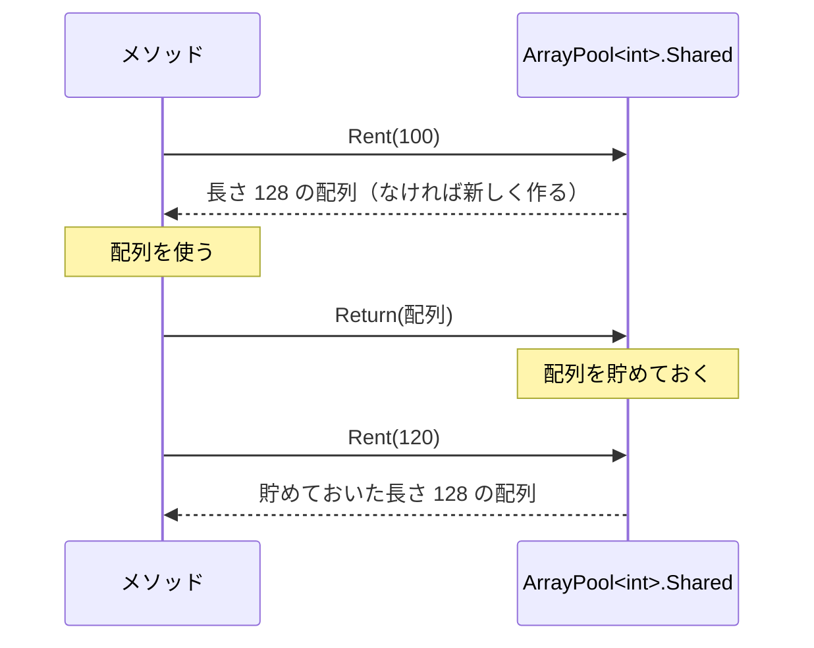

# ArrayPool\<T\>（補足）

[stackalloc](/unity-csharp-learning/csharp/stackalloc/) は小さな領域にしか使えません。大きな一時的な配列を、呼び出すたびに `new` で作ると、ヒープへの割り当てが大きくなります。**ArrayPool\<T\>** は、使い終わった配列を返しておき、次に必要になったときに借りて使い回すための仕組みです。このページでは、`ArrayPool<T>` から配列を借りて返す方法と、使うときの注意点を紹介します。

## 学習目標

このページを読み終えると、以下のことができるようになります。

- `ArrayPool<T>.Shared` から `Rent` で配列を借り、`Return` で返せる
- `Rent` が、求めた長さより長い配列を返すことがあると説明できる
- `try` / `finally` で、借りた配列を確実に返せる
- 借りた配列に、前に使ったときのデータが残っていることがあると説明できる

## 前提知識

- [stackalloc](/unity-csharp-learning/csharp/stackalloc/) と [Memory\<T\>](/unity-csharp-learning/csharp/memory/) を読んでいること
- [例外の基本](/unity-csharp-learning/csharp/exceptions/) で `try` / `finally` を学んだこと

---

## 1. 配列を借りて返す

[ArrayPool\<T\> クラス](https://learn.microsoft.com/dotnet/api/system.buffers.arraypool-1) は、配列を貯めておく入れ物（**プール**）です。ふつうは、.NET が用意している共有のプール [ArrayPool\<T\>.Shared](https://learn.microsoft.com/dotnet/api/system.buffers.arraypool-1.shared) を使います。`System.Buffers` 名前空間にあるので、ファイルの先頭に `using System.Buffers;` を書きます。

**書式：[ArrayPool\<T\>.Rent メソッド](https://learn.microsoft.com/dotnet/api/system.buffers.arraypool-1.rent) / [ArrayPool\<T\>.Return メソッド](https://learn.microsoft.com/dotnet/api/system.buffers.arraypool-1.return)**
```
T[] 変数名 = ArrayPool<T>.Shared.Rent(必要な長さ);
// 配列を使う
ArrayPool<T>.Shared.Return(変数名);
```

| メソッド | 説明 |
|---|---|
| `Rent(必要な長さ)` | 長さが `必要な長さ` 以上の配列を借りる。プールに合う配列がなければ、新しく作る |
| `Return(配列)` | 借りた配列をプールに返す。返した配列は、次に `Rent` を呼んだときに貸し出される |

```csharp
using System.Buffers;

int[] array = ArrayPool<int>.Shared.Rent(100);
Console.WriteLine(array.Length);
ArrayPool<int>.Shared.Return(array);

int[] again = ArrayPool<int>.Shared.Rent(120);
Console.WriteLine(again.Length);
Console.WriteLine(object.ReferenceEquals(array, again));
ArrayPool<int>.Shared.Return(again);
```

実行結果の例です。どの長さの配列が返されるかは、.NET の実装によって決まり、バージョンによって変わることがあります。

```
128
128
True
```

`Rent(100)` で借りた配列の長さは、`100` ではなく `128` でした。`ArrayPool<T>.Shared` は、いくつかの決まった長さの配列を貯めていて、求めた長さ以上のうち、いちばん近いものを貸し出します。返した後に `Rent(120)` を呼ぶと、さっき返した同じ配列が貸し出されました。



### 必要な長さだけを使う

借りた配列は、求めた長さより長いことがあります。配列の全体ではなく、必要な長さの部分だけを使うには、[Span\<T\> と ReadOnlySpan\<T\>](/unity-csharp-learning/csharp/span/) の `AsSpan(0, 必要な長さ)` で、その部分を指す `Span<T>` を作ります。

---

## 2. try / finally で確実に返す

借りた配列は、使い終わったら必ず返します。途中で例外が発生しても返せるように、[例外の基本](/unity-csharp-learning/csharp/exceptions/) で学んだ `try` / `finally` を使います。

大きな作業用の配列を使う処理を、`new` で作る場合と、`ArrayPool<T>` から借りる場合で 1000 回ずつ実行し、ヒープに確保されたメモリの量を比べます。

```csharp
using System.Buffers;

int total = 0;
long before = GC.GetAllocatedBytesForCurrentThread();
for (int i = 0; i < 1000; i++)
{
    total += ProcessWithNew(4000);
}
long after = GC.GetAllocatedBytesForCurrentThread();
Console.WriteLine($"new: {after - before} バイト");

ProcessWithPool(4000);
before = GC.GetAllocatedBytesForCurrentThread();
for (int i = 0; i < 1000; i++)
{
    total += ProcessWithPool(4000);
}
after = GC.GetAllocatedBytesForCurrentThread();
Console.WriteLine($"ArrayPool: {after - before} バイト");

int ProcessWithNew(int count)
{
    int[] work = new int[count];
    return Fill(work);
}

int ProcessWithPool(int count)
{
    int[] rented = ArrayPool<int>.Shared.Rent(count);
    try
    {
        return Fill(rented.AsSpan(0, count));
    }
    finally
    {
        ArrayPool<int>.Shared.Return(rented);
    }
}

int Fill(Span<int> work)
{
    for (int i = 0; i < work.Length; i++)
    {
        work[i] = i;
    }
    return work[^1];
}
```

64 ビットの環境で実行した結果の例です。バイト数は実行環境によって変わることがあります。

```
new: 16024000 バイト
ArrayPool: 0 バイト
```

`new` では、`int` が 4000 個の配列（約 16 KB）を 1000 回作っています。`ArrayPool<int>` では、測る前に 1 回呼び出して、プールに配列を用意させています。その後は、同じ配列を借りて返すことを繰り返すので、ヒープにメモリを確保していません。

`Fill` のパラメータを `Span<int>` にしているので、`new` で作った配列も、借りた配列の一部も、同じメソッドで処理できます。

### stackalloc と組み合わせる

[stackalloc](/unity-csharp-learning/csharp/stackalloc/) では、大きさによって `stackalloc` と `new` を使い分けました。`new` の代わりに `ArrayPool<T>` を使うと、大きい場合もヒープへの割り当てを避けられます。

```csharp
using System.Buffers;

Console.WriteLine(SumOfSquares(10));
Console.WriteLine(SumOfSquares(10000));

long SumOfSquares(int count)
{
    if (count <= 256)
    {
        Span<int> work = stackalloc int[count];
        return Compute(work);
    }

    int[] rented = ArrayPool<int>.Shared.Rent(count);
    try
    {
        return Compute(rented.AsSpan(0, count));
    }
    finally
    {
        ArrayPool<int>.Shared.Return(rented);
    }
}

long Compute(Span<int> work)
{
    for (int i = 0; i < work.Length; i++)
    {
        work[i] = i;
    }
    long total = 0;
    foreach (int v in work)
    {
        total += (long)v * v;
    }
    return total;
}
```

```
285
333283335000
```

`count` が 256 以下なら `stackalloc` の領域を、それより大きければ借りた配列の一部を、`Span<int>` として `Compute` に渡しています。

---

## 3. 借りた配列にはデータが残っている

`Return` で返した配列は、中身を消さずにプールに戻されます。そのため、借りた配列には、前に使った人が書き込んだデータが残っていることがあります。

```csharp
using System.Buffers;

int[] first = ArrayPool<int>.Shared.Rent(4);
first[0] = 42;
ArrayPool<int>.Shared.Return(first);

int[] second = ArrayPool<int>.Shared.Rent(4);
Console.WriteLine(second[0]);
ArrayPool<int>.Shared.Return(second, clearArray: true);

int[] third = ArrayPool<int>.Shared.Rent(4);
Console.WriteLine(third[0]);
ArrayPool<int>.Shared.Return(third);
```

実行結果の例です。同じ配列が貸し出されるかどうかは、.NET の実装によって変わることがあります。

```
42
0
```

`second` には、`first` で書き込んだ `42` が残っていました。`new` で作った配列とは違い、借りた配列の要素が `0` だとは限りません。読む前に、必ず自分で値を書き込みます。

`Return` の 2 番目のパラメータ `clearArray` に `true` を渡すと、配列の要素を既定値に戻してから返します。パスワードのような、ほかの処理に見られたくないデータを入れた配列は、`clearArray: true` で返します。

---

## よくあるミス

### 借りた配列の全体を使う

借りた配列の `Length` は、求めた長さより長いことがあります。配列の全体を処理すると、使っていない部分に残っていたデータまで処理してしまいます。

```csharp
using System.Buffers;

int[] previous = ArrayPool<int>.Shared.Rent(16);
previous.AsSpan().Fill(9);
ArrayPool<int>.Shared.Return(previous);

int[] rented = ArrayPool<int>.Shared.Rent(3);
rented[0] = 1;
rented[1] = 2;
rented[2] = 3;
Console.WriteLine(Sum(rented));               // ❌ NG: 配列の全体を処理する
Console.WriteLine(Sum(rented.AsSpan(0, 3)));  // ✅ OK: 必要な長さだけを処理する
ArrayPool<int>.Shared.Return(rented);

int Sum(ReadOnlySpan<int> values)
{
    int total = 0;
    foreach (int v in values)
    {
        total += v;
    }
    return total;
}
```

実行結果の例です。同じ配列が貸し出されるかどうかは、.NET の実装によって変わることがあります。

```
123
6
```

`Rent(3)` で借りた配列は長さが 16 で、前に使ったときの `9` が残っていました。配列の全体を合計すると、1 + 2 + 3 に、残っていた 13 個の `9` が加わって `123` になります。必要な長さは自分で覚えておき、`AsSpan(0, 必要な長さ)` でその部分だけを使います。

### 返した配列を使い続ける・2 回返す

`Return` で返した配列は、ほかの処理に貸し出されます。返した後に同じ配列を読み書きすると、ほかの処理が使っているデータを壊してしまいます。同じ配列を 2 回返すと、プールの中に同じ配列が 2 つ入り、2 つの処理に同時に貸し出されることがあります。

どちらの誤りも、コンパイルエラーにも例外にもならず、関係のない場所でデータがおかしくなります。借りた配列は `try` / `finally` の `finally` で 1 回だけ返し、返した後は使わないようにします。

---

## まとめ

- `ArrayPool<T>.Shared.Rent` で配列を借り、`Return` で返す。返した配列は次の `Rent` で使い回される
- `Rent` は、求めた長さより長い配列を返すことがある。`AsSpan(0, 必要な長さ)` で必要な部分だけを使う
- 借りた配列は、`try` / `finally` で確実に返す
- 借りた配列には、前に使ったときのデータが残っていることがある。見られたくないデータは `clearArray: true` で消してから返す
- 返した配列を使い続けたり、同じ配列を 2 回返したりしない
- 小さい領域は `stackalloc`、大きい領域は `ArrayPool<T>` と組み合わせると、どちらの場合もヒープへの割り当てを避けられる

---

## 理解度チェック

1. `ArrayPool<int>.Shared.Rent(100)` で借りた配列を処理するとき、`array.Length` ではなく `100` を使って処理する範囲を決めるのはなぜですか？
2. 次のコードを実行すると何が出力されますか？

   ```csharp
   using System.Buffers;

   int[] a = ArrayPool<int>.Shared.Rent(5);
   a[0] = 7;
   Console.WriteLine(a.Length >= 5);
   ArrayPool<int>.Shared.Return(a, clearArray: true);
   int[] b = ArrayPool<int>.Shared.Rent(5);
   Console.WriteLine(b[0]);
   ArrayPool<int>.Shared.Return(b);
   ```

3. 借りた配列を返す処理を、`try` / `finally` の `finally` に書くのはなぜですか？

<details markdown="1">
<summary>解答を見る</summary>

1. `Rent` は、求めた長さより長い配列を返すことがあるからです。`array.Length` まで処理すると、使っていない部分に残っている、前に使ったときのデータまで処理してしまいます。
2. 次のように出力されます。`Rent(5)` は長さが 5 以上の配列を返すので、1 行目は `True` です。`a` は `clearArray: true` で要素を `0` に戻してから返しているので、`b` に同じ配列が貸し出されても、`b[0]` は `0` です（プールに合う配列がなく、新しく作られた場合も `0` です）。

   ```
   True
   0
   ```

3. 配列を使っている途中で例外が発生しても、`finally` は必ず実行されるからです。返し忘れた配列はプールに戻らず、使い回されなくなります。

</details>

---

## 次のステップ

[文字列処理の割り当てを減らす](/unity-csharp-learning/csharp/string-performance/) では、このセクションで学んだ `Span<T>` や `stackalloc` を使って、文字列の解析や組み立てでヒープへの割り当てを減らす方法を学びます。
