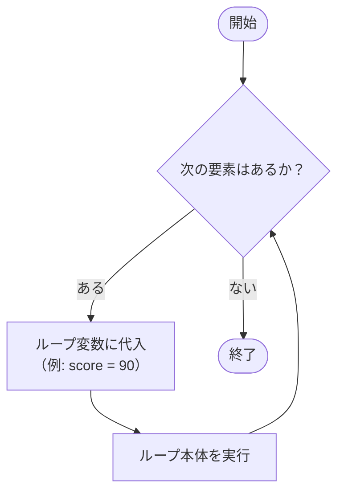

# 配列と foreach（補足）

`foreach` は配列の全要素を先頭から順に取り出してループする構文です。カウンター変数が不要なため、インデックスを使わない走査を簡潔に書けます。

## 学習目標

- `foreach` の書式と各要素の取り出し方を説明できる
- `var` による型推論を使える
- ループ変数が読み取り専用であることを理解できる
- `break`/`continue` と組み合わせて走査を制御できる
- `for` と `foreach` をシーンに応じて使い分けられる

## 前提知識

- [配列の基礎](/unity-csharp-learning/csharp/arrays/) を読んでいること
- [反復処理](/unity-csharp-learning/csharp/loops/) を読んでいること

---

## 1. foreach の構文

**書式：foreach 文**
```
foreach (型 変数名 in コレクション)
{
    繰り返す処理
}
```

| 要素 | 説明 |
|---|---|
| `型 変数名` | 各要素を受け取るループ変数 |
| `in` | 「〜の各要素を」を意味するキーワード |
| `コレクション` | 走査する配列またはシーケンス |

`foreach` の実行フローを示します。



```csharp
int[] scores = { 85, 72, 90, 68, 95 };

foreach (int score in scores)
{
    Console.WriteLine(score);
}
// 85
// 72
// 90
// 68
// 95
```

---

## 2. var による型推論

`var` を使うとコンパイラが右辺から型を推論します。配列の要素型が自明なときや型名が長いときに便利です。

```csharp
foreach (var score in scores)      // var は int と推論される
{
    Console.WriteLine(score);
}
```

型推論の結果はコンパイル時に確定します。実行速度への影響はありません。

---

## 3. ループ変数は読み取り専用

`foreach` のループ変数に値を代入しようとするとコンパイルエラーになります。

```csharp
foreach (int score in scores)
{
    // ❌ NG: ループ変数への代入はコンパイルエラー
    score = 100;
}

// ✅ OK: 要素の書き換えには for でインデックスを使う
for (int i = 0; i < scores.Length; i++)
{
    scores[i] = 100;
}
```

`foreach` は「読み取り」専用の走査と割り切り、書き換えが必要なときは `for` を使います。

---

## 4. 配列以外でも使える

`foreach` は配列だけでなく、順に要素を取り出せる型（シーケンス）であれば使えます。

**string（文字列）** — 文字（`char`）のシーケンスとして走査できます。

```csharp
string word = "Hello";
foreach (char c in word)
{
    Console.Write(c + " ");  // H e l l o
}
```

**List\<T\> などのコレクション** — `List<T>`・`Queue<T>` など標準コレクションも同様に走査できます（詳細は後続ページで扱います）。

```csharp
var list = new List<int> { 1, 2, 3 };
foreach (int n in list)
{
    Console.WriteLine(n);
}
```

---

## 5. break / continue と foreach

`foreach` でも `break` と `continue` を使えます。詳しい動作は[break と continue（補足）](/unity-csharp-learning/csharp/break-and-continue/)を参照してください。

```csharp
int[] scores = { 85, 55, 90, 40, 95 };

foreach (int score in scores)
{
    if (score < 60) continue;   // 60 未満はスキップ
    Console.WriteLine(score);
}
// 85
// 90
// 95
```

---

## 6. for と foreach の使い分け

| 状況 | 向いている構文 |
|---|---|
| インデックスが不要で読むだけ | `foreach` |
| 要素を書き換える | `for` |
| 逆順・飛ばしなど特殊な走査 | `for` |
| 多次元配列を行・列ごとに処理 | `for`（`GetLength`） |
| 全要素を順に処理するだけ | `foreach` |

インデックスが不要なら `foreach` を選ぶと、コードの意図が「全要素を順に処理する」と明確になります。

---

## まとめ

- `foreach (型 変数名 in 配列)` で全要素を先頭から走査できる
- `var` で型を省略できる（コンパイラが推論する）
- ループ変数は読み取り専用。書き換えには `for` を使う
- 配列以外にも `string`・`List<T>` など幅広いシーケンスに使える

---

## 理解度チェック

1. 次のコードの出力結果を答えてください。

   ```csharp
   string[] fruits = { "apple", "banana", "cherry" };
   foreach (var f in fruits)
   {
       Console.WriteLine(f.Length);
   }
   ```

2. `foreach` で配列要素を 2 倍にしようとした次のコードの問題点を答えてください。

   ```csharp
   int[] nums = { 1, 2, 3 };
   foreach (var n in nums)
   {
       n = n * 2;  // ?
   }
   ```

<details markdown="1">
<summary>解答を見る</summary>

1. `5`・`6`・`6` が順に出力されます（"apple" は 5 文字、"banana" と "cherry" は 6 文字）。

2. `foreach` のループ変数 `n` は読み取り専用のため、代入はコンパイルエラーになります。`for (int i = 0; i < nums.Length; i++) { nums[i] *= 2; }` と書き換えます。

</details>

---

## 次のステップ

[Array クラスと配列の性質（補足）](/unity-csharp-learning/csharp/array-class/) では、配列が参照型である仕組みと `Array.Sort` などの組み込みメソッドを学びます。
