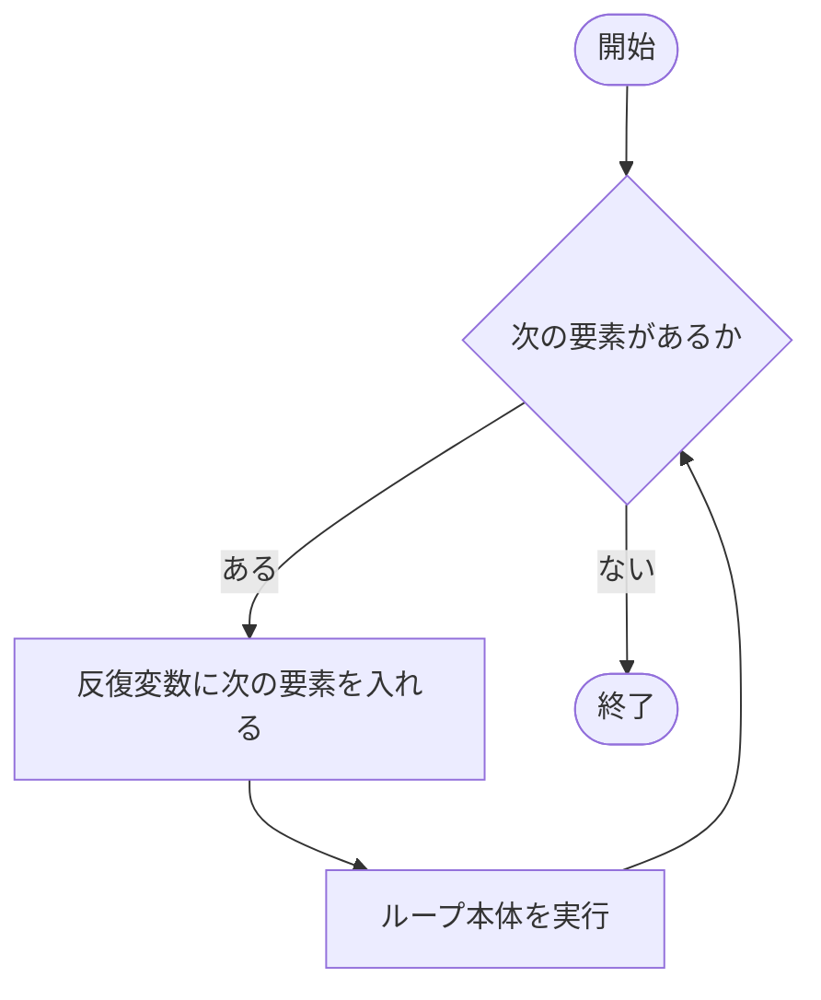

# 配列と foreach（補足）

このページは、[配列の基礎](/unity-csharp-learning/csharp/arrays/) の補足です。`foreach` 文で配列の要素を処理するときの決まりと、`for` 文との使い分けを学びます。

## 学習目標

このページを読み終えると、以下のことができるようになります。

- `foreach` 文で、配列の要素を先頭から順に取り出せる
- 反復変数の型に `var` を使える
- 反復変数が読み取り専用であることを説明できる
- `foreach` 文と `break`・`continue` を組み合わせられる
- `for` 文と `foreach` 文を、目的に応じて使い分けられる

## 前提知識

- [配列の基礎](/unity-csharp-learning/csharp/arrays/) を読んでいること
- [break と continue（補足）](/unity-csharp-learning/csharp/break-and-continue/) を読んでいること

---

## 1. foreach 文で配列を処理する

**書式：[foreach 文](https://learn.microsoft.com/dotnet/csharp/language-reference/statements/iteration-statements#the-foreach-statement)**
```
foreach (型 変数名 in 配列)
{
    // 繰り返す処理
}
```

| 要素 | 説明 |
|---|---|
| `型 変数名` | 取り出した要素を受け取る変数（反復変数） |
| `in` | 「〜の中の各要素について」を表すキーワード |
| `配列` | 要素を取り出す元の配列やコレクション |

`foreach` 文は、配列の先頭の要素から順に反復変数に入れて、ループ本体を実行します。すべての要素を処理すると、繰り返しを終えます。


```mermaid
flowchart TD
    A([開始]) --> B{"次の要素があるか"}
    B -- ある --> C["反復変数に次の要素を入れる"]
    C --> D["ループ本体を実行"]
    D --> B
    B -- ない --> E([終了])
```

```csharp
int[] scores = { 85, 72, 90, 68, 95 };

foreach (int score in scores)
{
    Console.WriteLine(score);
}
```

```
85
72
90
68
95
```

---

## 2. 反復変数の型に var を使う

反復変数の型には、`var` も書けます。コンパイラーが、配列の要素の型から反復変数の型を決めます。

```csharp
string[] fruits = { "apple", "banana" };

foreach (var fruit in fruits)
{
    Console.WriteLine($"{fruit}: {fruit.GetType()}");
}
```

```
apple: System.String
banana: System.String
```

`fruits` は `string` の配列なので、`fruit` は `string` になります。型が決まるのはコンパイルのときなので、`var` を使っても実行の速さは変わりません。

---

## 3. 反復変数は読み取り専用

`foreach` 文の反復変数には、値を代入できません。

```csharp
// ❌ NG: 反復変数には代入できない
// int[] scores = { 85, 72, 90 };
// foreach (int score in scores)
// {
//     score = 100;  // CS1656
// }
```

配列の要素を書き換えたいときは、`for` 文でインデックスを使います。

```csharp
int[] scores = { 85, 72, 90 };

for (int i = 0; i < scores.Length; i++)
{
    scores[i] += 10;
}

foreach (int score in scores)
{
    Console.WriteLine(score);
}
```

```
95
82
100
```

---

## 4. break と continue を組み合わせる

`foreach` 文でも、[break と continue（補足）](/unity-csharp-learning/csharp/break-and-continue/) で学んだ `break` と `continue` を使えます。

```csharp
int[] scores = { 85, 55, 90, 40, 95 };

foreach (int score in scores)
{
    if (score < 60)
    {
        continue;
    }
    Console.WriteLine(score);
}
```

```
85
90
95
```

60 未満の要素では `continue` するので、表示が飛ばされます。

```csharp
string[] names = { "Alice", "Bob", "Carol", "Dave" };

foreach (string name in names)
{
    if (name == "Carol")
    {
        Console.WriteLine("Carol が見つかった");
        break;
    }
    Console.WriteLine($"{name} を調べた");
}
```

```
Alice を調べた
Bob を調べた
Carol が見つかった
```

`Carol` が見つかった時点で `break` するので、`Dave` は調べられません。

---

## 5. 配列以外にも使える

`foreach` 文は、配列だけでなく、要素を順に取り出せるさまざまな型に使えます。[反復処理](/unity-csharp-learning/csharp/loops/) で見たように、文字列（`string`）からは文字（`char`）を 1 つずつ取り出せます。

```csharp
string word = "Hello";

foreach (char c in word)
{
    Console.Write(c + " ");
}
Console.WriteLine();
```

```
H e l l o 
```

.NET には、配列のほかにも、要素の数を後から増やせる `List<T>` などのコレクションが用意されています。これらのコレクションも、`foreach` 文で同じように処理できます。

---

## 6. for 文と foreach 文の使い分け

| やりたいこと | 向いている文 |
|---|---|
| すべての要素を、先頭から順に読むだけ | `foreach` |
| 要素を書き換える | `for` |
| インデックスを使う（何番目かを表示するなど） | `for` |
| 逆順や、1 つおきなど、順番を変えて処理する | `for` |

インデックスが必要なければ `foreach` 文を選ぶと、「すべての要素を順に処理する」という意図が読み取りやすくなります。

---

## まとめ

- `foreach (型 変数名 in 配列)` で、配列の要素を先頭から順に処理できる
- 反復変数の型には `var` も使える
- 反復変数は読み取り専用。要素を書き換えるときは `for` 文を使う
- `foreach` 文でも `break` と `continue` を使える
- `foreach` 文は、配列のほか、文字列やほかのコレクションにも使える

---

## 理解度チェック

1. 次のコードを実行すると何が出力されますか？

   ```csharp
   string[] fruits = { "apple", "banana", "cherry" };
   foreach (var f in fruits)
   {
       Console.WriteLine(f.Length);
   }
   ```

2. `foreach` 文で配列の要素を 2 倍にしようとした次のコードには、どのような問題がありますか？

   ```csharp
   int[] nums = { 1, 2, 3 };
   foreach (var n in nums)
   {
       n = n * 2;
   }
   ```

<details markdown="1">
<summary>解答を見る</summary>

1. 次のように出力されます。`"apple"` は 5 文字、`"banana"` と `"cherry"` は 6 文字です。

   ```
   5
   6
   6
   ```

2. 反復変数 `n` は読み取り専用なので、`n = n * 2;` はコンパイルエラーになります（CS1656）。要素を書き換えるには、`for` 文を使います。

   ```csharp
   int[] nums = { 1, 2, 3 };
   for (int i = 0; i < nums.Length; i++)
   {
       nums[i] *= 2;
   }
   ```

</details>

---

## 次のステップ

[Array クラスと配列の性質（補足）](/unity-csharp-learning/csharp/array-class/) では、配列の変数を代入したときに起きることと、配列を並べ替えたりコピーしたりするメソッドを学びます。
