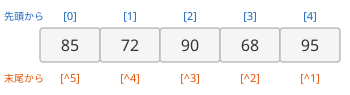

# 配列の基礎

**配列**（array）は、同じ型の値をいくつも並べてまとめたものです。1 つの変数で、複数の値をまとめて扱えます。

## 学習目標

このページを読み終えると、以下のことができるようになります。

- 配列を作り、初期化できる
- インデックスで要素を読み書きできる
- `Length` で要素の数を調べられる
- `for` 文と `foreach` 文で、配列のすべての要素を処理できる
- 範囲外のインデックスを使ったときに起きることを説明できる

## 前提知識

- [反復処理](/unity-csharp-learning/csharp/loops/) を読んでいること

---

## 1. 配列とは

5 人分のテストの点数を扱うとき、`score1`・`score2`・… と変数を 5 つ作ると、人数が増えるたびに変数が増えてしまいます。配列を使うと、5 つの値を 1 つの変数 `scores` にまとめられます。

配列の中の 1 つ 1 つの値を **要素** といいます。各要素には、`0` から始まる番号（**インデックス**）が付いていて、`scores[0]` のようにインデックスを指定して使います。

![変数 scores が、85、72、90、68、95 の 5 つの要素が並んだ配列を指している。先頭の要素は scores[0]、末尾の要素は scores[4]](array-layout.svg)

5 つの要素がある配列では、インデックスは `0` から `4` までです。先頭は `scores[0]`、末尾は `scores[4]` です。

---

## 2. 配列の作り方

### 配列の変数を宣言する

配列を入れる変数の型は、要素の型の後に `[]` を付けて表します。

**書式：[配列の変数の宣言](https://learn.microsoft.com/dotnet/csharp/language-reference/builtin-types/arrays#single-dimensional-arrays)**
```
型[] 変数名;
```

| 要素 | 説明 |
|---|---|
| `型[]` | 配列の型。`[]` は、その型の要素が並んだ配列であることを表す |
| `変数名` | 配列を入れる変数の名前 |

```csharp
int[] scores;
```

この時点では、変数 `scores` があるだけで、要素を入れる配列そのものはまだ作られていません。

### new で配列を作る

配列そのものは、`new` で作ります。

**書式：[配列の作成](https://learn.microsoft.com/dotnet/csharp/language-reference/builtin-types/arrays#single-dimensional-arrays)**
```
new 型[要素数]
```

| 要素 | 説明 |
|---|---|
| `型` | 要素の型 |
| `要素数` | 配列に入れられる要素の数。作った後で変えることはできない |

変数の宣言と配列の作成は、1 行にまとめて書くのが一般的です。

```csharp
int[] scores = new int[5];
Console.WriteLine(scores[0]);
```

```
0
```

作ったばかりの配列の要素には、型ごとの **既定値** が入っています。数値型は `0`、`bool` は `false` です。`string` の配列の要素は、どの文字列も指していないことを表す `null` になります（`null` については、[値型と参照型](/unity-csharp-learning/csharp/value-reference-types/) で学びます）。

---

## 3. 要素を読み書きする

**書式：[要素へのアクセス](https://learn.microsoft.com/dotnet/csharp/language-reference/operators/member-access-operators#array-access)**
```
配列[インデックス]
```

| 要素 | 説明 |
|---|---|
| `インデックス` | `0` 以上、要素数 - 1 以下の整数 |

```csharp
int[] scores = new int[5];

scores[0] = 85;
scores[1] = 72;
scores[2] = 90;
scores[3] = 68;
scores[4] = 95;

Console.WriteLine(scores[0]);
Console.WriteLine(scores[4]);

scores[2] = 100;
Console.WriteLine(scores[2]);
```

```
85
95
100
```

`scores[インデックス] = 値;` で要素に値を代入し、`scores[インデックス]` で要素の値を読み取ります。

### 末尾から数える（C# 8 以降）

インデックスの前に `^` を付けると、末尾から数えた位置を指定できます。`^1` は末尾の要素、`^2` は末尾から 2 番目の要素です。

**書式：[末尾からのインデックス](https://learn.microsoft.com/dotnet/csharp/language-reference/operators/member-access-operators#index-from-end-operator-)**
```
配列[^n]
```



```csharp
int[] scores = { 85, 72, 90, 68, 95 };

Console.WriteLine(scores[^1]);
Console.WriteLine(scores[^2]);
```

```
95
68
```

`scores[^1]` は、`scores[scores.Length - 1]` と同じ要素です。`Length` は 5 節で説明します。

---

## 4. 配列初期化子

要素の値が決まっているときは、**配列初期化子** を使うと、配列を作ると同時に要素の値を入れられます。要素数は、書いた値の数になります。

**書式：[配列初期化子](https://learn.microsoft.com/dotnet/csharp/language-reference/builtin-types/arrays#single-dimensional-arrays)**
```
型[] 変数名 = { 値1, 値2, ... };
```

```csharp
int[] scores = { 85, 72, 90, 68, 95 };
Console.WriteLine(scores[1]);
```

```
72
```

同じ配列を、次のようにも書けます。

```csharp
int[] a = { 85, 72, 90 };
int[] b = new int[] { 85, 72, 90 };
var c = new int[] { 85, 72, 90 };
var d = new[] { 85, 72, 90 };

Console.WriteLine($"{a[0]} {b[0]} {c[0]} {d[0]}");
Console.WriteLine(d.GetType());
```

```
85 85 85 85
System.Int32[]
```

| 左辺 | 右辺 | 型を決めるもの |
|---|---|---|
| `int[]` | `{ ... }` | 左辺の型 |
| `int[]` | `new int[] { ... }` | 両辺の型 |
| `var` | `new int[] { ... }` | 右辺の型 |
| `var` | `new[] { ... }` | 右辺の要素の型（すべて `int` なので `int[]`） |

`var` を使うときは、右辺に `new` が必要です。`{ ... }` だけでは、配列の型を決められないからです（よくあるミスを参照）。

---

## 5. すべての要素を処理する

### for 文と Length

配列のすべての要素を順に処理するときは、`for` 文でインデックスを 0 から順に変えていきます。繰り返しを終える条件には、配列の要素数を返す [Length プロパティ](https://learn.microsoft.com/dotnet/api/system.array.length) を使います。

**書式：[Array.Length プロパティ](https://learn.microsoft.com/dotnet/api/system.array.length)**
```csharp
public int Length { get; }
```

```csharp
int[] scores = { 85, 72, 90, 68, 95 };

Console.WriteLine(scores.Length);

for (int i = 0; i < scores.Length; i++)
{
    Console.WriteLine($"scores[{i}] = {scores[i]}");
}
```

```
5
scores[0] = 85
scores[1] = 72
scores[2] = 90
scores[3] = 68
scores[4] = 95
```

条件を `i < 5` と数値で書くこともできますが、配列の要素数を変えたときに、条件も書き直さなければなりません。`i < scores.Length` なら、要素数が変わっても書き直す必要はありません。

### foreach 文

インデックスが必要なく、要素を先頭から順に読むだけなら、[反復処理](/unity-csharp-learning/csharp/loops/) で学んだ `foreach` 文が簡潔です。

```csharp
int[] scores = { 85, 72, 90, 68, 95 };
int total = 0;

foreach (int score in scores)
{
    total += score;
}

Console.WriteLine($"合計: {total}");
```

```
合計: 410
```

要素を書き換えたいときや、インデックスを使いたいときは `for` 文を使います。使い分けは、[配列と foreach（補足）](/unity-csharp-learning/csharp/arrays-and-foreach/) で詳しく学びます。

---

## よくあるミス

### 範囲外のインデックスを使う

```csharp
// ❌ NG: インデックスが Length と等しい（範囲外）
// int[] scores = { 85, 72, 90, 68, 95 };
// Console.WriteLine(scores[5]);  // IndexOutOfRangeException
```

インデックスに使えるのは `0` から `Length - 1` までです。要素が 5 つの配列で `scores[5]` を使うと、実行したときに [IndexOutOfRangeException](https://learn.microsoft.com/dotnet/api/system.indexoutofrangeexception) という例外が発生して、プログラムが止まります。末尾の要素は `scores[scores.Length - 1]` か `scores[^1]` で指定します。

`for` 文の条件を `i <= scores.Length` と書いてしまうのも、同じ間違いです。

### var と { } だけで配列を作る

```csharp
// ❌ NG: { } だけでは、配列の型が決まらない
// var scores = { 85, 72, 90 };  // CS0820
```

`var` は右辺から型を決めますが、`{ 85, 72, 90 }` だけでは、何の型の配列なのかが決まりません。`int[] scores = { ... };` と型を書くか、`var scores = new[] { ... };` と書きます。

---

## ワンポイントアドバイス

### コレクション式（C# 12 以降）

C# 12 以降では、`[ ]` を使う [コレクション式](https://learn.microsoft.com/dotnet/csharp/language-reference/operators/collection-expressions) でも配列を作れます。

```csharp
int[] scores = [85, 72, 90, 68, 95];
Console.WriteLine(scores.Length);
```

```
5
```

`{ }` の配列初期化子と同じ結果になります。コレクション式は、配列以外のコレクションでも同じ書き方で使えます。

---

## まとめ

- 配列は、同じ型の値を並べてまとめたもの。各値を要素という
- `型[] 変数名 = new 型[要素数];` で配列を作る。要素には既定値が入る
- `型[] 変数名 = { 値1, 値2, ... };` で、作ると同時に値を入れられる
- インデックスは `0` から始まる。`配列[^1]` で末尾の要素を指定できる（C# 8 以降）
- `Length` で要素の数を調べられる
- すべての要素を処理するには、`for` 文（インデックスが必要なとき）か `foreach` 文（読むだけのとき）を使う
- 範囲外のインデックスを使うと、`IndexOutOfRangeException` が発生する

---

## 理解度チェック

1. `"red"`・`"green"`・`"blue"` の 3 つの要素を持つ `string` の配列を作るコードを書いてください。
2. 次のコードを実行すると何が出力されますか？

   ```csharp
   int[] nums = new int[3];
   nums[^1] = 7;
   Console.WriteLine(nums[1]);
   Console.WriteLine(nums[2]);
   Console.WriteLine(nums.Length);
   ```

3. `for` 文を使って、配列 `{ 1, 2, 3, 4, 5 }` のすべての要素の合計を表示するコードを書いてください。

<details markdown="1">
<summary>解答を見る</summary>

1. ```csharp
   string[] colors = { "red", "green", "blue" };
   ```

2. 次のように出力されます。数値型の配列の要素は `0` で初期化されます。`nums[^1]` は末尾の `nums[2]` なので、`nums[2]` は `7` です。

   ```
   0
   7
   3
   ```

3. ```csharp
   int[] nums = { 1, 2, 3, 4, 5 };
   int sum = 0;
   for (int i = 0; i < nums.Length; i++)
   {
       sum += nums[i];
   }
   Console.WriteLine(sum);
   ```

   `15` が表示されます。

</details>

---

## 次のステップ

[配列と foreach（補足）](/unity-csharp-learning/csharp/arrays-and-foreach/) では、`foreach` 文の反復変数、`break` や `continue` との組み合わせ、`for` 文との使い分けを学びます。
