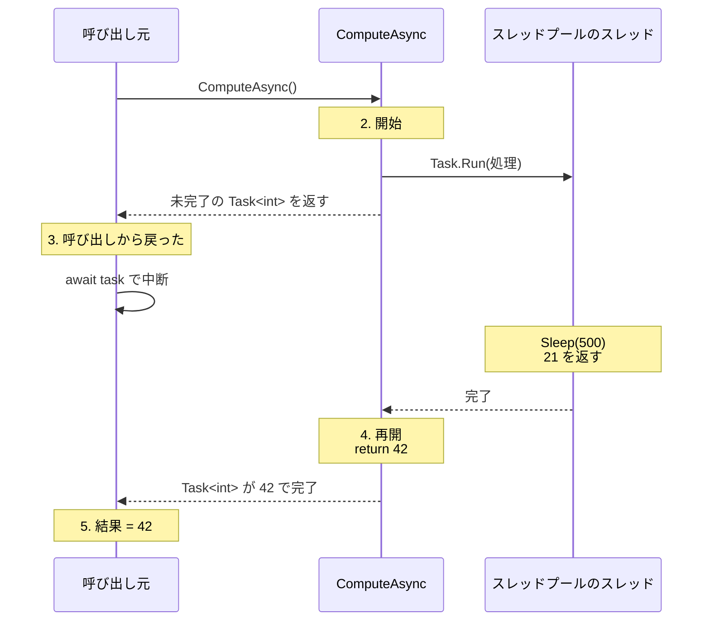

# async と await

**await**（アウェイト）演算子は、`Task` の完了を、スレッドを止めずに待ちます。`await` を使うメソッドには **async**（エイシンク）修飾子を付けます。`await` を使うと、[継続と ContinueWith](/unity-csharp-learning/csharp/task-continuation/) で学んだ継続を、コンパイラーが代わりに組み立ててくれます。そのため、`if`・`for`・`try` / `catch` を使った上から順に読める形のまま、スレッドを止めない処理を書けます。

## 学習目標

このページを読み終えると、以下のことができるようになります。

- `await` で `Task` の完了を待ち、結果を受け取れる
- `async` 修飾子を付けて、`Task` や `Task<T>` を返す async メソッドを定義できる
- async メソッドが最初の `await` で呼び出し元に戻り、完了後に続きから再開することを説明できる
- `await` では、`AggregateException` ではなく元の例外が投げられることを説明できる

## 前提知識

- [継続と ContinueWith](/unity-csharp-learning/csharp/task-continuation/) を読んでいること
- [例外の基本](/unity-csharp-learning/csharp/exceptions/) を読んでいること

---

## 1. await で Task の完了を待つ

[継続と ContinueWith](/unity-csharp-learning/csharp/task-continuation/) の最後に、時間のかかる `Read` の結果を数値に変換する処理を、`ContinueWith` で書きました。同じ処理を `await` で書くと、次のようになります。

```csharp
try
{
    string text = await Task.Run(Read);
    int number = int.Parse(text);
    Console.WriteLine($"結果 = {number * 2}");
}
catch (FormatException)
{
    Console.WriteLine("数値に変換できない");
}

string Read()
{
    Thread.Sleep(500);
    return "abc";
}
```

```
数値に変換できない
```

`Task.Run` を呼び出す行に `await` を付けただけで、あとは `Wait` で待つ書き方とほとんど同じです。`try` / `catch` も、処理全体を 1 つで囲めています。

**書式：[await 演算子](https://learn.microsoft.com/dotnet/csharp/language-reference/operators/await)**
```
await Task型の式
```

| 要素 | 説明 |
|---|---|
| `await` | `Task` の完了を待つ演算子 |
| `Task型の式` | `Task` や `Task<T>` を返す式。`Task<T>` のとき、`await` 式の値は `T` 型の結果になる |

`await` は、`Task` が完了していなければ、その時点でメソッドの実行を中断し、スレッドを手放します。`Task` が完了すると、中断したところから実行を再開します。中断している間、スレッドは止まっていないので、ほかの仕事に使えます。`Wait` や `Result` との違いは、ここにあります。

トップレベルステートメントでは、このように `await` をそのまま書けます。メソッドの中で `await` を使うには、次の節で学ぶ `async` 修飾子が必要です。

---

## 2. async メソッドを定義する

`await` を使うメソッドには、`async` 修飾子を付けます。`async` 修飾子を付けたメソッドを **async メソッド**（非同期メソッド）といいます。

**書式：[async 修飾子](https://learn.microsoft.com/dotnet/csharp/language-reference/keywords/async)**
```
async Task<T> メソッド名(パラメータ)
{
    // await を使う処理
    return T型の値;
}

async Task メソッド名(パラメータ)
{
    // await を使う処理
}
```

| 要素 | 説明 |
|---|---|
| `async` | メソッドの中で `await` を使えるようにする修飾子 |
| `Task<T>` | 値を返す async メソッドの戻り値の型。`return` には `Task<T>` ではなく、`T` 型の値を書く |
| `Task` | 値を返さない async メソッドの戻り値の型。`return` に値は書かない |

async メソッドは、`return` に書いた値を、コンパイラーが `Task<T>` に包んで返します。呼び出し元は、戻り値の `Task<T>` を `await` して結果を受け取ります。TAP の決まりにしたがって、async メソッドの名前の末尾には `Async` を付けます。

次のコードは、async メソッド `ComputeAsync` を呼び出し、どの順番で処理が進むかを表示します。

```csharp
Console.WriteLine("1. 呼び出す前");
Task<int> task = ComputeAsync();
Console.WriteLine("3. 呼び出しから戻った");

int result = await task;
Console.WriteLine($"5. 結果 = {result}");

async Task<int> ComputeAsync()
{
    Console.WriteLine("2. ComputeAsync を開始");
    int value = await Task.Run(() =>
    {
        Thread.Sleep(500);
        return 21;
    });
    Console.WriteLine("4. ComputeAsync を再開");
    return value * 2;
}
```

```
1. 呼び出す前
2. ComputeAsync を開始
3. 呼び出しから戻った
4. ComputeAsync を再開
5. 結果 = 42
```

`ComputeAsync` を呼び出すと、最初の `await` までは、ふつうのメソッドと同じように呼び出したスレッドで実行されます（2）。`await` した `Task` がまだ完了していないので、`ComputeAsync` はそこで中断し、まだ完了していない `Task<int>` を呼び出し元に返します（3）。0.5 秒後に `Task.Run` の処理が完了すると、`ComputeAsync` は `await` の次の行から再開し（4）、`return` した `42` で `Task<int>` が完了します。呼び出し元の `await task` は、その `42` を受け取ります（5）。



### async メソッドの return

`Task<int>` を返す async メソッドの `return` には、`int` 型の値を書きます。`Task<int>` を `return` しようとすると、コンパイルエラーになります。

```csharp
// ❌ NG: async メソッドで Task<int> を return するとコンパイルエラーになる（CS4016）
async Task<int> GetAsync()
{
    await Task.Delay(10);
    return Task.FromResult(1);
}
```

逆に、`async` 修飾子のないメソッドで `await` を使ってもコンパイルエラーになります（CS4032）。

---

## 3. await の正体

`await` は、コンパイラーが [継続と ContinueWith](/unity-csharp-learning/csharp/task-continuation/) の継続に置き換えて実現しています。前の節の `ComputeAsync` は、おおまかには次のようなメソッドに置き換えられます。

```csharp
// コンパイラーによる置き換えのイメージ（実際のコードとは異なる）
Task<int> ComputeAsync()
{
    Console.WriteLine("2. ComputeAsync を開始");
    return Task.Run(() =>
    {
        Thread.Sleep(500);
        return 21;
    })
    .ContinueWith(t =>
    {
        int value = t.Result;
        Console.WriteLine("4. ComputeAsync を再開");
        return value * 2;
    });
}
```

`await` より前の部分はそのまま実行され、`await` より後ろの部分が継続になります。メソッドの中に `await` がいくつあっても、コンパイラーがメソッドを `await` の位置で区切り、区切られた部分を順に継続として実行します。`for` や `try` の中に `await` があっても、コンパイラーは「どこまで実行したか」を覚えておくオブジェクト（**ステートマシン**）を作って、正しい位置から再開できるようにします。

[継続と ContinueWith](/unity-csharp-learning/csharp/task-continuation/) では、継続を使うと `if`・`for`・`try` / `catch` が書きにくくなることを学びました。`await` を使えば、この組み立てをコンパイラーが引き受けてくれるので、制御の書き方をそのまま使えます。

> 💡 **ポイント**: `await` は「待つ」と読めますが、スレッドを止めて待つわけではありません。「続きを継続として登録して、いったんメソッドから戻る」のが `await` の働きです。

---

## 4. await と例外

`await` した `Task` が例外で終わっていると、`await` はその例外を投げます。このとき投げられるのは、`AggregateException` ではなく、元の例外です。

```csharp
try
{
    int number = await ParseAsync("abc");
    Console.WriteLine(number);
}
catch (FormatException e)
{
    Console.WriteLine($"{e.GetType().Name}: {e.Message}");
}

async Task<int> ParseAsync(string text)
{
    string trimmed = await Task.Run(() => text.Trim());
    return int.Parse(trimmed);
}
```

```
FormatException: The input string 'abc' was not in a correct format.
```

`ParseAsync` の中の `int.Parse` で発生した `FormatException` は、`ParseAsync` が返した `Task<int>` に記録されます。呼び出し元の `await` がそれを取り出して、`FormatException` のまま投げるので、`catch (FormatException)` で受け止められます。`Wait` や `Result` と違い、`InnerException` をたどる必要はありません。

async メソッドで発生した例外は、`await` より前で発生した場合でも、呼び出したときには投げられません。例外は戻り値の `Task` に記録され、その `Task` を `await` したときに投げられます。次のコードは、前のコード例とは別のプログラムです。

```csharp
Task<int> task = ParseAsync("abc");
Console.WriteLine("呼び出しから戻った");
Console.WriteLine($"IsFaulted = {task.IsFaulted}");

async Task<int> ParseAsync(string text)
{
    int number = int.Parse(text);
    await Task.Delay(100);
    return number;
}
```

```
呼び出しから戻った
IsFaulted = True
```

`int.Parse` は最初の `await` より前にあるので、呼び出したスレッドで実行されて例外が発生します。それでも例外は呼び出し元に投げられず、`IsFaulted` が `True` の `Task` が返されます。

---

## 5. Wait と await の比較

| | `Wait` / `Result` | `await` |
|---|---|---|
| 待っている間のスレッド | 止まる | 手放して、ほかの仕事に使える |
| 使える場所 | どこでも | async メソッドとトップレベルステートメント |
| 例外 | `AggregateException` に包まれる | 元の例外がそのまま投げられる |
| 続きの処理 | 同じスレッドで、止まっていたところから | 継続として、`Task` の完了後に再開する |

`await` を使うメソッドは async メソッドになり、`Task` を返します。そのメソッドを呼び出す側も、スレッドを止めずに結果を受け取るには `await` を使うので、呼び出す側も async メソッドになります。こうして、async メソッドは呼び出し元へ向かって広がっていきます。途中で `Wait` や `Result` を使うと、そこでスレッドが止まり、`await` を使った意味が薄れてしまいます。

---

## よくあるミス

### async void メソッドを作る

`async` 修飾子は、戻り値が `void` のメソッドにも付けられます。しかし、`async void` メソッドは `Task` を返さないので、呼び出し元は完了を待つことも、例外を受け止めることもできません。`async void` メソッドの中で発生した例外は、プログラムを異常終了させます。

```csharp
// ❌ NG: async void メソッドの例外は、呼び出し元の catch で受け止められない
try
{
    Fire();
}
catch (Exception)
{
    Console.WriteLine("catch");  // 表示されない
}
await Task.Delay(1000);
Console.WriteLine("Main: 終了");  // 表示されない。InvalidOperationException が処理されずにプログラムが異常終了する

async void Fire()
{
    await Task.Delay(100);
    throw new InvalidOperationException("async void で発生した例外");
}
```

`Fire` は最初の `await` で呼び出し元に戻るので、`try` ブロックはすぐに終わります。0.1 秒後に `throw` が実行されますが、例外を記録する `Task` がないため、例外はスレッドプールのスレッドで投げられ、[スレッドプール](/unity-csharp-learning/csharp/thread-pool/) で学んだのと同じように、プログラム全体を異常終了させます。

値を返さない async メソッドの戻り値は、`void` ではなく `Task` にします。`async void` は、[イベント](/unity-csharp-learning/csharp/events/) のイベントハンドラーのように、戻り値が `void` と決められているメソッドを async メソッドにするときだけ使います。

### Task を返すメソッドの呼び出しに await を付け忘れる

`Task` を返すメソッドを呼び出して、戻り値を使わずに捨てると、処理の完了を待たずに次の行へ進みます。[Task と Task\<T\>](/unity-csharp-learning/csharp/tasks/) の「よくあるミス」で見たように、例外も誰にも知らされません。

async メソッドやトップレベルステートメントの中で、`Task` を返すメソッドの戻り値を捨てると、コンパイラーは警告 CS4014 を表示します。トップレベルステートメントで警告が出たのは、トップレベルステートメントも `await` を書ける場所だからです。警告が出たら、`await` を付け忘れていないかを確かめます。

---

## ワンポイントアドバイス

### トップレベルステートメントと async Main

トップレベルステートメントに `await` を書くと、コンパイラーが作る `Main` メソッドは、`static async Task Main(string[] args)` のような async メソッドになります。トップレベルステートメントを使わずに `Main` メソッドを自分で書く場合も、戻り値を `Task` や `Task<int>` にして `async` 修飾子を付ければ、`Main` の中で `await` を使えます。

---

## まとめ

- `await` は、`Task` が完了していなければメソッドを中断してスレッドを手放し、完了後に続きから再開する
- `Task<T>` を `await` すると、`T` 型の結果が得られる
- `await` を使うメソッドには `async` 修飾子を付け、戻り値を `Task` か `Task<T>` にする。`Task<T>` のとき、`return` には `T` 型の値を書く
- async メソッドは、最初の未完了の `await` で、未完了の `Task` を呼び出し元に返す
- コンパイラーは、`await` より後ろの部分を継続に置き換える。そのため、`if`・`for`・`try` / `catch` をそのまま使える
- `await` は、`AggregateException` ではなく元の例外を投げる
- `async void` は、イベントハンドラーのほかには使わない

---

## 理解度チェック

1. `async Task<string>` を戻り値とするメソッドで、`return` に書く値の型は何ですか？
2. 次のコードを実行すると何が出力されますか？

   ```csharp
   Console.WriteLine("A");
   Task task = PrintAsync();
   Console.WriteLine("C");
   await task;
   Console.WriteLine("E");

   async Task PrintAsync()
   {
       Console.WriteLine("B");
       await Task.Delay(100);
       Console.WriteLine("D");
   }
   ```

3. 値を返さない async メソッドの戻り値を、`void` ではなく `Task` にするのはなぜですか？

<details markdown="1">
<summary>解答を見る</summary>

1. `string` です。`return` に書いた値は、コンパイラーが `Task<string>` に包んで返します。
2. 次のように出力されます。`PrintAsync` は `B` を表示したあと、`await Task.Delay(100)` で中断して呼び出し元に戻るので、`C` が `D` より先に表示されます。

   ```
   A
   B
   C
   D
   E
   ```

3. `Task` を返せば、呼び出し元がその `Task` を `await` して、完了を待ったり、例外を受け止めたりできるからです。`async void` メソッドでは、どちらもできず、例外はプログラムを異常終了させます。

</details>

---

## 次のステップ

[スレッドを使わずに待つ](/unity-csharp-learning/csharp/async-without-threads/) では、`Task.Run` を使わない非同期処理で、待っている間にスレッドを 1 つも使わない仕組みを学びます。
