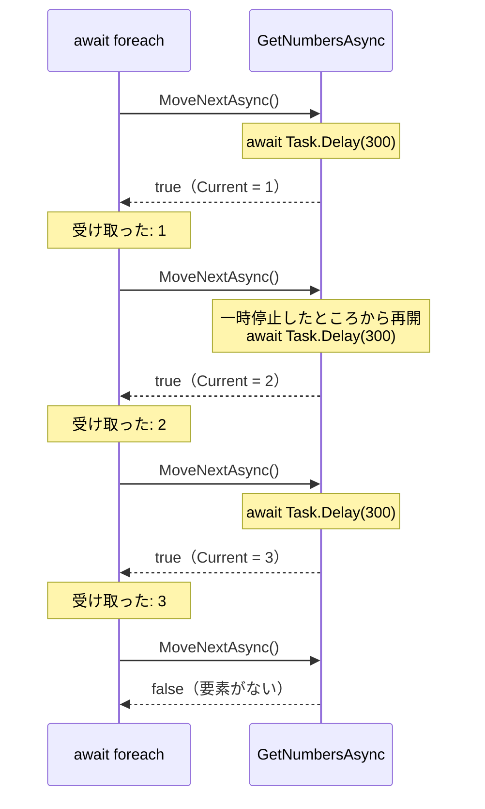

# IAsyncEnumerable と await foreach

`Task<List<T>>` を返す async メソッドでは、すべての要素がそろうまで、呼び出し元は 1 つも受け取れません。**IAsyncEnumerable\<T\>** を使うと、要素が 1 つ用意できるたびに、呼び出し元がそれを受け取って処理できます。受け取る側は **await foreach** 文で、要素を待ちながら 1 つずつ取り出します。このページでは、`foreach` が要素を取り出す仕組みから始めて、その非同期版である `IAsyncEnumerable<T>` と `await foreach` を学びます。

## 学習目標

このページを読み終えると、以下のことができるようになります。

- `foreach` 文が `IEnumerable<T>` と `IEnumerator<T>` を使って要素を取り出す仕組みを説明できる
- `yield return` を使って、要素を 1 つずつ返すメソッドを書ける
- `async IAsyncEnumerable<T>` を返す非同期イテレーターを書き、`await foreach` で要素を受け取れる
- `await foreach` が `MoveNextAsync` と `DisposeAsync` の呼び出しに置き換えられることを説明できる

## 前提知識

- [ValueTask](/unity-csharp-learning/csharp/value-task/) を読んでいること
- [配列と foreach（補足）](/unity-csharp-learning/csharp/arrays-and-foreach/) を読んでいること
- [インターフェイス](/unity-csharp-learning/csharp/interfaces/) を読んでいること

---

## 1. foreach が要素を取り出す仕組み

[配列と foreach（補足）](/unity-csharp-learning/csharp/arrays-and-foreach/) では、配列や `List<T>` の要素を `foreach` 文で順に取り出しました。`foreach` 文は、次の 2 つのインターフェイスを使って要素を取り出しています。

| インターフェイス | 役割 | 主なメンバー |
|---|---|---|
| [IEnumerable\<T\>](https://learn.microsoft.com/dotnet/api/system.collections.generic.ienumerable-1) | 要素を順に取り出せるもの（コレクションなど） | `GetEnumerator()`：取り出し役の `IEnumerator<T>` を返す |
| [IEnumerator\<T\>](https://learn.microsoft.com/dotnet/api/system.collections.generic.ienumerator-1) | 取り出し役。今どの要素を指しているかを覚えている | `MoveNext()`：次の要素に進む。要素がなければ `false` を返す<br/>`Current`：今指している要素 |

[List\<T\> クラス](https://learn.microsoft.com/dotnet/api/system.collections.generic.list-1) は `IEnumerable<T>` を実装しています。`foreach` 文は、おおまかには次のように置き換えられます。

```csharp
List<int> numbers = new List<int> { 10, 20, 30 };

IEnumerator<int> enumerator = numbers.GetEnumerator();
while (enumerator.MoveNext())
{
    int n = enumerator.Current;
    Console.WriteLine(n);
}
```

```
10
20
30
```

`MoveNext` で次の要素に進み、`Current` でその要素を読む、を `MoveNext` が `false` を返すまで繰り返します。`foreach (int n in numbers)` と書いたときも、コンパイラーがこれと同じ処理を作っています。

---

## 2. yield return で要素を 1 つずつ返す

`IEnumerable<T>` を返すメソッドは、[yield 文](https://learn.microsoft.com/dotnet/csharp/language-reference/statements/yield) を使って書けます。`yield return` を使うメソッドを **イテレーター**（iterator）といいます。

**書式：[yield return 文](https://learn.microsoft.com/dotnet/csharp/language-reference/statements/yield)**
```
IEnumerable<T> メソッド名(パラメータ)
{
    yield return T型の値;
}
```

イテレーターは、呼び出されたときには実行されません。`foreach` が `MoveNext` を呼ぶと、次の `yield return` まで実行し、その値を `Current` にして一時停止します。次に `MoveNext` が呼ばれると、一時停止したところから再開します。

```csharp
foreach (int n in GetNumbers())
{
    Console.WriteLine($"受け取った: {n}");
}

IEnumerable<int> GetNumbers()
{
    Console.WriteLine("1 を返す");
    yield return 1;
    Console.WriteLine("2 を返す");
    yield return 2;
    Console.WriteLine("3 を返す");
    yield return 3;
}
```

```
1 を返す
受け取った: 1
2 を返す
受け取った: 2
3 を返す
受け取った: 3
```

`GetNumbers` は、すべての値を先に用意するのではなく、`foreach` が次の要素を求めるたびに 1 つずつ用意しています。そのため、`GetNumbers` の表示と `foreach` の表示が交互に並びます。どこまで実行したかを覚えておいて続きから再開するために、コンパイラーは、[async と await](/unity-csharp-learning/csharp/async-await/) で学んだ async メソッドと同じように、イテレーターをステートマシンに置き換えます。

---

## 3. 要素を待ちながら受け取る

要素を用意するのに時間がかかり、その間 `await` したい場合を考えます。`Task<List<int>>` を返す async メソッドなら、次のように書けます。

```csharp
List<int> numbers = await GetNumbersAsync();
foreach (int n in numbers)
{
    Console.WriteLine($"受け取った: {n}");
}

async Task<List<int>> GetNumbersAsync()
{
    List<int> list = new List<int>();
    for (int i = 1; i <= 3; i++)
    {
        await Task.Delay(300);
        Console.WriteLine($"{i} を用意した");
        list.Add(i);
    }
    return list;
}
```

```
1 を用意した
2 を用意した
3 を用意した
受け取った: 1
受け取った: 2
受け取った: 3
```

`Task<List<int>>` が完了するのは、3 つの要素がすべてそろったときです。1 つ目の要素は 0.3 秒で用意できているのに、呼び出し元がそれを受け取れるのは 0.9 秒後です。要素の数が多い場合や、通信で少しずつ届くデータの場合には、届いたものから処理を始められないのは不便です。

一方、前の節の `IEnumerable<T>` は要素を 1 つずつ返せますが、`MoveNext` は `bool` を返すふつうのメソッドなので、次の要素を用意するために `await` することはできません。

そこで、`IEnumerable<T>` と `IEnumerator<T>` の非同期版として、次の 2 つのインターフェイスが用意されています。

| インターフェイス | 主なメンバー |
|---|---|
| [IAsyncEnumerable\<T\>](https://learn.microsoft.com/dotnet/api/system.collections.generic.iasyncenumerable-1) | `GetAsyncEnumerator()`：取り出し役の `IAsyncEnumerator<T>` を返す |
| [IAsyncEnumerator\<T\>](https://learn.microsoft.com/dotnet/api/system.collections.generic.iasyncenumerator-1) | `MoveNextAsync()`：次の要素に進む。`ValueTask<bool>` を返す<br/>`Current`：今指している要素<br/>`DisposeAsync()`：取り出しの後片付けをする |

**書式：[IAsyncEnumerator\<T\>.MoveNextAsync メソッド](https://learn.microsoft.com/dotnet/api/system.collections.generic.iasyncenumerator-1.movenextasync)**
```csharp
ValueTask<bool> MoveNextAsync();
```

`MoveNextAsync` は `ValueTask<bool>` を返すので、次の要素が用意できるまで `await` で待てます。戻り値が `Task<bool>` ではなく `ValueTask<bool>` なのは、[ValueTask](/unity-csharp-learning/csharp/value-task/) で学んだ理由によります。`MoveNextAsync` は要素の数だけ呼ばれ、次の要素がすでに用意できていて、中断せずに結果を返せることも多いからです。

---

## 4. 非同期イテレーターと await foreach

`IAsyncEnumerable<T>` を返すメソッドも、`yield return` を使って書けます。戻り値を `IAsyncEnumerable<T>` にして `async` 修飾子を付けると、メソッドの中で `await` と `yield return` の両方を使えます。このようなメソッドを **非同期イテレーター** といいます。

**書式：非同期イテレーター**
```
async IAsyncEnumerable<T> メソッド名(パラメータ)
{
    await ...;
    yield return T型の値;
}
```

`IAsyncEnumerable<T>` の要素は、`await foreach` 文で取り出します。

**書式：[await foreach 文](https://learn.microsoft.com/dotnet/csharp/language-reference/statements/iteration-statements#await-foreach)**
```
await foreach (型 変数名 in IAsyncEnumerable型の式)
{
    // 要素ごとの処理
}
```

前の節の `GetNumbersAsync` を、非同期イテレーターで書き直します。

```csharp
await foreach (int n in GetNumbersAsync())
{
    Console.WriteLine($"受け取った: {n}");
}
Console.WriteLine("終了");

async IAsyncEnumerable<int> GetNumbersAsync()
{
    for (int i = 1; i <= 3; i++)
    {
        await Task.Delay(300);
        Console.WriteLine($"{i} を返す");
        yield return i;
    }
}
```

```
1 を返す
受け取った: 1
2 を返す
受け取った: 2
3 を返す
受け取った: 3
終了
```

`GetNumbersAsync` が 1 つ返すたびに、`await foreach` がそれを受け取って処理しています。1 つ目の要素は、0.3 秒後に受け取れます。

`await foreach` は、次の要素が用意できるまで `await` で待つので、待っている間スレッドを手放します。そのため、`await foreach` は `await` と同じく、async メソッドかトップレベルステートメントの中で使います。



---

## 5. await foreach の正体

`foreach` 文と同じように、`await foreach` 文もコンパイラーによって置き換えられます。前の節の `await foreach` は、おおまかには次のようになります。

```csharp
IAsyncEnumerator<int> enumerator = GetNumbersAsync().GetAsyncEnumerator();
try
{
    while (await enumerator.MoveNextAsync())
    {
        int n = enumerator.Current;
        Console.WriteLine($"受け取った: {n}");
    }
}
finally
{
    await enumerator.DisposeAsync();
}

async IAsyncEnumerable<int> GetNumbersAsync()
{
    for (int i = 1; i <= 3; i++)
    {
        await Task.Delay(300);
        yield return i;
    }
}
```

```
受け取った: 1
受け取った: 2
受け取った: 3
```

`MoveNextAsync` を `await` しながら要素を取り出し、最後に `finally` の中で `DisposeAsync` を `await` しています。`DisposeAsync` は、取り出し役の後片付けを非同期に行うメソッドです。途中で `break` したり例外が発生したりしても、`finally` なので必ず呼ばれます。[IDisposable と using](/unity-csharp-learning/csharp/dispose-using/) で学んだ `using` 文の正体と同じ形です。

### break したときの後片付け

非同期イテレーターの中に `try` / `finally` を書くと、`DisposeAsync` が呼ばれたときに、その `finally` が実行されます。次のコードは、前のコード例とは別のプログラムです。2 つ目の要素を受け取ったところで `break` します。

```csharp
await foreach (int n in GetNumbersAsync())
{
    Console.WriteLine($"受け取った: {n}");
    if (n == 2)
    {
        break;
    }
}
Console.WriteLine("終了");

async IAsyncEnumerable<int> GetNumbersAsync()
{
    try
    {
        for (int i = 1; i <= 5; i++)
        {
            await Task.Delay(100);
            yield return i;
        }
    }
    finally
    {
        Console.WriteLine("GetNumbersAsync の後片付け");
    }
}
```

```
受け取った: 1
受け取った: 2
GetNumbersAsync の後片付け
終了
```

`GetNumbersAsync` は `yield return 2` で一時停止したまま、3 つ目以降の要素を返すことはありません。`break` で `await foreach` を抜けると `DisposeAsync` が呼ばれ、一時停止していた `GetNumbersAsync` の `finally` が実行されます。ファイルや通信の接続を使いながら要素を返すイテレーターでも、途中でやめたときに確実に閉じられます。

`DisposeAsync` を持つ `IAsyncDisposable` インターフェイスと、それを使う `await using` 文は、次のページで学びます。

---

## よくあるミス

### IAsyncEnumerable を foreach で回す

`IAsyncEnumerable<T>` は `IEnumerable<T>` を実装していないので、`foreach` 文では取り出せません。

```csharp
// ❌ NG: IAsyncEnumerable<int> を foreach で回すとコンパイルエラーになる（CS8414）
foreach (int n in GetNumbersAsync())
{
    Console.WriteLine(n);
}

// ✅ OK: await foreach で回す
await foreach (int n in GetNumbersAsync())
{
    Console.WriteLine(n);
}
```

エラーメッセージでも、`foreach` ではなく `await foreach` ではないかと指摘されます。

---

## ワンポイントアドバイス

### 非同期イテレーターのキャンセル

非同期イテレーターを [キャンセル](/unity-csharp-learning/csharp/task-cancellation/) できるようにするには、`CancellationToken` のパラメータに [EnumeratorCancellation 属性](https://learn.microsoft.com/dotnet/api/system.runtime.compilerservices.enumeratorcancellationattribute) を付けます。呼び出し元は、[WithCancellation メソッド](https://learn.microsoft.com/dotnet/api/system.threading.tasks.taskasyncenumerableextensions.withcancellation) で `CancellationToken` を渡します。

```csharp
using System.Runtime.CompilerServices;

using CancellationTokenSource source = new CancellationTokenSource();
source.CancelAfter(700);

try
{
    await foreach (int n in GetNumbersAsync().WithCancellation(source.Token))
    {
        Console.WriteLine($"受け取った: {n}");
    }
}
catch (OperationCanceledException)
{
    Console.WriteLine("キャンセルされた");
}

async IAsyncEnumerable<int> GetNumbersAsync([EnumeratorCancellation] CancellationToken token = default)
{
    for (int i = 1; i <= 5; i++)
    {
        await Task.Delay(300, token);
        yield return i;
    }
}
```

実行結果の例です。受け取る要素の数は、時間の進み方によって変わることがあります。

```
受け取った: 1
受け取った: 2
キャンセルされた
```

`WithCancellation` で渡した `CancellationToken` が、`EnumeratorCancellation` 属性を付けたパラメータ `token` に渡されます。0.7 秒の時点で、3 つ目の要素を用意する `Task.Delay(300, token)` がキャンセルされます。

---

## まとめ

- `foreach` 文は、`IEnumerable<T>` の `GetEnumerator` で取り出し役の `IEnumerator<T>` を得て、`MoveNext` と `Current` で要素を取り出す
- `yield return` を使うイテレーターは、要素を求められるたびに次の `yield return` まで実行し、一時停止する
- `IAsyncEnumerable<T>` と `IAsyncEnumerator<T>` は、要素を非同期に 1 つずつ取り出すためのインターフェイス。`MoveNextAsync` は `ValueTask<bool>` を返す
- `async IAsyncEnumerable<T>` を返す非同期イテレーターでは、`await` と `yield return` の両方を使える
- `await foreach` 文は、`MoveNextAsync` を `await` しながら要素を取り出し、最後に `finally` で `DisposeAsync` を `await` する
- `break` で途中でやめても、`DisposeAsync` によって非同期イテレーターの `finally` が実行される

---

## 理解度チェック

1. `Task<List<int>>` を返す async メソッドと、`IAsyncEnumerable<int>` を返す非同期イテレーターでは、呼び出し元が最初の要素を受け取れるタイミングはどう違いますか？
2. 次のコードを実行すると何が出力されますか？

   ```csharp
   int sum = 0;
   await foreach (int n in GetAsync())
   {
       sum += n;
   }
   Console.WriteLine(sum);

   async IAsyncEnumerable<int> GetAsync()
   {
       for (int i = 1; i <= 4; i++)
       {
           await Task.Delay(10);
           yield return i * i;
       }
   }
   ```

3. `IAsyncEnumerator<T>` の `MoveNextAsync` の戻り値が、`Task<bool>` ではなく `ValueTask<bool>` なのはなぜですか？

<details markdown="1">
<summary>解答を見る</summary>

1. `Task<List<int>>` では、すべての要素がそろって `Task` が完了するまで、最初の要素も受け取れません。非同期イテレーターでは、最初の要素が `yield return` された時点で受け取れます。
2. `30` が出力されます。`GetAsync` は `1`・`4`・`9`・`16` を順に返し、その合計は `30` です。
3. `MoveNextAsync` は要素の数だけ呼ばれるうえに、次の要素がすでに用意できていて、中断せずに結果を返せることが多いからです。`ValueTask<bool>` なら、そのような呼び出しでヒープにオブジェクトを作らずに済みます。

</details>

---

## 次のステップ

[IAsyncDisposable と await using](/unity-csharp-learning/csharp/async-dispose/) では、リソースの後片付けを非同期に行う `DisposeAsync` と、それを確実に呼ぶ `await using` 文を学びます。
