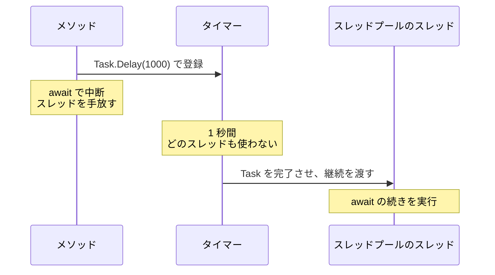

# スレッドを使わずに待つ

ここまでの `Task` は、どれも `Task.Run` でスレッドプールのスレッドに処理を実行させていました。しかし、時間の経過や通信の応答を待つだけなら、待っている間にスレッドは必要ありません。このページでは、`Task.Delay` や `TaskCompletionSource<TResult>` を使って、スレッドを 1 つも使わずに待つ `Task` を学びます。[スレッドの数と性能](/unity-csharp-learning/csharp/thread-performance/) で残した「待つためだけにスレッドを占有するのは無駄が大きい」という問題は、ここで解決します。

## 学習目標

このページを読み終えると、以下のことができるようになります。

- `Task.Run` の中で待つと、スレッドプールのスレッドを占有してしまうことを説明できる
- `Task.Delay` を `await` して、スレッドを使わずに待てる
- `TaskCompletionSource<TResult>` を使って、スレッドに結び付かない `Task` を作れる
- 計算する処理には `Task.Run`、待つ処理には `XxxAsync` メソッドを使う、という使い分けを説明できる

## 前提知識

- [async と await](/unity-csharp-learning/csharp/async-await/) を読んでいること
- [スレッドの数と性能](/unity-csharp-learning/csharp/thread-performance/) を読んでいること

---

## 1. Task.Run で待つと、スレッドを占有する

[スレッドの数と性能](/unity-csharp-learning/csharp/thread-performance/) では、1 秒間 `Sleep` するスレッドを 100 個作り、全体がおよそ 1 秒で終わることを確かめました。同じことを、スレッドを作らずに `Task.Run` で行うと、次のようになります。

[ThreadPool.ThreadCount プロパティ](https://learn.microsoft.com/dotnet/api/system.threading.threadpool.threadcount) は、スレッドプールにあるスレッドの数を返します。[Environment.ProcessorCount プロパティ](https://learn.microsoft.com/dotnet/api/system.environment.processorcount) は、論理プロセッサーの数を返します。

```csharp
using System.Diagnostics;

Console.WriteLine($"論理プロセッサーの数: {Environment.ProcessorCount}");
Stopwatch sw = Stopwatch.StartNew();

Task[] tasks = new Task[100];
for (int i = 0; i < tasks.Length; i++)
{
    tasks[i] = Task.Run(() => Thread.Sleep(1000));
}
foreach (Task t in tasks)
{
    await t;
}

Console.WriteLine($"{sw.ElapsedMilliseconds} ミリ秒");
Console.WriteLine($"スレッドプールのスレッドの数: {ThreadPool.ThreadCount}");
```

実行結果の例です。論理プロセッサーの数、時間、スレッドの数は、環境や実行するたびに変わります。

```
論理プロセッサーの数: 32
4044 ミリ秒
スレッドプールのスレッドの数: 33
```

1 秒で終わらず、この環境ではおよそ 4 秒かかりました。[スレッドプール](/unity-csharp-learning/csharp/thread-pool/) で学んだように、スレッドプールのスレッドの数は、論理プロセッサーの数などをもとに調整され、処理の数までは増えません。`Thread.Sleep` している処理は、何もしていないのに 1 秒間スレッドを占有します。そのため、32 個ほどのスレッドで 100 個の処理を順番に片付けることになり、4 回分の時間がかかったのです。

`Task.Run` と `await` を使っていても、渡した処理の中で待っている間は、スレッドプールのスレッドが止まっています。

---

## 2. Task.Delay でスレッドを使わずに待つ

時間の経過を待つだけなら、`Task.Delay` メソッドを使います。

**書式：[Task.Delay メソッド](https://learn.microsoft.com/dotnet/api/system.threading.tasks.task.delay)**
```csharp
public static Task Delay(int millisecondsDelay);
```

| パラメータ | 説明 |
|---|---|
| `millisecondsDelay` | 待つ時間（ミリ秒） |

`Task.Delay` は、指定した時間が経過すると完了する `Task` を返します。前の節のコードの `Task.Run(() => Thread.Sleep(1000))` を、`Task.Delay(1000)` に置き換えます。

```csharp
using System.Diagnostics;

Stopwatch sw = Stopwatch.StartNew();

Task[] tasks = new Task[100];
for (int i = 0; i < tasks.Length; i++)
{
    tasks[i] = Task.Delay(1000);
}
foreach (Task t in tasks)
{
    await t;
}

Console.WriteLine($"{sw.ElapsedMilliseconds} ミリ秒");
Console.WriteLine($"スレッドプールのスレッドの数: {ThreadPool.ThreadCount}");
```

実行結果の例です。時間とスレッドの数は、環境や実行するたびに変わりますが、時間は 1000 ミリ秒を少し超える程度になります。

```
1006 ミリ秒
スレッドプールのスレッドの数: 4
```

100 個の `Task` が、およそ 1 秒ですべて完了しました。スレッドプールのスレッドもほとんど増えていません。`Task.Delay` が返す `Task` は、待っている間、どのスレッドも使っていないからです。

`Task.Delay` は、.NET のタイマーに「指定した時間が経ったら知らせてほしい」と登録するだけで、すぐに戻ります。時間が経つと、タイマーが `Task` を完了させます。`await` していれば、そこで継続がスレッドプールに渡され、スレッドプールのスレッドで続きが実行されます。スレッドが使われるのは、継続を実行する短い間だけです。



### 10000 個の待ちでもスレッドは増えない

[スレッドの数と性能](/unity-csharp-learning/csharp/thread-performance/) では、10000 件の応答を待つのに 10000 個のスレッドを作ると、10000 個分のメモリが必要になる、という問題を挙げました。`await Task.Delay` で待つ async メソッドなら、10000 個呼び出してもスレッドは増えません。次のコードは、前のコード例とは別のプログラムです。

```csharp
using System.Diagnostics;

Stopwatch sw = Stopwatch.StartNew();

Task[] tasks = new Task[10000];
for (int i = 0; i < tasks.Length; i++)
{
    tasks[i] = WaitAsync();
}
foreach (Task t in tasks)
{
    await t;
}

Console.WriteLine($"{sw.ElapsedMilliseconds} ミリ秒");
Console.WriteLine($"スレッドプールのスレッドの数: {ThreadPool.ThreadCount}");

async Task WaitAsync()
{
    await Task.Delay(1000);
}
```

実行結果の例です。時間とスレッドの数は、環境や実行するたびに変わります。

```
1018 ミリ秒
スレッドプールのスレッドの数: 32
```

10000 個の待ちが、およそ 1 秒で終わっています。スレッドの数は、10000 よりはるかに少ないままです。中断している async メソッドは、`await` の続きがどこからかを覚えておくステートマシンのオブジェクトとしてヒープに残っているだけで、スレッドのスタックは使っていません。

---

## 3. スレッドに結び付かない Task

`Task` は「いずれ完了する処理」を表すオブジェクトで、スレッドそのものではない、と [Task と Task\<T\>](/unity-csharp-learning/csharp/tasks/) で説明しました。そのことは、[TaskCompletionSource\<TResult\> クラス](https://learn.microsoft.com/dotnet/api/system.threading.tasks.taskcompletionsource-1) を使うとよくわかります。

`TaskCompletionSource<TResult>` は、完了させる操作を自分で行う `Task<TResult>` を作ります。作った `Task<TResult>` は [Task プロパティ](https://learn.microsoft.com/dotnet/api/system.threading.tasks.taskcompletionsource-1.task) で取り出せます。この `Task<TResult>` は、[SetResult メソッド](https://learn.microsoft.com/dotnet/api/system.threading.tasks.taskcompletionsource-1.setresult) を呼ぶまで完了しません。

**書式：[TaskCompletionSource\<TResult\>.SetResult メソッド](https://learn.microsoft.com/dotnet/api/system.threading.tasks.taskcompletionsource-1.setresult)**
```csharp
public void SetResult(TResult result);
```

| パラメータ | 説明 |
|---|---|
| `result` | `Task<TResult>` の結果にする値。`SetResult` を呼ぶと、`Task<TResult>` はこの値で完了する |

次のコードでは、`Task.Delay` と同じように、タイマーを使って 0.5 秒後に `Task<string>` を完了させます。[Timer クラス](https://learn.microsoft.com/dotnet/api/system.threading.timer) は、指定した時間が経つと、渡したメソッドをスレッドプールのスレッドで呼び出します。コンストラクターの 3 つ目の引数が最初に呼び出すまでの時間（ミリ秒）で、4 つ目の `Timeout.Infinite` は、繰り返し呼び出さないことを表します。`Timer` は `IDisposable` を実装しているので、`using` 宣言で使います。

```csharp
TaskCompletionSource<string> source = new TaskCompletionSource<string>();
Task<string> task = source.Task;

Console.WriteLine($"IsCompleted = {task.IsCompleted}");

using Timer timer = new Timer(_ => source.SetResult("完了"), null, 500, Timeout.Infinite);

string result = await task;
Console.WriteLine($"結果 = {result}");
Console.WriteLine($"IsCompleted = {task.IsCompleted}");
```

```
IsCompleted = False
結果 = 完了
IsCompleted = True
```

この `Task<string>` には、実行する処理がありません。`Task.Run` のようにスレッドプールに渡された処理もありません。0.5 秒後にタイマーが `SetResult` を呼んだことで完了しただけです。`await task` で中断している間、この `Task` のために動いているスレッドはありません。

`Task.Delay` も、内部ではこのように、タイマーで `Task` を完了させています。[非同期処理のパターンの変遷（補足）](/unity-csharp-learning/csharp/async-patterns-history/) で紹介したように、EAP のイベントを `Task` に変換するときも、`XxxCompleted` イベントのイベントハンドラーで `SetResult` を呼びます。

---

## 4. 計算する処理と待つ処理

ここまでの内容をまとめると、`Task` には 2 種類あることがわかります。

| | 計算する処理 | 待つ処理 |
|---|---|---|
| 例 | 大量のデータの集計、画像の変換 | 時間の経過、ファイルの読み書き、ネットワークの通信 |
| 使うもの | `Task.Run` | `Task.Delay` や、ファイル・通信のクラスの `XxxAsync` メソッド |
| 実行中のスレッド | スレッドプールのスレッドを使い続ける | 待っている間は使わない |

計算する処理は、実際に CPU のコアで命令を実行するので、スレッドが必要です。重い計算で呼び出し元のスレッドを止めたくないときに、`Task.Run` でスレッドプールに任せます。

待つ処理は、OS やハードウェアが作業を終えるのを待っているだけなので、待っている間にスレッドは必要ありません。ファイルやネットワークのクラスには、TAP の `XxxAsync` メソッドが用意されています。これらのメソッドは、OS に読み書きを依頼してすぐに戻り、OS から完了の知らせが届いたときに `Task` を完了させます。

次のコードは、[File.WriteAllTextAsync メソッド](https://learn.microsoft.com/dotnet/api/system.io.file.writealltextasync) と [File.ReadAllTextAsync メソッド](https://learn.microsoft.com/dotnet/api/system.io.file.readalltextasync) で、一時ファイルに文字列を書き込んでから読み込みます。[Path.GetTempFileName メソッド](https://learn.microsoft.com/dotnet/api/system.io.path.gettempfilename) は、空の一時ファイルを作ってそのパスを返します。

```csharp
string path = Path.GetTempFileName();

await File.WriteAllTextAsync(path, "Hello, async!");
string text = await File.ReadAllTextAsync(path);
Console.WriteLine(text);

File.Delete(path);
```

```
Hello, async!
```

待つ処理を `Task.Run(() => File.ReadAllText(path))` のように書くと、読み込みを待っている間、スレッドプールのスレッドを 1 つ占有してしまいます。`XxxAsync` メソッドが用意されているなら、そちらを `await` します。

---

## よくあるミス

### async メソッドの中で Thread.Sleep を使う

async メソッドの中で `Thread.Sleep` を使うと、`await` を使っていても、その間スレッドが止まります。

```csharp
// ❌ NG: Sleep の間、スレッドが止まる
async Task WaitAsync()
{
    Thread.Sleep(1000);
    await Task.Delay(0);
}

// ✅ OK: 待っている間、スレッドを手放す
async Task WaitAsync()
{
    await Task.Delay(1000);
}
```

async メソッドの中で時間を待つときは、`Thread.Sleep` ではなく `await Task.Delay` を使います。

### async を付ければ別のスレッドで実行されると考える

`async` 修飾子は、メソッドの中で `await` を使えるようにするだけです。メソッドを別のスレッドで実行するわけではありません。[async と await](/unity-csharp-learning/csharp/async-await/) で学んだように、async メソッドは、最初の未完了の `await` までは、呼び出したスレッドで実行されます。

```csharp
Console.WriteLine($"Main: スレッド {Environment.CurrentManagedThreadId}");
int result = await SumAsync();
Console.WriteLine($"結果 = {result}");

async Task<int> SumAsync()
{
    Console.WriteLine($"SumAsync: スレッド {Environment.CurrentManagedThreadId}");
    int sum = 0;
    for (int i = 1; i <= 100; i++)
    {
        sum += i;
    }
    return sum;
}
```

実行結果の例です。ID の値は環境によって変わりますが、2 つの ID は同じになります。

```
Main: スレッド 2
SumAsync: スレッド 2
結果 = 5050
```

`SumAsync` には `await` がないので、最後まで呼び出したスレッドで実行されます。重い計算を呼び出し元のスレッドから外したいときは、`async` を付けるのではなく、`Task.Run` を使います。

---

## まとめ

- `Task.Run` に渡した処理の中で待つと、その間スレッドプールのスレッドを占有する
- `Task.Delay` は、タイマーを使って、指定した時間が経つと完了する `Task` を返す。待っている間、スレッドは使わない
- 中断している async メソッドは、ヒープ上のオブジェクトとして残るだけで、スレッドを使わない。そのため、大量の待ちでもスレッドは増えない
- `TaskCompletionSource<TResult>` を使うと、`SetResult` を呼んで完了させる `Task` を作れる。`Task` はスレッドに結び付いていない
- 計算する処理には `Task.Run`、待つ処理には `Task.Delay` や `XxxAsync` メソッドを使う
- `async` 修飾子は、メソッドを別のスレッドで実行するものではない

---

## 理解度チェック

1. `await Task.Run(() => Thread.Sleep(1000))` と `await Task.Delay(1000)` は、どちらも 1 秒待ちます。スレッドの使い方にはどのような違いがありますか？
2. 次のコードを実行すると何が出力されますか？

   ```csharp
   TaskCompletionSource<int> source = new TaskCompletionSource<int>();
   Task<int> task = source.Task;

   Console.WriteLine(task.IsCompleted);
   source.SetResult(7);
   Console.WriteLine(await task + 1);
   ```

3. 次の 2 つの処理のうち、`Task.Run` を使うのが適しているのはどちらですか？理由も説明してください。
   - (a) 100 万個の数値の合計を求める
   - (b) ネットワークから文字列を受け取る

<details markdown="1">
<summary>解答を見る</summary>

1. `Task.Run(() => Thread.Sleep(1000))` は、スレッドプールのスレッドを 1 秒間止めて占有します。`Task.Delay(1000)` は、タイマーで 1 秒後に完了する `Task` を返すので、待っている間はどのスレッドも使いません。
2. 次のように出力されます。`SetResult` を呼ぶまで `task` は完了しないので、最初は `False` です。`SetResult(7)` で `task` は `7` で完了し、`await task + 1` は `8` になります。

   ```
   False
   8
   ```

3. (a) です。合計を求める処理は CPU で計算するのでスレッドが必要で、呼び出し元のスレッドを止めないために `Task.Run` でスレッドプールに任せます。(b) は応答を待つ処理なので、通信のクラスの `XxxAsync` メソッドを `await` すれば、待っている間にスレッドを使いません。

</details>

---

## 次のステップ

[await の前後で実行されるスレッド](/unity-csharp-learning/csharp/await-threads/) では、`await` から再開したとき、続きがどのスレッドで実行されるのかを学びます。
