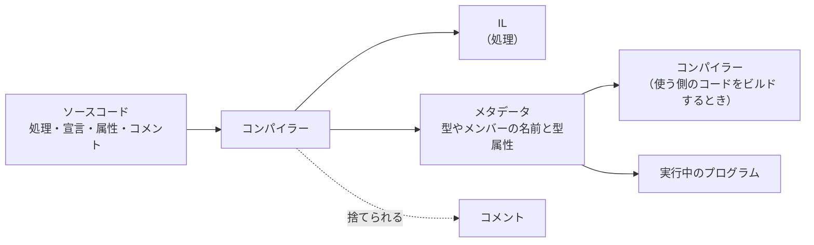

# 属性の基本

**属性**（attribute）は、クラスやメソッド、プロパティなどの宣言に付ける、追加の情報です。付けた情報は、コンパイルしたプログラムの中に **メタデータ**（metadata）として記録され、コンパイラーや実行中のプログラムが読み取れます。このページでは、属性を使う理由と、いちばん単純な属性の作り方と付け方を学びます。

## 学習目標

このページを読み終えると、以下のことができるようになります。

- コメントでは伝えられない「宣言についての情報」があることを説明できる
- 属性がメタデータとして記録され、コンパイラーや実行中のプログラムに読み取られることを説明できる
- `Attribute` を継承したクラスを作り、`[属性名]` で宣言に付けられる
- 属性を付けただけでは、プログラムの動作が変わらないことを説明できる
- `[Obsolete]` と `[Flags]` を例に、属性を読み取るものを説明できる

## 前提知識

- [中間言語と JIT コンパイル](/unity-csharp-learning/csharp/dotnet-internals/) を読んでいること
- [プロパティ](/unity-csharp-learning/csharp/properties/) を読んでいること
- [継承](/unity-csharp-learning/csharp/inheritance/) を読んでいること
- [列挙型](/unity-csharp-learning/csharp/enums/) を読んでいること

---

## 1. 宣言に情報を付けたい場面

プログラムを書いていると、処理そのものではなく、宣言についての情報を書き残したくなることがあります。

- このプロパティは、画面に表示しない
- このメソッドは古いので、代わりに別のメソッドを使ってほしい
- この列挙型は、メンバーをビットで組み合わせて使う

たとえば、プレイヤーの情報を画面に一覧表示するとします。ただし、パスワードは表示しないと決めました。この決まりを、コメントで書くことはできます。

```
class Player
{
    public string Name { get; set; }

    // 画面に表示しない
    public string Password { get; set; }
}
```

コメントは、コードを読む人には伝わります。しかし、コンパイラーや実行中のプログラムには伝わりません。コメントは、コンパイルするときに捨てられるからです。

一覧表示する処理は、コメントを読めません。そのため、表示する処理の中に「`Password` は表示しない」ともう一度書くことになります。1 つの決まりが、コメントと表示する処理の 2 か所に分かれました。表示しないプロパティが増えるたびに、表示する処理も書き直さなければなりません。

決まりを `Password` の宣言そのものに付けて、プログラムからも読み取れるようにするのが、属性です。

```
class Player
{
    public string Name { get; set; }

    [Hidden]
    public string Password { get; set; }
}
```

`[Hidden]` は、「`Password` は表示しない」という情報を、`Password` の宣言に付けた属性です。

---

## 2. 属性はメタデータとして記録される

[中間言語と JIT コンパイル](/unity-csharp-learning/csharp/dotnet-internals/) で学んだように、C# のソースコードは、コンパイルすると IL（中間言語）になります。コンパイルしたプログラムに含まれるのは、IL だけではありません。どんな型があり、それぞれにどんな名前と型のメンバーがあるか、といった情報も記録されます。このように、プログラムについて説明する情報を **メタデータ** といいます。

メタデータがあるので、ほかのプログラムからクラスやメソッドを使えます。コンパイラーは、メタデータを見て、呼び出そうとしているメソッドがあるか、引数の型が合っているかを確かめます。

属性は、このメタデータに、自分で決めた情報を加える仕組みです。



メタデータに記録された属性は、2 種類のものに読み取られます。

| 読み取るもの | 読み取るとき | 属性を読み取って行うこと |
|---|---|---|
| コンパイラー | 属性を付けた宣言を使うコードを、ビルドするとき | 警告やエラーを出すなど、ビルドの結果を変える |
| 実行中のプログラム | 実行しているとき | 属性の情報に合わせて、動作を変える |

---

## 3. 属性のクラスを作る

属性は、クラスとして作ります。

**書式：[属性のクラス](https://learn.microsoft.com/dotnet/csharp/advanced-topics/reflection-and-attributes/attribute-tutorial#create-your-own-attribute)**
```
class 名前Attribute : Attribute
{
}
```

| 要素 | 説明 |
|---|---|
| `: Attribute` | [Attribute クラス](https://learn.microsoft.com/dotnet/api/system.attribute) を継承したクラスが、属性として使える |
| `名前Attribute` | 名前の最後を `Attribute` にする決まりになっている |

1 節の `[Hidden]` のクラスは、次のように作ります。中身は空でかまいません。「付いているかどうか」だけを表す属性だからです。

```
class HiddenAttribute : Attribute
{
}
```

---

## 4. 属性を付ける

作った属性は、宣言の直前に `[ ]` で囲んで書きます。

**書式：[属性を付ける](https://learn.microsoft.com/dotnet/csharp/advanced-topics/reflection-and-attributes#work-with-attributes)**
```
[名前]
宣言
```

属性として書くときは、クラスの名前の最後の `Attribute` を省略できます。`HiddenAttribute` クラスは、`[Hidden]` と書いて付けます。省略せずに `[HiddenAttribute]` と書いても同じです。

3 節の `HiddenAttribute` を、`Player` の `Password` に付けます。

```csharp
Player player = new Player("Alice", "secret123");
Console.WriteLine(player.Name);
Console.WriteLine(player.Password);

class HiddenAttribute : Attribute
{
}

class Player
{
    public string Name { get; set; }

    [Hidden]
    public string Password { get; set; }

    public Player(string name, string password)
    {
        Name = name;
        Password = password;
    }
}
```

```
Alice
secret123
```

`[Hidden]` を付けても、`Password` は表示されます。属性は、宣言に付けた目印にすぎないからです。`Password` にどんな値が入っても、`player.Password` と書けばその値を取り出せます。属性を付けただけでは、プログラムの動作は変わりません。

`[Hidden]` に効果を持たせるには、実行中に `[Hidden]` を読み取って、表示するかどうかを決める処理を書きます。その方法は、次の [属性を読み取る](/unity-csharp-learning/csharp/reading-attributes/) で学びます。

---

## 5. 複数の属性を付ける

1 つの宣言に、複数の属性を付けられます。`[ ]` を並べて書くか、1 つの `[ ]` の中に `,` で区切って書きます。次の 2 つは同じ意味です。

```
[属性A]
[属性B]
宣言

[属性A, 属性B]
宣言
```

---

## 6. .NET の属性と、属性を読み取るもの

.NET には、いろいろな属性が用意されています。付けるだけで効果があるように見える属性もありますが、それは、属性を読み取るものが、あらかじめ用意されているからです。2 節の表の 2 種類について、1 つずつ見てみます。

### コンパイラーが読み取る属性：Obsolete

[Obsolete 属性](https://learn.microsoft.com/dotnet/api/system.obsoleteattribute) は、宣言が古く、もう使わないでほしいことを表す属性です。

```csharp
Console.WriteLine(Calc.OldAdd(1, 2));

static class Calc
{
    [Obsolete]
    public static int OldAdd(int a, int b)
    {
        return a + b;
    }
}
```

ビルドすると、`OldAdd` を呼び出している行に、次の警告が出ます。警告なので、ビルドは成功します。

```
warning CS0612: 'Calc.OldAdd(int, int)' は古い形式です
```

実行した結果は、`[Obsolete]` を付けないときと変わりません。

```
3
```

コンパイラーは、`OldAdd` を呼び出すコードをビルドするときに、`OldAdd` のメタデータに `Obsolete` 属性が付いていることを読み取って、警告を出します。`OldAdd` の動作は、何も変わっていません。

### 実行中のプログラムが読み取る属性：Flags

[列挙型](/unity-csharp-learning/csharp/enums/) で使った `[Flags]` は、実行中のプログラムが読み取る属性です。値が同じで、`[Flags]` があるかどうかだけが違う 2 つの列挙型を比べます。

```csharp
Console.WriteLine(Permission.Read | Permission.Write);
Console.WriteLine(FlagPermission.Read | FlagPermission.Write);

enum Permission
{
    Read = 1,
    Write = 2,
    Execute = 4
}

[Flags]
enum FlagPermission
{
    Read = 1,
    Write = 2,
    Execute = 4
}
```

```
3
Read, Write
```

どちらも値は `3` です。列挙型の `ToString` は、実行中に列挙型のメタデータを調べ、`[Flags]` が付いていれば、立っているビットのメンバー名を `,` でつないで返します。付いていなければ、`3` に当たるメンバーがないので、数値のまま返します。`[Flags]` が処理をしているのではなく、`ToString` が `[Flags]` を読み取って、動作を変えているのです。

[構造体のメモリレイアウト（補足）](/unity-csharp-learning/csharp/memory-layout/) の `[StructLayout]` も、実行時に読み取られる属性です。.NET が構造体をメモリに並べるときに読み取って、フィールドの並べ方を決めます。

どちらの属性も、正体は .NET に用意されたクラスです。`Obsolete` は `ObsoleteAttribute` クラス、`Flags` は `FlagsAttribute` クラスで、3 節で作った `HiddenAttribute` と同じく、`Attribute` を継承しています。

---

## よくあるミス

### Attribute を継承していないクラスを、属性として使う

```csharp
// ❌ NG: HiddenAttribute が Attribute を継承していない
// class HiddenAttribute
// {
// }
//
// [Hidden]  // CS0616
// class Player
// {
// }
```

属性として使えるのは、`Attribute` を継承したクラスだけです。名前が `Attribute` で終わっていても、`Attribute` を継承していなければ、CS0616 のエラーになります。

---

## まとめ

- 属性は、宣言に付ける追加の情報。コメントと違って、コンパイルしたプログラムの中に **メタデータ** として記録される
- メタデータは、型やメンバーについて説明する情報。属性を読み取るのは、コンパイラーと実行中のプログラム
- 属性は、`Attribute` を継承したクラスとして作る。名前の最後は `Attribute` にし、付けるときは `Attribute` を省略して `[名前]` と書ける
- 1 つの宣言に、複数の属性を付けられる
- 属性を付けただけでは、プログラムの動作は変わらない。読み取るものがあって、初めて効果が出る
- `[Obsolete]` はコンパイラーが読み取り、使っている場所に警告（CS0612）を出す。`[Flags]` は実行中のプログラム（列挙型の `ToString`）が読み取る

---

## 理解度チェック

1. プロパティの宣言の上に、`// 画面に表示しない` というコメントを書きました。実行中のプログラムがこの情報を読み取れないのはなぜですか？ また、属性ならなぜ読み取れるのですか？
2. 次のコードを実行すると何が出力されますか？

   ```csharp
   Console.WriteLine(Color.Red | Color.Blue);
   Console.WriteLine(Style.Bold | Style.Italic);

   enum Color
   {
       Red = 1,
       Green = 2,
       Blue = 4
   }

   [Flags]
   enum Style
   {
       Bold = 1,
       Italic = 2,
       Underline = 4
   }
   ```

3. `ImportantAttribute` という属性のクラスを作りました。メソッドに付けるとき、どう書きますか？ 2 通り答えてください。
4. 4 節の `Player` の `Password` に `[Hidden]` を付けても、`player.Password` の値が表示されるのはなぜですか？

<details markdown="1">
<summary>解答を見る</summary>

1. コメントは、コンパイルするときに捨てられ、コンパイルしたプログラムに残らないからです。属性は、コンパイルしたプログラムの中にメタデータとして記録されるので、実行中のプログラムから読み取れます。
2. 次のように出力されます。`Color` には `[Flags]` がないので、値の `5` がそのまま表示されます。`Style` には `[Flags]` があるので、メンバー名が表示されます。

   ```
   5
   Bold, Italic
   ```

3. `[Important]` または `[ImportantAttribute]` と書きます。
4. 属性は宣言に付けた目印にすぎず、属性を付けただけではプログラムの動作は変わらないからです。`[Hidden]` を読み取って、表示するかどうかを決める処理は、まだどこにもありません。

</details>

---

## 次のステップ

[属性を読み取る](/unity-csharp-learning/csharp/reading-attributes/) では、実行中に `[Hidden]` を読み取り、`[Hidden]` の付いたプロパティを表示しない一覧表示の処理を作ります。
