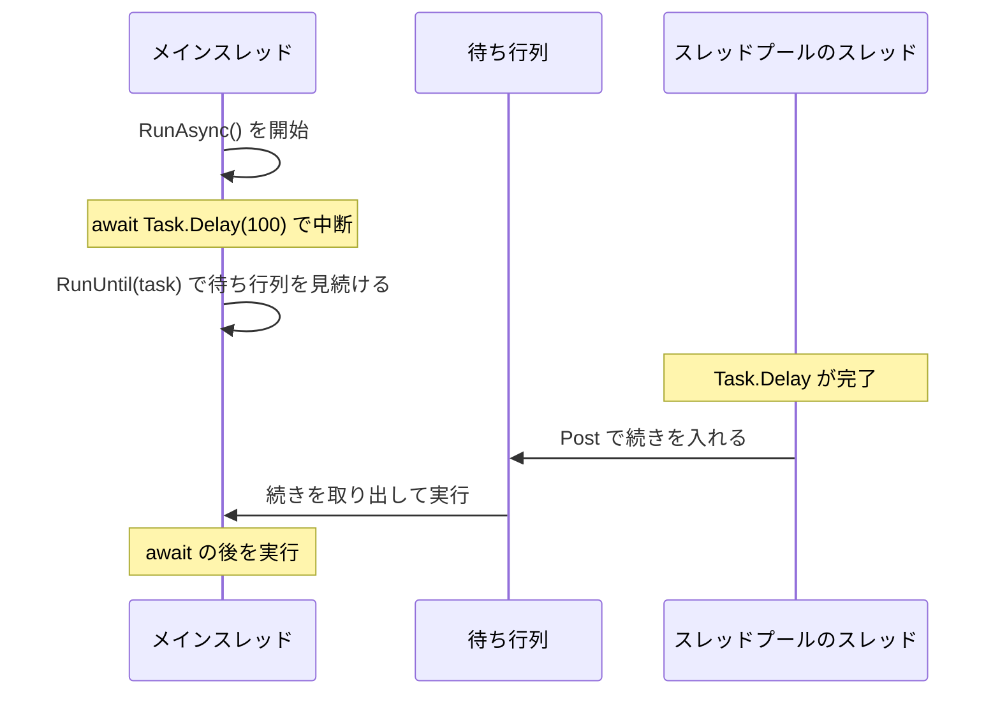
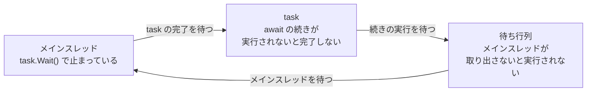

# await の前後で実行されるスレッド

`await` で中断した async メソッドは、`Task` が完了すると続きから再開します。このとき、続きを実行するスレッドは、`await` の前と同じとは限りません。どのスレッドで再開するかを決めるのが **同期コンテキスト**（synchronization context）です。このページでは、`await` の後のスレッドがどう決まるのか、その仕組みから起きるデッドロック、そして `ConfigureAwait` を学びます。

## 学習目標

このページを読み終えると、以下のことができるようになります。

- コンソールアプリケーションでは、`await` の後の続きがスレッドプールのスレッドで実行されることを説明できる
- 同期コンテキストが、`await` の後の続きを実行する場所を決める仕組みを説明できる
- 同期コンテキストがあるスレッドで `Wait` や `Result` を使うと、デッドロックが起きる理由を説明できる
- `ConfigureAwait(false)` の働きを説明できる

## 前提知識

- [スレッドを使わずに待つ](/unity-csharp-learning/csharp/async-without-threads/) を読んでいること
- [スレッドの基本](/unity-csharp-learning/csharp/threads/) を読んでいること
- [継承](/unity-csharp-learning/csharp/inheritance/) と [オーバーライドとポリモーフィズム](/unity-csharp-learning/csharp/polymorphism/) を読んでいること

---

## 1. await の後で、スレッドが変わる

[スレッドの基本](/unity-csharp-learning/csharp/threads/) で学んだ `Environment.CurrentManagedThreadId` で、`await` の前後のスレッドを調べます。

```csharp
Console.WriteLine($"await の前: スレッド {Environment.CurrentManagedThreadId}");
await Task.Delay(100);
Console.WriteLine($"await の後: スレッド {Environment.CurrentManagedThreadId}");
```

実行結果の例です。ID の値は、環境や実行するたびに変わります。

```
await の前: スレッド 2
await の後: スレッド 5
```

`await` の前はメインスレッドで実行されていましたが、`await` の後は別のスレッドで実行されています。[スレッドを使わずに待つ](/unity-csharp-learning/csharp/async-without-threads/) で学んだように、`Task.Delay` が完了すると、続き（継続）はスレッドプールに渡されるからです。メインスレッドは `await` の時点で手放されていて、続きを実行するために待っていたわけではありません。

### 完了済みの Task は中断しない

`await` した `Task` がすでに完了しているときは、`await` はメソッドを中断せず、そのまま次の行へ進みます。この場合、スレッドは変わりません。

[Task.CompletedTask プロパティ](https://learn.microsoft.com/dotnet/api/system.threading.tasks.task.completedtask) は完了済みの `Task` を返し、[Task.FromResult メソッド](https://learn.microsoft.com/dotnet/api/system.threading.tasks.task.fromresult) は、指定した値を結果として完了済みの `Task<TResult>` を返します。次のコードは、前のコード例とは別のプログラムです。

```csharp
Console.WriteLine($"await の前: スレッド {Environment.CurrentManagedThreadId}");
await Task.CompletedTask;
Console.WriteLine($"完了済みの Task の後: スレッド {Environment.CurrentManagedThreadId}");
await Task.FromResult(1);
Console.WriteLine($"完了済みの Task の後: スレッド {Environment.CurrentManagedThreadId}");
```

実行結果の例です。ID の値は環境によって変わりますが、3 つの ID は同じになります。

```
await の前: スレッド 2
完了済みの Task の後: スレッド 2
完了済みの Task の後: スレッド 2
```

---

## 2. 同期コンテキスト

画面を持つアプリケーション（GUI アプリケーション）では、画面の部品を操作できるスレッドが 1 つに決まっていることがほとんどです。このスレッドを **UI スレッド** といいます。ボタンが押されたときのイベントハンドラーも UI スレッドで実行され、画面の表示を書き換えるのも UI スレッドの仕事です。

UI スレッドで通信の応答を `await` し、受け取った文字列を画面に表示したいとします。コンソールアプリケーションと同じように、`await` の後がスレッドプールのスレッドで実行されると、そのスレッドからは画面を操作できません。`await` の後は、UI スレッドに戻ってきてほしいのです。

そこで .NET には、「このスレッドで続きを実行するには、どこに頼めばよいか」を表す [SynchronizationContext クラス](https://learn.microsoft.com/dotnet/api/system.threading.synchronizationcontext) があります。`await` は、中断するときに、そのスレッドの同期コンテキストを [SynchronizationContext.Current プロパティ](https://learn.microsoft.com/dotnet/api/system.threading.synchronizationcontext.current) で調べます。同期コンテキストがあれば、`Task` が完了したときに、続きをその同期コンテキストの [Post メソッド](https://learn.microsoft.com/dotnet/api/system.threading.synchronizationcontext.post) に渡します。`Post` が、受け取った続きをどのスレッドで実行するかを決めます。

| `await` したスレッドの同期コンテキスト | 続きを実行するスレッド |
|---|---|
| ない（`null`） | スレッドプールのスレッド |
| ある | 同期コンテキストの `Post` が決める。GUI アプリケーションの UI スレッドなら、UI スレッド |

GUI アプリケーションの UI スレッドには、そのフレームワークが用意した同期コンテキストが設定されています。一方、コンソールアプリケーションのメインスレッドには、同期コンテキストがありません。

```csharp
Console.WriteLine($"SynchronizationContext.Current is null: {SynchronizationContext.Current is null}");
```

```
SynchronizationContext.Current is null: True
```

そのため、前の節のコンソールアプリケーションでは、`await` の後がスレッドプールのスレッドで実行されたのです。

### Post が呼ばれることを確かめる

`SynchronizationContext` を継承し、`Post` をオーバーライドすると、`await` が続きを渡しにくることを確かめられます。[SetSynchronizationContext メソッド](https://learn.microsoft.com/dotnet/api/system.threading.synchronizationcontext.setsynchronizationcontext) で、今のスレッドの同期コンテキストを設定します。

**書式：[SynchronizationContext.Post メソッド](https://learn.microsoft.com/dotnet/api/system.threading.synchronizationcontext.post)**
```csharp
public virtual void Post(SendOrPostCallback d, object? state);
```

| パラメータ | 説明 |
|---|---|
| `d` | 実行してほしい処理。[SendOrPostCallback](https://learn.microsoft.com/dotnet/api/system.threading.sendorpostcallback) は、`object?` 型のパラメータを 1 つ受け取るデリゲート型 |
| `state` | `d` を呼び出すときに渡す引数 |

基底クラスの `SynchronizationContext` の `Post` は、受け取った処理をスレッドプールで実行します。

```csharp
SynchronizationContext.SetSynchronizationContext(new LoggingContext());

Console.WriteLine("1. await の前");
await Task.Delay(100);
Console.WriteLine("3. await の後");

class LoggingContext : SynchronizationContext
{
    public override void Post(SendOrPostCallback d, object? state)
    {
        Console.WriteLine("2. Post で継続を受け取った");
        base.Post(d, state);
    }
}
```

```
1. await の前
2. Post で継続を受け取った
3. await の後
```

`Task.Delay` が完了すると、`await` は続きを `LoggingContext` の `Post` に渡しています。`Post` が `base.Post` で続きをスレッドプールに渡したので、`3. await の後` が表示されました。

---

## 3. 1 つのスレッドに戻す同期コンテキスト

UI スレッドの同期コンテキストは、`Post` で受け取った処理を待ち行列に入れます。UI スレッドは、ボタンの操作や画面の描画などの仕事と一緒に、この待ち行列から処理を 1 つずつ取り出して実行します。そのため、`await` の後の続きは、UI スレッドで実行されます。

同じ仕組みの同期コンテキストを、小さく作ってみます。[Queue\<T\> クラス](https://learn.microsoft.com/dotnet/api/system.collections.generic.queue-1) は、入れた順に要素を取り出せるコレクションです。`Enqueue` メソッドで入れ、`Dequeue` メソッドで取り出します。`Post` はスレッドプールのスレッドから呼ばれることがあるので、[共有データと lock](/unity-csharp-learning/csharp/thread-safety/) で学んだ `lock` で待ち行列を守ります。

```csharp
SingleThreadContext context = new SingleThreadContext();
SynchronizationContext.SetSynchronizationContext(context);

Task task = RunAsync();
context.RunUntil(task);
Console.WriteLine("終了");

async Task RunAsync()
{
    Console.WriteLine($"await の前: スレッド {Environment.CurrentManagedThreadId}");
    await Task.Delay(100);
    Console.WriteLine($"await の後: スレッド {Environment.CurrentManagedThreadId}");
    await Task.Delay(100);
    Console.WriteLine($"2 回目の await の後: スレッド {Environment.CurrentManagedThreadId}");
}

class SingleThreadContext : SynchronizationContext
{
    private readonly Queue<Action> queue = new Queue<Action>();

    public override void Post(SendOrPostCallback d, object? state)
    {
        lock (queue)
        {
            queue.Enqueue(() => d(state));
        }
    }

    public void RunUntil(Task task)
    {
        while (!task.IsCompleted)
        {
            Action? work = null;
            lock (queue)
            {
                if (queue.Count > 0)
                {
                    work = queue.Dequeue();
                }
            }

            if (work != null)
            {
                work();
            }
            else
            {
                Thread.Sleep(1);
            }
        }
    }
}
```

実行結果の例です。ID の値は環境によって変わりますが、3 つの ID は同じになります。

```
await の前: スレッド 2
await の後: スレッド 2
2 回目の await の後: スレッド 2
終了
```

`SingleThreadContext` の `Post` は、受け取った続きを実行せずに、待ち行列に入れるだけです。メインスレッドは `RunUntil` の中で、`task` が完了するまで、待ち行列から処理を取り出して実行し続けます。そのため、`await` の後の続きは、どれもメインスレッドで実行されます。



---

## 4. Wait と Result によるデッドロック

同期コンテキストが続きを 1 つのスレッドに戻すとき、そのスレッドで `Wait` や `Result` を使うと、処理が永遠に進まなくなります。次のコードは、前のコード例の `RunUntil` の代わりに `Wait` で完了を待ちます。`SingleThreadContext` クラスは、前のコード例と同じものを使います。[Wait メソッド](https://learn.microsoft.com/dotnet/api/system.threading.tasks.task.wait) にミリ秒を渡すと、その時間だけ待ち、時間内に完了したかどうかを `bool` で返します。

```csharp
SingleThreadContext context = new SingleThreadContext();
SynchronizationContext.SetSynchronizationContext(context);

Task task = RunAsync();
bool completed = task.Wait(2000);
Console.WriteLine($"2 秒以内に完了したか: {completed}");

async Task RunAsync()
{
    await Task.Delay(100);
    Console.WriteLine("await の後");
}

// SingleThreadContext クラスは前のコード例と同じ
```

```
2 秒以内に完了したか: False
```

`Task.Delay(100)` は 0.1 秒で完了するのに、2 秒待っても `task` は完了せず、`await の後` も表示されません。

- `RunAsync` の `await` は、続きを `SingleThreadContext` の `Post` に渡す。続きは待ち行列に入り、メインスレッドが取り出して実行するのを待つ
- メインスレッドは `task.Wait` で止まっていて、`task` が完了するまで待ち行列から処理を取り出さない
- `task` が完了するには、待ち行列に入っている続きが実行されなければならない

お互いが相手を待っているので、どちらも進みません。このような状態を **デッドロック**（deadlock）といいます。ここでは `Wait` に時間を指定したので 2 秒であきらめましたが、時間を指定しない `Wait` や `Result` なら、プログラムは永遠に止まったままになります。



GUI アプリケーションの UI スレッドで async メソッドの戻り値に `Wait` や `Result` を使うと、これと同じデッドロックが起きます。コンソールアプリケーションで同じコードを動かしても、同期コンテキストがないので続きはスレッドプールで実行され、デッドロックは起きません。「コンソールでは動いたのに、GUI アプリケーションでは固まる」という形で問題が表れるのはこのためです。async メソッドの結果は、`Wait` や `Result` ではなく `await` で受け取るようにします。

---

## 5. ConfigureAwait(false)

続きを同期コンテキストに戻す必要がないときは、`await` する `Task` に対して `ConfigureAwait(false)` を呼びます。

**書式：[Task.ConfigureAwait メソッド](https://learn.microsoft.com/dotnet/api/system.threading.tasks.task.configureawait)**
```csharp
public ConfiguredTaskAwaitable ConfigureAwait(bool continueOnCapturedContext);
```

| パラメータ | 説明 |
|---|---|
| `continueOnCapturedContext` | `true` なら、続きを元の同期コンテキストで実行する（`await` の既定の動作）。`false` なら、同期コンテキストを使わず、スレッドプールで実行する |

2 節の `LoggingContext` を使ったコードで、`await` に `ConfigureAwait(false)` を付けます。

```csharp
SynchronizationContext.SetSynchronizationContext(new LoggingContext());

Console.WriteLine("1. await の前");
await Task.Delay(100).ConfigureAwait(false);
Console.WriteLine("2. await の後");

class LoggingContext : SynchronizationContext
{
    public override void Post(SendOrPostCallback d, object? state)
    {
        Console.WriteLine("Post で継続を受け取った");
        base.Post(d, state);
    }
}
```

```
1. await の前
2. await の後
```

`Post` が呼ばれていないので、`Post で継続を受け取った` は表示されません。続きは、同期コンテキストを通さずにスレッドプールで実行されました。

前の節のデッドロックするコードでも、`RunAsync` の中の `await` を `await Task.Delay(100).ConfigureAwait(false);` に変えると、続きがスレッドプールで実行されるので、`task` は完了します。

```
await の後
2 秒以内に完了したか: True
```

---

## ワンポイントアドバイス

### ConfigureAwait(false) を使う場面

`ConfigureAwait(false)` を付けると、`await` の後は元のスレッドに戻らないので、UI スレッドでなければできない処理（画面の操作など）はできなくなります。そのため、画面を操作するアプリケーションのコードには付けません。

一方、いろいろなアプリケーションから呼ばれるライブラリのコードは、呼び出し元の UI スレッドに戻る必要がありません。そのようなコードでは、`await` のたびに `ConfigureAwait(false)` を付けて、UI スレッドの待ち行列に余計な処理を入れないようにするのが一般的です。これで、ライブラリの利用者が誤って `Wait` や `Result` を使ったときのデッドロックも避けられます。

---

## まとめ

- `await` した `Task` が完了済みなら、`await` は中断せず、スレッドも変わらない
- `await` は中断するときに `SynchronizationContext.Current` を調べ、同期コンテキストがあれば、続きをその `Post` に渡す
- 同期コンテキストがなければ（コンソールアプリケーションのメインスレッドなど）、続きはスレッドプールのスレッドで実行される
- GUI アプリケーションの UI スレッドの同期コンテキストは、続きを UI スレッドに戻す
- 続きを 1 つのスレッドに戻す同期コンテキストがあるスレッドで `Wait` や `Result` を使うと、デッドロックが起きる
- `ConfigureAwait(false)` を付けると、同期コンテキストを使わず、続きをスレッドプールで実行する

---

## 理解度チェック

1. コンソールアプリケーションで、`await Task.Delay(100)` の後の続きは、どのスレッドで実行されますか？理由も説明してください。
2. 次のコードをコンソールアプリケーションのトップレベルステートメントとして実行すると、何が出力されますか？

   ```csharp
   Console.WriteLine(SynchronizationContext.Current == null);
   int before = Environment.CurrentManagedThreadId;
   await Task.CompletedTask;
   Console.WriteLine(before == Environment.CurrentManagedThreadId);
   ```

3. GUI アプリケーションのボタンのイベントハンドラーで、async メソッドの戻り値の `Result` を読むと、アプリケーションが固まることがあります。理由を説明してください。

<details markdown="1">
<summary>解答を見る</summary>

1. スレッドプールのスレッドで実行されます。コンソールアプリケーションのメインスレッドには同期コンテキストがないので、`await` は続きをスレッドプールに渡すからです。
2. 次のように出力されます。コンソールアプリケーションのメインスレッドには同期コンテキストがないので、最初は `True` です。`Task.CompletedTask` は完了済みなので、`await` は中断せず、スレッドも変わりません。

   ```
   True
   True
   ```

3. イベントハンドラーは UI スレッドで実行され、UI スレッドには続きを UI スレッドに戻す同期コンテキストがあるからです。async メソッドの `await` の続きは UI スレッドの待ち行列に入りますが、UI スレッドは `Result` で止まっているので、続きを実行できません。続きが実行されないと async メソッドは完了しないので、お互いを待ち続けるデッドロックになります。

</details>

---

## 次のステップ

[複数の Task を待つ](/unity-csharp-learning/csharp/task-whenall/) では、`Task.WhenAll` と `Task.WhenAny` で、複数の `Task` をまとめて扱う方法を学びます。
