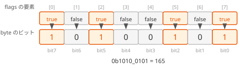

# ビットパッキング（補足）

このページは、[配列の基礎](/unity-csharp-learning/csharp/arrays/) と [ビット演算](/unity-csharp-learning/csharp/bitwise-operations/) の補足です。`bool` の配列の 8 つの値を、1 つの `byte` の 8 つのビットに詰めて表す方法を学びます。このように、複数の値をビットに詰めて表すことを **ビットパッキング** といいます。

## 学習目標

このページを読み終えると、以下のことができるようになります。

- `bool` の配列の要素と、`byte` のビットを対応させられる
- `for` 文とビット演算で、`bool` の配列を `byte` に詰められる（パック）
- `byte` から `bool` の配列に戻せる（アンパック）
- `BitArray` クラスが、先頭の要素を最下位のビットに対応させることを説明できる

## 前提知識

- [配列の基礎](/unity-csharp-learning/csharp/arrays/) を読んでいること
- [ビット演算](/unity-csharp-learning/csharp/bitwise-operations/) を読んでいること

---

## 1. bool の配列と byte の対応

`bool` の値は、1 つで 1 バイト（8 ビット）のメモリを使います。そのため、`bool` を 8 つ持つ配列は、要素だけで 8 バイトを使います。

一方、`bool` の値は `true` か `false` の 2 通りしかないので、1 ビットで表せます。`byte` は 8 ビットなので、8 つの `bool` の値を 1 つの `byte` に詰められます。

このページでは、配列の先頭の要素（`[0]`）を `byte` の最上位のビット（bit7）に、末尾の要素（`[7]`）を最下位のビット（bit0）に対応させます。



---

## 2. パック — bool の配列を byte に詰める

`true` の要素に対応するビットだけを、[ビット演算](/unity-csharp-learning/csharp/bitwise-operations/) で学んだ OR で `1` にします。

```csharp
bool[] flags = { true, false, true, false, false, true, false, true };

byte packed = 0;
for (int i = 0; i < flags.Length; i++)
{
    if (flags[i])
    {
        packed |= (byte)(1 << (7 - i));
    }
}

Console.WriteLine(packed);
Console.WriteLine($"{packed:B8}");
```

```
165
10100101
```

- `1 << (7 - i)` は、`i` 番目の要素に対応するビットだけが `1` の値（ビットマスク）です。`i` が `0` なら bit7、`i` が `7` なら bit0 になります
- `packed |= マスク` で、そのビットだけを `1` にします
- `1 << (7 - i)` の結果は `int` なので、`byte` の変数と計算するために `(byte)` でキャストします
- `{packed:B8}` は、値を 8 桁の 2 進数で表示します

---

## 3. アンパック — byte から bool の配列に戻す

各ビットが `1` かどうかを、AND で調べます。

```csharp
byte packed = 0b1010_0101;

bool[] flags = new bool[8];
for (int i = 0; i < flags.Length; i++)
{
    flags[i] = (packed & (1 << (7 - i))) != 0;
}

Console.WriteLine(string.Join(", ", flags));
```

```
True, False, True, False, False, True, False, True
```

`packed & (1 << (7 - i))` は、`i` 番目の要素に対応するビット以外を `0` にした値です。その値が `0` でなければ、そのビットは `1` なので、要素を `true` にします。[string.Join メソッド](https://learn.microsoft.com/dotnet/api/system.string.join) は、配列の要素を区切り文字でつないだ文字列にします。

---

## 4. パックしてアンパックする

パックした値をアンパックすると、元の配列と同じ値に戻ることを確かめます。

```csharp
bool[] original = { true, true, false, true, false, false, false, true };

byte packed = 0;
for (int i = 0; i < original.Length; i++)
{
    if (original[i])
    {
        packed |= (byte)(1 << (7 - i));
    }
}

bool[] restored = new bool[8];
for (int i = 0; i < restored.Length; i++)
{
    restored[i] = (packed & (1 << (7 - i))) != 0;
}

Console.WriteLine($"packed: {packed:B8}");

bool same = true;
for (int i = 0; i < original.Length; i++)
{
    if (original[i] != restored[i])
    {
        same = false;
    }
}
Console.WriteLine($"元に戻ったか: {same}");
```

```
packed: 11010001
元に戻ったか: True
```

---

## 5. BitArray クラス

.NET には、ビットの並びを扱う [BitArray クラス](https://learn.microsoft.com/dotnet/api/system.collections.bitarray) も用意されています。`System.Collections` 名前空間にあるので、ファイルの先頭に `using System.Collections;` を書きます。

`BitArray` を `byte` の配列に変換すると、**先頭の要素が最下位のビット（bit0）** に入ります。このページで自分で書いたパックとは、ビットの順序が逆です。

```csharp
using System.Collections;

BitArray bits = new BitArray(new bool[] { true, true, false, false, false, false, false, false });

byte[] bytes = new byte[1];
bits.CopyTo(bytes, 0);
Console.WriteLine($"{bytes[0]:B8}");
Console.WriteLine(bytes[0]);
```

```
00000011
3
```

先頭の 2 つの要素が `true` なので、bit0 と bit1 が `1` になり、`3` になりました。このページの方法でパックすると、bit7 と bit6 が `1` になり `192` になります。ビットパッキングでは、どの要素をどのビットに対応させるかを決めておき、パックとアンパックで同じ決まりを使うことが大切です。

---

## まとめ

- `bool` の値は 1 ビットで表せるので、8 つの `bool` の値を 1 つの `byte` に詰められる
- パック：`true` の要素に対応するビットを、OR（`|=`）で `1` にする
- アンパック：対応するビットを AND（`&`）で取り出し、`0` でなければ `true` にする
- `BitArray` は、先頭の要素を最下位のビットに対応させる。パックとアンパックで同じ対応の決まりを使う

---

## 理解度チェック

1. このページの方法（先頭の要素を bit7 に対応させる）で、`{ false, false, false, false, true, true, true, true }` をパックすると、値はいくつになりますか？
2. このページの方法で、`byte packed = 0b1111_0000;` をアンパックすると、`flags[4]` は `true` と `false` のどちらになりますか？

<details markdown="1">
<summary>解答を見る</summary>

1. `15` です。インデックス 4〜7 の要素が bit3〜bit0 に対応するので、`0b0000_1111` になります。
2. `false` です。`flags[4]` は bit3（`1 << (7 - 4)` = `0b0000_1000`）に対応し、`0b1111_0000` の bit3 は `0` だからです。

</details>

---

## 次のステップ

[多次元配列](/unity-csharp-learning/csharp/multidimensional-arrays/) では、行と列のある表のようなデータを、2 次元配列で扱う方法を学びます。
