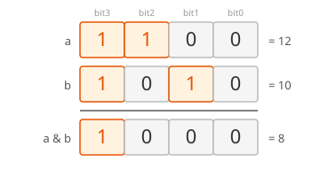
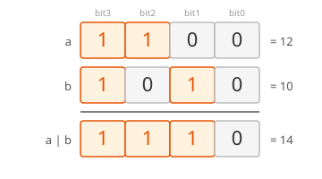
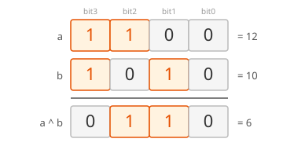
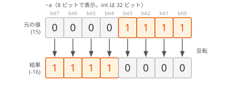
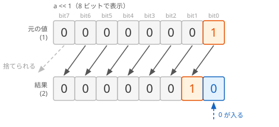
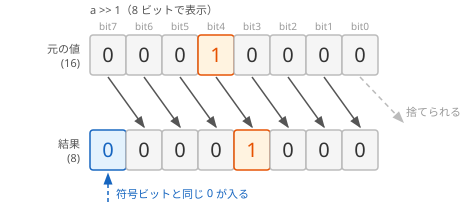
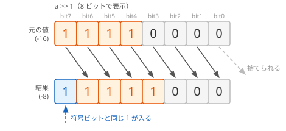
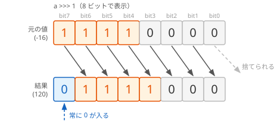

# ビット演算

コンピューターは、すべてのデータを 0 と 1 の **ビット** の並びとして扱います。**ビット演算** は、整数をビットの並びとして見て、ビットごとに計算する演算です。複数の ON / OFF の状態を 1 つの整数にまとめて管理する **ビットマスク** などに使います。

## 学習目標

このページを読み終えると、以下のことができるようになります。

- AND・OR・XOR・NOT の 4 種類のビット演算子で計算できる
- 左シフト・右シフトで、ビットの並びをずらせる
- ビットマスクで、フラグを立てる・調べる・下ろす・切り替えることができる

## 前提知識

- [数値リテラルと型エイリアス（補足）](/unity-csharp-learning/csharp/numeric-literals/) を読んでいること
- [条件分岐](/unity-csharp-learning/csharp/conditionals/) を読んでいること

---

## 1. ビット演算子

[ビット演算子](https://learn.microsoft.com/dotnet/csharp/language-reference/operators/bitwise-and-shift-operators) は、2 つの整数の同じ位置のビットどうしを、1 つずつ計算します。

このページでは、計算の結果を 2 進数でも表示します。文字列補間の `{値:B4}` は、値を 4 桁の 2 進数で表示する書式です（[2 進数の書式指定子](https://learn.microsoft.com/dotnet/standard/base-types/standard-numeric-format-strings#binary-format-specifier-b)。.NET 8 以降で使えます）。

### & — AND（論理積）

**書式：[& 演算子](https://learn.microsoft.com/dotnet/csharp/language-reference/operators/bitwise-and-shift-operators#logical-and-operator-)**
```
式1 & 式2
```

両方のビットが `1` のとき、結果のビットが `1` になります。



```csharp
int a = 0b1100;
int b = 0b1010;
Console.WriteLine(a & b);
Console.WriteLine($"{a & b:B4}");
```

```
8
1000
```

### \| — OR（論理和）

**書式：[\| 演算子](https://learn.microsoft.com/dotnet/csharp/language-reference/operators/bitwise-and-shift-operators#logical-or-operator-)**
```
式1 | 式2
```

どちらか一方でも `1` なら、結果のビットが `1` になります。



```csharp
int a = 0b1100;
int b = 0b1010;
Console.WriteLine(a | b);
Console.WriteLine($"{a | b:B4}");
```

```
14
1110
```

### ^ — XOR（排他的論理和）

**書式：[&#94; 演算子](https://learn.microsoft.com/dotnet/csharp/language-reference/operators/bitwise-and-shift-operators#logical-exclusive-or-operator-)**
```
式1 ^ 式2
```

2 つのビットが **異なる** とき、結果のビットが `1` になります。同じなら `0` です。



```csharp
int a = 0b1100;
int b = 0b1010;
Console.WriteLine(a ^ b);
Console.WriteLine($"{a ^ b:B4}");
```

```
6
0110
```

### ~ — NOT（ビット反転）

**書式：[~ 演算子](https://learn.microsoft.com/dotnet/csharp/language-reference/operators/bitwise-and-shift-operators#bitwise-complement-operator-)**
```
~式
```

すべてのビットを反転します（`0` は `1` に、`1` は `0` に）。



```csharp
int a = 0b0000_1111;
Console.WriteLine(~a);
```

```
-16
```

`int` は 32 ビットなので、`0b0000_1111` を反転すると、上位の 28 ビットもすべて `1` になります。最上位ビットが `1` になるので、[数値リテラルと型エイリアス（補足）](/unity-csharp-learning/csharp/numeric-literals/) で学んだ 2 の補数では負の数 `-16` です。

---

## 2. シフト演算子

[シフト演算子](https://learn.microsoft.com/dotnet/csharp/language-reference/operators/bitwise-and-shift-operators#left-shift-operator-) は、ビットの並びを左右にずらします。

**書式：[シフト演算子](https://learn.microsoft.com/dotnet/csharp/language-reference/operators/bitwise-and-shift-operators#left-shift-operator-)**
```
値 << ビット数
値 >> ビット数
値 >>> ビット数
```

| 演算子 | 意味 | 空いた左端または右端に入るビット |
|---|---|---|
| `<<` | 左シフト | 右端に `0` |
| `>>` | 右シフト（算術シフト） | 左端に、符号ビット（最上位ビット）と同じ値 |
| `>>>` | 符号なし右シフト（論理シフト）。C# 11 以降 | 左端に `0` |

### 左シフト

左シフトでは、各ビットが左へずれ、右端に `0` が入ります。左端からはみ出したビットは捨てられます。



1 ビット左にシフトするたびに、値は 2 倍になります。`x << n` は、はみ出すビットがなければ、`x` × 2ⁿ と同じです。

```csharp
int x = 1;
Console.WriteLine(x << 1);
Console.WriteLine(x << 2);
Console.WriteLine(x << 3);
```

```
2
4
8
```

### 右シフト（>>）

右シフトでは、各ビットが右へずれ、右端からはみ出したビットは捨てられます。`int` などの符号ありの型の `>>` では、左端に、符号ビットと同じ値が入ります。これを **算術シフト** といいます。

正の数（符号ビットが `0`）なら、左端に `0` が入ります。



負の数（符号ビットが `1`）なら、左端に `1` が入り、負の数のままになります。



```csharp
int positive = 16;
int negative = -16;
Console.WriteLine(positive >> 1);
Console.WriteLine(negative >> 1);
```

```
8
-8
```

1 ビット右にシフトするたびに、値はおよそ半分になります。

### 符号なし右シフト（>>>）

C# 11 以降の `>>>` は、符号に関係なく、左端に常に `0` を入れます。これを **論理シフト** といいます。



```csharp
int negative = -16;
Console.WriteLine(negative >>> 1);
```

```
2147483640
```

図は 8 ビットで表示していますが、`int` は 32 ビットです。`-16` を `>>>` で 1 ビットずらすと、最上位ビットが `0` になって大きな正の数になります。`uint` などの符号なしの型では、`>>` も常に左端に `0` を入れます。

---

## 3. ビットマスク — フラグの管理

1 つの整数のビットを、それぞれ 1 つの ON / OFF の状態（**フラグ**）に割り当てると、複数の状態を 1 つの整数で管理できます。このとき、特定のビットを取り出したり書き換えたりするために使う値を、**ビットマスク** といいます。

次のコードでは、ビット 0 を「ジャンプ中」、ビット 1 を「走っている」、ビット 2 を「しゃがみ中」に割り当てています。[const](https://learn.microsoft.com/dotnet/csharp/language-reference/keywords/const) を付けた変数は、値を変えられない **定数** です。定数については、[const と readonly（補足）](/unity-csharp-learning/csharp/const-readonly/) で詳しく学びます。

```csharp
const int FlagJump = 0b0001;
const int FlagRun = 0b0010;
const int FlagCrouch = 0b0100;

int state = 0;

// フラグを立てる（OR）
state |= FlagJump;
state |= FlagRun;
Console.WriteLine($"立てた後: {state:B4}");

// フラグを調べる（AND）
Console.WriteLine($"ジャンプ中: {(state & FlagJump) != 0}");
Console.WriteLine($"しゃがみ中: {(state & FlagCrouch) != 0}");

// フラグを下ろす（AND と NOT）
state &= ~FlagJump;
Console.WriteLine($"下ろした後: {state:B4}");

// フラグを切り替える（XOR）
state ^= FlagRun;
Console.WriteLine($"切り替えた後: {state:B4}");
```

```
立てた後: 0011
ジャンプ中: True
しゃがみ中: False
下ろした後: 0010
切り替えた後: 0000
```

`|=`・`&=`・`^=` は、[インクリメント・デクリメント（補足）](/unity-csharp-learning/csharp/increment-decrement/) で学んだ複合代入演算子のビット演算版です。`state |= FlagJump` は `state = state | FlagJump` と同じ意味です。

| 操作 | 書き方 | 仕組み |
|---|---|---|
| 立てる | `state \|= フラグ` | フラグのビットだけを `1` にする。ほかのビットは変わらない |
| 調べる | `(state & フラグ) != 0` | フラグのビット以外を `0` にして、残ったビットが `1` かを調べる |
| 下ろす | `state &= ~フラグ` | `~フラグ` はフラグのビットだけが `0` の値。AND でそのビットだけを `0` にする |
| 切り替える | `state ^= フラグ` | フラグのビットだけを反転する |

---

## よくあるミス

### フラグを調べるときに == 1 と書く

```csharp
const int FlagJump = 0b0001;
const int FlagRun = 0b0010;

int state = FlagJump | FlagRun;

Console.WriteLine((state & FlagRun) == 1);
Console.WriteLine((state & FlagRun) != 0);
```

```
False
True
```

`state & FlagRun` の結果は、`FlagRun` のビットが立っていれば `0b0010`、つまり `2` です。`1` にはならないので、`== 1` では、フラグが立っているのに `False` になります。フラグが立っているかは、`!= 0` で調べます。

### && の代わりに & を書く

`&` と `|` は、`bool` 型の値にも使えます。結果は `&&` と `||` と同じですが、[条件分岐](/unity-csharp-learning/csharp/conditionals/) で学んだ短絡評価を行いません。左側の結果にかかわらず、右側の式も必ず計算します。

```csharp
// ❌ NG: & は短絡評価を行わないので、10 / count も計算される
// int count = 0;
// if (count > 0 & 10 / count > 1)  // DivideByZeroException
// {
//     Console.WriteLine("条件が成り立った");
// }
```

このコードは、`count > 0` が `false` なのに `10 / count` も計算するので、0 で割ったことになり、`DivideByZeroException` という例外が発生して止まります。`&&` なら、左側が `false` の時点で右側を計算しないので、例外は発生しません。条件式には `&&` と `||` を使います。

---

## ワンポイントアドバイス

### [Flags] 属性の付いた列挙型

フラグは、`[Flags]` 属性を付けた列挙型（`enum`）で定義すると、名前で扱えて読みやすくなります。列挙型は、[列挙型](/unity-csharp-learning/csharp/enums/) で詳しく学びます。

```csharp
PlayerState state = PlayerState.Jump | PlayerState.Run;
Console.WriteLine(state);
Console.WriteLine(state.HasFlag(PlayerState.Jump));

[Flags]
enum PlayerState
{
    None = 0,
    Jump = 1 << 0,
    Run = 1 << 1,
    Crouch = 1 << 2
}
```

```
Jump, Run
True
```

`[Flags]` を付けた列挙型の値を表示すると、立っているフラグの名前が `, ` で区切られて表示されます。`HasFlag` メソッドで、フラグが立っているかを調べられます。

---

## まとめ

- `&`（AND）は、両方が `1` のビットだけ `1` にする。フラグを調べる・下ろすときに使う
- `|`（OR）は、どちらかが `1` のビットを `1` にする。フラグを立てるときに使う
- `^`（XOR）は、異なるビットだけ `1` にする。フラグを切り替えるときに使う
- `~`（NOT）は、すべてのビットを反転する
- `<<` は左シフト。はみ出さなければ、`x << n` は `x` × 2ⁿ
- `>>` は右シフト。符号ありの型では、左端に符号ビットと同じ値が入る
- `>>>` は符号なし右シフト（C# 11 以降）。左端に常に `0` が入る
- ビットマスクで、複数の ON / OFF の状態を 1 つの整数で管理できる。フラグが立っているかは `!= 0` で調べる

---

## 理解度チェック

1. 次のコードを実行すると何が出力されますか？

   ```csharp
   Console.WriteLine(0b1111 & 0b1010);
   Console.WriteLine(0b1111 | 0b1010);
   Console.WriteLine(0b1111 ^ 0b1010);
   ```

2. `int flags = 0b0101;` のとき、ビット 1（`0b0010`）のフラグを立てた結果は、10 進数でいくつになりますか？
3. 次のコードを実行すると何が出力されますか？

   ```csharp
   Console.WriteLine(1 << 4);
   Console.WriteLine(40 >> 2);
   ```

<details markdown="1">
<summary>解答を見る</summary>

1. 次のように出力されます。`1111 & 1010` は `1010`（10）、`1111 | 1010` は `1111`（15）、`1111 ^ 1010` は `0101`（5）です。

   ```
   10
   15
   5
   ```

2. `7` です。`0b0101 | 0b0010` は `0b0111` で、10 進数では `7` です。
3. 次のように出力されます。`1 << 4` は 1 × 2⁴ で `16` です。`40 >> 2` は 2 回半分にするので `10` です。

   ```
   16
   10
   ```

</details>

---

## 次のステップ

[配列の基礎](/unity-csharp-learning/csharp/arrays/) からは、「C# 配列と集合操作」のセクションに進み、複数の値をまとめて扱う配列を学びます。
