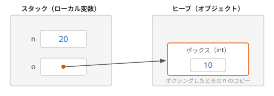

# ボクシングとアンボクシング

値型の値を `object` 型やインターフェイス型の変数に入れると、値のコピーがヒープに作られます。これを **ボクシング**（boxing）といいます。反対に、ボクシングされた値を元の値型に取り出すことを **アンボクシング**（unboxing）といいます。

## 学習目標

このページを読み終えると、以下のことができるようになります。

- ボクシングで、値のコピーがヒープに作られることを説明できる
- アンボクシングでは、ボクシングしたときと同じ型を指定する必要があることを説明できる
- 構造体をインターフェイス型の変数に入れると、コピーを操作することになる理由を説明できる
- ジェネリクスを使うと、ボクシングを避けられることを説明できる

## 前提知識

- [構造体の制約](/unity-csharp-learning/csharp/struct-constraints/) を読んでいること
- [型変換と型チェック](/unity-csharp-learning/csharp/type-casting/) を読んでいること
- [ジェネリクスの基本](/unity-csharp-learning/csharp/generics/) を読んでいること

---

## 1. ボクシング

`object` はすべての型の基底クラスなので、`int` の値も `object` 型の変数に入れられます。しかし、`object` は参照型です。参照型の変数には、ヒープにあるオブジェクトへの参照しか入れられません。

そこで、値型の値を `object` 型の変数に入れるときは、ヒープに値を入れるためのオブジェクト（**ボックス**）が作られ、値がそこにコピーされます。変数には、そのボックスへの参照が入ります。これがボクシングです。

```csharp
int n = 10;
object o = n;
n = 20;

Console.WriteLine($"n = {n}");
Console.WriteLine($"o = {o}");
```

```
n = 20
o = 10
```

`object o = n` の時点で、`n` の値 `10` がボックスにコピーされます。その後 `n` を `20` に書き換えても、ボックスの中の値は `10` のままです。



ボクシングは、キャストを書かなくても暗黙的に行われます。[params キーワード](/unity-csharp-learning/csharp/params-keyword/) で、`params object[]` に `int` や `bool` を渡したときも、ボクシングが行われていました。

---

## 2. アンボクシング

ボックスから値を取り出すには、元の値型へキャストします。これがアンボクシングです。

```csharp
object o = 10;
int n = (int)o;
Console.WriteLine(n);
```

```
10
```

アンボクシングでは、ボクシングしたときと **同じ型** を指定する必要があります。`int` をボクシングしたボックスを、`long` として取り出すことはできません。`int` から `long` への暗黙的な変換はできますが、アンボクシングではその変換は行われず、[InvalidCastException](https://learn.microsoft.com/dotnet/api/system.invalidcastexception) が発生します。

```csharp
object o = 10;

try
{
    long wrong = (long)o;
}
catch (InvalidCastException e)
{
    Console.WriteLine(e.GetType().Name);
}

long right = (int)o;
Console.WriteLine(right);
```

```
InvalidCastException
10
```

`long` として取り出したいときは、`(int)o` でいったん `int` として取り出してから、`long` に変換します。

---

## 3. インターフェイスを通したボクシング

構造体の値を、その構造体が実装しているインターフェイス型の変数に入れるときも、ボクシングが行われます。インターフェイス型も参照型だからです。

次の `Counter` 構造体は、`Increment` メソッドで自分の値を 1 増やします。

```csharp
Counter c = new Counter();
ICounter i = c;

i.Increment();
i.Increment();

Console.WriteLine($"c.Value = {c.Value}");
Console.WriteLine($"i の値 = {((Counter)i).Value}");

interface ICounter
{
    void Increment();
}

struct Counter : ICounter
{
    public int Value;

    public void Increment()
    {
        Value++;
    }
}
```

```
c.Value = 0
i の値 = 2
```

`ICounter i = c` で、`c` の値がボックスにコピーされます。`i.Increment()` で増えるのは、ボックスの中のコピーの `Value` です。変数 `c` の `Value` は `0` のままです。

書き換えられる構造体をインターフェイス型で扱うと、どの値を書き換えているのかがわかりにくくなります。これも、構造体を [構造体の制約](/unity-csharp-learning/csharp/struct-constraints/) で学んだ `readonly struct` にしておく理由の 1 つです。

---

## 4. ボクシングのコスト

ボクシングのたびに、ヒープに新しいボックスが作られます。ボックスは、使われなくなれば [ガベージコレクション](/unity-csharp-learning/csharp/garbage-collection/) で回収されます。ボクシングを繰り返すと、そのぶんメモリを確保する手間と、ガベージコレクションの回数が増えます。

[ジェネリクスの基本](/unity-csharp-learning/csharp/generics/) で、値を `object` で持つ `Container` クラスと、型パラメータで持つ `Container<T>` クラスを比べました。この 2 つに `int` の値を 1000 回ずつ入れて、ヒープに確保されたメモリの量を比べます。[GC.GetAllocatedBytesForCurrentThread メソッド](https://learn.microsoft.com/dotnet/api/system.gc.getallocatedbytesforcurrentthread) は、現在のスレッドがそれまでにヒープに確保したメモリの合計をバイト単位で返します。

```csharp
Container objectContainer = new Container(0);
Container<int> genericContainer = new Container<int>(0);

long before = GC.GetAllocatedBytesForCurrentThread();
for (int i = 0; i < 1000; i++)
{
    objectContainer.Set(i);
}
long objectBytes = GC.GetAllocatedBytesForCurrentThread() - before;

before = GC.GetAllocatedBytesForCurrentThread();
for (int i = 0; i < 1000; i++)
{
    genericContainer.Set(i);
}
long genericBytes = GC.GetAllocatedBytesForCurrentThread() - before;

Console.WriteLine($"Container: {objectBytes} バイト");
Console.WriteLine($"Container<int>: {genericBytes} バイト");

class Container
{
    private object _value;

    public Container(object value) { _value = value; }

    public void Set(object value) { _value = value; }
    public object Get() { return _value; }
}

class Container<T>
{
    private T _value;

    public Container(T value) { _value = value; }

    public void Set(T value) { _value = value; }
    public T Get() { return _value; }
}
```

64 ビットの環境での実行結果の例です。バイト数は実行環境によって変わることがあります。

```
Container: 24000 バイト
Container<int>: 0 バイト
```

`Container` の `Set` は `object` を受け取るので、`int` の値を渡すたびにボクシングが行われます。1 回あたり 24 バイトのボックスが、1000 回作られています。`Container<int>` の `Set` は `int` をそのまま受け取るので、ボクシングは行われず、ヒープにメモリを確保していません。

型の安全性だけでなく、ボクシングを避けられることも、ジェネリクスを使う理由の 1 つです。型パラメータ `T` に `int` を指定すると、`T` は `int` そのものとして扱われるので、[型制約](/unity-csharp-learning/csharp/generic-constraints/) で学んだ `struct` 制約がなくてもボクシングは行われません。

---

## よくあるミス

### アンボクシングで別の数値型を指定する

```csharp
// ❌ NG: int をボクシングしたボックスを double として取り出している
// object o = 10;
// double d = (double)o;  // InvalidCastException
```

`(double)o` は、コンパイルエラーにはなりませんが、実行すると `InvalidCastException` が発生します。数値型どうしの変換とアンボクシングは別の操作です。ボックスの中身と同じ型で取り出してから、変換します。

---

## ワンポイントアドバイス

### foreach と構造体の取り出し役

[IEnumerable\<T\> と foreach の仕組み](/unity-csharp-learning/csharp/ienumerable/) で学んだ取り出し役にも、ボクシングが関係します。`List<T>` の `GetEnumerator` メソッドが返す取り出し役は、[List\<T\>.Enumerator](https://learn.microsoft.com/dotnet/api/system.collections.generic.list-1.enumerator) という構造体です。

`foreach` 文は、`IEnumerable<T>` インターフェイスを通すのではなく、まず回そうとしている型そのものに `GetEnumerator` という名前の public メソッドがあるかを探し、あればそれを呼びます。そのため、`List<int>` 型の変数を `foreach` で回すと、構造体の取り出し役がそのまま使われ、ヒープにオブジェクトは作られません。

一方、同じ `List<int>` を `IEnumerable<int>` 型の変数に入れて回すと、呼ばれるのはインターフェイスの `GetEnumerator` で、その戻り値の型は `IEnumerator<int>` です。構造体の取り出し役がインターフェイス型として返されるので、ボクシングが起こります。

```csharp
List<int> list = new List<int> { 1, 2, 3 };
IEnumerable<int> sequence = list;
int total = 0;

long before = GC.GetAllocatedBytesForCurrentThread();
for (int i = 0; i < 1000; i++)
{
    foreach (int n in list)
    {
        total += n;
    }
}
long listBytes = GC.GetAllocatedBytesForCurrentThread() - before;

before = GC.GetAllocatedBytesForCurrentThread();
for (int i = 0; i < 1000; i++)
{
    foreach (int n in sequence)
    {
        total += n;
    }
}
long sequenceBytes = GC.GetAllocatedBytesForCurrentThread() - before;

Console.WriteLine($"List<int> で回す: {listBytes} バイト");
Console.WriteLine($"IEnumerable<int> で回す: {sequenceBytes} バイト");
```

64 ビットの環境での実行結果の例です。バイト数は実行環境によって変わることがあります。

```
List<int> で回す: 0 バイト
IEnumerable<int> で回す: 40000 バイト
```

`IEnumerable<int>` で回すと、`foreach` 1 回ごとに、40 バイトのボックスに入った取り出し役が作られています。ふつうのプログラムで気にする必要はありませんが、何度も繰り返し実行される処理では、`IEnumerable<T>` ではなく具体的なコレクションの型のまま回すと、ヒープへの割り当てを避けられます。

---

## まとめ

- 値型の値を `object` 型やインターフェイス型の変数に入れると、ヒープにボックスが作られ、値がコピーされる（ボクシング）
- ボックスから値を取り出すには、元の値型へキャストする（アンボクシング）。ボクシングしたときと同じ型を指定しないと `InvalidCastException` が発生する
- 構造体をインターフェイス型の変数に入れると、ボックスの中のコピーを操作することになる
- ボクシングのたびにヒープにメモリが確保される。ジェネリクスを使うとボクシングを避けられる

---

## 理解度チェック

1. `int` の値を `object` 型の変数に入れると、何が起きますか？
2. 次のコードを実行すると何が出力されますか？

   ```csharp
   int a = 5;
   object b = a;
   object c = b;
   a++;

   Console.WriteLine(a);
   Console.WriteLine(b);
   Console.WriteLine(object.ReferenceEquals(b, c));
   ```

3. 次のコードは、実行するとどうなりますか？理由も説明してください。

   ```csharp
   object o = 3.14;
   float f = (float)o;
   ```

<details markdown="1">
<summary>解答を見る</summary>

1. ヒープにボックスが作られ、`int` の値がそこにコピーされます。変数には、そのボックスへの参照が入ります（ボクシング）。
2. 次のように出力されます。`b` は `a` の値 `5` をボクシングしたボックスを指しているので、`a++` の影響を受けません。`c = b` は参照のコピーなので、`b` と `c` は同じボックスを指しています。

   ```
   6
   5
   True
   ```

3. `InvalidCastException` が発生します。`3.14` は `double` のリテラルなので、ボックスの中身は `double` です。アンボクシングでは、ボクシングしたときと同じ `double` を指定する必要があります。

</details>

---

## 次のステップ

[構造体のメモリレイアウト（補足）](/unity-csharp-learning/csharp/memory-layout/) では、構造体のフィールドがメモリにどう並ぶのかを学びます。
