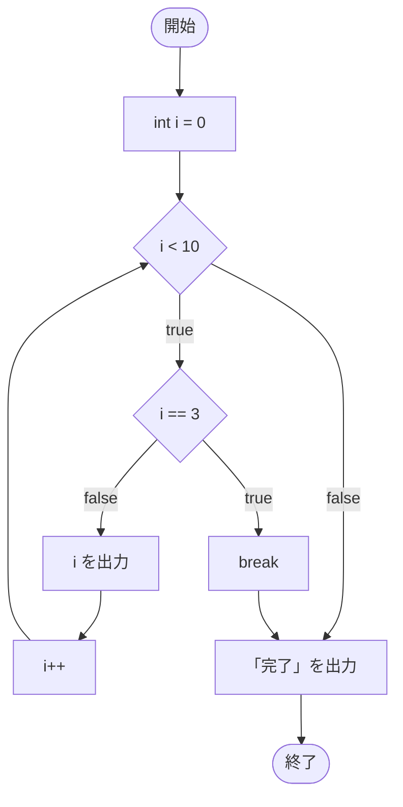
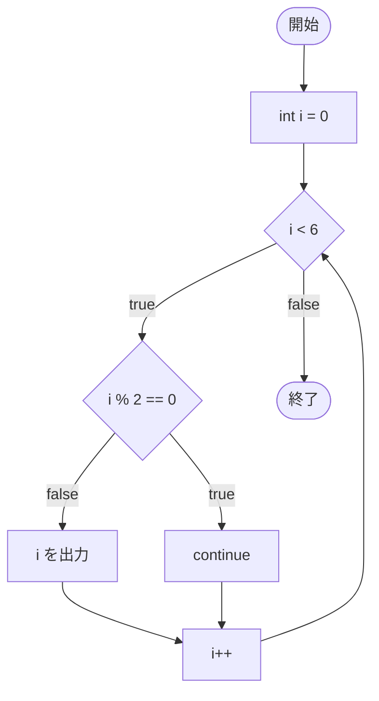

# break と continue（補足）

このページは、[反復処理](/unity-csharp-learning/csharp/loops/) の補足です。繰り返しを途中で終える `break` 文と、繰り返しの 1 回分の残りを飛ばす `continue` 文を学びます。どちらも `while`・`do-while`・`for`・`foreach` のすべてで使えます。

## 学習目標

このページを読み終えると、以下のことができるようになります。

- `break` で繰り返しを途中で終えられる
- `continue` で、ループ本体の残りを飛ばして次の繰り返しに進める
- 繰り返しが入れ子になっているとき、`break` と `continue` がいちばん内側の繰り返しにだけ作用することを説明できる

## 前提知識

- [反復処理](/unity-csharp-learning/csharp/loops/) を読んでいること
- [インクリメント・デクリメント（補足）](/unity-csharp-learning/csharp/increment-decrement/) を読んでいること

---

## 1. break — 繰り返しを途中で終える

[break 文](https://learn.microsoft.com/dotnet/csharp/language-reference/statements/jump-statements#the-break-statement) を実行すると、繰り返しがその場で終わり、繰り返しの文の後へ進みます。

**書式：[break 文](https://learn.microsoft.com/dotnet/csharp/language-reference/statements/jump-statements#the-break-statement)**
```
break;
```

```csharp
for (int i = 0; i < 10; i++)
{
    if (i == 3)
    {
        break;
    }
    Console.WriteLine(i);
}
Console.WriteLine("完了");
```

```
0
1
2
完了
```

`i` が `3` になった時点で `break` が実行され、`for` 文が終わります。`3` 以降は表示されず、`for` 文の後の `完了` が表示されます。



### 見つかったら繰り返しを終える

`break` は、「目的のものが見つかったら、それ以上は調べない」という処理によく使います。次のコードは、1 から順に、3 の倍数でも 7 の倍数でもある最初の数を探します。

```csharp
for (int n = 1; n <= 100; n++)
{
    if (n % 3 == 0 && n % 7 == 0)
    {
        Console.WriteLine($"見つかった: {n}");
        break;
    }
}
```

```
見つかった: 21
```

`21` が見つかった時点で `break` するので、`42` や `63` は調べられません。

### while (true) と break

[反復処理](/unity-csharp-learning/csharp/loops/) で学んだように、`while (true)` は、それだけでは終わらない無限ループです。繰り返しの途中で終わる条件を判定して `break` すると、「条件を満たすまで繰り返す」処理を書けます。

```csharp
int total = 0;
int n = 0;

while (true)
{
    n++;
    total += n;
    if (total > 20)
    {
        break;
    }
}

Console.WriteLine($"1 から {n} までの合計 {total} で 20 を超えた");
```

```
1 から 6 までの合計 21 で 20 を超えた
```

終わる条件がループ本体の途中にあるときに便利です。ただし、`break` に届かない書き方をすると、本当の無限ループになるので注意します。

---

## 2. continue — 1 回分の残りを飛ばす

[continue 文](https://learn.microsoft.com/dotnet/csharp/language-reference/statements/jump-statements#the-continue-statement) を実行すると、ループ本体の残りの処理を飛ばして、次の繰り返しに進みます。繰り返しそのものは終わりません。

**書式：[continue 文](https://learn.microsoft.com/dotnet/csharp/language-reference/statements/jump-statements#the-continue-statement)**
```
continue;
```

```csharp
for (int i = 0; i < 6; i++)
{
    if (i % 2 == 0)
    {
        continue;
    }
    Console.WriteLine(i);
}
```

```
1
3
5
```

`i` が偶数のときは `continue` が実行され、`Console.WriteLine(i)` が飛ばされます。`for` 文では、`continue` の後、更新式の `i++` が実行されてから条件式に進みます。



### while 文で continue を使う

`while` 文では、`continue` の後、すぐに条件式に進みます。`for` 文の更新式のような部分はないので、条件式に使う変数の更新を `continue` より **前** に書きます。

```csharp
int i = 0;
while (i < 6)
{
    i++;
    if (i % 2 == 0)
    {
        continue;
    }
    Console.WriteLine(i);
}
```

```
1
3
5
```

`i++` を `continue` より前に書いているので、`continue` した場合も `i` は増えています。

---

## 3. 入れ子の繰り返しでの動作

繰り返しの中に別の繰り返しがあるとき、`break` と `continue` は、**いちばん内側の繰り返し** にだけ作用します。

```csharp
for (int i = 0; i < 3; i++)
{
    for (int j = 0; j < 3; j++)
    {
        if (j == 1)
        {
            break;
        }
        Console.WriteLine($"i={i}, j={j}");
    }
}
```

```
i=0, j=0
i=1, j=0
i=2, j=0
```

`break` で終わるのは内側の `j` の `for` 文だけです。外側の `i` の `for` 文は続くので、`i` が `0`・`1`・`2` のそれぞれで、`j=0` だけが表示されます。

---

## よくあるミス

### while 文で、変数の更新より前に continue する

```csharp
// ❌ NG: i が 0 のとき continue して、i++ に届かない
// int i = 0;
// while (i < 6)
// {
//     if (i % 2 == 0)
//     {
//         continue;
//     }
//     Console.WriteLine(i);
//     i++;
// }
```

`i` が `0` のとき、`continue` で `i++` が飛ばされます。`i` は `0` のままなので、次の繰り返しでも `continue` され、無限ループになります。変数の更新は `continue` より前に書くか、更新式が必ず実行される `for` 文を使います。

---

## ワンポイントアドバイス

### switch 文の中の break

`break` は、[条件分岐](/unity-csharp-learning/csharp/conditionals/) で学んだ `switch` 文を抜けるときにも使います。繰り返しの中に `switch` 文があるとき、`switch` の中の `break` が抜けるのは `switch` 文だけで、繰り返しは終わりません。

```csharp
for (int i = 0; i < 3; i++)
{
    switch (i)
    {
        case 1:
            Console.WriteLine("1 で break");
            break;
        default:
            Console.WriteLine(i);
            break;
    }
}
```

```
0
1 で break
2
```

`i` が `1` のときも `break` するのは `switch` 文だけなので、繰り返しは `i` が `2` まで続きます。

---

## まとめ

| 文 | 動作 |
|---|---|
| `break` | 繰り返しをその場で終え、繰り返しの文の後へ進む |
| `continue` | ループ本体の残りを飛ばして、次の繰り返しに進む |

- `break` と `continue` は、いちばん内側の繰り返しにだけ作用する
- `while` 文で `continue` を使うときは、条件式に使う変数の更新を `continue` より前に書く

---

## 理解度チェック

1. 次のコードを実行すると何が出力されますか？

   ```csharp
   for (int i = 0; i < 5; i++)
   {
       if (i == 3)
       {
           break;
       }
       Console.WriteLine(i);
   }
   ```

2. 次のコードを実行すると何が出力されますか？

   ```csharp
   for (int i = 0; i < 5; i++)
   {
       if (i == 2)
       {
           continue;
       }
       Console.WriteLine(i);
   }
   ```

3. 次のコードを実行すると何が出力されますか？

   ```csharp
   for (int i = 1; i <= 2; i++)
   {
       for (int j = 1; j <= 3; j++)
       {
           if (j == 2)
           {
               continue;
           }
           Console.WriteLine($"{i}-{j}");
       }
   }
   ```

<details markdown="1">
<summary>解答を見る</summary>

1. 次のように出力されます。`i` が `3` のときに `break` するので、`3` 以降は表示されません。

   ```
   0
   1
   2
   ```

2. 次のように出力されます。`i` が `2` のときだけ `continue` で表示が飛ばされます。

   ```
   0
   1
   3
   4
   ```

3. 次のように出力されます。`continue` は内側の `j` の繰り返しにだけ作用するので、`j` が `2` のときだけ表示が飛ばされます。

   ```
   1-1
   1-3
   2-1
   2-3
   ```

</details>

---

## 次のステップ

[ビット演算](/unity-csharp-learning/csharp/bitwise-operations/) では、整数を 0 と 1 のビットの並びとして扱い、ビットごとに計算する方法を学びます。
