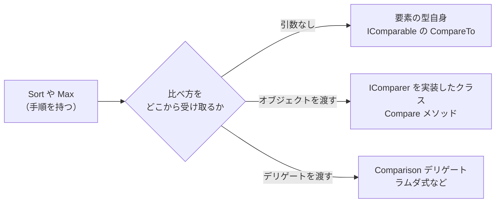

# 比較の仕組み

並べ替えや最大値を求める処理には、「2 つの値のどちらが前か」を決める **比べ方** が必要です。このページでは、比べ方を型に持たせる [IComparable\<T\>](https://learn.microsoft.com/dotnet/api/system.icomparable-1) と、比べ方を外から渡す [IComparer\<T\>](https://learn.microsoft.com/dotnet/api/system.collections.generic.icomparer-1) と [Comparison\<T\>](https://learn.microsoft.com/dotnet/api/system.comparison-1) を学びます。インターフェイスとデリゲートを使って、処理の一部を差し替えられるように作る設計の例でもあります。

## 学習目標

このページを読み終えると、以下のことができるようになります。

- 自分で作ったクラスに `IComparable<T>` を実装して、既定の順序を持たせられる
- 比べ方を `IComparer<T>` や `Comparison<T>` で受け取るメソッドを作れる
- `List<T>` の `Sort` に、3 つの方法で比べ方を渡せる
- 比べ方を型に持たせるか、外から渡すかを使い分けられる

## 前提知識

- [インターフェイス](/unity-csharp-learning/csharp/interfaces/) を読んでいること
- [型制約](/unity-csharp-learning/csharp/generic-constraints/) を読んでいること
- [List\<T\>](/unity-csharp-learning/csharp/list/) を読んでいること
- [ラムダ式](/unity-csharp-learning/csharp/lambda/) を読んでいること

---

## 1. 自分で作ったクラスは並べ替えられない

`List<int>` や `List<string>` は、[List\<T\>.Sort メソッド](https://learn.microsoft.com/dotnet/api/system.collections.generic.list-1.sort) を引数なしで呼び出すだけで、小さい順に並べ替えられます。ところが、自分で作った `Enemy` クラスの `List<Enemy>` で同じことをすると、例外が発生します。

```csharp
var enemies = new List<Enemy>
{
    new Enemy("Slime", 3),
    new Enemy("Dragon", 30),
    new Enemy("Bat", 5),
};

enemies.Sort();

class Enemy
{
    public string Name { get; }
    public int Level { get; }

    public Enemy(string name, int level)
    {
        Name = name;
        Level = level;
    }
}
```

実行すると、次のように表示されてプログラムが終了します（3 行目以降は省略）。

```
Unhandled exception. System.InvalidOperationException: Failed to compare two elements in the array.
 ---> System.ArgumentException: At least one object must implement IComparable.
```

「2 つの要素を比べられなかった」「少なくとも一方が `IComparable` を実装していなければならない」という意味のメッセージです。例外については、[例外の基本](/unity-csharp-learning/csharp/exceptions/) で学びます。

`Sort` は、並べ替えの手順を知っています。しかし、`Enemy` どうしのどちらを前にするのか（名前の順か、レベルの順か）は知りません。引数なしの `Sort` は、比べ方を要素の型自身に尋ねます。`Enemy` は比べ方を持っていないので、比べられませんでした。

---

## 2. IComparable\<T\>：型に既定の順序を持たせる

型に比べ方を持たせるには、[IComparable\<T\> インターフェイス](https://learn.microsoft.com/dotnet/api/system.icomparable-1) を実装します。`int` や `string` が `Sort` で並べ替えられるのは、このインターフェイスを実装しているからです。

**書式：[IComparable\<T\>.CompareTo メソッド](https://learn.microsoft.com/dotnet/api/system.icomparable-1.compareto)**
```csharp
int CompareTo(T? other);
```

`CompareTo` は、自分（`this`）と `other` を比べて、次の値を返します。

| 戻り値 | 意味 |
|---|---|
| 負の数 | 自分が `other` より前 |
| `0` | 自分と `other` は同じ順位 |
| 正の数 | 自分が `other` より後ろ |

`-1` や `1` である必要はありません。符号だけに意味があります。

次の `Enemy` は、レベルの低い順を既定の順序にしています。

```csharp
Enemy slime = new Enemy("Slime", 3);
Enemy dragon = new Enemy("Dragon", 30);
Enemy bat = new Enemy("Bat", 5);

var enemies = new List<Enemy> { slime, dragon, bat };
enemies.Sort();
Console.WriteLine(string.Join(", ", enemies));

Console.WriteLine(Util.Max(slime, bat));

class Enemy : IComparable<Enemy>
{
    public string Name { get; }
    public int Level { get; }

    public Enemy(string name, int level)
    {
        Name = name;
        Level = level;
    }

    public int CompareTo(Enemy? other)
    {
        if (other is null)
        {
            return 1;
        }
        return Level.CompareTo(other.Level);
    }

    public override string ToString()
    {
        return $"{Name} Lv{Level}";
    }
}

static class Util
{
    public static T Max<T>(T a, T b) where T : IComparable<T>
    {
        return a.CompareTo(b) >= 0 ? a : b;
    }
}
```

```
Slime Lv3, Bat Lv5, Dragon Lv30
Bat Lv5
```

`CompareTo` では、比べたい `Level` どうしの比較を、`int` の `CompareTo` に任せています。`other` が `null` のときは正の数を返します。`null` は、どの値よりも前（小さい）とみなすのが決まりです。

`IComparable<Enemy>` を実装したので、`Sort()` で並べ替えられるようになりました。[型制約](/unity-csharp-learning/csharp/generic-constraints/) で作った `Util.Max` にも、`Enemy` を渡せます。`ToString` は、`string.Join` や `Console.WriteLine` で表示するときの文字列を決めるためにオーバーライドしています。

---

## 3. 比べ方を受け取るメソッドを作る

`IComparable<T>` で決められる順序は、1 つの型につき 1 つです。`Enemy` の既定の順序はレベルの順にしたので、「名前の順で後ろのほう」を `Util.Max` で求めることはできません。

そこで、比べ方を型に持たせるのではなく、呼び出す側から渡せるようにします。渡す方法には、インターフェイスを使う方法と、デリゲートを使う方法があります。

### IComparer\<T\>：比べ方をオブジェクトとして渡す

[IComparer\<T\> インターフェイス](https://learn.microsoft.com/dotnet/api/system.collections.generic.icomparer-1) は、2 つの値を比べるメソッドを 1 つだけ持つインターフェイスです。

**書式：[IComparer\<T\>.Compare メソッド](https://learn.microsoft.com/dotnet/api/system.collections.generic.icomparer-1.compare)**
```csharp
int Compare(T? x, T? y);
```

戻り値の意味は `CompareTo` と同じです。`x` が前なら負の数、同じ順位なら `0`、`x` が後ろなら正の数を返します。

名前の順で比べるクラスは、次のように書けます。[String.Compare メソッド](https://learn.microsoft.com/dotnet/api/system.string.compare) は、2 つの文字列を比べて、同じ約束の値を返します。`null` を渡してもかまいません。

```csharp
class NameComparer : IComparer<Enemy>
{
    public int Compare(Enemy? x, Enemy? y)
    {
        return string.Compare(x?.Name, y?.Name);
    }
}
```

`Util.Max` には、`IComparer<T>` を受け取るオーバーロードを追加します。`a` と `b` を比べるとき、`a.CompareTo(b)` の代わりに `comparer.Compare(a, b)` を呼び出します。

```csharp
public static T Max<T>(T a, T b, IComparer<T> comparer)
{
    return comparer.Compare(a, b) >= 0 ? a : b;
}
```

このメソッドには、`where T : IComparable<T>` の制約がありません。比べ方は `comparer` が持っているので、`T` 自身が比べ方を持っている必要はないからです。

### Comparison\<T\>：比べ方をデリゲートとして渡す

比べ方は、デリゲートでも渡せます。2 つの値を比べるメソッドを表すデリゲート型として、[Comparison\<T\> デリゲート](https://learn.microsoft.com/dotnet/api/system.comparison-1) が用意されています。

**書式：[Comparison\<T\> デリゲート](https://learn.microsoft.com/dotnet/api/system.comparison-1)**
```csharp
public delegate int Comparison<in T>(T x, T y);
```

`Util.Max` に、`Comparison<T>` を受け取るオーバーロードも追加します。

```csharp
public static T Max<T>(T a, T b, Comparison<T> comparison)
{
    return comparison(a, b) >= 0 ? a : b;
}
```

デリゲートなので、呼び出す側はラムダ式で比べ方を書けます。比べ方のためにクラスを作る必要はありません。

### 完成したコード

3 つの `Max` を使い比べます。

```csharp
Enemy slime = new Enemy("Slime", 3);
Enemy bat = new Enemy("Bat", 5);

// 既定の順序（レベルの順）で比べる
Console.WriteLine(Util.Max(slime, bat));

// IComparer<T> で、名前の順で比べる
Console.WriteLine(Util.Max(slime, bat, new NameComparer()));

// Comparison<T> で、名前の文字数で比べる
Console.WriteLine(Util.Max(slime, bat, (x, y) => x.Name.Length.CompareTo(y.Name.Length)));

class Enemy : IComparable<Enemy>
{
    public string Name { get; }
    public int Level { get; }

    public Enemy(string name, int level)
    {
        Name = name;
        Level = level;
    }

    public int CompareTo(Enemy? other)
    {
        if (other is null)
        {
            return 1;
        }
        return Level.CompareTo(other.Level);
    }

    public override string ToString()
    {
        return $"{Name} Lv{Level}";
    }
}

class NameComparer : IComparer<Enemy>
{
    public int Compare(Enemy? x, Enemy? y)
    {
        return string.Compare(x?.Name, y?.Name);
    }
}

static class Util
{
    public static T Max<T>(T a, T b) where T : IComparable<T>
    {
        return a.CompareTo(b) >= 0 ? a : b;
    }

    public static T Max<T>(T a, T b, IComparer<T> comparer)
    {
        return comparer.Compare(a, b) >= 0 ? a : b;
    }

    public static T Max<T>(T a, T b, Comparison<T> comparison)
    {
        return comparison(a, b) >= 0 ? a : b;
    }
}
```

```
Bat Lv5
Slime Lv3
Slime Lv3
```

同じ `slime` と `bat` でも、比べ方によって結果が変わります。レベルの順では `Bat`（Lv5）が、名前の順では `Slime`（`B` より `S` が後ろ）が、文字数の順では `Slime`（5 文字）が大きいと判断されます。`Max` の中身は「比べて、大きいほうを返す」だけで、何で比べるかは知りません。

### Func\<T, T, int\> にしない理由

`Comparison<T>` は、`T` を 2 つ受け取って `int` を返すデリゲートです。[デリゲートの基本](/unity-csharp-learning/csharp/delegates/) で学んだ `Func<T, T, int>` と同じ形ですが、比べ方を受け取るパラメータには `Comparison<T>` を使います。

- 型の名前から、比べ方を表すデリゲートだとわかる
- `List<T>.Sort` など、.NET の比べ方を受け取るメソッドも `Comparison<T>` を使っている。同じ型にしておけば、同じ変数をどちらにも渡せる

デリゲート型は、形が同じでも、名前が違えば別の型です。`Func<T, T, int>` の変数は、`Comparison<T>` の変数に代入できません。

```csharp
// ❌ NG: Func<Enemy, Enemy, int> と Comparison<Enemy> は別の型
// Func<Enemy, Enemy, int> byName = (x, y) => string.Compare(x.Name, y.Name);
// Comparison<Enemy> comparison = byName;  // CS0029
```

`byName` を `Sort` に渡しても、同じ理由でコンパイルエラー（CS1503）になります。ラムダ式を直接書いて渡すときは、渡す先の型に合わせて変換されるので、この問題は起きません。

---

## 4. List\<T\>.Sort も同じ設計になっている

`List<T>.Sort` にも、`Util.Max` と同じように、比べ方の渡し方が違う 3 つのオーバーロードがあります。

| 呼び出し方 | 比べ方 |
|---|---|
| `Sort()` | 要素の型の `IComparable<T>` |
| `Sort(IComparer<T>? comparer)` | 渡した `IComparer<T>` |
| `Sort(Comparison<T> comparison)` | 渡した `Comparison<T>` |

[ラムダ式](/unity-csharp-learning/csharp/lambda/) で `names.Sort((a, b) => a.Length - b.Length)` と書いたときは、3 つ目の `Comparison<T>` を受け取る `Sort` を呼び出していました。

`IComparer<T>` しか受け取らないメソッドに、ラムダ式で比べ方を渡したいこともあります。そのときは、[Comparer\<T\>.Create メソッド](https://learn.microsoft.com/dotnet/api/system.collections.generic.comparer-1.create) で、`Comparison<T>` から `IComparer<T>` のオブジェクトを作ります。

```csharp
var enemies = new List<Enemy>
{
    new Enemy("Slime", 3),
    new Enemy("Dragon", 30),
    new Enemy("Bat", 5),
};

enemies.Sort();
Console.WriteLine(string.Join(", ", enemies));

enemies.Sort(new NameComparer());
Console.WriteLine(string.Join(", ", enemies));

enemies.Sort((x, y) => y.Level.CompareTo(x.Level));
Console.WriteLine(string.Join(", ", enemies));

IComparer<Enemy> byNameLength = Comparer<Enemy>.Create((x, y) => x.Name.Length.CompareTo(y.Name.Length));
enemies.Sort(byNameLength);
Console.WriteLine(string.Join(", ", enemies));

class Enemy : IComparable<Enemy>
{
    public string Name { get; }
    public int Level { get; }

    public Enemy(string name, int level)
    {
        Name = name;
        Level = level;
    }

    public int CompareTo(Enemy? other)
    {
        if (other is null)
        {
            return 1;
        }
        return Level.CompareTo(other.Level);
    }

    public override string ToString()
    {
        return $"{Name} Lv{Level}";
    }
}

class NameComparer : IComparer<Enemy>
{
    public int Compare(Enemy? x, Enemy? y)
    {
        return string.Compare(x?.Name, y?.Name);
    }
}
```

```
Slime Lv3, Bat Lv5, Dragon Lv30
Bat Lv5, Dragon Lv30, Slime Lv3
Dragon Lv30, Bat Lv5, Slime Lv3
Bat Lv5, Slime Lv3, Dragon Lv30
```

3 つ目の `Sort` では、`x` と `y` を入れ替えて `y.Level.CompareTo(x.Level)` としています。比べる向きを逆にすると、大きい順に並びます。

---

## 5. 比べ方を型に持たせるか、外から渡すか

`Sort` や `Util.Max` は、並べ替えや最大値を求める **手順** だけを持ち、**比べ方** は 3 つのどこかから受け取ります。手順と比べ方を分けておくと、手順を書き直さずに、比べ方だけを差し替えられます。



| 方法 | 向いている場面 |
|---|---|
| `IComparable<T>` | その型にとって自然な順序が 1 つに決まる（数値の大小、日付の前後など） |
| `IComparer<T>` | 名前を付けて、何か所でも使う比べ方。フィールドを持てるので、設定（大きい順にするかどうかなど）を持たせられる |
| `Comparison<T>` | その場だけで使う比べ方。ラムダ式で短く書ける |

### 複数の基準で比べる

1 つ目の基準で同じ順位になったときに、2 つ目の基準で比べるには、1 つ目の結果が `0` かどうかを調べます。`0` でなければその結果を返し、`0` なら 2 つ目の基準で比べた結果を返します。

```csharp
var enemies = new List<Enemy>
{
    new Enemy("Slime", 3),
    new Enemy("Goblin", 5),
    new Enemy("Bat", 5),
    new Enemy("Dragon", 30),
};

// レベルの低い順。同じレベルなら名前の順
enemies.Sort((x, y) =>
{
    int result = x.Level.CompareTo(y.Level);
    if (result != 0)
    {
        return result;
    }
    return string.Compare(x.Name, y.Name);
});

Console.WriteLine(string.Join(", ", enemies));

class Enemy
{
    public string Name { get; }
    public int Level { get; }

    public Enemy(string name, int level)
    {
        Name = name;
        Level = level;
    }

    public override string ToString()
    {
        return $"{Name} Lv{Level}";
    }
}
```

```
Slime Lv3, Bat Lv5, Goblin Lv5, Dragon Lv30
```

`Goblin` と `Bat` は、どちらも Lv5 なので、名前の順で `Bat` が前になります。この例の `Enemy` は `IComparable<T>` を実装していませんが、比べ方を `Sort` に渡しているので並べ替えられます。

---

## よくあるミス

### 引き算で比べる

`x - y` の結果は、`x` が小さければ負の数、大きければ正の数になるので、比べ方に使えそうに見えます。しかし、差が `int` の範囲を超えると、オーバーフローして符号が逆になります。

```csharp
var numbers = new List<int> { int.MaxValue, -1 };

// ❌ NG: int.MaxValue - (-1) がオーバーフローして負の数になる
numbers.Sort((a, b) => a - b);
Console.WriteLine(string.Join(", ", numbers));

// ✅ OK: CompareTo で比べる
numbers.Sort((a, b) => a.CompareTo(b));
Console.WriteLine(string.Join(", ", numbers));
```

```
2147483647, -1
-1, 2147483647
```

1 回目の `Sort` では、`int.MaxValue` のほうが `-1` より小さいと判断されて、並びが変わりませんでした。比べ方には、`CompareTo` を使います。[ラムダ式](/unity-csharp-learning/csharp/lambda/) の `a.Length - b.Length` は、文字数がオーバーフローするほど大きくならないので問題ありません。

### 結果を -1 や 1 と比べる

`CompareTo` や `Compare` が返すのは「負の数」「`0`」「正の数」で、`-1` や `1` とは限りません。たとえば [String.CompareOrdinal メソッド](https://learn.microsoft.com/dotnet/api/system.string.compareordinal) は、文字コードの差を返します。

```csharp
Console.WriteLine(string.CompareOrdinal("a", "c"));
```

```
-2
```

`== -1` で「前かどうか」を調べると、`-2` のときに間違えます。結果は `< 0`、`== 0`、`> 0` で調べます。

---

## ワンポイントアドバイス

### ジェネリックでない IComparable

1 節の例外のメッセージには、`IComparable<T>` ではなく `IComparable` と書かれていました。[IComparable インターフェイス](https://learn.microsoft.com/dotnet/api/system.icomparable) は、ジェネリクスが導入される前からある、`CompareTo(object? obj)` を持つインターフェイスです。引数が `object` なので、構造体を渡すと [ボクシング](/unity-csharp-learning/csharp/boxing/) が起き、違う型の値を渡してもコンパイルエラーになりません。新しく実装するときは、`IComparable<T>` を使います。

---

## まとめ

- 引数なしの `Sort` は、比べ方を要素の型の `IComparable<T>` に尋ねる。実装していない型は、例外が発生して並べ替えられない
- `IComparable<T>` の `CompareTo` で、型に既定の順序を 1 つ持たせる。自分が前なら負の数、同じなら `0`、後ろなら正の数を返す
- 比べ方を外から渡すには、インターフェイスの `IComparer<T>` か、デリゲートの `Comparison<T>` を使う
- 比べ方を受け取るメソッドは、手順だけを持ち、比べ方を差し替えられる。`List<T>.Sort` も、3 つの方法で比べ方を受け取る
- 比べ方を受け取るパラメータには、`Func<T, T, int>` ではなく `Comparison<T>` を使う。`Comparer<T>.Create` で `Comparison<T>` から `IComparer<T>` を作れる
- 比べ方は引き算ではなく `CompareTo` で書く。結果は `-1` や `1` ではなく、符号で調べる

---

## 理解度チェック

1. `x.CompareTo(y)` が正の数を返したとき、`x` と `y` はどちらが前に並びますか？
2. 次のコードを実行すると何が出力されますか？

   ```csharp
   var words = new List<string> { "pear", "fig", "banana", "kiwi" };
   words.Sort((x, y) =>
   {
       int result = x.Length.CompareTo(y.Length);
       if (result != 0)
       {
           return result;
       }
       return string.Compare(x, y);
   });
   Console.WriteLine(string.Join(", ", words));
   ```

3. 3 節の完成したコードに、名前の逆順で比べる `IComparer<Enemy>` を実装した `NameDescendingComparer` クラスを追加してください。そして、`Util.Max(slime, bat, new NameDescendingComparer())` の結果を表示してください。

<details markdown="1">
<summary>解答を見る</summary>

1. `y` が前、`x` が後ろに並びます。`CompareTo` が正の数を返すのは、自分（`x`）が `other`（`y`）より後ろのときです。
2. 文字数の少ない順に並び、文字数が同じ `pear` と `kiwi` は名前の順に並びます。

   ```
   fig, kiwi, pear, banana
   ```

3. ```csharp
   Enemy slime = new Enemy("Slime", 3);
   Enemy bat = new Enemy("Bat", 5);

   Console.WriteLine(Util.Max(slime, bat, new NameDescendingComparer()));

   class Enemy : IComparable<Enemy>
   {
       public string Name { get; }
       public int Level { get; }

       public Enemy(string name, int level)
       {
           Name = name;
           Level = level;
       }

       public int CompareTo(Enemy? other)
       {
           if (other is null)
           {
               return 1;
           }
           return Level.CompareTo(other.Level);
       }

       public override string ToString()
       {
           return $"{Name} Lv{Level}";
       }
   }

   class NameDescendingComparer : IComparer<Enemy>
   {
       public int Compare(Enemy? x, Enemy? y)
       {
           return string.Compare(y?.Name, x?.Name);
       }
   }

   static class Util
   {
       public static T Max<T>(T a, T b) where T : IComparable<T>
       {
           return a.CompareTo(b) >= 0 ? a : b;
       }

       public static T Max<T>(T a, T b, IComparer<T> comparer)
       {
           return comparer.Compare(a, b) >= 0 ? a : b;
       }

       public static T Max<T>(T a, T b, Comparison<T> comparison)
       {
           return comparison(a, b) >= 0 ? a : b;
       }
   }
   ```

   `Bat Lv5` が表示されます。`NameComparer` の `x` と `y` を入れ替えると、名前の逆順になります。名前の逆順では `Bat` のほうが後ろになるので、`Max` は `Bat` を返します。

</details>

---

## 次のステップ

このページで「C# デリゲートとイベント」の章は終了です。デリゲート・コールバック・イベント・ラムダ式・変数キャプチャ・ローカル関数と、インターフェイスやデリゲートで処理の一部を差し替える設計を学びました。

次の章の [LINQ の基本](/unity-csharp-learning/csharp/linq-basics/) では、ラムダ式を使って、コレクションの要素の絞り込みや変換を短く書く LINQ を学びます。
