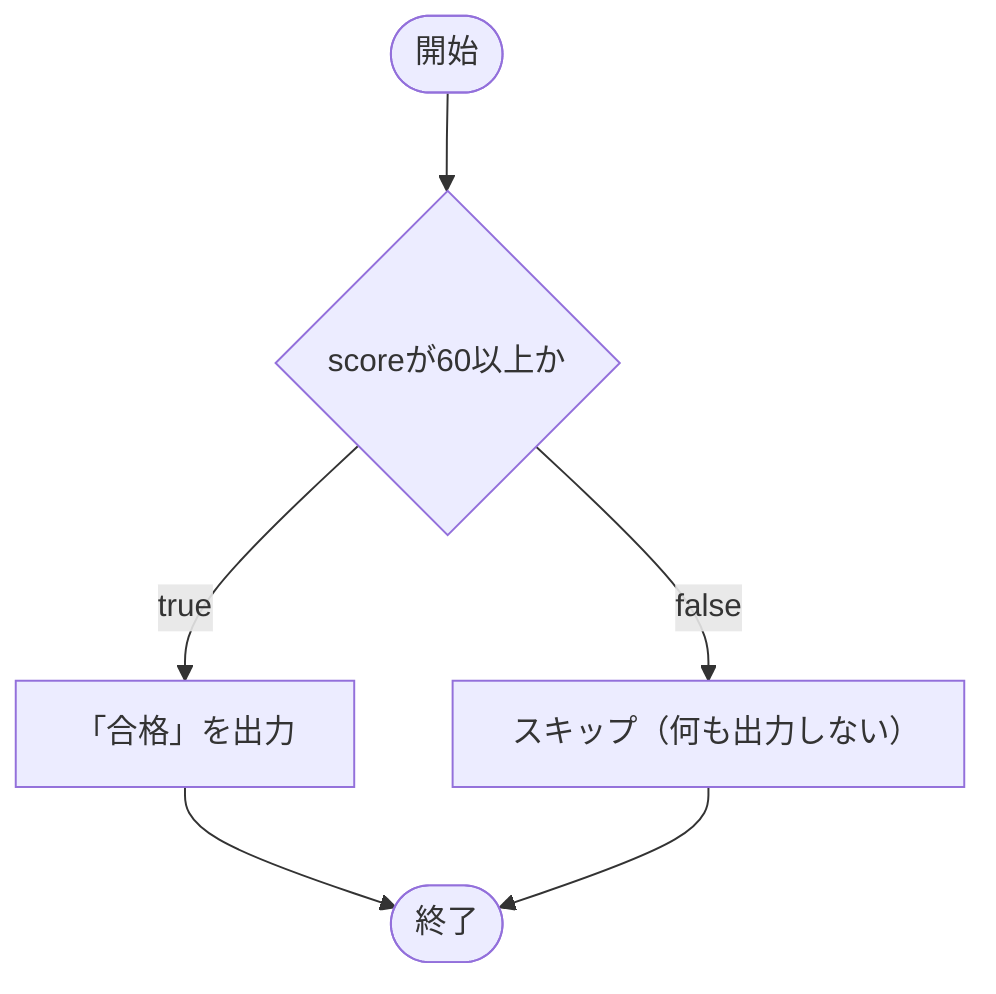
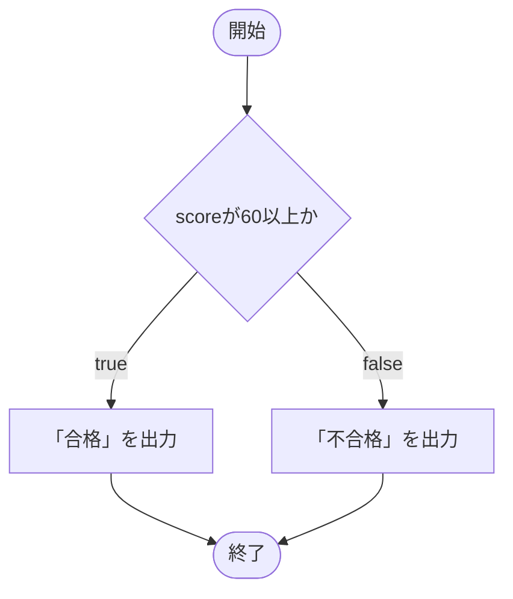
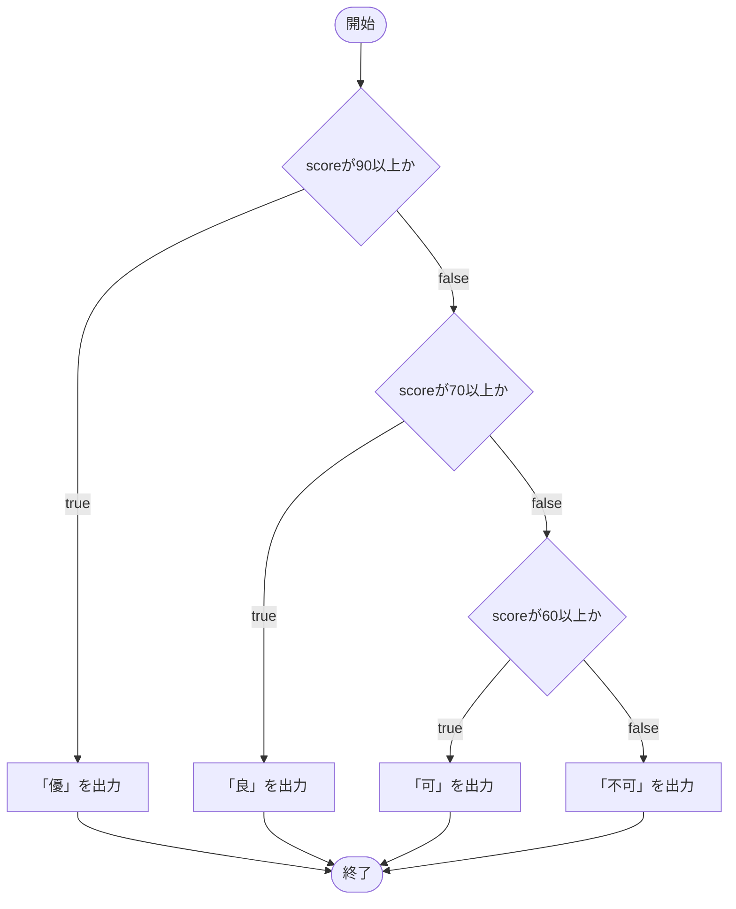
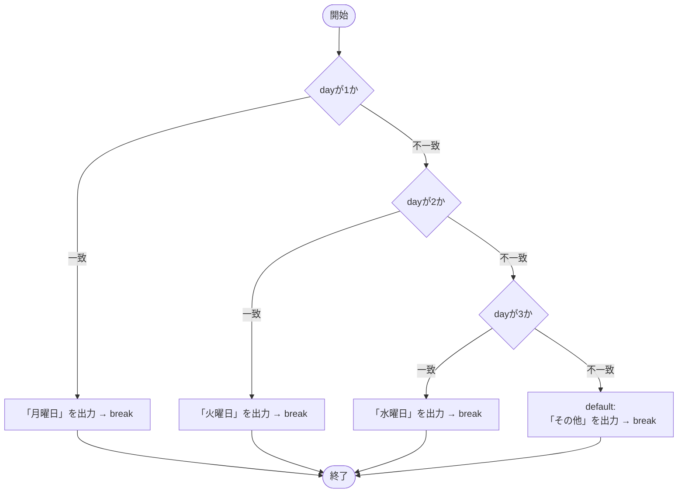
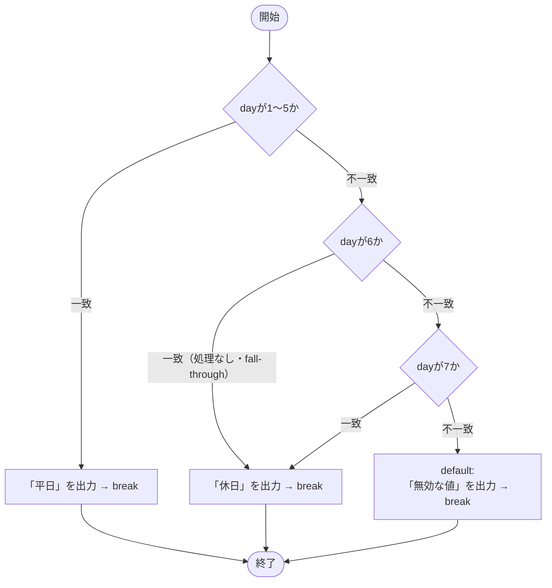

# 条件分岐

プログラムは常に上から下へ順番に実行されますが、**条件分岐**を使うと「ある条件のときだけ実行する」という制御ができます。C# の条件分岐には `if` 文と `switch` 文があります。

## 学習目標

- `if` 文の構文を理解して書ける
- 比較演算子・等値演算子を使って条件式を作れる
- `else`・`else if` で複数の分岐を書ける
- `switch` 文を使って値に応じた処理を書ける

## 前提知識

- [プリミティブ型と型変換](/unity-csharp-learning/csharp/primitive-types/) を読んでいること（`bool` 型の基本を理解していること）

---

## 1. if 文の構文

`if` 文は「条件が成り立つときだけ、特定の処理を実行する」ための構文です。

**書式：if 文**
```
if (条件式)
{
    条件が true のときに実行される処理
}
```

| 要素 | 説明 |
|---|---|
| `条件式` | `bool` 型（`true` か `false`）になる式 |
| `{ }` | 条件が成立したときに実行するコードのまとまり（ブロック） |

`{ }` で囲まれたブロックの中には複数の処理を書けます。条件が `false` のときはブロック全体がスキップされ、`}` の直後から実行が続きます。

条件式に `true` を直接書いてみましょう。

```csharp
if (true)
{
    Console.WriteLine("条件が成立した");
}
```

```
条件が成立した
```

`true` は常に「成立」なので、このコードは必ず実行されます。逆に `false` を入れると一度も実行されません。

```csharp
if (false)
{
    Console.WriteLine("ここは実行されない");
}
Console.WriteLine("ここは実行される");
```

```
ここは実行される
```

`if` ブロックの外のコードは条件に関係なく実行されます。

---

## 2. 条件式と演算子

固定の `true`/`false` では意味がないので、実際には**変数や演算の結果**を条件にします。

### 比較演算子

2 つの値の大小を比べる演算子です。演算の結果は `bool` 型の値（`true` または `false`）になります。

| 演算子 | 意味 | 例 | 結果 |
|---|---|---|---|
| `<` | より小さい | `3 < 5` | `true` |
| `>` | より大きい | `3 > 5` | `false` |
| `<=` | 以下 | `5 <= 5` | `true` |
| `>=` | 以上 | `3 >= 5` | `false` |

### 等値演算子

2 つの値が等しいかどうかを調べる演算子です。

| 演算子 | 意味 | 例 | 結果 |
|---|---|---|---|
| `==` | 等しい | `3 == 3` | `true` |
| `!=` | 等しくない | `3 != 5` | `true` |

これらの演算子を使って `bool` 型の条件式を作り、`if` に渡します。

```csharp
int score = 80;

if (score >= 60)
{
    Console.WriteLine("合格");
}
```

```
合格
```

`score >= 60` は `80 >= 60` と評価され、`true` になるのでブロックが実行されます。`score` が 59 以下であれば `false` になり、ブロックはスキップされます。



---

## 3. else — 条件が成立しない場合

`if` だけでは「条件が成り立つとき」しか処理を書けません。「条件が成り立たないとき」にも処理を行いたい場合は `else` を使います。

**書式：if-else 文**
```
if (条件式)
{
    条件が true のときの処理
}
else
{
    条件が false のときの処理
}
```

`else` ブロックは `if` の条件が `false` のときだけ実行されます。`if` と `else` のどちらか一方だけが必ず実行されます。

```csharp
int score = 40;

if (score >= 60)
{
    Console.WriteLine("合格");
}
else
{
    Console.WriteLine("不合格");
}
```

```
不合格
```

`score >= 60` は `40 >= 60` つまり `false` なので、`else` ブロックが実行されます。



---

## 4. else if — 複数の条件を順番にチェックする

3 つ以上の分岐が必要なときは `else if` を使います。`else if` はいくつでも連続して書けます。

**書式：if-else if-else 文**
```
if (条件式1)
{
    条件式1 が true のときの処理
}
else if (条件式2)
{
    条件式1 が false で条件式2 が true のときの処理
}
else
{
    どの条件も true でないときの処理
}
```

条件は**上から順番に評価**され、最初に `true` になったブロックだけが実行されます。一つのブロックが実行されると、残りの `else if` や `else` は評価されずにスキップされます。

```csharp
int score = 75;

if (score >= 90)
{
    Console.WriteLine("優");
}
else if (score >= 70)
{
    Console.WriteLine("良");
}
else if (score >= 60)
{
    Console.WriteLine("可");
}
else
{
    Console.WriteLine("不可");
}
```

```
良
```

`score >= 90` は `75 >= 90` で `false` → スキップ。`score >= 70` は `75 >= 70` で `true` → 「良」を出力して残りをスキップ。`score >= 60` と `else` は評価されません。



---

## 5. switch 文

特定の変数がどの値に**等しいか**によって分岐するときは、`switch` 文を使うとすっきり書けます。`if`-`else if` で同じ変数に対して `==` の比較を何度も書く場合、`switch` 文に置き換えると読みやすくなります。

**書式：switch 文**
```
switch (式)
{
    case 値1:
        処理1;
        break;
    case 値2:
        処理2;
        break;
    default:
        どの case にも一致しないときの処理;
        break;
}
```

| 要素 | 説明 |
|---|---|
| `式` | 判定する値（変数など） |
| `case 値:` | 式がこの値に等しいとき、直後の処理を実行する |
| `break` | `switch` ブロックを抜ける。各 `case` の末尾に必要 |
| `default:` | どの `case` にも一致しなかったときの処理（省略可） |

switch 文で判定する式には `int`・`long`・`char`・`string`・`bool`・`enum` 型の値を指定できます。それ以外の型、例えば `float`・`double` などは使用できません。また、エラーにはなりませんが特性上 `bool` 型を指定することも稀です。

各 case に指定する値は網羅する必要はなく、例えば整数なら 1, 5, 10 のように不連続な値でも問題はありません。また順序も関係なく 7, 3 ,5 といった順番で書いても影響はありませんが、慣例的（感覚的な問題で）に昇順に並べることが一般的でしょう。

case に指定する値はリテラルである必要があり、変数を指定することはできません。また、同じ値を重複して設定することはできません。

```csharp
int day = 3;

switch (day)
{
    case 1:
        Console.WriteLine("月曜日");
        break;
    case 2:
        Console.WriteLine("火曜日");
        break;
    case 3:
        Console.WriteLine("水曜日");
        break;
    default:
        Console.WriteLine("その他");
        break;
}
```

```
水曜日
```

`day` が `3` なので `case 3:` に一致し、「水曜日」が出力されます。`break` に達すると `switch` ブロックを抜け、それ以降の `case` は確認されません。どの `case` にも一致しない場合は `default:` の処理が実行されます。



### 複数の case をまとめる

同じ処理を複数の値に適用したいときは、`case` を並べて書けます。`break` のない `case` は処理を持たず、次の `case` へそのまま流れ落ちます。最初に一致した `case` から `break` のある `case` まで処理が実行されます。

```csharp
int day = 6;

switch (day)
{
    case 1:
    case 2:
    case 3:
    case 4:
    case 5:
        Console.WriteLine("平日");
        break;
    case 6:
    case 7:
        Console.WriteLine("休日");
        break;
    default:
        Console.WriteLine("無効な値");
        break;
}
```

```
休日
```

`day` が `6` なので `case 6:` に一致します。`case 6:` は処理を持たず `break` もないため、そのまま `case 7:` の処理（`Console.WriteLine("休日")`）へ流れ落ちます。その後 `break` で `switch` ブロックを抜けます。



---

## よくあるミス

### `=` と `==` を混同する

```csharp
int score = 100;

// ❌ NG: = は代入。条件式に使うとコンパイルエラーになる
if (score = 100)
{
    Console.WriteLine("満点");
}

// ✅ OK: 比較には == を使う
if (score == 100)
{
    Console.WriteLine("満点");
}
```

### switch に `break` を書き忘れる

```csharp
int value = 1;

switch (value)
{
    case 1:
        Console.WriteLine("one");
        // ❌ NG: break がないとコンパイルエラー（C# では fall-through は禁止）
    case 2:
        Console.WriteLine("two");
        break;
}
```

C# では `case` の末尾に `break`（または `return`）を書かないとコンパイルエラーになります。他の言語（C や Java）と異なり、自動的に次の `case` に落ちません。

---

## ワンポイントアドバイス

**論理演算子** — 複数の条件を組み合わせるときに使います。

| 演算子 | 意味 | 例 |
|---|---|---|
| `&&` | かつ（AND） | `score >= 60 && score < 90` |
| `\|\|` | または（OR） | `day == 6 \|\| day == 7` |
| `!` | でない（NOT） | `!isGameOver` |

```csharp
int score = 75;

if (score >= 60 && score < 90)
{
    Console.WriteLine("合格（優ではない）");
}
```

---

## まとめ

- `if (条件式) { }` — 条件が `true` のときだけブロックを実行する
- 条件式には比較演算子（`<` `>` `<=` `>=`）・等値演算子（`==` `!=`）が使える
- `else { }` — `if` の条件が `false` のときに実行する
- `else if (条件式) { }` — 複数の条件を上から順番にチェックする
- `switch` 文 — 一つの値が複数の候補のどれに一致するかで分岐する
- `case` の末尾には必ず `break` が必要

---

## 理解度チェック

1. 次のコードの出力結果を答えてください。

   ```csharp
   int x = 10;

   if (x > 5)
   {
       Console.WriteLine("A");
   }
   else
   {
       Console.WriteLine("B");
   }
   ```

2. 次のコードの出力結果を答えてください。

   ```csharp
   int score = 90;

   if (score >= 90)
   {
       Console.WriteLine("優");
   }
   else if (score >= 70)
   {
       Console.WriteLine("良");
   }
   else
   {
       Console.WriteLine("可");
   }
   ```

3. （応用）`switch` 文を使って、`string` 型の変数 `color` が `"red"`・`"blue"`・`"green"` のいずれかであれば「原色」、それ以外であれば「その他の色」と出力するコードを書いてください。

<details markdown="1">
<summary>解答を見る</summary>

1. `A`。`x > 5` は `10 > 5` で `true` なので `if` ブロックが実行される。

2. `優`。`score >= 90` は `true` なので最初の `if` ブロックが実行される。それ以降の `else if` は評価されない。

3. ```csharp
   string color = "red";

   switch (color)
   {
       case "red":
       case "blue":
       case "green":
           Console.WriteLine("原色");
           break;
       default:
           Console.WriteLine("その他の色");
           break;
   }
   ```

</details>

---

## 次のステップ

[ブロック文とスコープ（補足）](/unity-csharp-learning/csharp/block-and-scope/) では、`{ }` の正体・スコープ・`else if` の実体を掘り下げます。
