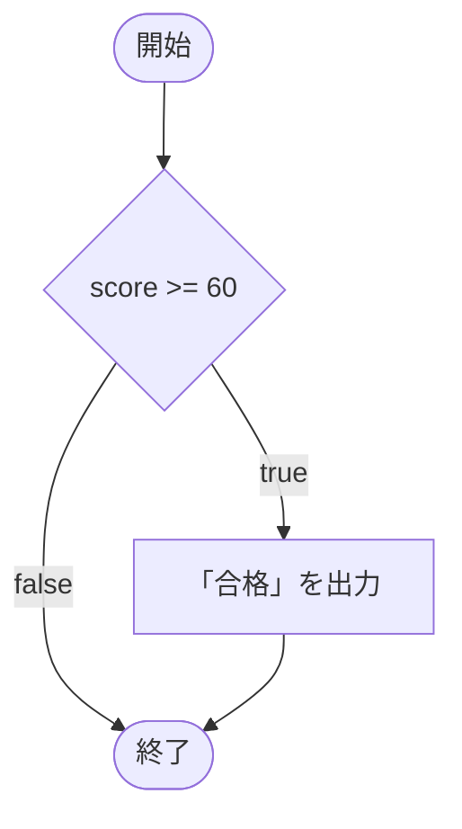
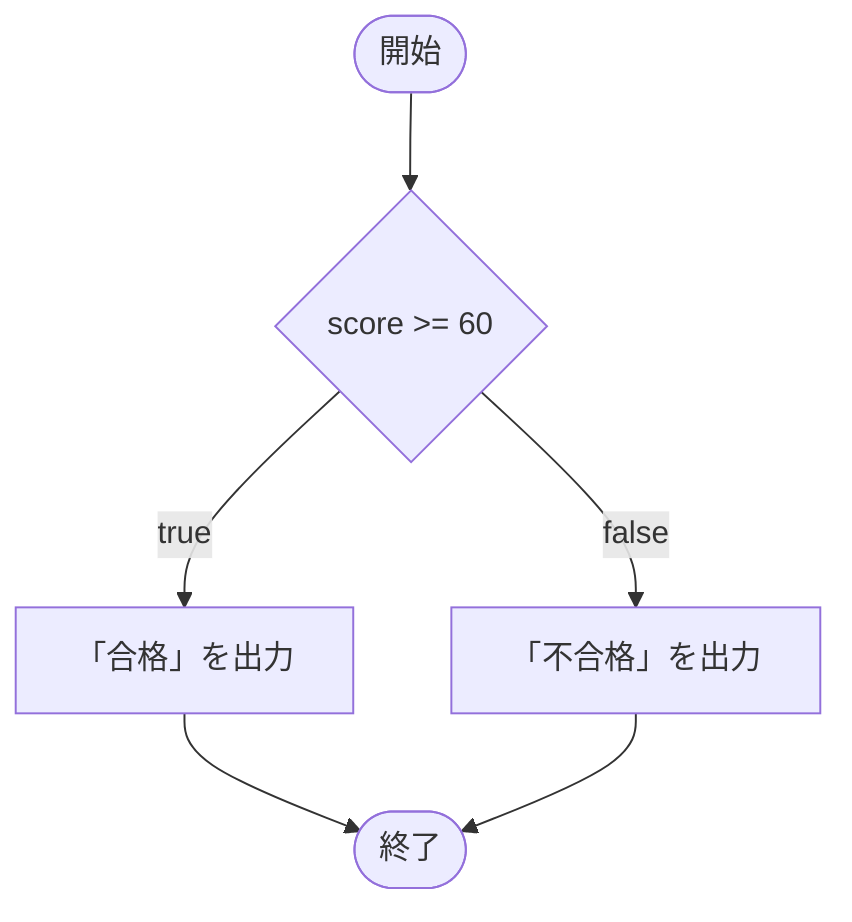
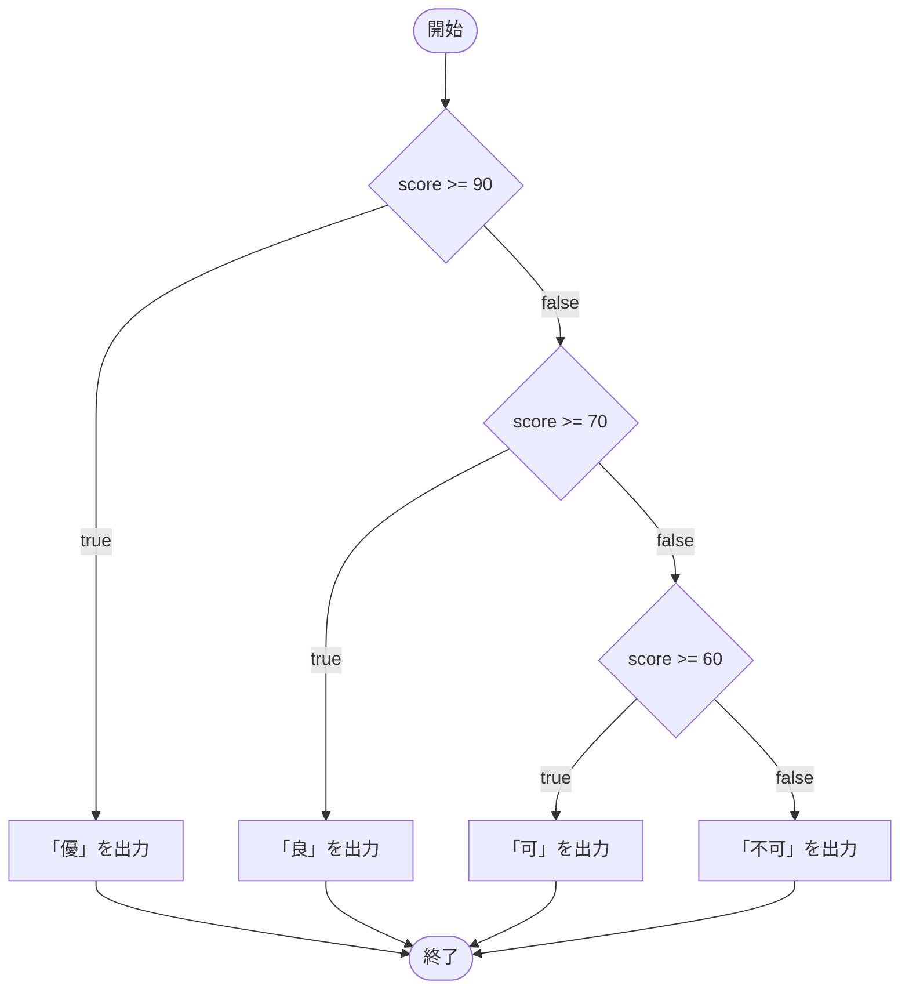
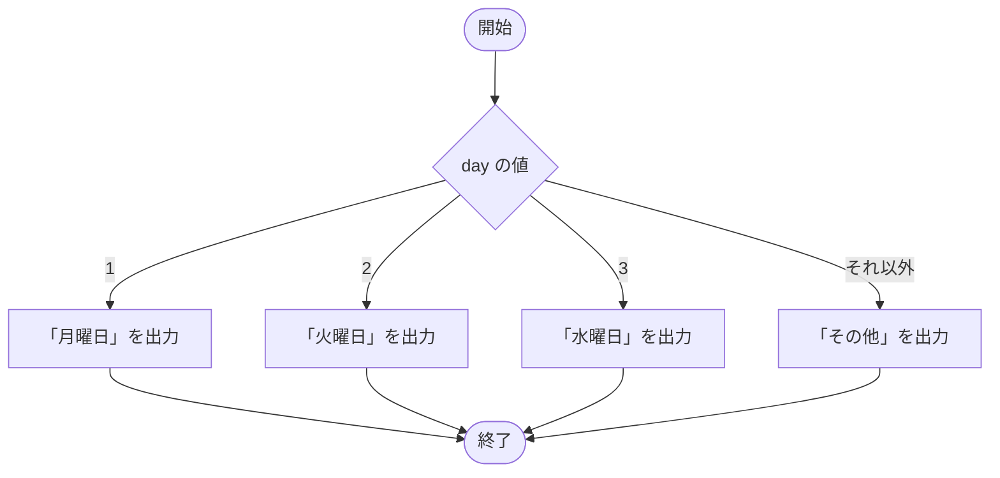

# 条件分岐

プログラムは上から下へ順番に実行されますが、**条件分岐** を使うと、「ある条件のときだけ実行する」「条件によって実行する処理を変える」といった制御ができます。C# の条件分岐には、`if` 文と `switch` 文があります。

## 学習目標

このページを読み終えると、以下のことができるようになります。

- `if` 文で、条件が成り立つときだけ処理を実行できる
- 比較演算子・等値演算子・論理演算子で条件式を作れる
- `else` と `else if` で、複数の分岐を書ける
- `switch` 文で、値に応じて処理を分けられる

## 前提知識

- [プリミティブ型と型変換](/unity-csharp-learning/csharp/primitive-types/) を読んでいること

---

## 1. if 文

`if` 文は、条件が成り立つときだけ、決まった処理を実行するための構文です。

**書式：[if 文](https://learn.microsoft.com/dotnet/csharp/language-reference/statements/selection-statements#the-if-statement)**
```
if (条件式)
{
    // 条件式が true のときに実行する処理
}
```

| 要素 | 説明 |
|---|---|
| `条件式` | `bool` 型（`true` か `false`）になる式 |
| `{ }` | 条件式が `true` のときに実行する処理のまとまり（ブロック） |

条件式が `false` のときは、ブロック全体が飛ばされ、`}` の後から実行が続きます。

```csharp
bool isRaining = true;

if (isRaining)
{
    Console.WriteLine("傘を持っていく");
}
Console.WriteLine("出かける");
```

```
傘を持っていく
出かける
```

`isRaining` を `false` にすると、`傘を持っていく` は表示されず、`出かける` だけが表示されます。`if` のブロックの外にある処理は、条件に関係なく実行されます。

---

## 2. 条件式を作る演算子

実際の条件式では、変数や計算の結果を比べて、`true` か `false` を作ります。

### 比較演算子

2 つの値の大小を比べる [比較演算子](https://learn.microsoft.com/dotnet/csharp/language-reference/operators/comparison-operators) です。結果は `bool` 型の値になります。

| 演算子 | 意味 | 例 | 結果 |
|---|---|---|---|
| `<` | より小さい | `3 < 5` | `true` |
| `>` | より大きい | `3 > 5` | `false` |
| `<=` | 以下 | `5 <= 5` | `true` |
| `>=` | 以上 | `3 >= 5` | `false` |

### 等値演算子

2 つの値が等しいかどうかを調べる [等値演算子](https://learn.microsoft.com/dotnet/csharp/language-reference/operators/equality-operators) です。

| 演算子 | 意味 | 例 | 結果 |
|---|---|---|---|
| `==` | 等しい | `3 == 3` | `true` |
| `!=` | 等しくない | `3 != 5` | `true` |

```csharp
int score = 80;

if (score >= 60)
{
    Console.WriteLine("合格");
}
```

```
合格
```

`score >= 60` は `80 >= 60` なので `true` になり、ブロックが実行されます。`score` が 59 以下なら `false` になり、ブロックは飛ばされます。


```mermaid
flowchart TD
    A([開始]) --> B{"score >= 60"}
    B -- true --> C["「合格」を出力"]
    B -- false --> E([終了])
    C --> E
```

### 論理演算子

複数の条件を組み合わせるときは、[論理演算子](https://learn.microsoft.com/dotnet/csharp/language-reference/operators/boolean-logical-operators) を使います。

| 演算子 | 意味 | 例 | 結果が true になるとき |
|---|---|---|---|
| `&&` | かつ（AND） | `score >= 60 && score < 90` | 両方が `true` |
| `\|\|` | または（OR） | `day == 6 \|\| day == 7` | どちらかが `true` |
| `!` | でない（NOT） | `!isRaining` | `isRaining` が `false` |

```csharp
int score = 75;

if (score >= 60 && score < 90)
{
    Console.WriteLine("60 点以上 90 点未満");
}
```

```
60 点以上 90 点未満
```

`&&` は、左の条件が `false` なら、右の条件を調べずに全体を `false` にします。`||` は、左の条件が `true` なら、右の条件を調べずに全体を `true` にします。これを **短絡評価** といいます。

---

## 3. else — 条件が成り立たないとき

条件が成り立たないときにも処理をしたい場合は、`else` を使います。

**書式：[if-else 文](https://learn.microsoft.com/dotnet/csharp/language-reference/statements/selection-statements#the-if-statement)**
```
if (条件式)
{
    // 条件式が true のときの処理
}
else
{
    // 条件式が false のときの処理
}
```

`if` のブロックと `else` のブロックは、必ずどちらか一方だけが実行されます。

```csharp
int score = 40;

if (score >= 60)
{
    Console.WriteLine("合格");
}
else
{
    Console.WriteLine("不合格");
}
```

```
不合格
```

`score >= 60` は `40 >= 60` なので `false` になり、`else` のブロックが実行されます。


```mermaid
flowchart TD
    A([開始]) --> B{"score >= 60"}
    B -- true --> C["「合格」を出力"]
    B -- false --> D["「不合格」を出力"]
    C --> E([終了])
    D --> E
```

---

## 4. else if — 複数の条件を順に調べる

3 つ以上に分けたいときは、`else if` を使います。`else if` は、いくつでも続けて書けます。

**書式：[if-else if-else 文](https://learn.microsoft.com/dotnet/csharp/language-reference/statements/selection-statements#the-if-statement)**
```
if (条件式1)
{
    // 条件式1 が true のときの処理
}
else if (条件式2)
{
    // 条件式1 が false で、条件式2 が true のときの処理
}
else
{
    // どの条件式も true でないときの処理
}
```

条件式は **上から順に** 調べられ、最初に `true` になったブロックだけが実行されます。1 つのブロックが実行されると、残りの `else if` と `else` は調べられません。

```csharp
int score = 75;

if (score >= 90)
{
    Console.WriteLine("優");
}
else if (score >= 70)
{
    Console.WriteLine("良");
}
else if (score >= 60)
{
    Console.WriteLine("可");
}
else
{
    Console.WriteLine("不可");
}
```

```
良
```

`score >= 90` は `false` なので次へ進みます。`score >= 70` は `true` なので、`良` を表示して終わります。`score >= 60` と `else` は調べられません。


```mermaid
flowchart TD
    A([開始]) --> B{"score >= 90"}
    B -- true --> C["「優」を出力"]
    B -- false --> D{"score >= 70"}
    D -- true --> E["「良」を出力"]
    D -- false --> F{"score >= 60"}
    F -- true --> G["「可」を出力"]
    F -- false --> H["「不可」を出力"]
    C --> Z([終了])
    E --> Z
    G --> Z
    H --> Z
```

条件を上から順に調べるので、条件を書く順序が大切です。`score >= 60` を最初に書くと、90 点でも `可` になってしまいます。

---

## 5. switch 文

1 つの値が、いくつかの候補のどれに **等しいか** で処理を分けるときは、`switch` 文を使うと読みやすく書けます。

**書式：[switch 文](https://learn.microsoft.com/dotnet/csharp/language-reference/statements/selection-statements#the-switch-statement)**
```
switch (式)
{
    case 値1:
        // 式が値1 に等しいときの処理
        break;
    case 値2:
        // 式が値2 に等しいときの処理
        break;
    default:
        // どの case にも一致しないときの処理
        break;
}
```

| 要素 | 説明 |
|---|---|
| `式` | 調べる値（変数など） |
| `case 値:` | 式がこの値に等しいとき、その後の処理を実行する |
| `break` | `switch` 文を抜ける |
| `default:` | どの `case` にも一致しなかったときの処理。省略できる |

```csharp
int day = 3;

switch (day)
{
    case 1:
        Console.WriteLine("月曜日");
        break;
    case 2:
        Console.WriteLine("火曜日");
        break;
    case 3:
        Console.WriteLine("水曜日");
        break;
    default:
        Console.WriteLine("その他");
        break;
}
```

```
水曜日
```

`day` が `3` なので、`case 3:` の処理が実行されます。`break` で `switch` 文を抜けるので、それより後の処理は実行されません。どの `case` にも一致しないときは、`default:` の処理が実行されます。


```mermaid
flowchart TD
    A([開始]) --> B{"day の値"}
    B -- "1" --> C["「月曜日」を出力"]
    B -- "2" --> D["「火曜日」を出力"]
    B -- "3" --> E["「水曜日」を出力"]
    B -- "それ以外" --> F["「その他」を出力"]
    C --> Z([終了])
    D --> Z
    E --> Z
    F --> Z
```

### case の値と、switch に使える型

`case` に書く値は、リテラルのように、プログラムを実行する前に決まる値（定数）でなければなりません。変数は書けません。同じ値の `case` を 2 つ書くこともできません。`case` の順序は自由で、すべての値を網羅する必要もありません。

`switch` で調べる式には、`int`・`long` などの整数型、`char`・`string`・`enum` 型（[列挙型](/unity-csharp-learning/csharp/enums/) で学びます）の値がよく使われます。C# 6 までは、使える型がこれらと `bool` 型に限られていましたが、C# 7 以降では `float`・`double` などの型も使えます。なお、`bool` 型は `if` 文で書けるので、`switch` 文に使うことはまれです。

`float` や `double` の値を `switch` 文で調べるときは注意が必要です。[プリミティブ型と型変換](/unity-csharp-learning/csharp/primitive-types/) で学んだように、浮動小数点数の計算には小さな誤差が出ることがあり、計算の結果が `case` の値と等しくならないことがあります。

```csharp
double x = 0.1 + 0.2;

switch (x)
{
    case 0.3:
        Console.WriteLine("0.3");
        break;
    default:
        Console.WriteLine("0.3 ではない");
        break;
}
```

```
0.3 ではない
```

`0.1 + 0.2` の結果は `0.30000000000000004` なので、`case 0.3:` には一致しません。計算で求めた小数は、`if` 文で範囲を調べるほうが安全です。

### 複数の値で同じ処理をする

いくつかの値で同じ処理をしたいときは、`case` を続けて並べます。並べた `case` のどれかに一致すると、その後の処理が実行されます。

```csharp
int day = 6;

switch (day)
{
    case 1:
    case 2:
    case 3:
    case 4:
    case 5:
        Console.WriteLine("平日");
        break;
    case 6:
    case 7:
        Console.WriteLine("休日");
        break;
    default:
        Console.WriteLine("無効な値");
        break;
}
```

```
休日
```

`day` が `6` なので、`case 6:` と `case 7:` の後にある処理が実行され、`休日` が表示されます。値の範囲や組み合わせを調べるパターンは [パターンと is 演算子](/unity-csharp-learning/csharp/is-patterns/) で、値を選ぶための `switch` 式は [switch 式](/unity-csharp-learning/csharp/switch-expressions/) で学びます。

---

## よくあるミス

### = と == を混同する

```csharp
// ❌ NG: = は代入。条件式には使えない
// int score = 100;
// if (score = 100)  // CS0029
// {
//     Console.WriteLine("満点");
// }
```

`=` は代入演算子で、`score = 100` は `int` の値になります。`if` の条件式には `bool` 型の値が必要なので、コンパイルエラーになります。等しいかどうかは `==` で調べます。

### switch の case の最後に break を書き忘れる

```csharp
// ❌ NG: case 1: の処理の最後に break がない
// int value = 1;
// switch (value)
// {
//     case 1:
//         Console.WriteLine("one");  // CS0163
//     case 2:
//         Console.WriteLine("two");
//         break;
// }
```

C# では、`case` の処理の最後から次の `case` の処理へ続けて実行することはできず、コンパイルエラーになります。処理の最後には `break` を書いて、`switch` 文を抜けます（メソッドから戻る `return` などで抜けてもかまいません）。C や Java と違い、`break` を忘れて次の `case` まで実行してしまう間違いが起きないようになっています。

---

## まとめ

- `if (条件式) { }` は、条件式が `true` のときだけブロックを実行する
- 条件式は、比較演算子（`<`・`>`・`<=`・`>=`）、等値演算子（`==`・`!=`）、論理演算子（`&&`・`||`・`!`）で作る
- `else` のブロックは、`if` の条件式が `false` のときに実行される
- `else if` を続けると、条件式が上から順に調べられ、最初に `true` になったブロックだけが実行される
- `switch` 文は、1 つの値がどの `case` に等しいかで処理を分ける。`case` の処理の最後には `break` を書く

---

## 理解度チェック

1. 次のコードを実行すると何が出力されますか？

   ```csharp
   int x = 10;

   if (x > 5 && x % 2 == 1)
   {
       Console.WriteLine("A");
   }
   else if (x > 5)
   {
       Console.WriteLine("B");
   }
   else
   {
       Console.WriteLine("C");
   }
   ```

2. 次のコードを実行すると何が出力されますか？

   ```csharp
   int score = 90;

   if (score >= 60)
   {
       Console.WriteLine("可");
   }
   else if (score >= 90)
   {
       Console.WriteLine("優");
   }
   ```

3. （応用）`switch` 文を使って、`string` 型の変数 `color` が `"red"`・`"blue"`・`"green"` のどれかなら `原色`、それ以外なら `その他の色` と出力するコードを書いてください。

<details markdown="1">
<summary>解答を見る</summary>

1. `B` が出力されます。`x % 2 == 1` は `10 % 2` が `0` なので `false` になり、`&&` でつないだ最初の条件全体が `false` になります。次の `x > 5` は `true` です。
2. `可` が出力されます。条件は上から順に調べられ、`score >= 60` が先に `true` になるので、`score >= 90` は調べられません。

   ```
   可
   ```

3. ```csharp
   string color = "red";

   switch (color)
   {
       case "red":
       case "blue":
       case "green":
           Console.WriteLine("原色");
           break;
       default:
           Console.WriteLine("その他の色");
           break;
   }
   ```

</details>

---

## 次のステップ

[ブロック文とスコープ（補足）](/unity-csharp-learning/csharp/block-and-scope/) では、`{ }` の正体と、変数を使える範囲（スコープ）、`else if` のしくみを学びます。
