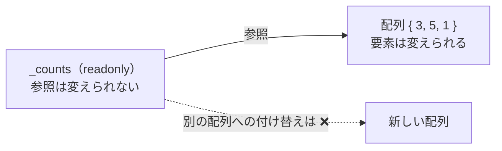

# const と readonly（補足）

プログラムの中には、一度決めたら変えない値があります。**const**（定数）は、コンパイルするときに値が決まり、決して変わらない値を表します。**readonly**（読み取り専用）フィールドは、インスタンスを作るときに一度だけ値を入れ、その後は変えられないフィールドです。このページでは、この 2 つの違いと使い分けを学びます。

## 学習目標

このページを読み終えると、以下のことができるようになります。

- `const` で定数を定義し、`const` に使える値の制限を説明できる
- `readonly` フィールドに値を入れられる場所を説明できる
- `const` にできない値を、`static readonly` フィールドで定数のように扱える
- 参照型の `readonly` フィールドでは、参照だけが変えられないことを説明できる

## 前提知識

- [static メンバーと static クラス](/unity-csharp-learning/csharp/static-members/) を読んでいること
- [プロパティ](/unity-csharp-learning/csharp/properties/) を読んでいること

---

## 1. const で定数を定義する

[ビット演算](/unity-csharp-learning/csharp/bitwise-operations/) では、フラグの値を `const` を付けた変数で表しました。`const` を付けると、値を変えられない **定数** になります。

**書式：[const](https://learn.microsoft.com/dotnet/csharp/language-reference/keywords/const)**
```
const 型 名前 = 定数式;
```

| 要素 | 説明 |
|---|---|
| `const` | 定数を表すキーワード |
| `定数式` | コンパイルするときに値が決まる式。リテラルや、ほかの定数を組み合わせた式 |

```csharp
const int MaxHp = 100;
const double TaxRate = 0.1;
const string Title = "RPG";

Console.WriteLine($"{Title}: 最大 HP {MaxHp}");
Console.WriteLine($"1000 円の税込み価格: {1000 * (1 + TaxRate)}");
```

```
RPG: 最大 HP 100
1000 円の税込み価格: 1100
```

`100` や `0.1` をコードのあちこちに直接書く代わりに名前を付けておくと、その値が何を表しているかが読み取りやすくなります。値を変えるときも、定数の宣言を 1 か所直すだけで済みます。定数の名前は、先頭を大文字にするのが慣例です。

定数に代入しようとすると、コンパイルエラーになります。

```csharp
// ❌ NG: 定数には代入できない（CS0131）
// const int MaxHp = 100;
// MaxHp = 200;
```

### const に使える値

`const` の値は、コンパイルするときに決まっていなければなりません。そのため、`=` の右辺に書けるのは、リテラルや、ほかの定数を組み合わせた式だけです。変数の値や、`new` で作るオブジェクトは使えません。

```csharp
const string Greeting = "Hello, " + "World";  // ✅ OK: 定数どうしの演算

// ❌ NG: 変数の値は、コンパイルするときには決まっていない（CS0133）
// int level = 5;
// const int Limit = level * 10;

// ❌ NG: 配列は new で作るので、定数にできない（CS0133）
// const int[] Primes = { 2, 3, 5 };
```

`const` にできる型は、数値型、`char`、`bool`、`string` など、リテラルで書ける型に限られます。

### クラスの定数

`const` は、クラスのメンバーとしても宣言できます。定数はどのインスタンスでも同じ値なので、[static メンバーと static クラス](/unity-csharp-learning/csharp/static-members/) で学んだ static メンバーと同じように、自動的にクラスに属します。`static` を書かなくても、`クラス名.定数名` で使います。

```csharp
Console.WriteLine(Player.MaxLevel);
Console.WriteLine(Player.LevelRange);

class Player
{
    public const int MaxLevel = 99;
    public const int MinLevel = 1;
    public const int LevelRange = MaxLevel - MinLevel + 1;
}
```

```
99
99
```

[プリミティブ型と型変換](/unity-csharp-learning/csharp/primitive-types/) で使った `int.MaxValue` も、`int` 型（`System.Int32` 構造体）の `public const` のフィールドです。

---

## 2. readonly フィールド

値がコンパイルするときには決まらず、インスタンスを作るときに決まるものもあります。たとえば、プレイヤーを作るたびに割り当てる ID や、コンストラクターで受け取る名前です。このような「作った後は変えない」フィールドには、[readonly](https://learn.microsoft.com/dotnet/csharp/language-reference/keywords/readonly) 修飾子を付けます。

`readonly` フィールドに値を入れられるのは、次の 2 か所だけです。

- フィールドの宣言（初期値）
- そのクラスのコンストラクターの中

コンストラクターが終わった後は、クラスの中のメソッドからも値を変えられません。

```csharp
Player a = new Player("Alice");
Player b = new Player("Bob");
Console.WriteLine($"{a.Name} (ID: {a.Id})");
Console.WriteLine($"{b.Name} (ID: {b.Id})");

class Player
{
    private static int _nextId = 1;
    private readonly int _id;
    private readonly string _name;

    public Player(string name)
    {
        _id = _nextId;
        _nextId++;
        _name = name;
    }

    public int Id
    {
        get { return _id; }
    }

    public string Name
    {
        get { return _name; }
    }
}
```

```
Alice (ID: 1)
Bob (ID: 2)
```

`_id` と `_name` は、インスタンスごとに違う値を持ちます。`const` はすべてのインスタンスで同じ値なので、このようなフィールドには使えません。

コンストラクターの外で `readonly` フィールドに代入すると、コンパイルエラーになります。

```csharp
// ❌ NG: コンストラクターの外で readonly フィールドに代入している（CS0191）
// public void Rename(string name)
// {
//     _name = name;
// }
```

`readonly` を付けておけば、うっかり値を書き換えるコードを書いてもコンパイラーが知らせてくれます。「このフィールドは作った後に変わらない」ことを、コードを読む人にも伝えられます。

---

## 3. static readonly：const にできない値

配列やクラスのインスタンスのように、`const` にできない値を、定数のようにクラスで 1 つだけ持ちたいときは、`static readonly` フィールドにします。`static readonly` フィールドに値を入れられるのは、宣言と [static コンストラクター](/unity-csharp-learning/csharp/static-members/) の中だけです。

```csharp
Console.WriteLine(string.Join(", ", Palette.Colors));
Console.WriteLine(Palette.Colors.Length);

class Palette
{
    public static readonly string[] Colors = { "赤", "緑", "青" };
}
```

```
赤, 緑, 青
3
```

`const` と `readonly` の違いをまとめると、次のようになります。

| | `const` | `readonly` フィールド |
|---|---|---|
| 値が決まるとき | コンパイルするとき | 実行して、インスタンス（`static readonly` ならクラス）を用意するとき |
| 値を入れられる場所 | 宣言だけ | 宣言とコンストラクター |
| 使える型 | 数値型・`char`・`bool`・`string` など | どの型でもよい |
| インスタンスごとに違う値 | 持てない（自動的に static） | 持てる（`static` を付けなければ） |

---

## 4. readonly なのは参照だけ

`readonly` フィールドの型が配列のような参照型のとき、変えられないのはフィールドに入っている参照だけです。参照している先のオブジェクトの中身は変えられます。

```csharp
Inventory inventory = new Inventory();
inventory.Show();
inventory.Update();
inventory.Show();

class Inventory
{
    private readonly int[] _counts = { 3, 5, 1 };

    public void Update()
    {
        _counts[0] = 10;                        // ✅ OK: 配列の要素は変えられる
        // _counts = new int[] { 0, 0, 0 };     // ❌ NG: 別の配列は代入できない（CS0191）
    }

    public void Show()
    {
        Console.WriteLine(string.Join(", ", _counts));
    }
}
```

```
3, 5, 1
10, 5, 1
```

`_counts` に別の配列を代入することはできませんが、`_counts[0] = 10` で配列の要素を書き換えることはできます。[Array クラスと配列の性質（補足）](/unity-csharp-learning/csharp/array-class/) で学んだように、配列の変数に入っているのは配列そのものではなく、配列を指す参照だからです。



3 節の `Palette.Colors` も同じです。`Palette.Colors = ...` とは書けませんが、`Palette.Colors[0] = "黒";` と書けば中身は変わってしまいます。変数に入っているものが値そのものか参照かの違いは、[値型と参照型](/unity-csharp-learning/csharp/value-reference-types/) で詳しく学びます。

---

## よくあるミス

### インスタンスを通して定数を使う

クラスの定数は自動的に static なので、インスタンスを通して使うことはできません。

```csharp
// ❌ NG: 定数をインスタンスを通して使っている（CS0176）
// Player p = new Player();
// Console.WriteLine(p.MaxLevel);

// ✅ OK: クラス名を通して使う
// Console.WriteLine(Player.MaxLevel);
```

---

## ワンポイントアドバイス

### 変わるかもしれない値は const にしない

`const` の値は、コンパイルするときに、定数を使っている場所へ直接埋め込まれます。あるライブラリの `public const` を使ったプログラムは、ライブラリの定数の値が変わっても、プログラムをコンパイルし直すまで古い値を使い続けます。円周率や 1 日の時間数のように決して変わらない値には `const` を、設定値のように将来変わるかもしれない値には `static readonly` を使います。

### readonly フィールドと読み取り専用のプロパティ

[プロパティ](/unity-csharp-learning/csharp/properties/) で学んだ `{ get; }` だけの自動実装プロパティは、コンパイラーが作る `readonly` のフィールドに値を保存します。そのため、コンストラクターの中でだけ値を入れられる点は `readonly` フィールドと同じです。クラスの外に公開する値は `{ get; }` のプロパティにし、クラスの中だけで使う値は `private readonly` のフィールドにする、という使い分けが一般的です。

---

## まとめ

- `const` は、コンパイルするときに値が決まる定数。右辺にはリテラルやほかの定数を組み合わせた式だけを書ける
- クラスの `const` は自動的に static になり、`クラス名.定数名` で使う
- `readonly` フィールドには、宣言とコンストラクターの中でだけ値を入れられる。インスタンスごとに違う値を持てる
- `const` にできない値は、`static readonly` フィールドで定数のように扱う
- 参照型の `readonly` フィールドで変えられないのは参照だけで、参照先のオブジェクトの中身は変えられる
- 将来変わるかもしれない値は、`const` ではなく `static readonly` にする

---

## 理解度チェック

1. 次の 3 つのうち、`const` にできるものはどれですか？理由も説明してください。
   - (a) `100`
   - (b) コンストラクターで受け取った名前
   - (c) `{ 1, 2, 3 }` の配列
2. 次のコードを実行すると何が出力されますか？

   ```csharp
   Counter c = new Counter(5);
   c.Add();
   c.Add();
   Console.WriteLine($"{c.Start} {c.Value}");

   class Counter
   {
       private readonly int _start;
       private int _value;

       public Counter(int start)
       {
           _start = start;
           _value = start;
       }

       public int Start
       {
           get { return _start; }
       }

       public int Value
       {
           get { return _value; }
       }

       public void Add()
       {
           _value++;
       }
   }
   ```

3. `private readonly int[] _items = new int[3];` と宣言したフィールドに対して、クラスのメソッドの中で `_items[0] = 1;` と書くと、コンパイルできますか？理由も説明してください。

<details markdown="1">
<summary>解答を見る</summary>

1. (a) だけです。`const` の値はコンパイルするときに決まっていなければなりません。(b) はプログラムを実行してインスタンスを作るときに決まるので、`readonly` フィールドにします。(c) の配列は `new` で作るオブジェクトなので、`static readonly` フィールドにします。
2. `5 7` が出力されます。`_start` は `readonly` で、コンストラクターで入れた `5` のままです。`_value` はふつうのフィールドなので、`Add` を 2 回呼ぶと `7` になります。
3. コンパイルできます。`readonly` で変えられないのは `_items` に入っている参照だけで、参照している配列の要素は変えられるからです。`_items = new int[3];` のように別の配列を代入すると、コンパイルエラーになります。

</details>

---

## 次のステップ

[拡張メソッド](/unity-csharp-learning/csharp/extension-methods/) では、既存の型に、あとからメソッドを追加したように見せる書き方を学びます。
