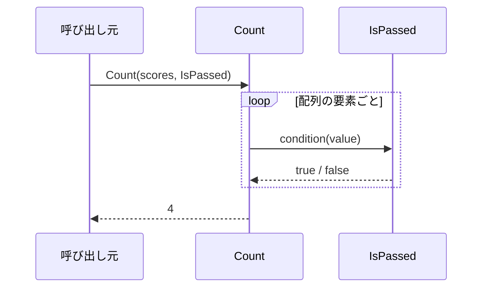

# デリゲートの変数渡しとコールバック

デリゲートをメソッドのパラメータにすると、メソッドの処理の一部を、呼び出し元が決めて渡せるようになります。渡されたメソッドを、受け取った側があとで呼び出す（コールバックする）ので、このパターンを**コールバック**（callback）と呼びます。

## 学習目標

このページを読み終えると、以下のことができるようになります。

- デリゲート型をメソッドのパラメータとして受け取るコードを書ける
- 処理の一部をコールバックとして渡すと、メソッドを使い回せることを説明できる
- 途中経過や完了を知らせるコールバックを書ける
- `?.Invoke()` を使って、省略できるコールバックを安全に呼び出せる

## 前提知識

- [デリゲートの基本](/unity-csharp-learning/csharp/delegates/) を読んでいること

---

## 1. 処理の一部だけが違うメソッド

テストの点数の配列から、「60 点以上の人数」と「100 点の人数」を数えるとします。

```csharp
int[] scores = { 45, 100, 72, 60, 100, 38 };

Console.WriteLine($"合格: {CountPassed(scores)} 人");
Console.WriteLine($"満点: {CountPerfect(scores)} 人");

int CountPassed(int[] values)
{
    int count = 0;
    foreach (int value in values)
    {
        if (value >= 60)
        {
            count++;
        }
    }
    return count;
}

int CountPerfect(int[] values)
{
    int count = 0;
    foreach (int value in values)
    {
        if (value == 100)
        {
            count++;
        }
    }
    return count;
}
```

```
合格: 4 人
満点: 2 人
```

2 つのメソッドは、`if` の条件だけが違い、残りはまったく同じです。「40 点未満の人数」も数えたくなれば、同じループをもう一度書くことになります。

違うのは「数えるかどうかを判定する処理」だけです。この判定を、呼び出し元からメソッドとして渡せれば、数えるメソッドは 1 つで済みます。

---

## 2. デリゲートをパラメータとして渡す

デリゲート型のパラメータを持つメソッドには、シグネチャの合うメソッドを引数として渡せます。

**書式：[デリゲートをパラメータとして受け取るメソッド](https://learn.microsoft.com/dotnet/csharp/programming-guide/delegates/using-delegates)**
```
戻り値型 メソッド名(デリゲート型 パラメータ名)
```

| 要素 | 説明 |
|---|---|
| `デリゲート型` | 受け取るメソッドのシグネチャを表すデリゲート型。自分で宣言した型や `Action` / `Func` を使う |
| `パラメータ名` | 受け取ったデリゲートをメソッド内で呼び出すときの名前 |

1 節の 2 つのメソッドを、判定する処理を `Func<int, bool>`（`int` を受け取って `bool` を返すメソッド）として受け取る `Count` にまとめます。

```csharp
int[] scores = { 45, 100, 72, 60, 100, 38 };

Console.WriteLine($"合格: {Count(scores, IsPassed)} 人");
Console.WriteLine($"満点: {Count(scores, IsPerfect)} 人");
Console.WriteLine($"追試: {Count(scores, NeedsRetest)} 人");

int Count(int[] values, Func<int, bool> condition)
{
    int count = 0;
    foreach (int value in values)
    {
        if (condition(value))   // 渡されたメソッドを呼び出して判定する
        {
            count++;
        }
    }
    return count;
}

bool IsPassed(int score) => score >= 60;
bool IsPerfect(int score) => score == 100;
bool NeedsRetest(int score) => score < 40;
```

```
合格: 4 人
満点: 2 人
追試: 1 人
```

`Count` は、配列を回して数えることだけを担当し、何を数えるのかは知りません。「追試の人数」のように数える条件を増やしても、`Count` は書き換えずに、判定するメソッドを 1 つ追加して渡すだけで済みます。

`Count` は、配列の要素ごとに、渡された `condition` を呼び返しています。このように、渡したメソッドを相手に呼んでもらうのが、コールバックです。



> 💡 **ポイント**: .NET の標準ライブラリにも、このように処理の一部をデリゲートで受け取るメソッドがたくさんあります。たとえば、[LINQ の基本](/unity-csharp-learning/csharp/linq-basics/) で学ぶ `Where` は、要素を残すかどうかの判定を `Func` で受け取ります。

---

## 3. 途中経過や完了を知らせるコールバック

コールバックには、もう 1 つよく使われる形があります。**処理の途中経過や完了を、呼び出し元に知らせてもらう**形です。

身近なたとえでは、「荷物が届いたら連絡して」という依頼と同じです。荷物を届ける側（処理を実行する側）は「届けたあとに何をするか」を知らなくてよく、依頼した側（呼び出し元）が「届いたら電話する」「届いたらメールする」などを自由に決められます。

次の `Download` は、ファイルのダウンロードを模したメソッドです。進み具合を `onProgress` で、終わったことを `onComplete` で知らせます。

```csharp
Download(300, ShowProgress, ShowCompleted);
Console.WriteLine("---");
Download(200, ShowProgress, null);

void Download(int totalSize, Action<int> onProgress, Action? onComplete)
{
    for (int received = 100; received <= totalSize; received += 100)
    {
        onProgress(received * 100 / totalSize);   // 途中経過を知らせる
    }
    onComplete?.Invoke();                         // 完了を知らせる
}

void ShowProgress(int percent)
{
    Console.WriteLine($"{percent}% 受信しました");
}

void ShowCompleted()
{
    Console.WriteLine("ダウンロードが完了しました");
}
```

```
33% 受信しました
66% 受信しました
100% 受信しました
ダウンロードが完了しました
---
50% 受信しました
100% 受信しました
```

途中経過は、`Download` の実行中にしか知ることができません。呼び出し元が `Download` から戻ってきたあとに何かを表示しても、途中の様子はわかりません。コールバックを渡しておけば、`Download` が知らせたいタイミングで、呼び出し元の処理を実行してもらえます。

完了の知らせは、なくてもよいので `Action?` にしています。`?` は「このパラメータには `null` を渡してもよい」という意味です（[null 許容参照型](/unity-csharp-learning/csharp/nullable-reference-types/)）。`null` が渡されることがあるので、`onComplete?.Invoke()` で呼び出します。2 回目の呼び出しでは `null` を渡したので、完了のメッセージは表示されていません。

> 💡 **ポイント**: 「完了したら呼んでほしいメソッドを先に渡しておく」という考え方は、時間のかかる処理を待たずに進める非同期処理でも使われます。

---

## 4. コールバックを使った設計の利点

2 節と 3 節の例に共通しているのは、処理を実行する側（`Count` や `Download`）が、呼び出し元の事情を知らずに済むことです。このように、お互いの詳細を知らずに済む関係を**疎結合**（そけつごう）と呼びます。

- 処理を実行する側は、「判定が必要になったら呼ぶ」「進んだら呼ぶ」ことだけを決めておけばよい
- 呼び出し元は、目的に合わせたメソッドを自由に渡せる
- その結果、どちらか一方を変更しても、もう一方を書き換えずに済む

---

## よくあるミス

`null` を渡してもよいコールバックを、そのまま `onComplete()` や `onComplete.Invoke()` と呼び出してしまうと、`null` のときに実行時エラー（`NullReferenceException`）になります。パラメータの型が `Action?` なら、コンパイル時にも警告（CS8602）が出ます。警告を見逃さないようにしましょう。

```csharp
// ❌ NG: null の可能性があるデリゲートをそのまま呼び出している（警告 CS8602）
onComplete();

// ✅ OK: ?.Invoke() で null のときは呼び出さない
onComplete?.Invoke();
```

逆に、`Count` の `condition` のように、必ず渡してほしいコールバックは、`?` を付けない型にします。そうすると、`null` を渡そうとしたときに警告が出ます。

---

## まとめ

- デリゲート型をメソッドのパラメータにすると、呼び出し元がメソッドを引数として渡せる
- 渡されたメソッドを、受け取った側が呼び出す（コールバックする）パターンをコールバックと呼ぶ
- 処理の一部（判定など）をコールバックで受け取ると、同じメソッドを目的に合わせて使い回せる
- 途中経過や完了をコールバックで知らせると、処理の実行中に呼び出し元の処理を実行してもらえる
- `null` を渡してよいコールバックは `?` を付けた型にし、`?.Invoke()` で呼び出す
- コールバックを使うと、処理を実行する側と呼び出し元が疎結合になる

---

## 理解度チェック

以下の問いに答えられるか確認しましょう。

1. 1 節の `CountPassed` と `CountPerfect` を `Count` にまとめると、数える条件を増やすときに何が楽になりますか？
2. 次のコードの出力結果は何になりますか？

   ```csharp
   Process("処理A", PrintResult);
   Process("処理B", null);

   void Process(string name, ResultCallback? callback)
   {
       Console.WriteLine($"{name} を実行中...");
       callback?.Invoke($"{name} が完了");
   }

   void PrintResult(string result)
   {
       Console.WriteLine(result);
   }

   delegate void ResultCallback(string result);
   ```

3. （応用）配列の要素のうち、条件に合うものだけを表示するメソッド `PrintIf(int[] values, Func<int, bool> condition)` を書き、`{ 3, 8, 5, 12, 7 }` から偶数だけを表示してください。

<details markdown="1">
<summary>解答を見る</summary>

1. `Count` は書き換えずに、判定するメソッドを 1 つ追加して渡すだけで済みます。配列を回して数えるループを、条件ごとに書き直す必要がありません。

2. 次のように出力されます。`Process("処理B", null)` では `callback` が `null` のため、`?.Invoke()` は何も実行しません。

   ```
   処理A を実行中...
   処理A が完了
   処理B を実行中...
   ```

3. たとえば次のように書けます。

   ```csharp
   int[] numbers = { 3, 8, 5, 12, 7 };
   PrintIf(numbers, IsEven);

   void PrintIf(int[] values, Func<int, bool> condition)
   {
       foreach (int value in values)
       {
           if (condition(value))
           {
               Console.WriteLine(value);
           }
       }
   }

   bool IsEven(int value) => value % 2 == 0;
   ```

   ```
   8
   12
   ```

</details>

---

## 次のステップ

[マルチキャストデリゲート](/unity-csharp-learning/csharp/multicast-delegates/) では、一つのデリゲートに複数のメソッドを登録して一括呼び出しする方法を学びます。
