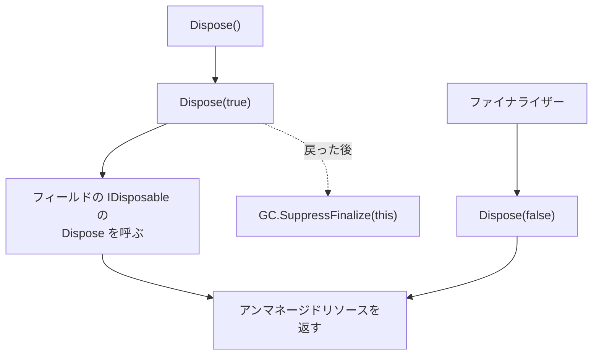

# Dispose パターン（補足）

[IDisposable と using](/unity-csharp-learning/csharp/dispose-using/) で作った `Dispose` は、呼び出し元が呼んでくれることを前提にしています。呼び忘れたときに備えて、[ファイナライザー（補足）](/unity-csharp-learning/csharp/finalizers/) を保険として組み合わせる決まった書き方を、**Dispose パターン** といいます。このページでは、`Dispose(bool)` と `GC.SuppressFinalize` を使った Dispose パターンを学びます。

## 学習目標

このページを読み終えると、以下のことができるようになります。

- ガベージコレクターが回収しないアンマネージドリソースを説明できる
- `GC.SuppressFinalize` で、`Dispose` した後のファイナライザーを止められる
- `Dispose(bool disposing)` を使い、`Dispose` とファイナライザーで後片付けの範囲を分けられる
- 派生クラスで `Dispose(bool)` をオーバーライドして、後片付けを追加できる

## 前提知識

- [ファイナライザー（補足）](/unity-csharp-learning/csharp/finalizers/) を読んでいること
- [IDisposable と using](/unity-csharp-learning/csharp/dispose-using/) を読んでいること
- [オーバーライドとポリモーフィズム](/unity-csharp-learning/csharp/polymorphism/) を読んでいること

---

## 1. アンマネージドリソース

.NET のガベージコレクターが管理しているのは、`new` で作ったオブジェクトが置かれるヒープ（**マネージドヒープ**）だけです。プログラムは、.NET を通さずに、OS から直接メモリなどを受け取ることもできます。このように、.NET が管理していないリソースを **アンマネージドリソース** といいます。アンマネージドリソースは、ガベージコレクターが回収しないので、プログラムが自分で返さなければなりません。

このページでは、アンマネージドリソースの例として、[Marshal.AllocHGlobal メソッド](https://learn.microsoft.com/dotnet/api/system.runtime.interopservices.marshal.allochglobal) で OS から受け取るメモリを使います。受け取ったメモリは、[Marshal.FreeHGlobal メソッド](https://learn.microsoft.com/dotnet/api/system.runtime.interopservices.marshal.freehglobal) で返します。`Marshal` クラスを使うには、`using System.Runtime.InteropServices;` が必要です。

**書式：[Marshal.AllocHGlobal メソッド](https://learn.microsoft.com/dotnet/api/system.runtime.interopservices.marshal.allochglobal)**
```csharp
public static IntPtr AllocHGlobal(int cb);
```

**書式：[Marshal.FreeHGlobal メソッド](https://learn.microsoft.com/dotnet/api/system.runtime.interopservices.marshal.freehglobal)**
```csharp
public static void FreeHGlobal(IntPtr hglobal);
```

| パラメータ | 説明 |
|---|---|
| `cb` | 受け取るメモリの大きさ（バイト数） |
| `hglobal` | 返すメモリ。`AllocHGlobal` が返した値を渡す |

`AllocHGlobal` が返す [IntPtr](https://learn.microsoft.com/dotnet/api/system.intptr) は、受け取ったメモリの位置（アドレス）を表す値です。`IntPtr` は値型なので、`IntPtr` を持つオブジェクトが回収されても、その位置にあるメモリは返されません。`FreeHGlobal` を呼ばない限り、メモリは使われたまま残ります。

> 💡 **ポイント**: ファイルやネットワークの接続も、OS が管理するアンマネージドリソースです。ただ、.NET のクラスを使うときは、アンマネージドリソースを直接扱いません。.NET のクラスが中で扱い、`Dispose` で閉じられるようにしてくれています。自分でアンマネージドリソースを扱うのは、OS の機能を直接呼び出すときなどに限られます。

---

## 2. ファイナライザーで呼び忘れに備える

アンマネージドなメモリを持つ `NativeBuffer` クラスを作ります。`Dispose` でメモリを返すのに加えて、`Dispose` を呼び忘れたときのために、ファイナライザーでもメモリを返します。どちらから呼ばれても同じ処理になるように、メモリを返す処理を `Release` メソッドにまとめます。`Release` は、`_memory` が `IntPtr.Zero` なら、返し終わっているとみなして何もしません。

```csharp
using System.Runtime.InteropServices;

UseWithUsing();
GC.Collect();
GC.WaitForPendingFinalizers();
Console.WriteLine("終了");

void UseWithUsing()
{
    using NativeBuffer a = new NativeBuffer("a", 100);
    Console.WriteLine("a を使う");
}

class NativeBuffer : IDisposable
{
    private string _name;
    private IntPtr _memory;

    public NativeBuffer(string name, int size)
    {
        _name = name;
        _memory = Marshal.AllocHGlobal(size);
    }

    ~NativeBuffer()
    {
        Console.WriteLine($"{_name} のファイナライザー");
        Release();
    }

    public void Dispose()
    {
        Console.WriteLine($"{_name}.Dispose");
        Release();
    }

    private void Release()
    {
        if (_memory == IntPtr.Zero)
        {
            return;
        }
        Marshal.FreeHGlobal(_memory);
        _memory = IntPtr.Zero;
        Console.WriteLine($"{_name}: メモリを解放");
    }
}
```

```
a を使う
a.Dispose
a: メモリを解放
a のファイナライザー
終了
```

`using` 宣言で `Dispose` を呼び、メモリを返しています。ところが、その後の `GC.Collect()` で、ファイナライザーも呼ばれています。`Release` が 2 回目に何もしないので、メモリを 2 回返す誤りにはなっていません。

ただ、このファイナライザーは、何もすることがないのに呼ばれています。[ファイナライザー（補足）](/unity-csharp-learning/csharp/finalizers/) で学んだように、ファイナライザーを持つオブジェクトは、メモリが回収されるまでにガベージコレクションが 2 回必要です。`Dispose` で後片付けが終わったオブジェクトまで、回収が遅れてしまいます。

---

## 3. GC.SuppressFinalize でファイナライザーを止める

[GC.SuppressFinalize メソッド](https://learn.microsoft.com/dotnet/api/system.gc.suppressfinalize) を呼ぶと、そのオブジェクトのファイナライザーは呼ばれなくなります。ファイナライザーを呼ぶ必要がないので、ガベージコレクションの 1 回目でメモリを回収できます。

**書式：[GC.SuppressFinalize メソッド](https://learn.microsoft.com/dotnet/api/system.gc.suppressfinalize)**
```csharp
public static void SuppressFinalize(object obj);
```

| パラメータ | 説明 |
|---|---|
| `obj` | ファイナライザーを呼ばないようにするオブジェクト |

`Dispose` で後片付けを終えたら、`GC.SuppressFinalize(this)` で自分自身のファイナライザーを止めます。`Dispose` を呼び忘れたときにファイナライザーが働くことも確かめるために、`Dispose` を呼ばない `ForgetDispose` も追加します。

```csharp
using System.Runtime.InteropServices;

UseWithUsing();
Console.WriteLine("---");
ForgetDispose();
GC.Collect();
GC.WaitForPendingFinalizers();
Console.WriteLine("終了");

void UseWithUsing()
{
    using NativeBuffer a = new NativeBuffer("a", 100);
    Console.WriteLine("a を使う");
}

void ForgetDispose()
{
    NativeBuffer b = new NativeBuffer("b", 100);
    Console.WriteLine("b を使う");
}

class NativeBuffer : IDisposable
{
    private string _name;
    private IntPtr _memory;

    public NativeBuffer(string name, int size)
    {
        _name = name;
        _memory = Marshal.AllocHGlobal(size);
    }

    ~NativeBuffer()
    {
        Console.WriteLine($"{_name} のファイナライザー");
        Release();
    }

    public void Dispose()
    {
        Console.WriteLine($"{_name}.Dispose");
        Release();
        GC.SuppressFinalize(this);
    }

    private void Release()
    {
        if (_memory == IntPtr.Zero)
        {
            return;
        }
        Marshal.FreeHGlobal(_memory);
        _memory = IntPtr.Zero;
        Console.WriteLine($"{_name}: メモリを解放");
    }
}
```

```
a を使う
a.Dispose
a: メモリを解放
---
b を使う
b のファイナライザー
b: メモリを解放
終了
```

`Dispose` した `a` のファイナライザーは、呼ばれなくなりました。`Dispose` を呼び忘れた `b` は、ファイナライザーがメモリを返しています。ただし、[ファイナライザー（補足）](/unity-csharp-learning/csharp/finalizers/) で学んだように、ファイナライザーがいつ呼ばれるかは決まりません。ファイナライザーは、あくまで呼び忘れたときの保険です。

---

## 4. Dispose(bool) で後片付けの範囲を分ける

`NativeBuffer` が、アンマネージドなメモリのほかに、`IDisposable` を実装したオブジェクトをフィールドに持つとします。ここでは、[IDisposable と using](/unity-csharp-learning/csharp/dispose-using/) の `A` クラスに似た、`Dispose` されると名前を表示する `A` クラスを、ログを書くオブジェクトの代わりに使います。

`Dispose` では、フィールドの `A` の `Dispose` も呼ぶべきです。一方、ファイナライザーからは、フィールドが指すオブジェクトを使ってはいけません。ファイナライザーが呼ばれるとき、そのオブジェクトから参照されているオブジェクトも、どこからもたどれなくなっています。ファイナライザーが呼ばれる順序は決まっていないので、参照先のオブジェクトのファイナライザーが先に実行され、後片付けが済んでいることがあるからです。

そこで、後片付けを `Dispose(bool disposing)` メソッドにまとめ、どちらから呼ばれたかを `disposing` で区別します。

| 呼び出し元 | `disposing` | 後片付けするもの |
|---|---|---|
| `Dispose()` | `true` | フィールドの `IDisposable` と、アンマネージドリソースの両方 |
| ファイナライザー | `false` | アンマネージドリソースだけ |



```csharp
using System.Runtime.InteropServices;

UseWithUsing();
Console.WriteLine("---");
ForgetDispose();
GC.Collect();
GC.WaitForPendingFinalizers();
Console.WriteLine("終了");

void UseWithUsing()
{
    using NativeBuffer a = new NativeBuffer("a", 100);
    Console.WriteLine("a を使う");
}

void ForgetDispose()
{
    NativeBuffer b = new NativeBuffer("b", 100);
    Console.WriteLine("b を使う");
}

class NativeBuffer : IDisposable
{
    private string _name;
    private IntPtr _memory;
    private A _log;
    private bool _disposed;

    public NativeBuffer(string name, int size)
    {
        _name = name;
        _memory = Marshal.AllocHGlobal(size);
        _log = new A($"{name} のログ");
    }

    ~NativeBuffer()
    {
        Console.WriteLine($"{_name} のファイナライザー");
        Dispose(false);
    }

    public void Dispose()
    {
        Dispose(true);
        GC.SuppressFinalize(this);
    }

    protected virtual void Dispose(bool disposing)
    {
        if (_disposed)
        {
            return;
        }
        if (disposing)
        {
            _log.Dispose();
        }
        Marshal.FreeHGlobal(_memory);
        _memory = IntPtr.Zero;
        Console.WriteLine($"{_name}: メモリを解放");
        _disposed = true;
    }
}

class A : IDisposable
{
    private string _name;

    public A(string name)
    {
        _name = name;
    }

    public void Dispose()
    {
        Console.WriteLine($"{_name}.Dispose");
    }
}
```

```
a を使う
a のログ.Dispose
a: メモリを解放
---
b を使う
b のファイナライザー
b: メモリを解放
終了
```

`Dispose` した `a` では、フィールドの `A` の `Dispose` と、メモリの解放の両方が行われています。ファイナライザーから後片付けされた `b` では、メモリだけが解放されています。

`Dispose(bool)` は、次の形で書くのが決まりです。

- `Dispose()` は、`Dispose(true)` を呼んでから `GC.SuppressFinalize(this)` を呼ぶ。後片付けを終えてからファイナライザーを止める順序にすると、`Dispose(true)` の途中で例外が発生したときは、ファイナライザーが止まらずに残る
- ファイナライザーは、`Dispose(false)` を呼ぶだけにする
- `Dispose(bool)` は、`_disposed` で 2 回目以降の呼び出しを何もせずに戻す（[IDisposable と using](/unity-csharp-learning/csharp/dispose-using/) の「Dispose を実装するときの約束」）
- `Dispose(bool)` は `protected virtual` にする。理由は次の節で説明する

このページでは省略していますが、`Dispose` した後に呼ばれたメソッドで `ObjectDisposedException` を投げることも、[IDisposable と using](/unity-csharp-learning/csharp/dispose-using/) と同じように守ります。

---

## 5. 派生クラスで後片付けを追加する

`Dispose(bool)` を `protected virtual` にしておくと、派生クラスはそれをオーバーライドして、自分のフィールドの後片付けを追加できます。派生クラスは、`Dispose()` もファイナライザーも書く必要がありません。基底クラスの `Dispose()` とファイナライザーが呼ぶ `Dispose(bool)` は `virtual` なので、実体の型である派生クラスのオーバーライドが呼ばれるからです（[オーバーライドとポリモーフィズム](/unity-csharp-learning/csharp/polymorphism/)）。

前の節の `NativeBuffer` を継承して、キャッシュを持つ `ImageBuffer` クラスを作ります。`NativeBuffer` と `A` は前の節のままです。

```csharp
using System.Runtime.InteropServices;

UseWithUsing();
Console.WriteLine("---");
ForgetDispose();
GC.Collect();
GC.WaitForPendingFinalizers();
Console.WriteLine("終了");

void UseWithUsing()
{
    using ImageBuffer a = new ImageBuffer("a", 100);
    Console.WriteLine("a を使う");
}

void ForgetDispose()
{
    ImageBuffer b = new ImageBuffer("b", 100);
    Console.WriteLine("b を使う");
}

class ImageBuffer : NativeBuffer
{
    private A _cache;
    private bool _disposed;

    public ImageBuffer(string name, int size) : base(name, size)
    {
        _cache = new A($"{name} のキャッシュ");
    }

    protected override void Dispose(bool disposing)
    {
        if (_disposed)
        {
            return;
        }
        if (disposing)
        {
            _cache.Dispose();
        }
        _disposed = true;
        base.Dispose(disposing);
    }
}

class NativeBuffer : IDisposable
{
    private string _name;
    private IntPtr _memory;
    private A _log;
    private bool _disposed;

    public NativeBuffer(string name, int size)
    {
        _name = name;
        _memory = Marshal.AllocHGlobal(size);
        _log = new A($"{name} のログ");
    }

    ~NativeBuffer()
    {
        Console.WriteLine($"{_name} のファイナライザー");
        Dispose(false);
    }

    public void Dispose()
    {
        Dispose(true);
        GC.SuppressFinalize(this);
    }

    protected virtual void Dispose(bool disposing)
    {
        if (_disposed)
        {
            return;
        }
        if (disposing)
        {
            _log.Dispose();
        }
        Marshal.FreeHGlobal(_memory);
        _memory = IntPtr.Zero;
        Console.WriteLine($"{_name}: メモリを解放");
        _disposed = true;
    }
}

class A : IDisposable
{
    private string _name;

    public A(string name)
    {
        _name = name;
    }

    public void Dispose()
    {
        Console.WriteLine($"{_name}.Dispose");
    }
}
```

```
a を使う
a のキャッシュ.Dispose
a のログ.Dispose
a: メモリを解放
---
b を使う
b のファイナライザー
b: メモリを解放
終了
```

`a` では、`ImageBuffer` の `Dispose(true)` がキャッシュを後片付けしてから、`base.Dispose(disposing)` で `NativeBuffer` の後片付けを呼んでいます。派生クラスの後片付けを先に、基底クラスの後片付けを最後にするのは、派生クラスの後片付けの中で、基底クラスのメンバーを使えるようにするためです。

`b` では、`NativeBuffer` のファイナライザーが `Dispose(false)` を呼び、`ImageBuffer` のオーバーライドを通って、メモリだけが解放されています。`disposing` が `false` なので、キャッシュの `Dispose` は呼ばれていません。

`_disposed` は `private` なので、`ImageBuffer` は `NativeBuffer` の `_disposed` を使えません。そのため、`ImageBuffer` にも自分の `_disposed` を用意しています。

---

## ワンポイントアドバイス

### ふつうはファイナライザーを書かない

このページでは仕組みを学ぶために、アンマネージドなメモリを `IntPtr` で直接持ちました。実際のプログラムでは、アンマネージドリソースを [SafeHandle クラス](https://learn.microsoft.com/dotnet/api/system.runtime.interopservices.safehandle) の派生クラスで包むのが一般的です。`SafeHandle` は、それ自身がファイナライザーを持ち、呼び忘れに備えた後片付けを引き受けてくれます。

`SafeHandle` や、`IDisposable` を実装した .NET のクラスをフィールドに持つだけのクラスは、ファイナライザーを書く必要がありません。フィールドの `Dispose` を呼ぶ `Dispose()` だけを実装します。ファイナライザーを書くのは、アンマネージドリソースを `IntPtr` などで直接持つときだけです。

詳しくは、.NET のドキュメントの [Dispose メソッドの実装](https://learn.microsoft.com/dotnet/standard/garbage-collection/implementing-dispose) を参照してください。

### 継承させないクラスでは virtual にしない

`sealed` を付けて継承できないようにしたクラスでは、`Dispose(bool)` を `protected virtual` にする意味がありません。`private void Dispose(bool disposing)` にします。

---

## まとめ

- アンマネージドリソースは、.NET が管理していないリソースで、ガベージコレクターは回収しない
- ファイナライザーは、`Dispose` を呼び忘れたときの保険としてアンマネージドリソースを返す
- `Dispose()` は、後片付けを終えたら `GC.SuppressFinalize(this)` を呼び、不要になったファイナライザーを止める
- `Dispose(bool disposing)` に後片付けをまとめる。`Dispose()` からは `true`、ファイナライザーからは `false` で呼び、`false` のときはフィールドが指すオブジェクトに触れない
- `Dispose(bool)` を `protected virtual` にすると、派生クラスはオーバーライドして後片付けを追加できる。最後に `base.Dispose(disposing)` を呼ぶ
- アンマネージドリソースはふつう `SafeHandle` で包み、自分ではファイナライザーを書かない

---

## 理解度チェック

1. `Dispose()` の中で `GC.SuppressFinalize(this)` を呼ぶのはなぜですか？
2. `Dispose(bool disposing)` で、`disposing` が `false` のときに、フィールドが指す `IDisposable` のオブジェクトの `Dispose` を呼ばないのはなぜですか？
3. 次のコードを実行すると何が出力されますか？

   ```csharp
   Use();
   GC.Collect();
   GC.WaitForPendingFinalizers();
   Console.WriteLine("終了");

   void Use()
   {
       Resource r1 = new Resource("r1");
       Resource r2 = new Resource("r2");
       r1.Dispose();
   }

   class Resource : IDisposable
   {
       private string _name;
       private bool _disposed;

       public Resource(string name)
       {
           _name = name;
       }

       ~Resource()
       {
           Dispose(false);
       }

       public void Dispose()
       {
           Dispose(true);
           GC.SuppressFinalize(this);
       }

       protected virtual void Dispose(bool disposing)
       {
           if (_disposed)
           {
               return;
           }
           Console.WriteLine($"{_name}: Dispose({disposing})");
           _disposed = true;
       }
   }
   ```

<details markdown="1">
<summary>解答を見る</summary>

1. `Dispose` で後片付けが終わったオブジェクトのファイナライザーを、呼ばれないようにするためです。ファイナライザーを持つオブジェクトはメモリの回収が遅れますが、`GC.SuppressFinalize` を呼べば、1 回目のガベージコレクションで回収できます。
2. ファイナライザーが呼ばれるとき、フィールドが指すオブジェクトもどこからもたどれなくなっていて、ファイナライザーが呼ばれる順序は決まっていないからです。そのオブジェクトのファイナライザーが先に実行され、後片付けが済んでいることがあります。
3. 次のように出力されます。`r1` は `Dispose` を呼んだので `Dispose(True)` が表示され、ファイナライザーは止められます。`Dispose` を呼んでいない `r2` は、`GC.Collect()` の後にファイナライザーから `Dispose(False)` が呼ばれます。`bool` の値は、文字列補間では `True` / `False` と表示されます。

   ```
   r1: Dispose(True)
   r2: Dispose(False)
   終了
   ```

</details>

---

## 次のステップ

[スレッドの基本](/unity-csharp-learning/csharp/threads/) では、複数の処理を同時に進めるためのスレッドを学びます。
