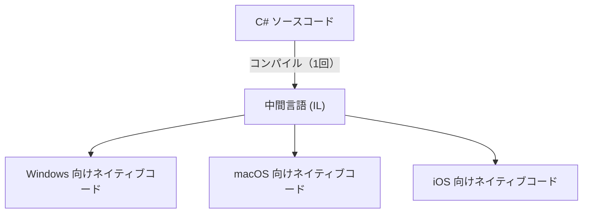
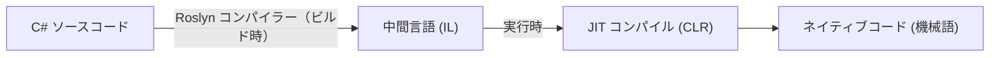
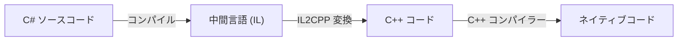
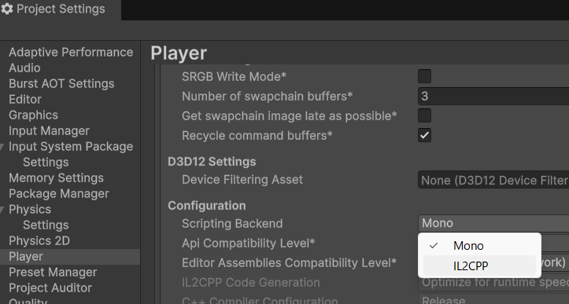

# 中間言語と JIT コンパイル

[C# と .NET の基本](/unity-csharp-learning/csharp/dotnet-overview/) の続きです。.NET の内部で何が起きているかを掘り下げます。

## 学習目標

- 中間言語（IL）が存在する理由を説明できる
- JIT コンパイルの仕組みと特徴を理解できる
- Unity における Mono と IL2CPP の違いを説明できる

## 前提知識

- [C# と .NET の基本](/unity-csharp-learning/csharp/dotnet-overview/) を読んでいること

---

## 1. なぜ「中間言語」が存在するのか

C# のコンパイル結果は、すぐに機械語になるわけではありません。一度**中間言語（IL: Intermediate Language）** と呼ばれる命令セットに変換されます。

中間言語が存在する主な理由は**プラットフォームの違いを吸収するため**です。Windows・macOS・Linux・iOS・Android はそれぞれ異なる機械語（CPU の命令セット）を持ちます。

C# を直接機械語にコンパイルすると、プラットフォームごとに別々のコンパイルが必要になります。中間言語を挟むことで、**C# の変換は1回**で済み、各プラットフォームへの機械語への変換はランタイム側に任せられます。

---

## 2. CLR と JIT コンパイル

**.NET ランタイムの中核は CLR（Common Language Runtime）** です。CLR が IL を受け取り、実行するハードウェアに合った機械語に変換して実行します。

この変換は**実行する直前**に行われます。これを **JIT（Just-In-Time）コンパイル**と呼びます。「ちょうど間に合うときに（実行直前に）コンパイルする」という意味です。

JIT の特徴：

| 項目 | 内容 |
|---|---|
| 変換タイミング | 実行時（プログラム起動後に変換） |
| メリット | 実行環境の CPU に合わせた最適化が可能・繰り返し実行されるコードは高速化される |
| デメリット | 初回起動時にコンパイルコストがかかる |

---

## 3. Unity の Mono と IL2CPP

Unity には2つの .NET 実行方式があります。

### Mono（JIT 方式）

Unity エディター上での実行や、スタンドアロン PC ビルドで使われます。CLR の代わりに **Mono** というオープンソースの .NET ランタイムを使いますが、JIT の仕組みは同じです。実行が速く始められるため、開発中の動作確認に適しています。

### IL2CPP（AOT 方式）

iOS・Android・ゲームコンソールなど多くのビルドターゲットで使われます。**IL2CPP（IL to C++）** は IL をいったん C++ コードに変換し、さらにネイティブコードにコンパイルします。

すべての変換を**ビルド時に事前に行う**方式を **AOT（Ahead-Of-Time）コンパイル**と呼びます。

JIT vs AOT の比較：

| 比較項目 | JIT（Mono） | AOT（IL2CPP） |
|---|---|---|
| 変換タイミング | 実行時 | ビルド時 |
| 起動速度 | やや遅い | 速い |
| 最高実行速度 | 動的な最適化が効く | コンパイル時最適化済み |
| ビルド時間 | 短い | 長い |
| 主な用途 | エディター・PC スタンドアロン | iOS・Android・コンソール |

この設定は Project Settings から Player タブを選択し、Configuration の「Scripting Backend」から変更できます。

---

## ワンポイントアドバイス

Unity のスクリプトが「エディターでは動くがビルドでは動かない」場合、IL2CPP の制約が原因であることがあります。IL2CPP はビルド時にコードを解析するため、**リフレクション**（実行時に型情報を動的に取得する機能）や一部のジェネリクスが制限される場合があります。本格的なプロジェクトでは早い段階でビルドテストを行う習慣をつけると良いでしょう。

---

## まとめ

- C# コードは一度**中間言語（IL）**にコンパイルされる（プラットフォーム非依存）
- **CLR** が JIT で IL を実行時に機械語に変換する
- **JIT**（実行時変換）vs **AOT**（事前変換）にはそれぞれトレードオフがある
- Unity の **Mono**（JIT）と **IL2CPP**（AOT）はこの違いに基づく

---

## 理解度チェック

1. 中間言語が存在する理由を説明してください。
2. JIT コンパイルの「Just-In-Time」とはどういう意味ですか？
3. iOS 向けに Unity でビルドする場合、Mono と IL2CPP のどちらが使われますか？その理由は？

解答を見る

1. プラットフォーム（OS・CPU）ごとの機械語の違いを吸収し、C# コードを一度書けばどこでも動かせるようにするため。
2. 「ちょうど間に合うときに（実行直前に）コンパイルする」という意味。
3. **IL2CPP**。iOS は JIT（実行時コンパイル）を OS レベルで禁止しているため、事前にすべてネイティブコードに変換する AOT が必須となる。

