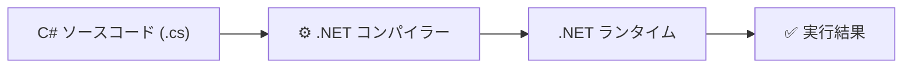

# C# と .NET の基本

## 学習目標

- ソースコードがどのようにして実行されるか大まかに説明できる
- C# と .NET の関係を理解できる
- Unity が .NET を使って動いていることを知っている

---

## 1. プログラムはどう動くか

コンピューターが直接実行できるのは**機械語（マシンコード）** と呼ばれる、0と1の命令だけです。

一方、私たちが書く C# は人間が読み書きしやすいように設計された言語です。このような言語を**高水準言語**と呼びます。

```csharp
Debug.Log("Hello, Unity!");
```

この C# のコードをそのままコンピューターは実行できません。機械語に変換する処理が必要です。この変換処理を**コンパイル（compile）**、変換を行うプログラムを**コンパイラー（compiler）**と呼びます。

---

## 2. .NET とは

**.NET（ドットネット）** は Microsoft が開発した、プログラムを実行するためのプラットフォームです。C# で書いたプログラムを動かすために必要な仕組みがまとまっています。

| 役割 | 説明 |
|---|---|
| **ランタイム** | コンパイルされたプログラムを実際に実行する環境 |
| **クラスライブラリ** | ファイル操作・ネットワーク・計算など、よく使う機能をあらかじめ用意したコード集 |

C# だけでなく、F# や VB.NET など複数の言語が .NET の上で動きます。

---

## 3. C# と .NET の関係

C# は「書く言語」、.NET は「動かす環境」です。両者はセットで使われます。



この図では「コンパイル → 実行」を1ステップのように描いていますが、実際には内部でさらに段階があります。詳しくは [中間言語と JIT コンパイル](/unity-csharp-learning/csharp/dotnet-internals/) で解説します。

---

## 4. Unity と .NET

Unity も内部で .NET を使っています。Unity スクリプトは C# で書き、.NET の仕組みで実行されます。

Unity はエディター上の実行と、ゲームのビルド（最終成果物）で**異なる実行方式**を採用しています。エディターでは素早く動作確認できるよう、ビルドでは配布先プラットフォームに最適な形式が選ばれます。

この仕組みの詳細は [中間言語と JIT コンパイル](/unity-csharp-learning/csharp/dotnet-internals/) で解説します。

---

## まとめ

- コンピューターが実行できるのは**機械語**のみ。C# は人間向けの高水準言語
- **コンパイル**によって C# を実行可能な形式に変換する
- **.NET** は C# を動かすためのランタイムとクラスライブラリのセット
- Unity も .NET を使って C# スクリプトを実行している

---

## 理解度チェック

1. 「コンパイル」とは何ですか？
2. .NET の主な役割を2つ挙げてください。
3. C# と .NET の関係を一言で表すとどうなりますか？

<details>
<summary>解答を見る</summary>

1. ソースコードをコンピューターが実行できる形式（機械語）に変換する処理。
2. **ランタイム**（プログラムを実行する環境）と**クラスライブラリ**（よく使う機能のコード集）。
3. C# は「書く言語」、.NET は「動かす環境」。

</details>

---

## 次のステップ

.NET の内部でどのようにコードが処理されるか、より深く知りたい場合は [中間言語と JIT コンパイル](/unity-csharp-learning/csharp/dotnet-internals/) へ。
