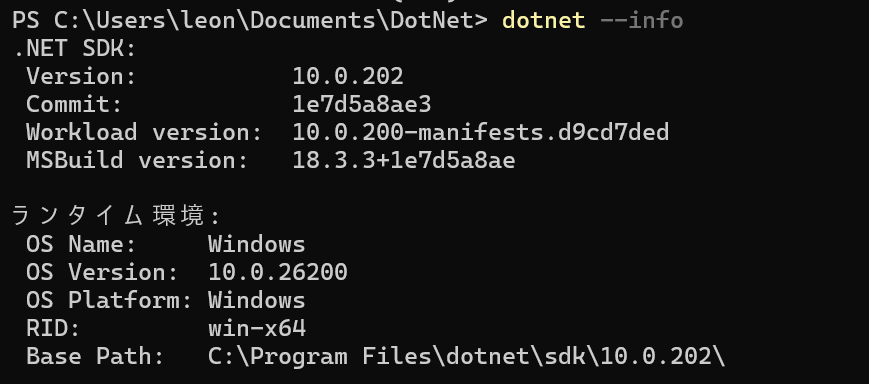

# .NET SDK と dotnet CLI

Visual Studio などの開発ツールがバックグラウンドで行っている「ビルド」や「実行」の仕組みをコマンドラインから直接体験します。GUI の裏側を知ることで、開発環境への理解が深まります。

> 📝 **執筆時点の参考バージョン**: .NET SDK 10.0.202（最新版）。このページでは特定バージョンに固定せず、基本的に最新版を使う前提で説明します。コマンドの出力やテンプレートの内容は、バージョンによって異なる場合があります。

## 学習目標

- .NET SDK とランタイムの違いを説明できる
- `dotnet` コマンドを使ってソリューションとプロジェクトを作成できる
- コマンドラインだけでビルドと実行ができる
- Visual Studio の操作がコマンドのどれに対応するかを説明できる

## 前提知識

- [C# と .NET の基本](/unity-csharp-learning/csharp/dotnet-overview/) を読んでいること

---

## 1. SDK とランタイムの違い

[C# と .NET の基本](/unity-csharp-learning/csharp/dotnet-overview/) で紹介した **.NET ランタイム**は「プログラムを実行する」ためのものでした。一方、**.NET SDK（Software Development Kit）** は「プログラムを開発する」ためのツール一式です。

| | ランタイム | SDK |
|---|---|---|
| 主な用途 | プログラムの実行 | プログラムの開発 |
| 含まれるもの | 実行エンジン（CLR）、基本ライブラリ | ランタイム ＋ コンパイラー ＋ CLI ＋ テンプレート |
| 必要な場面 | 作ったアプリを動かすだけなら十分 | コードを書いてビルドするときに必要 |

SDK をインストールすると、ランタイムも同梱されます。開発者は SDK だけインストールすれば OK です。

---

## 2. インストールの確認

### まず `dotnet` コマンドで確認する（推奨）

ターミナル（PowerShell またはコマンドプロンプト）を開き、次のコマンドを実行します。

```powershell
dotnet --info
```



`dotnet --info` が正常に実行でき、`SDKs installed`（または `インストール済み SDK`）にバージョンが表示されれば、SDK は利用可能です。

あわせて、短く確認したい場合は次も使えます。

```powershell
dotnet --version
```


バージョン番号（例: `10.0.202`）が表示されれば成功です。

### `dotnet` が見つからない場合

`dotnet` が見つからない、またはコマンドが失敗する場合は SDK をインストールします。

```powershell
winget install Microsoft.DotNet.SDK
```

インストール後、**ターミナルを再起動**してから再度 `dotnet --info` を実行してください。

### 補足: `winget list` は補助確認として使う

```powershell
winget list --id Microsoft.DotNet.SDK
```

`winget list` は「パッケージ管理上の登録情報」を確認するコマンドです。環境によっては古いバージョンが表示されたり、複数バージョンが並んだりして判断が難しいことがあります。実際に使える SDK の判定は、`dotnet --info` / `dotnet --version` を優先するのが確実です。

インストール済みの場合、`winget list` では以下のような出力が表示されます。

```
名前              ID                        バージョン ソース
-----------------------------------------------------------
Microsoft .NET SDK 10.0.202  Microsoft.DotNet.SDK  10.0.202  winget
```

---

## 3. ソリューションとプロジェクト

コードを書き始める前に、.NET 開発の2つの重要な概念を理解しましょう。

**プロジェクト**は「1つのビルド単位」です。コンソールアプリ・ライブラリ・Web アプリなど、出力物の種類ごとに1つのプロジェクトを作ります。プロジェクトの設定は `.csproj` ファイルに記述されます。

**ソリューション**は「複数プロジェクトをまとめる入れ物」です。関連するプロジェクトを1つのソリューション（`.sln` ファイル）で管理します。Visual Studio でプロジェクトを開くときは、この `.sln` ファイルを開きます。

```
HelloSln/               ← ソリューションフォルダー
├── HelloSln.sln        ← ソリューションファイル
└── HelloApp/           ← プロジェクトフォルダー
    ├── HelloApp.csproj ← プロジェクト設定ファイル
    └── Program.cs      ← コードファイル
```

---

## 4. ハンズオン: 作成からビルド・実行まで

順番にコマンドを実行していきましょう。

### ① 作業フォルダーに移動する

```powershell
cd C:\Users\YourName\Documents  # 任意の場所でOK
```

### ② ソリューションを作成する

```powershell
dotnet new sln -n HelloSln
cd HelloSln
```

`dotnet new sln` はソリューションファイルを作成します。`-n` オプションで名前を指定します。

### ③ コンソールアプリのプロジェクトを作成する

```powershell
dotnet new console -n HelloApp
```

`dotnet new console` はコンソールアプリのテンプレートからプロジェクトを作成します。`HelloApp` フォルダーが作られ、中に `HelloApp.csproj` と `Program.cs` が生成されます。

生成された `Program.cs` を見てみましょう。

```csharp
// Program.cs（生成直後）
Console.WriteLine("Hello, World!");
```

C# 9 以降で使えるトップレベルステートメントという書き方です。クラスや `Main` メソッドの宣言なしにコードが書けます。

### ④ ソリューションにプロジェクトを追加する

```powershell
dotnet sln add HelloApp/HelloApp.csproj
```

このコマンドで `.sln` ファイルに `.csproj` の参照が追加されます。これを行わないと、Visual Studio でソリューションを開いたときにプロジェクトが見えません。

### ⑤ ビルドする

```powershell
dotnet build
```

成功すると以下のような出力が表示されます。

```
ビルドが成功しました。
    0 個の警告
    0 エラー
```

`bin\Debug\net10.0\` フォルダーに実行ファイル（`.exe` または `.dll`）が生成されます。

### ⑥ 実行する

```powershell
dotnet run --project HelloApp
```

```
Hello, World!
```

`dotnet run` はビルドと実行を一度に行います。すでにビルド済みであっても、ソースが変更されていれば自動で再ビルドします。

---

## 5. 生成されたファイルの役割

| ファイル / フォルダー | 説明 |
|---|---|
| `HelloSln.sln` | ソリューション定義ファイル。プロジェクトの一覧を記録する |
| `HelloApp/HelloApp.csproj` | プロジェクト設定ファイル。対象フレームワーク・依存パッケージなどを記述する |
| `HelloApp/Program.cs` | コードファイル。実際に書くのはここ |
| `HelloApp/bin/` | ビルド成果物（実行ファイル）。git 管理対象外が推奨 |
| `HelloApp/obj/` | ビルド中間ファイル。git 管理対象外が推奨 |

`.csproj` ファイルの中身は XML 形式です。

```xml
<Project Sdk="Microsoft.NET.Sdk">

  <PropertyGroup>
    <OutputType>Exe</OutputType>
    <TargetFramework>net10.0</TargetFramework>
    <ImplicitUsings>enable</ImplicitUsings>
    <Nullable>enable</Nullable>
  </PropertyGroup>

</Project>
```

| 項目 | 説明 |
|---|---|
| `OutputType` | `Exe`（実行ファイル）または `Library`（DLL）|
| `TargetFramework` | 対象の .NET バージョン |
| `ImplicitUsings` | よく使う名前空間を自動でインポートする設定 |
| `Nullable` | null 参照型の警告を有効にする設定 |

---

## 6. Visual Studio との対応

ここまで実行したコマンドは、Visual Studio では以下の操作に相当します。

| dotnet CLI | Visual Studio の操作 |
|---|---|
| `dotnet new sln` | 「新しいプロジェクト」でプロジェクトを作成するとソリューションが自動生成される |
| `dotnet new console` | 「新しいプロジェクト」→「コンソール アプリ」を選択 |
| `dotnet sln add` | ソリューション エクスプローラーで右クリック→「追加」→「既存のプロジェクト」|
| `dotnet build` | ビルドメニュー →「ソリューションのビルド」（**Ctrl+Shift+B**）|
| `dotnet run` | デバッグメニュー →「デバッグなしで開始」（**Ctrl+F5**）|

Visual Studio は内部でこれらのコマンドを呼び出しています。GUI で行っている操作の正体は、すべてこのコマンド群です。

---

## まとめ

- **.NET SDK** は開発ツール一式。ランタイム ＋ コンパイラー ＋ CLI が含まれる
- SDK の利用可否は `dotnet --info` / `dotnet --version` で確認し、未導入なら `winget` でインストールする
- **ソリューション**（`.sln`）は複数プロジェクトの入れ物、**プロジェクト**（`.csproj`）は1つのビルド単位
- `dotnet new` でテンプレートからプロジェクトを作成できる
- `dotnet build` でビルド、`dotnet run` でビルド＆実行ができる
- Visual Studio はこれらのコマンドを GUI で包んでいる

---

## 理解度チェック

1. .NET SDK と .NET ランタイムの違いを説明してください。
2. 次のコマンドは何をしますか？ `dotnet sln add HelloApp/HelloApp.csproj`
3. `bin/` フォルダーと `obj/` フォルダーにはそれぞれ何が入っていますか？

<details markdown="1">
<summary>解答を見る</summary>

1. **ランタイム**はプログラムを実行するだけの環境。**SDK** はランタイムに加えてコンパイラー・CLI・テンプレートなど開発に必要なツール一式を含む。
2. ソリューションファイル（`.sln`）に指定したプロジェクト（`.csproj`）を追加・登録するコマンド。
3. `bin/` にはビルドされた実行ファイル（成果物）、`obj/` にはビルド中の一時ファイルが入る。どちらも git 管理対象外にするのが一般的。

</details>

---

## 次のステップ

次は C# の文法を学んでいきます。変数とデータ型（準備中）では、値を格納する「変数」の概念から始めます。
