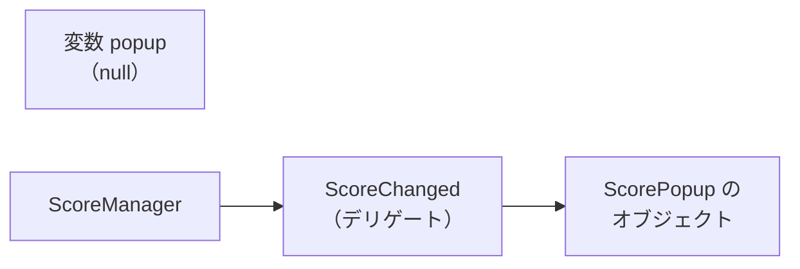

# イベント

`event` キーワードを使うと、デリゲートに制限を加えてクラスの外から安全に扱える**イベント**を定義できます。ゲームのスコア変化やボタンクリックなど「何かが起きた」ことを通知する設計に広く使われます。

## 学習目標

このページを読み終えると、以下のことができるようになります。

- `event` キーワードでイベントを宣言できる
- 発行者（Publisher）と購読者（Subscriber）の役割を説明できる
- 購読を解除しないと何が起きるかを説明できる
- `EventHandler` / `EventHandler<TEventArgs>` の標準パターンを使え、`sender` と `EventArgs` を使う理由を説明できる
- `event` とデリゲートの違いを説明できる

## 前提知識

- [マルチキャストデリゲート](/unity-csharp-learning/csharp/multicast-delegates/) を読んでいること

---

## 1. デリゲートだけだと何が問題か

マルチキャストデリゲートだけで通知を実装すると、**クラスの外から `=` で上書きしたり、直接呼び出したりできる**という問題があります。

```csharp
var btn = new Button();
btn.Clicked += OnClick;

// ❌ クリックされていないのに、クラス外から直接呼び出せてしまう
btn.Clicked?.Invoke();

// ❌ クラス外から = で全登録を上書きできてしまう
btn.Clicked = null;

btn.Click();   // 登録が消えたので、何も呼ばれない

void OnClick() => Console.WriteLine("クリック！");

delegate void Notify();

class Button
{
    public Notify? Clicked;   // デリゲートをそのまま公開

    public void Click() => Clicked?.Invoke();
}
```

```
クリック！
```

表示された `クリック！` は、`btn.Click()` ではなく、クラスの外から `btn.Clicked?.Invoke()` で直接呼び出した結果です。そのあとの `btn.Click()` では、`= null` で登録が消えているため、何も表示されません。

「クリックされたこと」を知らせるのは `Button` の役目のはずです。ところが、デリゲートをそのまま公開すると、外のコードがクリックを偽装したり、ほかの購読者の登録を消したりできてしまいます。`event` を使うと、この直接呼び出しと上書きをクラス外から禁止できます。

---

## 2. `event` キーワード

**書式：[event キーワード](https://learn.microsoft.com/dotnet/csharp/language-reference/keywords/event)**
```
アクセス修飾子 event デリゲート型 イベント名;
```

| 要素 | 説明 |
|---|---|
| `event` | デリゲートをイベントとして公開するキーワード |
| `デリゲート型` | イベントのシグネチャを表すデリゲート型 |
| `イベント名` | イベントの名前（慣習として動詞または動詞句） |

`event` を付けると、クラスの**外からは `+=` / `-=` だけ**が許可され、`=` による上書きと直接呼び出し（`Invoke()`）は禁止されます。

```csharp
var btn = new Button();
btn.Clicked += OnClick;

btn.Click();

void OnClick() => Console.WriteLine("クリック！");

delegate void Notify();

class Button
{
    public event Notify? Clicked;   // event を付ける

    public void Click() => Clicked?.Invoke();   // 内部からは Invoke() できる
}
```

```
クリック！
```

このように、`event` を付けてフィールドと同じ形で宣言したイベントを、**フィールドライクイベント**（field-like event）と呼びます。

---

## 3. 発行者と購読者

イベントを使う設計では、役割を 2 つに分けます。

| 役割 | 説明 |
|---|---|
| **発行者（Publisher）** | イベントを宣言し、適切なタイミングで発火（`Invoke`）するクラス |
| **購読者（Subscriber）** | イベントに `+=` でメソッドを登録し、通知を受け取るクラス |

```csharp
var manager = new ScoreManager();
var hud = new HUD();
hud.Subscribe(manager);

manager.AddScore(100);
manager.AddScore(50);

delegate void ScoreChangedHandler(int newScore);

// 発行者
class ScoreManager
{
    private int _score;

    public event ScoreChangedHandler? ScoreChanged;

    public void AddScore(int value)
    {
        _score += value;
        ScoreChanged?.Invoke(_score);
    }
}

// 購読者
class HUD
{
    public void Subscribe(ScoreManager manager)
    {
        manager.ScoreChanged += UpdateDisplay;
    }

    private void UpdateDisplay(int newScore)
    {
        Console.WriteLine($"スコア表示を更新: {newScore}");
    }
}
```

```
スコア表示を更新: 100
スコア表示を更新: 150
```

`ScoreManager` は、`HUD` のことを何も知りません。スコアが変わったら `ScoreChanged` を発火するだけで、誰が受け取って何をするのかは、購読者が決めます。効果音を鳴らすクラスやセーブするクラスを追加しても、`ScoreManager` を書き換えずに、`+=` で購読させるだけで済みます。

---

## 4. 購読を解除する

インスタンスメソッドを `+=` で登録すると、デリゲートは「どのメソッドか」に加えて「どのオブジェクトのメソッドか」も覚えます。つまり、発行者のイベントは、購読者のオブジェクトを参照し続けます。

そのため、購読者を使い終わっても、購読を解除しなければ、通知を受け取り続けます。次の例では、スコアを表示するポップアップを使い終わったつもりで、変数 `popup` に `null` を代入しています。

```csharp
var manager = new ScoreManager();
ScorePopup? popup = new ScorePopup();
popup.Show(manager);

manager.AddScore(100);

popup = null;   // ポップアップはもう使わないつもり
manager.AddScore(50);

delegate void ScoreChangedHandler(int newScore);

class ScoreManager
{
    private int _score;

    public event ScoreChangedHandler? ScoreChanged;

    public void AddScore(int value)
    {
        _score += value;
        ScoreChanged?.Invoke(_score);
    }
}

class ScorePopup
{
    public void Show(ScoreManager manager)
    {
        manager.ScoreChanged += OnScoreChanged;
    }

    private void OnScoreChanged(int newScore)
    {
        Console.WriteLine($"ポップアップ: {newScore} 点");
    }
}
```

```
ポップアップ: 100 点
ポップアップ: 150 点
```

`popup` を `null` にしても、2 回目の `AddScore` でポップアップの表示が実行されています。`ScorePopup` のオブジェクトは、`manager` の `ScoreChanged` から参照されているからです。



参照が残っているので、このオブジェクトは [ガベージコレクション](/unity-csharp-learning/csharp/garbage-collection/) でも回収されません。発行者が長く使われるオブジェクトで、購読者が次々に作られる場合、解除し忘れた購読者が溜まり続け、メモリも処理時間も無駄になります。

購読者を使い終わるときは、`-=` で購読を解除します。

```csharp
var manager = new ScoreManager();
var popup = new ScorePopup();
popup.Show(manager);

manager.AddScore(100);

popup.Hide(manager);   // 購読を解除する
manager.AddScore(50);

delegate void ScoreChangedHandler(int newScore);

class ScoreManager
{
    private int _score;

    public event ScoreChangedHandler? ScoreChanged;

    public void AddScore(int value)
    {
        _score += value;
        ScoreChanged?.Invoke(_score);
    }
}

class ScorePopup
{
    public void Show(ScoreManager manager)
    {
        manager.ScoreChanged += OnScoreChanged;
    }

    public void Hide(ScoreManager manager)
    {
        manager.ScoreChanged -= OnScoreChanged;
    }

    private void OnScoreChanged(int newScore)
    {
        Console.WriteLine($"ポップアップ: {newScore} 点");
    }
}
```

```
ポップアップ: 100 点
```

`+=` で購読したら、使い終わるときに `-=` で解除する、と組にして書くのが基本です。

---

## 5. `EventHandler` 標準パターン

.NET には `EventHandler` と `EventHandler<TEventArgs>` という組み込みのデリゲート型があります。自前でデリゲート型を宣言せずにイベントを定義できます。

**`EventHandler`** — イベントのデータを持たないイベント用のデリゲート型です（`sender` と `e` の 2 つのパラメータは持ちます）。

**書式：[EventHandler デリゲート](https://learn.microsoft.com/dotnet/api/system.eventhandler)**
```csharp
public delegate void EventHandler(object? sender, EventArgs e);
```

| パラメータ | 型 | 説明 |
|---|---|---|
| `sender` | `object?` | イベントを発行したオブジェクト（発行者自身を渡す慣習） |
| `e` | `EventArgs` | イベントのデータ。追加情報がなければ `EventArgs.Empty` を渡す |

**`EventHandler<TEventArgs>`** — イベント固有のデータを渡せる汎用版です。

**書式：[EventHandler\<TEventArgs\> デリゲート](https://learn.microsoft.com/dotnet/api/system.eventhandler-1)**
```csharp
public delegate void EventHandler<TEventArgs>(object? sender, TEventArgs e);
```

| パラメータ | 型 | 説明 |
|---|---|---|
| `sender` | `object?` | イベントを発行したオブジェクト |
| `e` | `TEventArgs` | イベントに付随するデータ |

自分でデリゲート型を宣言できるのに、なぜ .NET のイベントはこの形にそろえるのでしょうか。理由は 2 つあります。

- **誰が発行したかがわかる**：`sender` で発行者を受け取れるので、1 つのメソッドで複数の発行者のイベントを購読しても、どれから届いたのかを区別できる
- **データを増やしても購読者を書き換えずに済む**：イベントのデータは `EventArgs` を継承したクラスにまとめる。あとで渡す情報を増やすときは、そのクラスにプロパティを追加するだけで、デリゲート型のシグネチャは変わらない。そのため、既存の購読者のメソッドはそのまま使える

また、イベントの戻り値は `void` にします。[マルチキャストデリゲート](/unity-csharp-learning/csharp/multicast-delegates/) で学んだように、複数の購読者がいると、戻り値は最後のメソッドのものしか受け取れないからです。

イベントデータを渡すには、`EventArgs` を継承したクラスを作ります。次の例では、2 体の敵のイベントを、1 つの `BattleLog` が購読し、`sender` でどちらの敵かを区別しています。

```csharp
var slime = new Enemy("Slime");
var dragon = new Enemy("Dragon");
var log = new BattleLog();
log.Subscribe(slime);
log.Subscribe(dragon);

slime.TakeDamage(30);
dragon.TakeDamage(80);

// イベントデータクラス（EventArgs を継承）
class DamageEventArgs : EventArgs
{
    public int Amount { get; }
    public DamageEventArgs(int amount) { Amount = amount; }
}

// 発行者
class Enemy
{
    public string Name { get; }

    public event EventHandler<DamageEventArgs>? Damaged;

    public Enemy(string name) { Name = name; }

    public void TakeDamage(int amount)
    {
        Console.WriteLine($"{Name} が {amount} ダメージを受けた");
        Damaged?.Invoke(this, new DamageEventArgs(amount));   // sender に自分自身を渡す
    }
}

// 購読者
class BattleLog
{
    public void Subscribe(Enemy enemy)
    {
        enemy.Damaged += OnDamaged;
    }

    private void OnDamaged(object? sender, DamageEventArgs e)
    {
        if (sender is Enemy enemy)   // どの敵から届いたかを sender で調べる
        {
            Console.WriteLine($"ログ: {enemy.Name} にダメージ {e.Amount}");
        }
    }
}
```

```
Slime が 30 ダメージを受けた
ログ: Slime にダメージ 30
Dragon が 80 ダメージを受けた
ログ: Dragon にダメージ 80
```

`sender` の型は `object?` なので、発行者のメンバーを使うには、[型変換と型チェック](/unity-csharp-learning/csharp/type-casting/) で学んだ `is` で型を調べます。

---

## 6. `add` / `remove` アクセサー

フィールドライクイベントでは、コンパイラーが、デリゲートを入れる `private` なフィールドと、`+=` / `-=` で呼ばれる処理を自動生成します。クラスの外から `+=` / `-=` しか使えないのは、外に公開されているのがこの処理だけだからです。これを**自分で制御したい**場合は、`add` / `remove` アクセサーを明示的に定義できます。プロパティの `get` / `set` に相当するしくみです。

**書式：[add](https://learn.microsoft.com/dotnet/csharp/language-reference/keywords/add) / [remove](https://learn.microsoft.com/dotnet/csharp/language-reference/keywords/remove) アクセサーつきイベント**
```
アクセス修飾子 event デリゲート型 イベント名
{
    add    { /* += されたときの処理 */ }
    remove { /* -= されたときの処理 */ }
}
```

| 要素 | 説明 |
|---|---|
| `add` | `+=` によってハンドラが登録されるときに実行されるブロック |
| `remove` | `-=` によってハンドラが解除されるときに実行されるブロック |
| `value` | 登録・解除しようとしているデリゲート（暗黙的に使える変数） |

アクセサーを定義した場合、バッキングフィールド（デリゲートを保持する変数）は自分で用意します。

```csharp
var btn = new Button();
btn.Clicked += OnClick;    // add が呼ばれる
btn.Click();
btn.Clicked -= OnClick;    // remove が呼ばれる

void OnClick() => Console.WriteLine("クリック！");

class Button
{
    // バッキングフィールドを自分で管理する
    private Action? _clickedHandlers;

    public event Action Clicked
    {
        add
        {
            Console.WriteLine("ハンドラを登録しました");
            _clickedHandlers += value;
        }
        remove
        {
            Console.WriteLine("ハンドラを解除しました");
            _clickedHandlers -= value;
        }
    }

    public void Click() => _clickedHandlers?.Invoke();
}
```

```
ハンドラを登録しました
クリック！
ハンドラを解除しました
```

> 💡 **ポイント**: ほとんどの場合、フィールドライクイベント（`public event Action Clicked;`）で十分です。`add` / `remove` を明示的に書くのは、登録時にログを出したい、登録されたデリゲートを別のオブジェクトに預けたい、といった特殊な要件がある場合に限られます。

---

## よくあるミス

```csharp
// ❌ NG: クラス外から event を = で上書きしようとするとコンパイルエラー（CS0070）
btn.Clicked = OnClick;

// ✅ OK: += で購読する
btn.Clicked += OnClick;
```

---

## まとめ

- `event` キーワードを付けると、クラス外からの `=` 上書きと直接呼び出しが禁止される
- 発行者がイベントを宣言して発火し、購読者が `+=` で受け取る（発行者/購読者パターン）。発行者は購読者を知らずに済む
- 発行者は購読者のオブジェクトを参照し続けるので、使い終わった購読者は `-=` で解除する
- `EventHandler<TEventArgs>` を使うと自前のデリゲート型を定義せずにイベントを実装できる。`sender` で発行者を区別でき、データは `EventArgs` の派生クラスにまとめるので、あとから増やしても購読者を書き換えずに済む
- `add` / `remove` アクセサーで、`+=` / `-=` されたときの処理を自分で書ける

---

## 理解度チェック

以下の問いに答えられるか確認しましょう。

1. `event` を付けないデリゲートと付けたイベントの違いを 2 つ挙げてください。
2. 次のコードでコンパイルエラーになるのはどの行ですか？理由も答えてください。

   ```csharp
   var c = new Counter();
   c.Incremented += ShowMessage;   // A
   c.Incremented = null;           // B
   c.Incremented?.Invoke();        // C

   void ShowMessage() => Console.WriteLine("増えた");

   delegate void Notify();

   class Counter
   {
       public event Notify? Incremented;
       public void Increment() => Incremented?.Invoke();
   }
   ```

3. （応用）`string` 型のメッセージをイベントデータとして渡す `MessageEventArgs` クラスと、それを使う `event EventHandler<MessageEventArgs>? MessageSent` を持つクラスを定義してください。

<details markdown="1">
<summary>解答を見る</summary>

1. ① `event` を付けると `=` による上書きがクラス外から禁止される。② `event` を付けると `Invoke()` の直接呼び出しがクラス外から禁止される。

2. B 行（`c.Incremented = null;`）と C 行（`c.Incremented?.Invoke();`）がコンパイルエラー（CS0070）になります。クラス外から `=` 代入と `Invoke()` は許可されないためです。A 行の `+=` は、クラス外からも使えます。

3. 使う側のコードも含めると、次のように書けます。

   ```csharp
   var messenger = new Messenger();
   messenger.MessageSent += OnMessageSent;
   messenger.Send("こんにちは");

   void OnMessageSent(object? sender, MessageEventArgs e)
   {
       Console.WriteLine($"受信: {e.Message}");
   }

   class MessageEventArgs : EventArgs
   {
       public string Message { get; }
       public MessageEventArgs(string message) { Message = message; }
   }

   class Messenger
   {
       public event EventHandler<MessageEventArgs>? MessageSent;

       public void Send(string message)
       {
           MessageSent?.Invoke(this, new MessageEventArgs(message));
       }
   }
   ```

   ```
   受信: こんにちは
   ```

</details>

---

## 次のステップ

[ラムダ式](/unity-csharp-learning/csharp/lambda/) では、メソッドをその場に短く書ける `=>` 構文を学びます。
