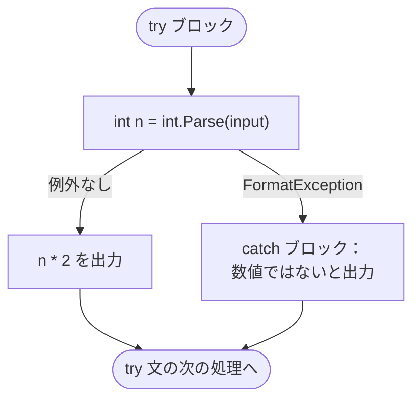
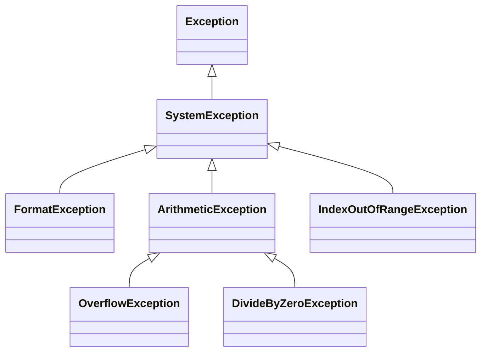
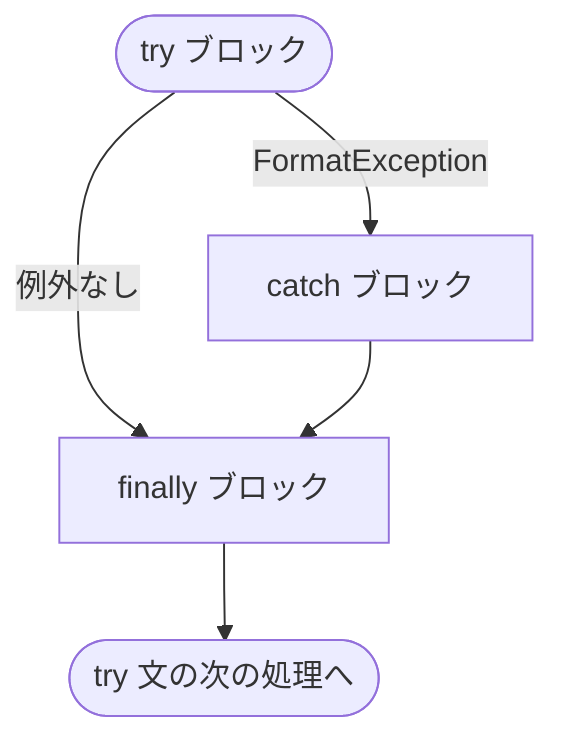

# 例外の基本

**例外**（exception）は、メソッドが処理を続けられなくなったことを呼び出し元に知らせる仕組みです。`try` / `catch` で例外を受け止めると、プログラムを止めずに処理を続けられます。

## 学習目標

このページを読み終えると、以下のことができるようになります。

- 例外が発生したときにプログラムがどうなるかを説明できる
- `try` / `catch` で例外を受け止め、処理を続けられる
- 例外の型の継承関係をもとに、`catch` を複数書くときの順序を判断できる
- `finally` で、例外の有無にかかわらず実行する処理を書ける

## 前提知識

- [継承](/unity-csharp-learning/csharp/inheritance/) を読んでいること
- [ローカル関数](/unity-csharp-learning/csharp/local-functions/) を読んでいること

---

## 1. 例外とは

[int.Parse メソッド](https://learn.microsoft.com/dotnet/api/system.int32.parse) は、文字列を `int` に変換します。数値として読めない文字列を渡すとどうなるでしょうか。

```csharp
string input = "abc";
int n = int.Parse(input);
Console.WriteLine(n * 2);
```

実行すると、次のように表示されてプログラムが終了します（2 行目以降は省略）。

```
Unhandled exception. System.FormatException: The input string 'abc' was not in a correct format.
```

`"abc"` は数値に変換できないので、`int.Parse` は戻り値を返せません。そこで `int.Parse` は、戻り値を返す代わりに「形式が正しくない」ことを表す **例外を投げ**（throw）ます。例外を受け止める処理がどこにもないと、プログラムはその場で終了します。そのため、3 行目の `Console.WriteLine` は実行されません。

表示の 1 行目にある `System.FormatException` は、投げられた例外の型です。例外はクラスのインスタンス（オブジェクト）で、型の名前が「何が起きたか」を表しています。

| 例外の型 | 発生する場面の例 |
|---|---|
| `FormatException` | 文字列の形式が正しくない（`int.Parse("abc")`） |
| `OverflowException` | 値が型の範囲を超えた（`int.Parse("99999999999")`） |
| `DivideByZeroException` | 整数を 0 で割った |
| `IndexOutOfRangeException` | 配列の範囲外の要素にアクセスした |

---

## 2. try / catch で例外を受け止める

例外が発生する可能性のある処理を `try` ブロックで囲み、発生したときの処理を `catch` ブロックに書きます。

**書式：[try-catch 文](https://learn.microsoft.com/dotnet/csharp/language-reference/statements/exception-handling-statements#the-try-catch-statement)**
```
try
{
    // 例外が発生する可能性のある処理
}
catch (例外の型 変数名)
{
    // 例外が発生したときの処理
}
```

| 要素 | 説明 |
|---|---|
| `try` ブロック | 例外が発生する可能性のある処理を書く |
| `例外の型` | 受け止める例外の型。この型（とその派生クラス）の例外だけが `catch` ブロックに渡される |
| `変数名` | 受け止めた例外オブジェクトを参照する変数。使わないときは省略して `catch (例外の型)` と書ける |
| `catch` ブロック | 例外が発生したときに実行する処理を書く |

次のコードは、配列の文字列を 1 つずつ `int` に変換して 2 倍します。

```csharp
string[] inputs = { "12", "abc", "7" };

foreach (string input in inputs)
{
    try
    {
        int n = int.Parse(input);
        Console.WriteLine($"{input} → {n * 2}");
    }
    catch (FormatException)
    {
        Console.WriteLine($"{input} は数値ではありません");
    }
}

Console.WriteLine("終了");
```

```
12 → 24
abc は数値ではありません
7 → 14
終了
```

`"abc"` のとき、`int.Parse` で例外が発生した時点で `try` ブロックの残り（`Console.WriteLine($"{input} → {n * 2}")`）は飛ばされ、`catch` ブロックに移ります。`catch` ブロックを実行し終えると `try` 文全体が終わり、次の処理（ここでは `foreach` の次の要素）に進みます。



> 💡 **ポイント**: 例外が発生した行より後ろの `try` ブロックの処理は、実行されません。「途中まで実行された」状態で `catch` に移ることを意識してください。

### 例外オブジェクトを使う

`catch` で変数名を書くと、受け止めた例外オブジェクトを使えます。次のコードは、例外の型の名前を表示します。

```csharp
string[] inputs = { "abc", "99999999999" };

foreach (string input in inputs)
{
    try
    {
        int n = int.Parse(input);
        Console.WriteLine(n);
    }
    catch (Exception e)
    {
        Console.WriteLine($"{input}: {e.GetType().Name}");
    }
}
```

```
abc: FormatException
99999999999: OverflowException
```

`catch (Exception e)` は、`FormatException` も `OverflowException` も受け止めています。その理由は、次の節で説明する例外の型の継承関係にあります。

例外オブジェクトには、エラーの内容を説明する `Message` プロパティもあります。ただし、その文章は .NET のバージョンなどによって変わることがあるため、プログラムの処理の分岐には使わず、ログの表示などに使います。

---

## 3. 例外の型と継承

例外の型はすべて [Exception クラス](https://learn.microsoft.com/dotnet/api/system.exception) を基底クラスとする派生クラスです。次の図は、このページで扱う例外の型の継承関係です。



`catch (型)` は、その型の例外だけでなく、その型の **派生クラスの例外も** 受け止めます。派生クラスのインスタンスは基底クラスの変数に代入できる（アップキャスト）のと同じ考え方です。前の節の `catch (Exception e)` は、すべての例外の基底クラスを指定したので、どちらの例外も受け止めました。

`OverflowException` と `DivideByZeroException` は、どちらも算術演算のエラーを表す `ArithmeticException` の派生クラスです。`catch (ArithmeticException)` と書けば、両方をまとめて受け止められます。

```csharp
int[] divisors = { 2, 0 };

foreach (int d in divisors)
{
    try
    {
        Console.WriteLine(10 / d);
    }
    catch (ArithmeticException e)
    {
        Console.WriteLine($"計算できません: {e.GetType().Name}");
    }
}
```

```
5
計算できません: DivideByZeroException
```

### catch を複数書く

例外の型ごとに処理を変えたいときは、`catch` ブロックを複数並べます。例外が発生すると、上から順に型を調べ、最初に一致した `catch` ブロックだけが実行されます。

```csharp
string[] inputs = { "12", "abc", "99999999999" };

foreach (string input in inputs)
{
    try
    {
        int n = int.Parse(input);
        Console.WriteLine($"{input} → {n}");
    }
    catch (FormatException)
    {
        Console.WriteLine($"{input}: 数値の形式ではありません");
    }
    catch (OverflowException)
    {
        Console.WriteLine($"{input}: int の範囲を超えています");
    }
}
```

```
12 → 12
abc: 数値の形式ではありません
99999999999: int の範囲を超えています
```

`catch` を複数書くときは、**派生クラスを先に、基底クラスを後に** 書きます。基底クラスを先に書くと、後ろの `catch` には例外が届かなくなるため、コンパイルエラーになります。

```csharp
// ❌ NG: Exception が先にあると、FormatException の catch には例外が届かない
// try
// {
//     int n = int.Parse("abc");
// }
// catch (Exception)
// {
//     Console.WriteLine("エラー");
// }
// catch (FormatException)  // CS0160
// {
//     Console.WriteLine("形式エラー");
// }
```

---

## 4. finally で必ず実行する

`finally` ブロックに書いた処理は、`try` ブロックで例外が発生してもしなくても、`try` 文を抜けるときに必ず実行されます。開いたファイルを閉じる、といった後片付けに使います。

**書式：[try-catch-finally 文](https://learn.microsoft.com/dotnet/csharp/language-reference/statements/exception-handling-statements#the-try-catch-finally-statement)**
```
try
{
    // 例外が発生する可能性のある処理
}
catch (例外の型 変数名)
{
    // 例外が発生したときの処理
}
finally
{
    // 例外の有無にかかわらず、最後に必ず実行する処理
}
```

```csharp
string[] inputs = { "12", "abc" };

foreach (string input in inputs)
{
    Console.WriteLine($"開始: {input}");
    try
    {
        int n = int.Parse(input);
        Console.WriteLine($"結果: {n * 2}");
    }
    catch (FormatException)
    {
        Console.WriteLine("数値ではありません");
    }
    finally
    {
        Console.WriteLine("後片付け");
    }
}
```

```
開始: 12
結果: 24
後片付け
開始: abc
数値ではありません
後片付け
```



### return しても finally は実行される

`try` ブロックや `catch` ブロックの中で `return` しても、メソッドを抜ける前に `finally` ブロックが実行されます。

```csharp
Console.WriteLine(ParseOrZero("5"));
Console.WriteLine(ParseOrZero("x"));

int ParseOrZero(string input)
{
    try
    {
        return int.Parse(input);
    }
    catch (FormatException)
    {
        return 0;
    }
    finally
    {
        Console.WriteLine($"ParseOrZero({input}) を終了");
    }
}
```

```
ParseOrZero(5) を終了
5
ParseOrZero(x) を終了
0
```

戻り値が呼び出し元の `Console.WriteLine` に渡るより先に、`finally` の出力が表示されています。

### catch のない try / finally

`catch` を書かずに、`try` と `finally` だけを組み合わせることもできます。この場合、例外はその場では受け止められませんが、`finally` を実行してから、呼び出し元へ伝わります。

**書式：[try-finally 文](https://learn.microsoft.com/dotnet/csharp/language-reference/statements/exception-handling-statements#the-try-finally-statement)**
```
try
{
    // 処理
}
finally
{
    // 例外の有無にかかわらず、最後に必ず実行する処理
}
```

```csharp
try
{
    Work();
}
catch (FormatException)
{
    Console.WriteLine("呼び出し元で FormatException を受け止めた");
}

void Work()
{
    try
    {
        Console.WriteLine("処理開始");
        int n = int.Parse("abc");
        Console.WriteLine($"処理完了: {n}");
    }
    finally
    {
        Console.WriteLine("後片付け");
    }
}
```

```
処理開始
後片付け
呼び出し元で FormatException を受け止めた
```

`Work` の中では例外を受け止めていませんが、後片付けは確実に実行されています。例外を「どこで受け止めるか」と「後片付けをどこでするか」は、別々に決められるということです。例外が呼び出し元へ伝わる仕組みは、次のページで詳しく扱います。

---

## よくあるミス

### すべての例外を受け止めて何もしない

```csharp
// ❌ NG: どんな例外が発生しても、黙って無視する
// try
// {
//     ...
// }
// catch (Exception)
// {
// }
```

`catch (Exception)` はすべての例外を受け止めるので、想定していなかったバグ（変数が `null` のままだった、配列の範囲を間違えた、など）まで隠してしまいます。プログラムは止まりませんが、正しく動いていない原因を探す手がかりがなくなります。`catch` には、**その場で対処できる例外の型だけ** を書きましょう。

### 例外を使わなくても判定できる場面で try / catch を使う

ユーザーの入力のように、数値ではない文字列が来ることが最初からわかっている場合は、[int.TryParse メソッド](https://learn.microsoft.com/dotnet/api/system.int32.tryparse) を使うと、例外を使わずに判定できます。

```csharp
// ✅ OK: 変換できたかどうかを bool で受け取る
string[] inputs = { "12", "abc" };

foreach (string input in inputs)
{
    if (int.TryParse(input, out int n))
    {
        Console.WriteLine($"{input} → {n * 2}");
    }
    else
    {
        Console.WriteLine($"{input} は数値ではありません");
    }
}
```

```
12 → 24
abc は数値ではありません
```

`int.TryParse` は、変換できたかどうかを `bool` で返し、変換した値を `out` パラメータで返します。例外は、「通常は起きない、想定外の状況」を知らせるための仕組みです。`if` で判定できることは、`if` で判定したほうがコードの意図が読み取りやすくなります。

---

## まとめ

- 例外は、メソッドが処理を続けられなくなったことを知らせる仕組みで、例外の型が「何が起きたか」を表す
- 例外を受け止める処理がないと、プログラムはその場で終了する
- `try` ブロックで例外が発生すると、残りの処理は飛ばされ、型が一致する `catch` ブロックに移る
- `catch (型)` は、その型の派生クラスの例外も受け止める。複数書くときは派生クラスを先に書く
- `finally` ブロックは、例外の有無や `return` にかかわらず、`try` 文を抜けるときに必ず実行される
- `if` や `TryParse` で判定できることに、例外を使わない

---

## 理解度チェック

1. `try` ブロックの途中で例外が発生すると、その行より後ろの `try` ブロックの処理はどうなりますか？
2. 次のコードを実行すると何が出力されますか？

   ```csharp
   string[] inputs = { "3", "x", "0" };

   foreach (string input in inputs)
   {
       try
       {
           int n = int.Parse(input);
           Console.WriteLine(12 / n);
       }
       catch (FormatException)
       {
           Console.WriteLine("F");
       }
       catch (DivideByZeroException)
       {
           Console.WriteLine("D");
       }
       finally
       {
           Console.WriteLine("-");
       }
   }
   ```

3. 次のコードはコンパイルエラーになります。理由を説明し、正しく直してください。

   ```csharp
   try
   {
       int n = int.Parse("abc");
   }
   catch (ArithmeticException)
   {
       Console.WriteLine("計算エラー");
   }
   catch (OverflowException)
   {
       Console.WriteLine("範囲外");
   }
   ```

<details markdown="1">
<summary>解答を見る</summary>

1. 実行されずに飛ばされ、型が一致する `catch` ブロックに移ります。
2. 次のように出力されます。`"x"` は `FormatException`、`"0"` は `12 / 0` で `DivideByZeroException` になり、どの場合も最後に `finally` が実行されます。

   ```
   4
   -
   F
   -
   D
   -
   ```

3. `OverflowException` は `ArithmeticException` の派生クラスなので、先にある `catch (ArithmeticException)` がすべて受け止めてしまい、`catch (OverflowException)` には例外が届きません（CS0160）。派生クラスの `catch` を先に書きます。

   ```csharp
   try
   {
       int n = int.Parse("abc");
   }
   catch (OverflowException)
   {
       Console.WriteLine("範囲外");
   }
   catch (ArithmeticException)
   {
       Console.WriteLine("計算エラー");
   }
   ```

   なお、`"abc"` で発生するのは `FormatException` なので、直したコードを実行しても、どちらの `catch` でも受け止められず、プログラムは終了します。

</details>

---

## 次のステップ

[例外を投げる](/unity-csharp-learning/csharp/throwing-exceptions/) では、`throw` で自分から例外を投げる方法と、例外が呼び出し元へ伝わる仕組みを学びます。
