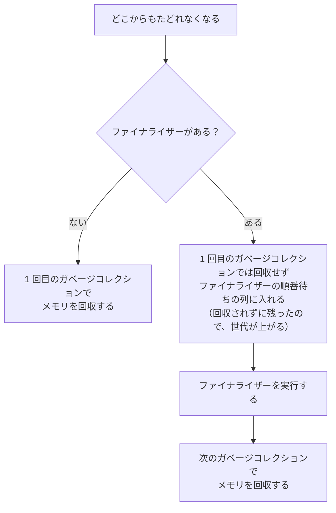

# ファイナライザー（補足）

**ファイナライザー**（finalizer）は、ガベージコレクターがオブジェクトを回収する前に呼び出す、特別なメソッドです。書き方はコンストラクターと対になっていますが、いつ呼ばれるかはプログラムから決められません。このページでは、ファイナライザーの書き方と、ファイナライザーを後片付けに使えない理由を学びます。

## 学習目標

このページを読み終えると、以下のことができるようになります。

- `~クラス名()` でファイナライザーを定義できる
- ファイナライザーがいつ呼ばれるかは決まらず、プログラムの終了時にも呼ばれないことを説明できる
- ファイナライザーを持つオブジェクトは、メモリの回収が遅れることを説明できる

## 前提知識

- [コンストラクター](/unity-csharp-learning/csharp/constructors/) を読んでいること
- [ガベージコレクション](/unity-csharp-learning/csharp/garbage-collection/) を読んでいること

---

## 1. ファイナライザーの書き方

[ファイナライザー](https://learn.microsoft.com/dotnet/csharp/programming-guide/classes-and-structs/finalizers) は、クラス名の前に `~` を付けて定義します。

**書式：[ファイナライザーの定義](https://learn.microsoft.com/dotnet/csharp/programming-guide/classes-and-structs/finalizers)**
```
~クラス名()
{
    // 回収される前に行う処理
}
```

コンストラクターと比べると、次のような違いがあります。

| | コンストラクター | ファイナライザー |
|---|---|---|
| 呼び出されるとき | `new` でインスタンスを作るとき | ガベージコレクターがオブジェクトを回収する前 |
| 名前 | クラス名 | `~` + クラス名 |
| アクセス修飾子 | 書く | 書けない |
| パラメータ | 書ける | 書けない |
| 1 つのクラスに定義できる数 | パラメータを変えて複数 | 1 つだけ |
| 自分で呼び出す | `new` で呼び出す | 呼び出せない |

ファイナライザーが呼ばれたことを確かめます。[ガベージコレクション](/unity-csharp-learning/csharp/garbage-collection/) と同じように、`Create` の中で作ったオブジェクトを、`Create` から戻った後にどこからもたどれない状態にして、`GC.Collect()` を呼びます。

```csharp
Create();
Console.WriteLine("GC.Collect を呼ぶ");
GC.Collect();
GC.WaitForPendingFinalizers();
Console.WriteLine("終了");

void Create()
{
    A a = new A("a");
}

class A
{
    private string _name;

    public A(string name)
    {
        _name = name;
        Console.WriteLine($"{_name} を作る");
    }

    ~A()
    {
        Console.WriteLine($"{_name} のファイナライザー");
    }
}
```

```
a を作る
GC.Collect を呼ぶ
a のファイナライザー
終了
```

`GC.Collect()` の後に、`A` のファイナライザーが呼ばれています。

ガベージコレクターは、回収しようとしたオブジェクトにファイナライザーがあると、その場では呼ばずに、ファイナライザーを呼ぶ順番待ちの列に入れます。ファイナライザーは、プログラムのメソッドとは別に、順番に実行されます。[GC.WaitForPendingFinalizers メソッド](https://learn.microsoft.com/dotnet/api/system.gc.waitforpendingfinalizers) は、列に入っているファイナライザーがすべて実行されるまで待ちます。ここでは、`終了` より前にファイナライザーの出力を表示させるために呼んでいます。

---

## 2. ファイナライザーが呼ばれるタイミングは決まらない

ファイナライザーは、ガベージコレクションが実行されたときに呼ばれます。[ガベージコレクション](/unity-csharp-learning/csharp/garbage-collection/) で学んだように、ガベージコレクションがいつ実行されるかは、プログラムからは決められません。そのため、ファイナライザーがいつ呼ばれるかも決まりません。

前の節のコードから、`GC.Collect()` と `GC.WaitForPendingFinalizers()` を取り除いて実行します。

```csharp
Create();
Console.WriteLine("終了");

void Create()
{
    A a = new A("a");
}

class A
{
    private string _name;

    public A(string name)
    {
        _name = name;
        Console.WriteLine($"{_name} を作る");
    }

    ~A()
    {
        Console.WriteLine($"{_name} のファイナライザー");
    }
}
```

```
a を作る
終了
```

`a のファイナライザー` は、最後まで表示されません。このプログラムでは、終了するまでに一度もガベージコレクションが実行されなかったからです。.NET は、プログラムが終了するときに、残っているオブジェクトのファイナライザーを呼びません。

つまり、ファイナライザーは、いつ呼ばれるかわからないうえに、一度も呼ばれないことがあります。

---

## 3. ファイナライザーを持つオブジェクトは回収が遅れる

ファイナライザーを持つオブジェクトは、メモリが回収されるまでに、ガベージコレクションが 2 回必要です。



ファイナライザーを実行するには、オブジェクトのフィールドが使える状態で残っていなければなりません。そのため、1 回目のガベージコレクションでは、メモリを回収せずに残しておきます。

ファイナライザーのないクラス `Plain` と、ファイナライザーのあるクラス `WithFinalizer` で比べます。`WeakReference<T>` のコンストラクターの 2 番目の引数に `true` を渡すと、ファイナライザーが実行された後も、メモリが回収されるまでオブジェクトを追跡します。

**書式：[WeakReference\<T\> コンストラクター](https://learn.microsoft.com/dotnet/api/system.weakreference-1.-ctor#system-weakreference-1-ctor(-0-system-boolean))**
```csharp
public WeakReference(T target, bool trackResurrection);
```

| パラメータ | 説明 |
|---|---|
| `target` | 追跡するオブジェクト |
| `trackResurrection` | `true` なら、ファイナライザーが実行された後も、メモリが回収されるまで追跡する。`false` なら、ファイナライザーを実行する列に入れられた時点で追跡をやめる |

```csharp
WeakReference<Plain> plainRef = CreatePlain();
WeakReference<WithFinalizer> finRef = CreateWithFinalizer();

GC.Collect();
GC.WaitForPendingFinalizers();
Console.WriteLine($"1 回目: Plain={IsAlive(plainRef)}, WithFinalizer={IsAlive(finRef)}");

GC.Collect();
Console.WriteLine($"2 回目: Plain={IsAlive(plainRef)}, WithFinalizer={IsAlive(finRef)}");

WeakReference<Plain> CreatePlain()
{
    return new WeakReference<Plain>(new Plain(), true);
}

WeakReference<WithFinalizer> CreateWithFinalizer()
{
    return new WeakReference<WithFinalizer>(new WithFinalizer(), true);
}

bool IsAlive<T>(WeakReference<T> weak) where T : class
{
    return weak.TryGetTarget(out _);
}

class Plain
{
}

class WithFinalizer
{
    ~WithFinalizer()
    {
        Console.WriteLine($"WithFinalizer のファイナライザー（第 {GC.GetGeneration(this)} 世代）");
    }
}
```

```
WithFinalizer のファイナライザー（第 1 世代）
1 回目: Plain=False, WithFinalizer=True
2 回目: Plain=False, WithFinalizer=False
```

`Plain` のオブジェクトは、1 回目のガベージコレクションで回収されています。`WithFinalizer` のオブジェクトは、1 回目ではファイナライザーが呼ばれただけで、メモリは残っています。メモリが回収されたのは、2 回目のガベージコレクションです。

ファイナライザーの中で調べた世代は `1` です。1 回目のガベージコレクションで回収されずに残ったので、第 0 世代から第 1 世代に移っています。このコードでは、2 回目の `GC.Collect()` がすべての世代を調べるので、すぐに回収されました。ふだんのガベージコレクションは第 0 世代だけを調べるので、実際には、回収までにもっと時間がかかることがあります。

`IsAlive` は、`Plain` と `WithFinalizer` のどちらの `WeakReference<T>` も受け取れるように、ジェネリックメソッドにしています。`WeakReference<T>` の `T` には参照型しか指定できないので、`where T : class` の制約を付けています（[型制約](/unity-csharp-learning/csharp/generic-constraints/)）。

---

## 4. ファイナライザーは後片付けには使えない

ここまでの内容をまとめると、ファイナライザーには次の性質があります。

- いつ呼ばれるかは決まらず、プログラムの終了時にも呼ばれない
- ファイナライザーを持つだけで、オブジェクトのメモリの回収が遅れる

開いたファイルを閉じるような後片付けを、ファイナライザーに任せることはできません。[ガベージコレクション](/unity-csharp-learning/csharp/garbage-collection/) で学んだとおり、リソースは使い終わった時点でプログラムから閉じる必要があります。その仕組みは、[IDisposable と using](/unity-csharp-learning/csharp/dispose-using/) で学びます。

ファイナライザーが役に立つのは、`Dispose` を呼び忘れたときに、リソースが閉じられないまま残るのを防ぐ「保険」としてです。その書き方は、[Dispose パターン（補足）](/unity-csharp-learning/csharp/dispose-pattern/) で学びます。

---

## よくあるミス

### ファイナライザーを書けない場所に書く

```csharp
// ❌ NG: アクセス修飾子は書けない
// class A
// {
//     public ~A()  // CS0106
//     {
//     }
// }

// ❌ NG: 構造体にはファイナライザーを書けない
// struct S
// {
//     ~S()  // CS0575
//     {
//     }
// }

// ❌ NG: ファイナライザーは自分で呼び出せない
// A a = new A();
// a.Finalize();  // CS0122
```

ファイナライザーは、ガベージコレクターがヒープのオブジェクトを回収するときに呼ぶものです。構造体はヒープに置かれたオブジェクトとして回収されるとは限らないので、ファイナライザーを持てません。また、ファイナライザーを呼ぶのはガベージコレクターだけで、プログラムから呼び出すことはできません。

---

## ワンポイントアドバイス

### ファイナライザーの正体は Finalize メソッドのオーバーライド

コンパイラーは、`~A()` を、`object` クラスの [Finalize メソッド](https://learn.microsoft.com/dotnet/api/system.object.finalize) をオーバーライドしたメソッドに置き換えます。ガベージコレクターは、この `Finalize` を呼び出します。上の NG 例で `a.Finalize()` が CS0122 になるのは、`Finalize` が `protected` だからです。

`Finalize` を `override` で直接オーバーライドすることはできず（CS0249）、ファイナライザーの書き方を使う必要があります。コンパイラーが作る `Finalize` は、最後に基底クラスの `Finalize` を呼ぶように作られるので、継承したクラスのファイナライザーは、派生クラスから基底クラスの順に呼ばれます。

---

## まとめ

- ファイナライザーは `~クラス名()` で定義する。アクセス修飾子とパラメータは書けず、1 つのクラスに 1 つだけ定義できる
- ファイナライザーは、ガベージコレクターがオブジェクトを回収する前に呼ぶ。プログラムからは呼び出せない
- ファイナライザーがいつ呼ばれるかは決まらず、プログラムの終了時にも呼ばれない
- ファイナライザーを持つオブジェクトは、メモリが回収されるまでにガベージコレクションが 2 回必要になる
- ファイナライザーは後片付けには使えない。後片付けは `Dispose` で行い、ファイナライザーは呼び忘れに備える保険として使う

---

## 理解度チェック

1. ファイナライザーとコンストラクターの、呼び出されるタイミングの違いを説明してください。
2. 次のコードを実行すると何が出力されますか？

   ```csharp
   Create();
   Console.WriteLine("Create から戻った");
   GC.Collect();
   GC.WaitForPendingFinalizers();
   Console.WriteLine("終了");

   void Create()
   {
       Item item = new Item();
       Console.WriteLine("Item を作った");
   }

   class Item
   {
       ~Item()
       {
           Console.WriteLine("Item のファイナライザー");
       }
   }
   ```

3. ファイルを開いたクラスで、ファイルを閉じる処理をファイナライザーだけに書いてはいけないのはなぜですか？

<details markdown="1">
<summary>解答を見る</summary>

1. コンストラクターは、`new` でインスタンスを作るときに必ず呼ばれます。ファイナライザーは、ガベージコレクターがオブジェクトを回収する前に呼ばれるので、いつ呼ばれるかは決まらず、一度も呼ばれないこともあります。
2. 次のように出力されます。`Create` から戻ると `item` が指すオブジェクトはどこからもたどれなくなり、`GC.Collect()` で回収の対象になります。ファイナライザーは `GC.WaitForPendingFinalizers()` が終わるまでに実行されます。

   ```
   Item を作った
   Create から戻った
   Item のファイナライザー
   終了
   ```

3. ファイナライザーがいつ呼ばれるかは決まらず、プログラムの終了時にも呼ばれないので、ファイルが開いたままになることがあるからです。ファイルは、使い終わった時点で `Dispose` で閉じます。

</details>

---

## 次のステップ

[構造体](/unity-csharp-learning/csharp/structs/) では、ヒープにオブジェクトを作らずに、値型としてデータをまとめる方法を学びます。
