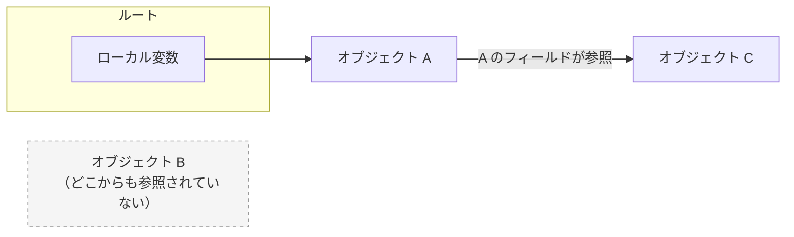
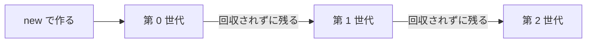

# ガベージコレクション

`new` で作ったオブジェクトは、使い終わっても自分で消す必要がありません。どこからも使われなくなったオブジェクトは、.NET の **ガベージコレクター**（garbage collector、GC）が自動的に見つけて、そのメモリを回収します。この仕組みを **ガベージコレクション** といいます。

## 学習目標

このページを読み終えると、以下のことができるようになります。

- ガベージコレクターが、どのオブジェクトを回収するかを説明できる
- オブジェクトがいつ回収されるかは、プログラムからは決められないことを説明できる
- 世代の仕組みと、ガベージコレクターが回収するのはメモリだけであることを説明できる

## 前提知識

- [値型と参照型](/unity-csharp-learning/csharp/value-reference-types/) を読んでいること
- [ジェネリクスの基本](/unity-csharp-learning/csharp/generics/) を読んでいること

---

## 1. 使われなくなったオブジェクトの回収

[値型と参照型](/unity-csharp-learning/csharp/value-reference-types/) で学んだように、`new` で作ったオブジェクトはヒープに置かれます。オブジェクトを作り続ければ、ヒープのメモリはいつか足りなくなります。そこで、使われなくなったオブジェクトのメモリを回収して、次のオブジェクトに使えるようにする必要があります。

C# には、オブジェクトを消す命令はありません。ガベージコレクターが、まだ使われているオブジェクトを調べ、それ以外のオブジェクトを回収します。

「まだ使われている」かどうかは、参照をたどって行き着けるかどうかで決まります。ガベージコレクターは、実行中のメソッドのローカル変数や `static` フィールドなど、プログラムから直接使える場所（**ルート**）から出発して、参照をたどります。たどり着けたオブジェクトは使われているとみなし、たどり着けなかったオブジェクトを回収します。



この図では、`A` はローカル変数から、`C` は `A` のフィールドからたどれるので、回収されません。どこからもたどれない `B` が回収の対象になります。

---

## 2. 回収されたことを確かめる

オブジェクトが回収されたかどうかは、[WeakReference\<T\> クラス](https://learn.microsoft.com/dotnet/api/system.weakreference-1) で確かめられます。`WeakReference<T>` は、オブジェクトを参照していても、そのオブジェクトの回収を妨げない、特別な参照です。[TryGetTarget メソッド](https://learn.microsoft.com/dotnet/api/system.weakreference-1.trygettarget) は、オブジェクトがまだ回収されていなければ `true` を返し、`out` パラメータでそのオブジェクトを返します。

**書式：[WeakReference\<T\>.TryGetTarget メソッド](https://learn.microsoft.com/dotnet/api/system.weakreference-1.trygettarget)**
```csharp
public bool TryGetTarget(out T target);
```

ふつう、ガベージコレクションはいつ実行されるかわかりません。ここでは確かめるために、[GC.Collect メソッド](https://learn.microsoft.com/dotnet/api/system.gc.collect) で、ガベージコレクションをその場で実行します。

```csharp
Box kept = new Box();
kept.Value = 1;
WeakReference<Box> keptRef = new WeakReference<Box>(kept);
WeakReference<Box> droppedRef = Create();

GC.Collect();

Console.WriteLine($"kept: {IsAlive(keptRef)}");
Console.WriteLine($"dropped: {IsAlive(droppedRef)}");
Console.WriteLine(kept.Value);

WeakReference<Box> Create()
{
    Box box = new Box();
    return new WeakReference<Box>(box);
}

bool IsAlive(WeakReference<Box> weak)
{
    return weak.TryGetTarget(out _);
}

class Box
{
    public int Value;
}
```

```
kept: True
dropped: False
1
```

`kept` が指すオブジェクトは、ローカル変数 `kept` からたどれるので、回収されていません。`Create` の中で作ったオブジェクトは、`Create` から戻った時点で、どの変数からもたどれなくなります。`WeakReference<Box>` からの参照は回収を妨げないので、`GC.Collect()` で回収されています。

最後の `Console.WriteLine(kept.Value)` は、`kept` をこの行まで使い続けるために書いています。変数が最後に使われた後は、その変数が指すオブジェクトも回収の対象になることがあるからです。

---

## 3. 回収のタイミングは決まらない

ガベージコレクションは、新しいオブジェクトを作るときにヒープの空きが少なくなっているなど、.NET が必要と判断したときに実行されます。プログラムから見ると、いつ実行されるかはわかりません。

[GC.CollectionCount メソッド](https://learn.microsoft.com/dotnet/api/system.gc.collectioncount) で、ガベージコレクションが実行された回数を調べられます。次のコードは、オブジェクトを 1000 万回作り、その間に何回実行されたかを表示します。

```csharp
Box[] holder = new Box[1];
int before = GC.CollectionCount(0);

for (int i = 0; i < 10_000_000; i++)
{
    holder[0] = new Box();
}

int after = GC.CollectionCount(0);
Console.WriteLine($"GC が実行された回数: {after - before}");

class Box
{
}
```

実行結果の例です。回数は環境によって変わります。

```
GC が実行された回数: 12
```

`GC.Collect()` を呼んでいないのに、ガベージコレクションが何回も実行されています。`holder[0]` に新しいオブジェクトを入れるたびに、それまで入っていたオブジェクトはどこからもたどれなくなり、回収の対象になります。`GC.CollectionCount` の引数の `0` は、次の節で説明する世代の番号です。

回収のタイミングが決まらないので、「このオブジェクトが使われなくなったら、すぐに何かをする」という処理は、ガベージコレクションには任せられません。

---

## 4. 世代

プログラムが作るオブジェクトの多くは、作られてからすぐに使われなくなります。一方で、長く使われ続けるオブジェクトは、その後も使われ続けることが多いです。ガベージコレクターはこの性質を利用して、オブジェクトを **世代**（generation）に分けて管理しています。

- 作られたばかりのオブジェクトは、第 0 世代になる
- ガベージコレクションで回収されずに残ったオブジェクトは、1 つ上の世代に移る
- 第 2 世代がいちばん上の世代



ガベージコレクターは、ふだんは第 0 世代だけを調べます。作られたばかりのオブジェクトだけを調べれば、少ない手間で多くのオブジェクトを回収できるからです。第 1 世代や第 2 世代まで調べる回収は、それより少ない頻度で行われます。

オブジェクトの世代は、[GC.GetGeneration メソッド](https://learn.microsoft.com/dotnet/api/system.gc.getgeneration) で調べられます。

```csharp
Box box = new Box();
Console.WriteLine(GC.GetGeneration(box));
GC.Collect();
Console.WriteLine(GC.GetGeneration(box));
GC.Collect();
Console.WriteLine(GC.GetGeneration(box));
GC.Collect();
Console.WriteLine(GC.GetGeneration(box));

class Box
{
}
```

```
0
1
2
2
```

`box` が指すオブジェクトは、ガベージコレクションで回収されずに残るたびに、1 つ上の世代に移っています。第 2 世代より上の世代はないので、3 回目の後も `2` のままです。

---

## 5. ガベージコレクターが回収するのはメモリだけ

ガベージコレクターが回収するのは、ヒープのメモリだけです。プログラムは、メモリのほかにも、開いたファイルやネットワークの接続など、使い終わったら閉じなければならない **リソース** を使います。

リソースを使うオブジェクトが回収されるまで、リソースを閉じるのを待つことはできません。回収のタイミングが決まらないので、ファイルが開いたままになり、ほかのプログラムがそのファイルを使えない状態が続くことがあるからです。リソースは、使い終わった時点でプログラムから閉じる必要があります。そのための仕組みは、[IDisposable と using](/unity-csharp-learning/csharp/dispose-using/) で学びます。

オブジェクトが回収される前に呼ばれるメソッド（ファイナライザー）を書くこともできますが、回収のタイミングが決まらないことは変わらないので、後片付けには使えません。[ファイナライザー（補足）](/unity-csharp-learning/csharp/finalizers/) で、実際に動かして確かめます。

---

## ワンポイントアドバイス

### GC.Collect はふつう呼ばない

このページでは、回収を確かめるために `GC.Collect()` を呼びましたが、ふつうのプログラムでは呼びません。ガベージコレクターは、ヒープの使われ方を見て、実行するタイミングを自分で調整しています。`GC.Collect()` を呼ぶと、その調整を乱すうえに、回収されずに残ったオブジェクトが必要以上に上の世代に移ってしまいます。

### オブジェクトを作る数を減らす

ガベージコレクションの実行中は、プログラムの処理が短い時間止まることがあります。オブジェクトをたくさん作るほど、ガベージコレクションの回数が増えます。繰り返し実行される処理の中で、使い捨てのオブジェクトを大量に作らないようにすると、この影響を小さくできます。[構造体](/unity-csharp-learning/csharp/structs/) は、そのための手段の 1 つです。

---

## まとめ

- ガベージコレクターは、ルート（ローカル変数や `static` フィールドなど）から参照をたどれないオブジェクトを回収する
- ガベージコレクションがいつ実行されるかは、プログラムからは決められない
- オブジェクトは世代に分けて管理され、回収されずに残るたびに上の世代に移る
- ガベージコレクターが回収するのはメモリだけ。ファイルなどのリソースは、使い終わった時点でプログラムから閉じる

---

## 理解度チェック

1. ガベージコレクターは、どのようなオブジェクトを回収しますか？
2. 次のコードを実行すると何が出力されますか？

   ```csharp
   Box a = new Box();
   Box? b = new Box();
   a.Next = b;

   WeakReference<Box> weakB = new WeakReference<Box>(b);
   b = null;

   GC.Collect();
   Console.WriteLine(weakB.TryGetTarget(out _));
   Console.WriteLine(a.Next != null);

   class Box
   {
       public Box? Next;
   }
   ```

3. ファイルを開いたオブジェクトの後片付けを、ガベージコレクションに任せてはいけないのはなぜですか？

<details markdown="1">
<summary>解答を見る</summary>

1. ルート（実行中のメソッドのローカル変数や `static` フィールドなど）から参照をたどっても、たどり着けないオブジェクトです。
2. 次のように出力されます。`b` に `null` を入れても、`b` が指していたオブジェクトは `a.Next` からたどれるので、回収されません。

   ```
   True
   True
   ```

3. ガベージコレクションがいつ実行されるかは決まらないので、回収されるまでファイルが開いたままになることがあるからです。

</details>

---

## 次のステップ

[ファイナライザー（補足）](/unity-csharp-learning/csharp/finalizers/) では、オブジェクトが回収される前に呼ばれるファイナライザーの書き方と、ファイナライザーを後片付けに使えない理由を学びます。
