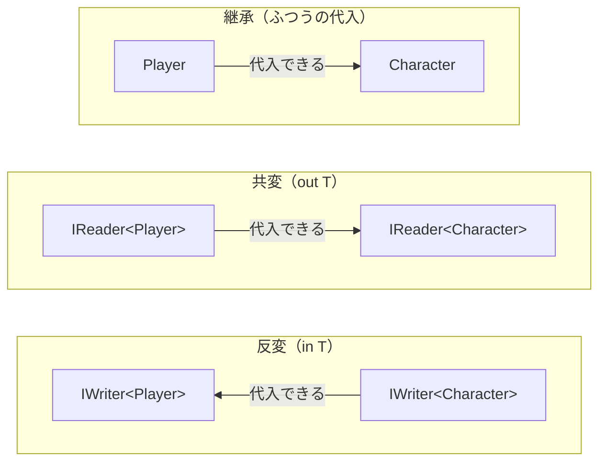

# 共変・反変

`Player` が `Character` の派生クラスでも、`Container<Player>` を `Container<Character>` の変数に代入することはできません。しかし、インターフェイスの型パラメータに `out` や `in` を付けると、型引数の継承関係に応じた代入ができるようになります。この性質を **変性**（variance）といいます。このページでは、ジェネリック型が既定で代入できない理由と、`out` による **共変**（covariance）、`in` による **反変**（contravariance）を学びます。

## 学習目標

このページを読み終えると、以下のことができるようになります。

- ジェネリック型が既定で不変（invariant）である理由を説明できる
- `out T` で共変のインターフェイスを定義し、派生クラス側から基底クラス側へ代入できる
- `in T` で反変のインターフェイスを定義し、基底クラス側から派生クラス側へ代入できる
- `out` と `in` で `T` を書ける位置が制限される理由を説明できる

## 前提知識

- [型制約](/unity-csharp-learning/csharp/generic-constraints/) を読んでいること
- [継承](/unity-csharp-learning/csharp/inheritance/) を読んでいること

---

## 1. ジェネリック型は不変

[継承](/unity-csharp-learning/csharp/inheritance/) で学んだように、`Player` のインスタンスは `Character` の変数に代入できます。しかし、[ジェネリクスの基本](/unity-csharp-learning/csharp/generics/) の `Container<T>` では、`Container<Player>` を `Container<Character>` の変数に代入できません。

```csharp
Character character = new Player();  // ✅ OK

Container<Player> players = new Container<Player>(new Player());

// ❌ NG: Container<Player> は Container<Character> の変数に代入できない（CS0029）
// Container<Character> characters = players;

class Container<T>
{
    private T _value;

    public Container(T value) { _value = value; }

    public void Set(T value) { _value = value; }
    public T Get() { return _value; }
}

class Character
{
    public string Name { get; set; } = "";
}

class Player : Character
{
}

class Enemy : Character
{
}
```

型引数に継承関係があっても、ジェネリック型どうしは代入できません。この性質を **不変**（invariant）といいます。

もし代入できたとすると、次のように、`Player` だけが入るはずの `players` に `Enemy` を入れられてしまいます。

```csharp
// もし代入できたとすると……
// Container<Character> characters = players;
// characters.Set(new Enemy());   // Container<Character> の Set は Character を受け取るので、Enemy も渡せる
// Player p = players.Get();      // players の中身は Enemy なのに、Player として取り出してしまう
```

`characters` と `players` は同じインスタンスを指しているので、`characters.Set` で入れた `Enemy` が `players.Get` で `Player` として出てきます。これでは型の安全性が守れません。問題は、`Container<T>` が `T` を受け取る `Set` と、`T` を返す `Get` の両方を持っていることです。

---

## 2. 共変 — out T

`T` を返すだけで、受け取ることがないインターフェイスなら、1 節の問題は起きません。型パラメータに `out` を付けると、そのインターフェイスは **共変** になります。

**書式：[out（ジェネリック修飾子）](https://learn.microsoft.com/dotnet/csharp/language-reference/keywords/out-generic-modifier)**
```
interface インターフェイス名<out T>
{
    T メソッド名();  // T は戻り値など、出力の位置にだけ書ける
}
```

| 要素 | 説明 |
|---|---|
| `out T` | `T` を出力の位置（戻り値、`get` だけのプロパティ）にだけ使うことを宣言する。共変になる |

[ジェネリクスの基本](/unity-csharp-learning/csharp/generics/) で作った `IReader<T>` に `out` を付けます。

```csharp
IReader<Player> playerReader = new FixedReader<Player>(new Player { Name = "Alice" });

// ✅ OK: out T なので、IReader<Player> を IReader<Character> の変数に代入できる
IReader<Character> characterReader = playerReader;

Character c = characterReader.Read();
Console.WriteLine(c.Name);

interface IReader<out T>
{
    T Read();
}

class FixedReader<T> : IReader<T>
{
    private T _value;

    public FixedReader(T value) { _value = value; }

    public T Read() { return _value; }
}

class Character
{
    public string Name { get; set; } = "";
}

class Player : Character
{
}
```

```
Alice
```

`characterReader.Read()` が実際に返すのは `Player` です。`Player` は `Character` の派生クラスなので、`Character` として受け取っても問題ありません。`IReader<T>` には `T` を受け取るメンバーがないので、`Enemy` を入れられてしまうこともありません。

代入の方向は、`Player` → `Character` という型引数の継承関係と **同じ向き** です。

---

## 3. 反変 — in T

逆に、`T` を受け取るだけで、返すことがないインターフェイスを考えます。型パラメータに `in` を付けると、そのインターフェイスは **反変** になります。

**書式：[in（ジェネリック修飾子）](https://learn.microsoft.com/dotnet/csharp/language-reference/keywords/in-generic-modifier)**
```
interface インターフェイス名<in T>
{
    void メソッド名(T パラメータ名);  // T はパラメータなど、入力の位置にだけ書ける
}
```

| 要素 | 説明 |
|---|---|
| `in T` | `T` を入力の位置（パラメータ）にだけ使うことを宣言する。反変になる |

値を受け取って表示する `IWriter<T>` を定義し、`Character` を表示する `CharacterPrinter` で実装します。

```csharp
IWriter<Character> characterWriter = new CharacterPrinter();

// ✅ OK: in T なので、IWriter<Character> を IWriter<Player> の変数に代入できる
IWriter<Player> playerWriter = characterWriter;

playerWriter.Write(new Player { Name = "Alice" });

interface IWriter<in T>
{
    void Write(T value);
}

class CharacterPrinter : IWriter<Character>
{
    public void Write(Character value)
    {
        Console.WriteLine($"キャラクター: {value.Name}");
    }
}

class Character
{
    public string Name { get; set; } = "";
}

class Player : Character
{
}
```

```
キャラクター: Alice
```

`playerWriter.Write` に渡せるのは `Player` だけです。実際に処理する `CharacterPrinter.Write` は `Character` を受け取れるので、`Player` を渡しても問題ありません。「`Character` を処理できるなら、`Character` の一種である `Player` も処理できる」ということです。

代入の方向は、`Character` → `Player` という、型引数の継承関係と **逆の向き** です。

---

## 4. 代入の向きのまとめ

型引数の継承関係と、ジェネリックインターフェイスの代入の向きを並べると、次のようになります。



| 変性 | 書き方 | 代入の向き | `T` を書ける位置 |
|---|---|---|---|
| 不変 | `<T>` | 代入できない | 入力・出力のどちらにも書ける |
| 共変 | `<out T>` | 継承と同じ向き（`IReader<Player>` → `IReader<Character>`） | 出力（戻り値など）だけ |
| 反変 | `<in T>` | 継承と逆の向き（`IWriter<Character>` → `IWriter<Player>`） | 入力（パラメータ）だけ |

`T` を書ける位置が制限されるのは、1 節のように、代入した後で型の安全性が崩れる操作をコンパイラーが禁止するためです。

---

## 5. 変性を付けられるもの

`out` と `in` を付けられるのは、インターフェイスと、[デリゲートの基本](/unity-csharp-learning/csharp/delegates/) で学ぶデリゲートの型パラメータだけです。クラスの型パラメータに付けると、コンパイルエラー（CS1960）になります。`Container<T>` のようなクラスは、いつも不変です。

また、変性による代入ができるのは、型引数が参照型のときだけです。`IReader<int>` は、`int` が `object` の派生型でも、`IReader<object>` の変数に代入できません（CS0266）。`int` を `object` として扱うには、[ボクシングとアンボクシング](/unity-csharp-learning/csharp/boxing/) で学ぶ変換が必要で、参照をそのまま渡すだけでは済まないからです。

.NET にも、変性を持つインターフェイスがあります。

| インターフェイス | 変性 | 学ぶページ |
|---|---|---|
| `IEnumerable<out T>` | 共変 | [イテレーターと yield return](/unity-csharp-learning/csharp/iterators/) |
| `IComparer<in T>` | 反変 | — |

---

## よくあるミス

### out T を入力の位置に書く

`out` を付けた型パラメータを、パラメータの型に使うとコンパイルエラーになります。`in` を付けた型パラメータを戻り値の型に使った場合も同じです。

```csharp
interface IStorage<out T>
{
    T Get();

    // ❌ NG: out T はパラメータの型に使えない（CS1961）
    // void Set(T value);
}
```

`Set` があると、1 節の `Container<T>` と同じく、`IStorage<Character>` として `Enemy` を入れられてしまいます。読み書きの両方が必要なら、`out` を付けずに不変のままにします。`set` のあるプロパティ `T Value { get; set; }` も、入力と出力の両方になるので、`out` や `in` の型パラメータには使えません。

---

## ワンポイントアドバイス

### 配列は共変

配列は、ジェネリック型と違って共変です。`Player[]` を `Character[]` の変数に代入できます。しかし、1 節で見た問題は、配列ではコンパイル時ではなく実行時に見つかります。

```csharp
Character[] characters = new Player[2];
Console.WriteLine("代入できた");

characters[0] = new Player();
Console.WriteLine("Player を入れた");

characters[1] = new Enemy();
Console.WriteLine("Enemy を入れた");

class Character
{
}

class Player : Character
{
}

class Enemy : Character
{
}
```

実行すると、次のように表示されてプログラムが終了します（例外の後に続く行は省略）。

```
代入できた
Player を入れた
Unhandled exception. System.ArrayTypeMismatchException: Attempted to access an element as a type incompatible with the array.
```

`characters` の実体は `Player` の配列なので、`Enemy` を入れようとした時点で [ArrayTypeMismatchException](https://learn.microsoft.com/dotnet/api/system.arraytypemismatchexception) が発生します。ジェネリック型が既定で不変になっているのは、この種類の誤りをコンパイル時に防ぐためです。

---

## まとめ

- ジェネリック型は既定で不変。型引数に継承関係があっても代入できない
- `T` を受け取るメンバーと返すメンバーの両方があると、代入を許したときに型の安全性が崩れる
- `out T`（共変）: `T` を出力の位置にだけ使える。`IReader<Player>` → `IReader<Character>` と、継承と同じ向きに代入できる
- `in T`（反変）: `T` を入力の位置にだけ使える。`IWriter<Character>` → `IWriter<Player>` と、継承と逆の向きに代入できる
- `out` / `in` を付けられるのはインターフェイスとデリゲートだけ。変性による代入は、型引数が参照型のときだけできる

---

## 理解度チェック

1. `IReader<out T>` に `void Write(T value)` を追加するとどうなりますか？
2. 次のうち、コンパイルが通る代入はどれですか？（`Player` は `Character` の派生クラスで、`IReader<out T>`・`IWriter<in T>` は本文と同じものとします）

   ```csharp
   IReader<Character> a = new FixedReader<Player>(new Player());      // (A)
   IReader<Player> b = new FixedReader<Character>(new Character());   // (B)
   IWriter<Player> c = new CharacterPrinter();                        // (C)
   Container<Character> d = new Container<Player>(new Player());      // (D)
   ```

3. （応用）`IReader<Player>` を `IReader<Character>` に代入しても安全な理由を、`IReader<T>` のメンバーに着目して説明してください。

<details markdown="1">
<summary>解答を見る</summary>

1. コンパイルエラー（CS1961）になります。`out T` は出力の位置にしか使えないので、パラメータの型として `T` を使う `Write` は書けません。
2. (A) と (C) です。(A) は共変なので、継承と同じ向きの `Player` → `Character` に代入できます。(C) の `CharacterPrinter` は `IWriter<Character>` を実装していて、反変なので `IWriter<Player>` に代入できます。(B) は共変と逆の向きなので代入できません。(D) の `Container<T>` はクラスなので不変で、代入できません。
3. `IReader<T>` のメンバーは `T` を返す `Read` だけで、`T` を受け取るメンバーがありません。`IReader<Character>` として使っても、できるのは値を読むことだけで、読んだ値は実際には `Player` なので `Character` として扱って問題ありません。`Enemy` などを入れる手段がないので、型の安全性が崩れません。

</details>

---

## 次のステップ

[List\<T\>](/unity-csharp-learning/csharp/list/) では、要素の数を後から変えられるコレクションを学びます。ジェネリクスを使う代表的な例です。
