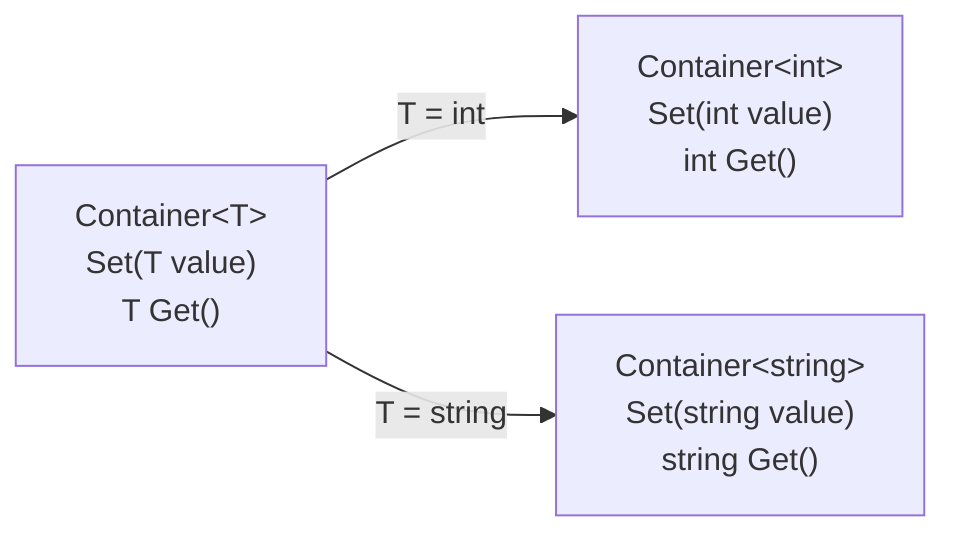

# ジェネリクスの基本

同じ処理を `int` でも `string` でも使いたいとき、`object` 型で書くと、型の誤りを実行するまで見つけられません。**ジェネリクス**（generics）は、クラスなどの定義の中で使う型を、使う側で指定できるようにする仕組みです。このページでは、ジェネリッククラスの定義と使い方、型パラメータと型引数、ジェネリックインターフェイスを学びます。

## 学習目標

このページを読み終えると、以下のことができるようになります。

- `object` を使って汎用化したクラスの問題点を説明できる
- 型パラメータ `<T>` を使ってジェネリッククラスを定義し、型引数を指定して使える
- 型引数ごとに別の型として扱われることを説明できる
- 複数の型パラメータを持つクラスと、ジェネリックインターフェイスを書ける

## 前提知識

- [継承](/unity-csharp-learning/csharp/inheritance/) を読んでいること
- [型変換と型チェック](/unity-csharp-learning/csharp/type-casting/) を読んでいること
- [インターフェイスの明示的実装](/unity-csharp-learning/csharp/explicit-interface/) を読んでいること

---

## 1. object 型による汎用化の問題

値を 1 つしまっておく入れ物のクラス `Container` を作るとします。`int` も `string` も入れられるようにしたいので、[継承](/unity-csharp-learning/csharp/inheritance/) で学んだ、すべての型の基底クラスである `object` 型でフィールドを宣言します。

```csharp
Container box = new Container(42);

int n = (int)box.Get();
Console.WriteLine(n);

string s = (string)box.Get();
Console.WriteLine(s);

class Container
{
    private object _value;

    public Container(object value) { _value = value; }

    public void Set(object value) { _value = value; }
    public object Get() { return _value; }
}
```

実行すると、次のように表示されてプログラムが終了します（例外の後に続く行は省略）。

```
42
Unhandled exception. System.InvalidCastException: Unable to cast object of type 'System.Int32' to type 'System.String'.
```

`Get` の戻り値は `object` 型なので、`int` や `string` として使うには [型変換と型チェック](/unity-csharp-learning/csharp/type-casting/) で学んだキャストが必要です。コンパイラーには `box` の中身が何の型なのかわからないので、`(string)` のキャストもそのままコンパイルが通ります。誤りに気付けるのは、実行して [InvalidCastException](https://learn.microsoft.com/dotnet/api/system.invalidcastexception) が発生したときです。

`object` による汎用化には、次の問題があります。

- 取り出すたびにキャストが必要になる
- 型の誤りを、コンパイルのときではなく、実行したときにしか見つけられない
- `int` などの値を `object` に入れると、[ボクシングとアンボクシング](/unity-csharp-learning/csharp/boxing/) で学ぶ余分な処理が起きる

---

## 2. ジェネリッククラスを定義する

クラス名の後に `<T>` のように型の名前を書くと、その名前をクラスの中で型として使えます。この `T` を **型パラメータ**（type parameter）といい、型パラメータを持つクラスを **ジェネリッククラス**（generic class）といいます。

**書式：[ジェネリッククラスの定義](https://learn.microsoft.com/dotnet/csharp/programming-guide/generics/generic-classes)**
```
class クラス名<型パラメータ>
{
    // 型パラメータを、フィールドやパラメータ、戻り値の型として使う
}
```

| 要素 | 説明 |
|---|---|
| `<型パラメータ>` | クラスを使う側が決める型に付ける名前。1 つだけなら `T` と名付けるのが慣例 |

1 節の `Container` を、型パラメータ `T` を使って書き直します。

```csharp
class Container<T>
{
    private T _value;

    public Container(T value) { _value = value; }

    public void Set(T value) { _value = value; }
    public T Get() { return _value; }
}
```

`object` と書いていたところが `T` に変わっています。`T` は「使う側が決める、まだ決まっていない型」の名前です。`int` や `string` と同じように、フィールド・パラメータ・戻り値の型として書けます。

---

## 3. 型引数を指定して使う

ジェネリッククラスを使うときは、クラス名の後の `< >` に具体的な型を書きます。型パラメータに当てはめる型を **型引数**（type argument）といいます。

**書式：[ジェネリッククラスの使用](https://learn.microsoft.com/dotnet/csharp/fundamentals/types/generics)**
```
クラス名<型引数> 変数名 = new クラス名<型引数>(引数);
```

| 要素 | 説明 |
|---|---|
| `<型引数>` | 型パラメータ `T` に当てはめる具体的な型。変数の型と `new` の両方に書く |

```csharp
Container<int> intBox = new Container<int>(42);
int n = intBox.Get();
Console.WriteLine(n + 1);

Container<string> textBox = new Container<string>("hello");
string s = textBox.Get();
Console.WriteLine(s.ToUpper());

class Container<T>
{
    private T _value;

    public Container(T value) { _value = value; }

    public void Set(T value) { _value = value; }
    public T Get() { return _value; }
}
```

```
43
HELLO
```

`Container<int>` の `Get` は `int` を返すので、キャストせずに `n + 1` のような計算に使えます。`Container<string>` の `Get` は `string` を返すので、`ToUpper` をそのまま呼び出せます。

型を間違えたときは、コンパイルエラーになります。

```csharp
// ❌ NG: Container<int> の Set に string は渡せない（CS1503）
// intBox.Set("hello");
```

`object` 版では実行するまでわからなかった誤りが、**コンパイルのとき**に見つかります。

### 型引数ごとに別の型になる

コンパイラーは、`Container<int>` を「`T` を `int` に置き換えた `Container`」として扱います。`Container<string>` なら `T` は `string` です。1 つの定義から、型引数ごとに別の型ができます。



`Container<int>` と `Container<string>` は別の型なので、一方の変数に他方を代入することもできません。

```csharp
// ❌ NG: Container<string> は Container<int> の変数に代入できない（CS0029）
// Container<int> box = new Container<string>("hello");
```

---

## 4. 複数の型パラメータ

型パラメータは、`,` で区切って複数持てます。2 つの値を組にして持つクラス `Pair` の例です。

**書式：[複数の型パラメータを持つクラスの定義](https://learn.microsoft.com/dotnet/csharp/programming-guide/generics/generic-classes)**
```
class クラス名<型パラメータ1, 型パラメータ2>
{
}
```

```csharp
Pair<string, int> score = new Pair<string, int>("Alice", 80);
Console.WriteLine($"{score.First}: {score.Second}");

Pair<int, bool> flag = new Pair<int, bool>(3, true);
Console.WriteLine($"{flag.First}: {flag.Second}");

class Pair<TFirst, TSecond>
{
    public TFirst First { get; }
    public TSecond Second { get; }

    public Pair(TFirst first, TSecond second)
    {
        First = first;
        Second = second;
    }
}
```

```
Alice: 80
3: True
```

型引数は、型パラメータと同じ順に書きます。`Pair<string, int>` では、`TFirst` が `string`、`TSecond` が `int` になります。

型パラメータが複数あるときは、`TFirst`・`TSecond` のように、`T` で始まり役割がわかる名前を付けるのが [慣例](https://learn.microsoft.com/dotnet/csharp/programming-guide/generics/generic-type-parameters) です。後で学ぶ `Dictionary<TKey, TValue>` も、この付け方に従っています。

---

## 5. ジェネリックインターフェイス

インターフェイスにも型パラメータを付けられます。型パラメータを持つインターフェイスを **ジェネリックインターフェイス**（generic interface）といいます。

**書式：[ジェネリックインターフェイスの宣言](https://learn.microsoft.com/dotnet/csharp/programming-guide/generics/generic-interfaces)**
```
interface インターフェイス名<型パラメータ>
{
}
```

値を 1 つ読み取る `IReader<T>` を宣言し、2 つのクラスで実装します。

```csharp
IReader<int> counter = new Counter();
Console.WriteLine(counter.Read());
Console.WriteLine(counter.Read());

IReader<string> greeting = new FixedReader<string>("hello");
Console.WriteLine(greeting.Read());

interface IReader<T>
{
    T Read();
}

// 型引数を決めて実装する
class Counter : IReader<int>
{
    private int _count;

    public int Read()
    {
        _count++;
        return _count;
    }
}

// クラスの型パラメータを、そのままインターフェイスの型引数にする
class FixedReader<T> : IReader<T>
{
    private T _value;

    public FixedReader(T value) { _value = value; }

    public T Read() { return _value; }
}
```

```
1
2
hello
```

ジェネリックインターフェイスを実装する方法は 2 つあります。

- `Counter : IReader<int>` のように、型引数を決めて実装する。`T` が `int` に決まるので、`Read` の戻り値は `int` にする
- `FixedReader<T> : IReader<T>` のように、ジェネリッククラスの型パラメータを型引数として渡す。`T` は `FixedReader<T>` を使う側が決める

### .NET のジェネリックインターフェイス

.NET にも、多くのジェネリックインターフェイスが用意されています。たとえば [IComparable\<T\> インターフェイス](https://learn.microsoft.com/dotnet/api/system.icomparable-1) は、同じ型の値と大小を比べる [CompareTo メソッド](https://learn.microsoft.com/dotnet/api/system.icomparable-1.compareto) を持ちます。`CompareTo` は、自分のほうが小さければ負の数、等しければ `0`、大きければ正の数を返します。`int` は `IComparable<int>` を、`string` は `IComparable<string>` を実装しています。

```csharp
Console.WriteLine(3.CompareTo(7));
Console.WriteLine(7.CompareTo(3));
Console.WriteLine("abc".CompareTo("abc"));
```

```
-1
1
0
```

`IComparable<T>` は、[型制約](/unity-csharp-learning/csharp/generic-constraints/) で「大小を比べられる型」だけを受け付けるメソッドを作るときに使います。

---

## よくあるミス

### 型引数を書き忘れる

ジェネリッククラスを使うときに型引数を省略すると、コンパイルエラーになります。

```csharp
// ❌ NG: Container<T> を型引数なしで使っている（CS0305）
// Container box = new Container(42);

// ✅ OK: 型引数を書く
Container<int> box = new Container<int>(42);
```

`Container<T>` と、1 節の `Container` は、名前が同じでも別のクラスです。同じプログラムの中に両方を定義することもできます。

---

## ワンポイントアドバイス

### .NET のジェネリッククラス

この後のページでは、.NET に用意されているジェネリックな型を多く使います。

| 型 | 内容 | 学ぶページ |
|---|---|---|
| `List<T>` | 要素の数を変えられるコレクション | [List\<T\>](/unity-csharp-learning/csharp/list/) |
| `Dictionary<TKey, TValue>` | キーで値を探すコレクション | [Dictionary\<TKey, TValue\>](/unity-csharp-learning/csharp/dictionary/) |
| `Nullable<T>` | 値がないことも表せる値型 | [null 許容値型](/unity-csharp-learning/csharp/nullable-value-types/) |
| `Task<TResult>` | 結果を返す非同期の処理 | [Task と Task\<T\>](/unity-csharp-learning/csharp/tasks/) |

どれも、このページで学んだ `クラス名<型引数>` の書き方で使います。

---

## まとめ

- `object` による汎用化は、取り出すときにキャストが必要で、型の誤りが実行するまでわからない
- ジェネリッククラスは `class クラス名<T>` の形で定義する。`T` を型パラメータという
- 使うときは `new クラス名<型引数>()` のように、型パラメータに当てはめる型（型引数）を書く
- 型の誤りはコンパイル時に検出される。型引数が違えば別の型になる
- 型パラメータは複数持てる（`<TFirst, TSecond>`）
- インターフェイスにも型パラメータを付けられる。実装するときは型引数を決めるか、クラスの型パラメータを渡す

---

## 理解度チェック

1. `object` を使って汎用化したクラスの問題点を 2 つ挙げてください。
2. 次のコードを実行すると何が出力されますか？

   ```csharp
   Pair<string, int> p = new Pair<string, int>("HP", 100);
   Pair<int, string> q = new Pair<int, string>(p.Second, p.First);
   Console.WriteLine($"{q.First} {q.Second}");

   class Pair<TFirst, TSecond>
   {
       public TFirst First { get; }
       public TSecond Second { get; }

       public Pair(TFirst first, TSecond second)
       {
           First = first;
           Second = second;
       }
   }
   ```

3. `Container<int>` 型の変数に `new Container<double>(1.5)` を代入できますか？理由とともに答えてください。
4. （応用）`Pair<TFirst, TSecond>` に、`First` と `Second` を入れ替えた新しい `Pair` を返すメソッド `Swap` を追加してください。

<details markdown="1">
<summary>解答を見る</summary>

1. 取り出すときにキャストが必要になることと、型の誤りをコンパイル時に見つけられず、実行したときに `InvalidCastException` が発生することです（`int` などの値を入れるとボクシングが起きることも問題です）。
2. `100 HP` が出力されます。`q` は `TFirst` が `int`、`TSecond` が `string` の `Pair` で、`p.Second`（`100`）と `p.First`（`"HP"`）を入れ替えて作っています。
3. 代入できません（コンパイルエラー CS0029）。型引数が違う `Container<int>` と `Container<double>` は、別の型だからです。
4. 戻り値の型は、型パラメータの順を入れ替えた `Pair<TSecond, TFirst>` になります。

   ```csharp
   public Pair<TSecond, TFirst> Swap()
   {
       return new Pair<TSecond, TFirst>(Second, First);
   }
   ```

</details>

---

## 次のステップ

[ジェネリックメソッド](/unity-csharp-learning/csharp/generic-methods/) では、クラスではなくメソッドに型パラメータを付ける方法と、型引数を省略できる型推論を学びます。
