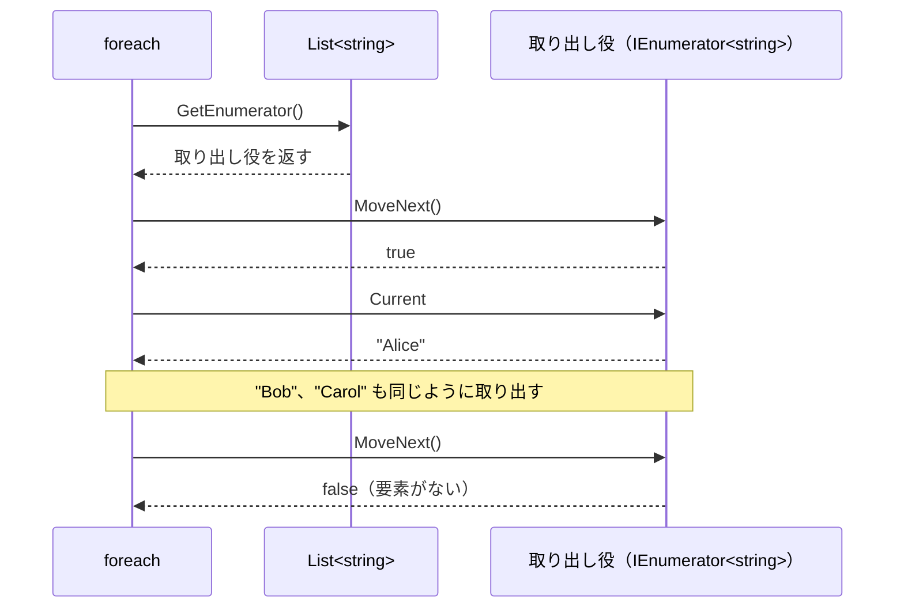
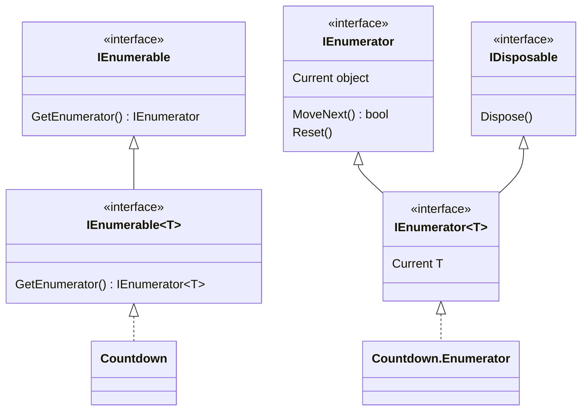

# IEnumerable\<T\> と foreach の仕組み

配列、`List<T>`、`Dictionary<TKey, TValue>`、`Queue<T>` など、種類の違うコレクションを、どれも同じ `foreach` 文で回せるのは、これらが共通のインターフェイス **IEnumerable\<T\>** を実装しているからです。このページでは、`foreach` 文が `IEnumerable<T>` と **IEnumerator\<T\>** を使って要素を取り出す仕組みと、自分で作ったクラスを `foreach` で回せるようにする方法を学びます。

## 学習目標

このページを読み終えると、以下のことができるようになります。

- `IEnumerable<T>` を受け取るメソッドに、いろいろなコレクションを渡せる
- `foreach` 文が `GetEnumerator`・`MoveNext`・`Current` の呼び出しに置き換えられることを説明できる
- `IEnumerable<T>` と `IEnumerator<T>` を実装して、自分のクラスを `foreach` で回せるようにできる
- `GetEnumerator` が呼ばれるたびに、新しい取り出し役を作る理由を説明できる

## 前提知識

- [Queue\<T\>・Stack\<T\>・HashSet\<T\>（補足）](/unity-csharp-learning/csharp/other-collections/) を読んでいること
- [インターフェイスの明示的実装](/unity-csharp-learning/csharp/explicit-interface/) を読んでいること
- [ジェネリクスの基本](/unity-csharp-learning/csharp/generics/) を読んでいること
- [入れ子の型](/unity-csharp-learning/csharp/nested-types/) を読んでいること

---

## 1. foreach で回せる型に共通するもの

次のメソッド `Sum` は、パラメータの型を [IEnumerable\<T\> インターフェイス](https://learn.microsoft.com/dotnet/api/system.collections.generic.ienumerable-1) にしています。配列、`List<int>`、`HashSet<int>` のどれを渡しても、`foreach` で要素を取り出して合計できます。

```csharp
int[] array = { 1, 2, 3 };
List<int> list = new List<int> { 10, 20 };
HashSet<int> set = new HashSet<int> { 100 };

Console.WriteLine(Sum(array));
Console.WriteLine(Sum(list));
Console.WriteLine(Sum(set));

int Sum(IEnumerable<int> numbers)
{
    int total = 0;
    foreach (int n in numbers)
    {
        total += n;
    }
    return total;
}
```

```
6
30
100
```

配列も、これまでに学んだコレクションも、どれも `IEnumerable<T>` を実装しています。`IEnumerable<T>` は「`T` 型の要素を順に取り出せる」ことを表すインターフェイスです。[インターフェイス](/unity-csharp-learning/csharp/interfaces/) で学んだように、パラメータの型をインターフェイスにしておけば、それを実装したどの型でも受け取れます。`Sum` は、渡されたものが配列なのか `List<T>` なのかを知らなくても、要素を順に取り出せれば仕事ができます。

---

## 2. IEnumerable\<T\> と IEnumerator\<T\>

`foreach` 文は、次の 2 つのインターフェイスを使って要素を取り出しています。

| インターフェイス | 役割 | 主なメンバー |
|---|---|---|
| `IEnumerable<T>` | 要素を順に取り出せるもの | [GetEnumerator()](https://learn.microsoft.com/dotnet/api/system.collections.generic.ienumerable-1.getenumerator)：取り出し役の `IEnumerator<T>` を返す |
| [IEnumerator\<T\>](https://learn.microsoft.com/dotnet/api/system.collections.generic.ienumerator-1) | 取り出し役。今どの要素を指しているかを覚えている | [MoveNext()](https://learn.microsoft.com/dotnet/api/system.collections.ienumerator.movenext)：次の要素に進む。次の要素がなければ `false` を返す<br/>[Current](https://learn.microsoft.com/dotnet/api/system.collections.generic.ienumerator-1.current)：今指している要素 |

`IEnumerator<T>` は、作られた直後は最初の要素の手前を指しています。`MoveNext` を呼ぶと 1 つ進んで最初の要素を指し、`true` を返します。最後の要素を指しているときに `MoveNext` を呼ぶと、進む先がないので `false` を返します。

`foreach` 文は、コンパイラーによって、おおまかには次のように置き換えられます。

```csharp
List<string> names = new List<string> { "Alice", "Bob", "Carol" };

IEnumerator<string> enumerator = names.GetEnumerator();
while (enumerator.MoveNext())
{
    string name = enumerator.Current;
    Console.WriteLine(name);
}
```

```
Alice
Bob
Carol
```

`foreach (string name in names)` と書いたときも、コンパイラーはこれと同じ処理を作っています。実際には、取り出しが終わった後に、取り出し役の後片付けをする `Dispose` メソッドを呼ぶ処理も加わります。`Dispose` については、[IDisposable と using](/unity-csharp-learning/csharp/dispose-using/) で学びます。



---

## 3. 自分のクラスを foreach で回せるようにする

自分で作ったクラスも、`IEnumerable<T>` を実装すれば `foreach` で回せます。ここでは、指定した数から 1 までを逆順に取り出す `Countdown` クラスを作ります。`new Countdown(3)` を `foreach` で回すと、`3`・`2`・`1` が取り出されます。

`IEnumerable<T>` を実装するクラス（`Countdown`）と、取り出し役として `IEnumerator<T>` を実装するクラスの 2 つが必要です。取り出し役は、`Countdown` の `GetEnumerator` からしか作りません。そこで、[入れ子の型](/unity-csharp-learning/csharp/nested-types/) で学んだように、`Countdown` の中の `private` なクラス `Enumerator` にして、外から隠します。`GetEnumerator` の戻り値の型はインターフェイスの `IEnumerator<int>` なので、`Enumerator` が `private` でも、`public` な `GetEnumerator` から返せます。.NET の `List<T>` の取り出し役も、`List<T>.Enumerator` という入れ子の型です。

```csharp
using System.Collections;

Countdown countdown = new Countdown(3);
foreach (int n in countdown)
{
    Console.WriteLine(n);
}

class Countdown : IEnumerable<int>
{
    private int _from;

    public Countdown(int from)
    {
        _from = from;
    }

    public IEnumerator<int> GetEnumerator()
    {
        return new Enumerator(_from);
    }

    IEnumerator IEnumerable.GetEnumerator()
    {
        return GetEnumerator();
    }

    private class Enumerator : IEnumerator<int>
    {
        private int _from;
        private int _current;

        public Enumerator(int from)
        {
            _from = from;
            _current = from + 1;
        }

        public int Current
        {
            get { return _current; }
        }

        object IEnumerator.Current
        {
            get { return Current; }
        }

        public bool MoveNext()
        {
            if (_current <= 1)
            {
                return false;
            }
            _current--;
            return true;
        }

        public void Reset()
        {
            _current = _from + 1;
        }

        public void Dispose()
        {
        }
    }
}
```

```
3
2
1
```

`Enumerator` は、今指している数を `_current` フィールドで覚えています。作られた直後は、最初の要素の手前を表すために `from + 1` にしておきます。`MoveNext` が呼ばれるたびに `_current` を 1 減らし、`1` を過ぎたら `false` を返します。

実装しなければならないメンバーは、`GetEnumerator`・`Current`・`MoveNext` のほかにもあります。

| メンバー | 実装する理由 |
|---|---|
| `IEnumerable.GetEnumerator()` と `IEnumerator.Current` | `IEnumerable<T>` と `IEnumerator<T>` は、ジェネリクスのない古いインターフェイス `IEnumerable` と `IEnumerator` を継承しているため。[インターフェイスの明示的実装](/unity-csharp-learning/csharp/explicit-interface/) で実装し、ジェネリック版のメンバーを呼び出す |
| `Reset()` | 最初の要素の手前に戻すメソッド。`foreach` は呼ばないが、`IEnumerator` のメンバーなので実装する |
| `Dispose()` | 取り出しの後片付けをするメソッド。`IEnumerator<T>` が `IDisposable` を継承しているため。後片付けするものがなければ、中身は空でよい |

古いインターフェイス `IEnumerable` と `IEnumerator` は、`System.Collections` 名前空間にあるので、`using System.Collections;` が必要です。



---

## 4. 取り出し役を毎回作る理由

`Countdown` の `GetEnumerator` は、呼ばれるたびに新しい `Enumerator` を作って返しています。どこまで取り出したかは、`Countdown` ではなく取り出し役が覚えているので、同じ `Countdown` を同時に何か所から回しても、互いに影響しません。

次のコードは、同じ `countdown` を二重の `foreach` で回します。`Countdown` クラスは、前のコード例と同じものです。

```csharp
using System.Collections;

Countdown countdown = new Countdown(2);
foreach (int a in countdown)
{
    foreach (int b in countdown)
    {
        Console.WriteLine($"({a}, {b})");
    }
}

class Countdown : IEnumerable<int>
{
    private int _from;

    public Countdown(int from)
    {
        _from = from;
    }

    public IEnumerator<int> GetEnumerator()
    {
        return new Enumerator(_from);
    }

    IEnumerator IEnumerable.GetEnumerator()
    {
        return GetEnumerator();
    }

    private class Enumerator : IEnumerator<int>
    {
        private int _from;
        private int _current;

        public Enumerator(int from)
        {
            _from = from;
            _current = from + 1;
        }

        public int Current
        {
            get { return _current; }
        }

        object IEnumerator.Current
        {
            get { return Current; }
        }

        public bool MoveNext()
        {
            if (_current <= 1)
            {
                return false;
            }
            _current--;
            return true;
        }

        public void Reset()
        {
            _current = _from + 1;
        }

        public void Dispose()
        {
        }
    }
}
```

```
(2, 2)
(2, 1)
(1, 2)
(1, 1)
```

外側の `foreach` と内側の `foreach` は、それぞれ `GetEnumerator` を呼んで、別々の取り出し役を持っています。そのため、内側の `foreach` が最後まで進んでも、外側の取り出し役の位置は変わりません。

---

## ワンポイントアドバイス

### ジェネリクスのない IEnumerable

`IEnumerable` と `IEnumerator` は、ジェネリクスがなかった .NET Framework 1.0 からあるインターフェイスです。`Current` の型は `object` なので、`int` などの値型を取り出すたびに [ボクシングとアンボクシング](/unity-csharp-learning/csharp/boxing/) で学ぶボクシングが起こり、取り出した値をキャストする必要もありました。ジェネリクスが追加された .NET Framework 2.0 で `IEnumerable<T>` と `IEnumerator<T>` が追加され、型安全に要素を取り出せるようになりました。古いインターフェイスとの互換性を保つために、ジェネリック版は古いインターフェイスを継承しています。

### 手で書くのは大変

`Countdown` を `foreach` で回せるようにするために、2 つのクラスと 7 つのメンバーを書きました。取り出し役は「どこまで取り出したか」を自分のフィールドで覚え、`MoveNext` が呼ばれるたびに次の状態へ進める必要があります。取り出し方が複雑になるほど、この状態の管理は難しくなります。次のページで学ぶ `yield return` を使うと、この取り出し役をコンパイラーが代わりに作ってくれます。

---

## まとめ

- 配列やコレクションは、`IEnumerable<T>` を実装している。`IEnumerable<T>` を受け取るメソッドには、どれでも渡せる
- `IEnumerable<T>` の `GetEnumerator` は、取り出し役の `IEnumerator<T>` を返す
- `IEnumerator<T>` は、`MoveNext` で次の要素に進み、`Current` で今の要素を返す。次の要素がなければ `MoveNext` は `false` を返す
- `foreach` 文は、`GetEnumerator` を呼び、`MoveNext` が `false` を返すまで `Current` を読む処理に置き換えられる
- `IEnumerable<T>` と `IEnumerator<T>` を実装すれば、自分のクラスも `foreach` で回せる。古い `IEnumerable` と `IEnumerator` のメンバーと、`Reset`・`Dispose` も実装する
- `GetEnumerator` は呼ばれるたびに新しい取り出し役を返すので、同じコレクションを同時に何か所から回せる

---

## 理解度チェック

1. `foreach` 文で回したいクラスは、どのインターフェイスを実装しますか？
2. 次のコードを実行すると何が出力されますか？`Countdown` クラスは、このページの 3 節と同じものです。

   ```csharp
   using System.Collections;

   int total = 0;
   foreach (int n in new Countdown(4))
   {
       total += n;
   }
   Console.WriteLine(total);

   class Countdown : IEnumerable<int>
   {
       private int _from;

       public Countdown(int from)
       {
           _from = from;
       }

       public IEnumerator<int> GetEnumerator()
       {
           return new Enumerator(_from);
       }

       IEnumerator IEnumerable.GetEnumerator()
       {
           return GetEnumerator();
       }

       private class Enumerator : IEnumerator<int>
       {
           private int _from;
           private int _current;

           public Enumerator(int from)
           {
               _from = from;
               _current = from + 1;
           }

           public int Current
           {
               get { return _current; }
           }

           object IEnumerator.Current
           {
               get { return Current; }
           }

           public bool MoveNext()
           {
               if (_current <= 1)
               {
                   return false;
               }
               _current--;
               return true;
           }

           public void Reset()
           {
               _current = _from + 1;
           }

           public void Dispose()
           {
           }
       }
   }
   ```

3. `Countdown` の `GetEnumerator` が、新しい `Enumerator` を作らず、フィールドに 1 つだけ持っている取り出し役を毎回返すようにすると、二重の `foreach` ではどのような問題が起きますか？

<details markdown="1">
<summary>解答を見る</summary>

1. `IEnumerable<T>` です。`foreach` は、`GetEnumerator` で得た `IEnumerator<T>` の `MoveNext` と `Current` を使って要素を取り出します。
2. `10` が出力されます。`4`・`3`・`2`・`1` が取り出され、その合計は `10` です。
3. 外側と内側の `foreach` が同じ取り出し役を使うことになります。4 節のコードなら、外側が `2` を取り出したあと、内側は同じ取り出し役の続きから `1` だけを取り出して最後まで進めます。外側の取り出し役も最後まで進んだことになるので、外側の `foreach` も終わり、`(2, 1)` の 1 行しか表示されません。どこまで取り出したかを覚えている取り出し役は、`foreach` ごとに別々に必要です。

</details>

---

## 次のステップ

[イテレーターと yield return](/unity-csharp-learning/csharp/iterators/) では、`yield return` を使って、取り出し役をコンパイラーに作らせる方法を学びます。
