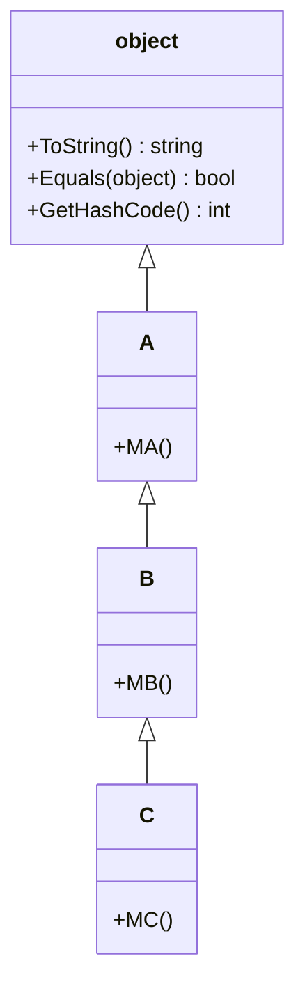

# 継承

**継承**（inheritance）は、既存のクラスのメンバーを引き継いで、新しいクラスを定義する仕組みです。引き継ぐ元のクラスを **基底クラス**（base class）、引き継いで新しく定義したクラスを **派生クラス**（derived class）といいます。派生クラスは、基底クラスのメンバーをそのまま使えるうえに、新しいメンバーを追加できます。

## 学習目標

このページを読み終えると、以下のことができるようになります。

- `class B : A` の形で、クラスを継承できる
- 派生クラスが、基底クラスのメンバーを引き継ぐことを説明できる
- `: base(...)` で、基底クラスのコンストラクターを呼び出せる
- C# のクラスが継承できる基底クラスは 1 つだけであることと、すべてのクラスが `object` を継承していることを説明できる

## 前提知識

- [クラスとフィールド](/unity-csharp-learning/csharp/classes/) を読んでいること
- [コンストラクター](/unity-csharp-learning/csharp/constructors/) を読んでいること
- [アクセス修飾子](/unity-csharp-learning/csharp/access-modifiers/) を読んでいること

---

## 1. 継承の書き方

**書式：[継承](https://learn.microsoft.com/dotnet/csharp/fundamentals/object-oriented/inheritance)**
```
class 派生クラス名 : 基底クラス名
{
    // 派生クラスで追加するメンバー
}
```

| 要素 | 説明 |
|---|---|
| `派生クラス名` | 新しく定義するクラスの名前 |
| `:` | 継承することを表す |
| `基底クラス名` | メンバーを引き継ぐ元のクラスの名前 |

```csharp
B b = new B();
b.M();

class A
{
    public void M()
    {
        Console.WriteLine("A.M");
    }
}

class B : A
{
}
```

```
A.M
```

`B` には何も書いていませんが、`A` を継承しているので、`A` の `M` メソッドを持っています。

---

## 2. 派生クラスにメンバーを追加する

派生クラスには、基底クラスにないメンバーを追加できます。

```csharp
B b = new B();
b.M();
b.N();

A a = new A();
a.M();

class A
{
    public void M()
    {
        Console.WriteLine("A.M");
    }
}

class B : A
{
    public void N()
    {
        Console.WriteLine("B.N");
    }
}
```

```
A.M
B.N
A.M
```

`B` のインスタンスは、`A` から引き継いだ `M` と、自分で追加した `N` の両方を持ちます。`A` のインスタンスは `M` だけを持ち、`N` は持ちません。

### 具体的な例

ゲームのキャラクターで考えます。プレイヤーも敵も、名前と HP を持ち、ダメージを受けます。共通する部分を基底クラス `Character` にまとめ、それぞれに固有の部分を派生クラスに書きます。

```csharp
Player player = new Player();
player.Name = "Alice";
player.Hp = 100;
player.TakeDamage(30);
player.UsePotion();

Enemy enemy = new Enemy();
enemy.Name = "Slime";
enemy.Hp = 20;
enemy.TakeDamage(30);

class Character
{
    public string Name = "";
    public int Hp;

    public void TakeDamage(int damage)
    {
        Hp -= damage;
        if (Hp < 0)
        {
            Hp = 0;
        }
        Console.WriteLine($"{Name} が {damage} ダメージ。残り HP={Hp}");
    }
}

class Player : Character
{
    public void UsePotion()
    {
        Hp += 20;
        Console.WriteLine($"{Name} は回復薬を使った。HP={Hp}");
    }
}

class Enemy : Character
{
}
```

```
Alice が 30 ダメージ。残り HP=70
Alice は回復薬を使った。HP=90
Slime が 30 ダメージ。残り HP=0
```

`TakeDamage` は `Character` に 1 回書くだけで、`Player` と `Enemy` の両方で使えます。

### private のメンバーは、派生クラスからも使えない

派生クラスは、基底クラスの `private` のメンバーも内部に持っていますが、派生クラスのメソッドから直接使うことはできません。`private` は、そのクラスの中からだけ使えるからです。

```csharp
// ❌ NG: 基底クラスの private のメンバーは、派生クラスからも使えない
// class A
// {
//     private int _secret = 1;
// }
//
// class B : A
// {
//     public void Show()
//     {
//         Console.WriteLine(_secret);  // CS0122
//     }
// }
```

派生クラスからは使えて、クラスの外からは使えないメンバーを作るには、[protected 修飾子](/unity-csharp-learning/csharp/protected-modifier/) を使います。

---

## 3. 基底クラスのコンストラクターを呼び出す

コンストラクターは、継承されません。派生クラスのインスタンスを作ると、派生クラスのコンストラクターの本体より先に、基底クラスのコンストラクターが実行されます。

```csharp
B b = new B();

class A
{
    public A()
    {
        Console.WriteLine("A のコンストラクター");
    }
}

class B : A
{
    public B()
    {
        Console.WriteLine("B のコンストラクター");
    }
}
```

```
A のコンストラクター
B のコンストラクター
```

基底クラスのコンストラクターにパラメータがあるときは、派生クラスのコンストラクターに `: base(引数)` と書いて、どのコンストラクターにどの値を渡すかを指定します。

**書式：[基底クラスのコンストラクターの呼び出し](https://learn.microsoft.com/dotnet/csharp/language-reference/keywords/base)**
```
public 派生クラス名(パラメータ) : base(引数)
{
    // 派生クラスの初期化
}
```

```csharp
Player p = new Player("Alice", 100, 3);
Console.WriteLine($"{p.Name}: HP={p.Hp}, 回復薬={p.Potions}");

class Character
{
    public string Name { get; }
    public int Hp { get; }

    public Character(string name, int hp)
    {
        Name = name;
        Hp = hp;
    }
}

class Player : Character
{
    public int Potions { get; }

    public Player(string name, int hp, int potions) : base(name, hp)
    {
        Potions = potions;
    }
}
```

```
Alice: HP=100, 回復薬=3
```

`new Player("Alice", 100, 3)` では、まず `: base(name, hp)` で `Character` のコンストラクターが実行されて `Name` と `Hp` が初期化され、その後で `Player` のコンストラクターの本体が実行されます。

基底クラスにパラメータのないコンストラクターがないときは、`: base(...)` を省略できません（よくあるミスを参照）。

---

## 4. 単一継承と object

C# のクラスが継承できる基底クラスは、**1 つだけ** です（単一継承）。ただし、継承は何段でも重ねられます。

```csharp
C c = new C();
c.MA();
c.MB();
c.MC();

class A
{
    public void MA() { Console.WriteLine("A.MA"); }
}

class B : A
{
    public void MB() { Console.WriteLine("B.MB"); }
}

class C : B
{
    public void MC() { Console.WriteLine("C.MC"); }
}
```

```
A.MA
B.MB
C.MC
```

`C` は `B` を継承し、`B` は `A` を継承しているので、`C` は 3 つのメソッドをすべて持ちます。

継承の元をたどっていくと、最後は [object](https://learn.microsoft.com/dotnet/api/system.object) にたどり着きます。基底クラスを書かずに定義したクラスは、自動的に `object` を継承します。`object` は、C# のすべての型の基底となる型です。



これまで使ってきた `GetType()` や `ToString()` は、`object` から引き継いだメソッドです。そのため、どのクラスのインスタンスでも使えます。

```csharp
C c = new C();
Console.WriteLine(c.ToString());

class A { }
class B : A { }
class C : B { }
```

```
C
```

`object` の `ToString` は、ふつうは型の名前を返します。

---

## よくあるミス

### 基底クラスのコンストラクターを呼び出さない

```csharp
// ❌ NG: A にはパラメータのないコンストラクターがないのに、: base(...) がない
// class A
// {
//     public A(int value)
//     {
//     }
// }
//
// class B : A
// {
//     public B(int value)  // CS7036
//     {
//     }
// }
```

`: base(...)` を書かないと、コンパイラーは、基底クラスのパラメータのないコンストラクターを呼び出そうとします。`A` にはそれがないので、コンパイルエラーになります。`public B(int value) : base(value)` と書きます。

### 2 つのクラスを継承しようとする

```csharp
// ❌ NG: 基底クラスは 1 つだけ
// class A { }
// class B { }
// class C : A, B { }  // CS1721
```

---

## まとめ

- `class B : A` と書くと、`B` は `A` を継承する。`A` が基底クラス、`B` が派生クラス
- 派生クラスは、基底クラスのメンバーを引き継ぎ、新しいメンバーを追加できる
- 基底クラスの `private` のメンバーは、派生クラスからも使えない
- コンストラクターは継承されない。派生クラスのインスタンスを作ると、基底クラスのコンストラクターが先に実行される
- `: base(引数)` で、基底クラスのコンストラクターに値を渡す
- C# のクラスが継承できる基底クラスは 1 つだけ。すべてのクラスは、最後は `object` を継承している

---

## 理解度チェック

1. `class B : A` の `:` は何を表しますか？
2. 次のコードを実行すると何が出力されますか？

   ```csharp
   C c = new C();

   class A
   {
       public A() { Console.WriteLine("A"); }
   }

   class B : A
   {
       public B() { Console.WriteLine("B"); }
   }

   class C : B
   {
       public C() { Console.WriteLine("C"); }
   }
   ```

3. 基底クラス `A` に `public A(int x)` しかないとき、派生クラス `B` の `int` を受け取るコンストラクターは、どう書きますか？

<details markdown="1">
<summary>解答を見る</summary>

1. `B` が `A` を継承することを表します。
2. 次のように出力されます。派生クラスのインスタンスを作ると、基底クラスのコンストラクターから順に実行されます。

   ```
   A
   B
   C
   ```

3. `public B(int x) : base(x) { }` と書きます。

</details>

---

## 次のステップ

[型変換と型チェック](/unity-csharp-learning/csharp/type-casting/) では、基底クラスと派生クラスの間での型の変換と、型を調べる方法を学びます。
