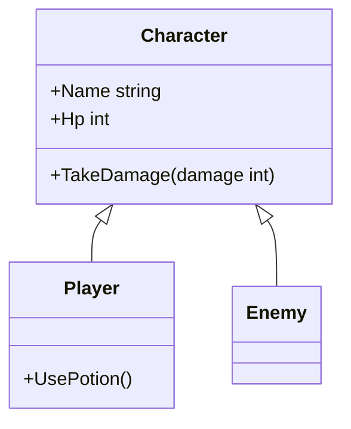
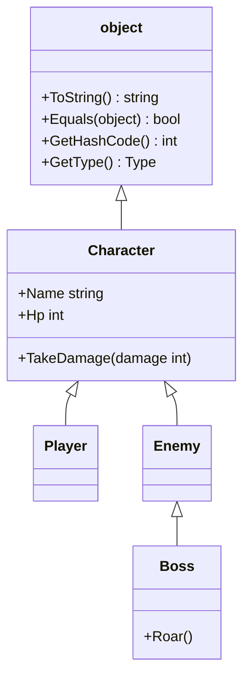

# 継承

プレイヤーと敵のように、似ているけれど少しずつ違うクラスを作ることがあります。共通の部分をクラスごとに書くと、手間がかかるうえに、直し忘れの原因になります。**継承**（inheritance）は、既存のクラスのメンバーを引き継いで、新しいクラスを定義する仕組みです。このページでは、継承の書き方、派生クラスへのメンバーの追加、基底クラスのコンストラクターの呼び出し、すべてのクラスの元になる `object` を学びます。

## 学習目標

このページを読み終えると、以下のことができるようになります。

- 似たクラスを別々に書くと何が困るかを説明できる
- `class 派生クラス名 : 基底クラス名` の形で、クラスを継承できる
- 派生クラスが基底クラスのメンバーを引き継ぎ、新しいメンバーを追加できることを説明できる
- `: base(...)` で、基底クラスのコンストラクターを呼び出せる
- 継承できる基底クラスは 1 つだけであることと、すべてのクラスが `object` を継承していることを説明できる

## 前提知識

- [コンストラクター](/unity-csharp-learning/csharp/constructors/) を読んでいること
- [アクセス修飾子](/unity-csharp-learning/csharp/access-modifiers/) を読んでいること
- [プロパティ](/unity-csharp-learning/csharp/properties/) を読んでいること

---

## 1. 似たクラスを別々に書くと困ること

ゲームに、プレイヤーと敵を登場させます。どちらも名前と HP を持ち、ダメージを受けると HP が減ります。`Player` と `Enemy` の 2 つのクラスを、それぞれ定義します。

```csharp
Player player = new Player();
player.Name = "Alice";
player.Hp = 20;
player.TakeDamage(30);

Enemy enemy = new Enemy();
enemy.Name = "Slime";
enemy.Hp = 20;
enemy.TakeDamage(30);

class Player
{
    public string Name { get; set; } = "";
    public int Hp { get; set; }

    public void TakeDamage(int damage)
    {
        Hp -= damage;
        if (Hp < 0)
        {
            Hp = 0;
        }
        Console.WriteLine($"{Name} が {damage} ダメージ。残り HP={Hp}");
    }
}

class Enemy
{
    public string Name { get; set; } = "";
    public int Hp { get; set; }

    public void TakeDamage(int damage)
    {
        Hp -= damage;
        Console.WriteLine($"{Name} が {damage} ダメージ。残り HP={Hp}");
    }
}
```

```
Alice が 30 ダメージ。残り HP=0
Slime が 30 ダメージ。残り HP=-10
```

`Name`・`Hp`・`TakeDamage` は、2 つのクラスでほとんど同じコードです。同じコードを 2 か所に書いたので、`Player` の `TakeDamage` に「HP を 0 未満にしない」処理を足したとき、`Enemy` を直し忘れてしまいました。その結果、敵の HP だけが `-10` になっています。

ボスや仲間のキャラクターなど、クラスが増えるたびに、同じコードを書き写す場所も増えます。共通の部分を 1 か所にまとめ、クラスごとに違う部分だけをそれぞれのクラスに書けると便利です。

---

## 2. 継承で共通の部分をまとめる

共通の部分を 1 つのクラスにまとめ、ほかのクラスがそれを引き継ぐようにできます。これを **継承** といいます。引き継ぐ元のクラスを **基底クラス**（base class）、引き継いで新しく定義したクラスを **派生クラス**（derived class）といいます。

**書式：[継承](https://learn.microsoft.com/dotnet/csharp/fundamentals/object-oriented/inheritance)**
```
class 派生クラス名 : 基底クラス名
{
    // 派生クラスで追加するメンバー
}
```

| 要素 | 説明 |
|---|---|
| `派生クラス名` | 新しく定義するクラスの名前 |
| `:` | 継承することを表す |
| `基底クラス名` | メンバーを引き継ぐ元のクラスの名前 |

プレイヤーと敵に共通する部分を、基底クラス `Character`（キャラクター）にまとめます。`Player` と `Enemy` は `Character` を継承します。

```csharp
Player player = new Player();
player.Name = "Alice";
player.Hp = 20;
player.TakeDamage(30);

Enemy enemy = new Enemy();
enemy.Name = "Slime";
enemy.Hp = 20;
enemy.TakeDamage(30);

class Character
{
    public string Name { get; set; } = "";
    public int Hp { get; set; }

    public void TakeDamage(int damage)
    {
        Hp -= damage;
        if (Hp < 0)
        {
            Hp = 0;
        }
        Console.WriteLine($"{Name} が {damage} ダメージ。残り HP={Hp}");
    }
}

class Player : Character
{
}

class Enemy : Character
{
}
```

```
Alice が 30 ダメージ。残り HP=0
Slime が 30 ダメージ。残り HP=0
```

`Player` と `Enemy` の中には何も書いていませんが、`Character` を継承しているので、`Name`・`Hp`・`TakeDamage` を持っています。`TakeDamage` は `Character` の 1 か所にしかないので、直せば `Player` と `Enemy` の両方に反映されます。

継承は、「プレイヤーはキャラクターの一種」「敵はキャラクターの一種」という関係を表します。

---

## 3. 派生クラスにメンバーを追加する

派生クラスには、基底クラスにないメンバーを追加できます。プレイヤーだけが回復薬を使えるように、`Player` に `UsePotion` メソッドを追加します。

```csharp
Player player = new Player();
player.Name = "Alice";
player.Hp = 20;
player.TakeDamage(15);
player.UsePotion();

Enemy enemy = new Enemy();
enemy.Name = "Slime";
enemy.Hp = 20;
enemy.TakeDamage(15);

class Character
{
    public string Name { get; set; } = "";
    public int Hp { get; set; }

    public void TakeDamage(int damage)
    {
        Hp -= damage;
        if (Hp < 0)
        {
            Hp = 0;
        }
        Console.WriteLine($"{Name} が {damage} ダメージ。残り HP={Hp}");
    }
}

class Player : Character
{
    public void UsePotion()
    {
        Hp += 20;
        Console.WriteLine($"{Name} は回復薬を使った。HP={Hp}");
    }
}

class Enemy : Character
{
}
```

```
Alice が 15 ダメージ。残り HP=5
Alice は回復薬を使った。HP=25
Slime が 15 ダメージ。残り HP=5
```

`Player` のインスタンスは、`Character` から引き継いだメンバーと、自分で追加した `UsePotion` の両方を持ちます。`UsePotion` の中でも、引き継いだ `Hp` と `Name` を、自分のメンバーと同じように使えます。

`Enemy` は `UsePotion` を持たないので、`enemy.UsePotion()` と書くとコンパイルエラーになります。

```csharp
// ❌ NG: UsePotion は Player に追加したメソッドなので、Enemy にはない（CS1061）
// enemy.UsePotion();
```

3 つのクラスの関係を図にすると、次のようになります。矢印は、派生クラスから基底クラスに向かって引きます。



`Player` と `Enemy` の枠の中には、そのクラスで追加したメンバーだけを書いています。`Character` のメンバーは、矢印の先から引き継ぎます。

### private のメンバーは、派生クラスからも使えない

派生クラスのインスタンスは、基底クラスの `private` のメンバーも内部に持っています。しかし、派生クラスのメソッドから直接使うことはできません。[アクセス修飾子](/unity-csharp-learning/csharp/access-modifiers/) で学んだように、`private` のメンバーは、そのクラスの中からだけ使えるからです。

```csharp
// ❌ NG: 基底クラスの private のメンバーは、派生クラスからも使えない
// class Character
// {
//     private int _defense = 5;
// }
//
// class Player : Character
// {
//     public void ShowDefense()
//     {
//         Console.WriteLine(_defense);  // CS0122
//     }
// }
```

派生クラスからは使えて、クラスの外からは使えないメンバーを作るには、[protected 修飾子](/unity-csharp-learning/csharp/protected-modifier/) を使います。

---

## 4. 基底クラスのコンストラクターを呼び出す

ここまでの例では、インスタンスを作ってから `Name` と `Hp` に値を入れていました。これでは、値を入れ忘れてもコンパイラーは気付きません。[コンストラクター](/unity-csharp-learning/csharp/constructors/) で学んだように、必ず必要な値は、コンストラクターのパラメータで受け取るようにします。

`Character` に、名前と HP を受け取るコンストラクターを定義します。すると、`Player` にもコンストラクターが必要になります。**コンストラクターは継承されない** ので、`Character` のコンストラクターを `new Player("Alice", 100)` のように使うことはできないからです。

派生クラスのコンストラクターから基底クラスのコンストラクターに値を渡すには、`: base(引数)` と書きます。

**書式：[基底クラスのコンストラクターの呼び出し](https://learn.microsoft.com/dotnet/csharp/language-reference/keywords/base)**
```
public 派生クラス名(パラメータ) : base(引数)
{
    // 派生クラスの初期化
}
```

| 要素 | 説明 |
|---|---|
| `base(引数)` | 基底クラスのコンストラクターを、指定した引数で呼び出す |

```csharp
Player player = new Player("Alice", 100, 3);
Console.WriteLine($"{player.Name}: HP={player.Hp}, 回復薬={player.Potions}");

class Character
{
    public string Name { get; }
    public int Hp { get; set; }

    public Character(string name, int hp)
    {
        Console.WriteLine("Character のコンストラクター");
        Name = name;
        Hp = hp;
    }
}

class Player : Character
{
    public int Potions { get; set; }

    public Player(string name, int hp, int potions) : base(name, hp)
    {
        Console.WriteLine("Player のコンストラクター");
        Potions = potions;
    }
}
```

```
Character のコンストラクター
Player のコンストラクター
Alice: HP=100, 回復薬=3
```

`new Player("Alice", 100, 3)` では、次の順に処理が進みます。

1. `: base(name, hp)` で、`Character` のコンストラクターが実行され、`Name` と `Hp` が初期化される
2. `Player` のコンストラクターの本体が実行され、`Potions` が初期化される

基底クラスの部分が先に初期化されるので、派生クラスのコンストラクターの本体では、`Name` や `Hp` をもう使えます。

派生クラスで初期化するものがなくても、基底クラスのコンストラクターにパラメータがあるなら、`: base(...)` を書いたコンストラクターが必要です。たとえば `Enemy` なら、`public Enemy(string name, int hp) : base(name, hp) { }` と書きます（よくあるミスを参照）。

---

## 5. 継承を重ねる

派生クラスを、さらに継承することもできます。強い敵のボス `Boss` を、`Enemy` の派生クラスとして定義します。

```csharp
Boss boss = new Boss("Dragon", 500);
boss.TakeDamage(30);
boss.Roar();
Console.WriteLine(boss.ToString());

class Character
{
    public string Name { get; }
    public int Hp { get; set; }

    public Character(string name, int hp)
    {
        Name = name;
        Hp = hp;
    }

    public void TakeDamage(int damage)
    {
        Hp -= damage;
        if (Hp < 0)
        {
            Hp = 0;
        }
        Console.WriteLine($"{Name} が {damage} ダメージ。残り HP={Hp}");
    }
}

class Enemy : Character
{
    public Enemy(string name, int hp) : base(name, hp)
    {
    }
}

class Boss : Enemy
{
    public Boss(string name, int hp) : base(name, hp)
    {
    }

    public void Roar()
    {
        Console.WriteLine($"{Name} がほえた");
    }
}
```

```
Dragon が 30 ダメージ。残り HP=470
Dragon がほえた
Boss
```

`Boss` は `Enemy` を継承し、`Enemy` は `Character` を継承しているので、`Boss` は `Character` の `TakeDamage` も持っています。`Boss` の `: base(name, hp)` が呼び出すのは、すぐ上の基底クラスである `Enemy` のコンストラクターです。

### すべてのクラスは object を継承している

最後の行の `ToString()` は、どのクラスにも定義していません。それでも呼び出せるのは、すべてのクラスが [object](https://learn.microsoft.com/dotnet/api/system.object) を継承しているからです。基底クラスを書かずに定義したクラスは、自動的に `object` を継承します。`object` の `ToString` は、ふつうは型の名前を返します。

継承の関係を元へたどると、どのクラスも最後は `object` にたどり着きます。



### 基底クラスは 1 つだけ

継承は何段でも重ねられますが、1 つのクラスが直接継承できる基底クラスは、**1 つだけ** です（単一継承）。`class C : A, B` のように、2 つのクラスを並べて継承することはできません。2 つの基底クラスが同じ名前のメンバーを持っていたときに、どちらを使うのかがあいまいになるからです。複数の種類の性質を持たせたいときは、後で学ぶ [インターフェイス](/unity-csharp-learning/csharp/interfaces/) を使います。

---

## よくあるミス

### 基底クラスのコンストラクターを呼び出さない

```csharp
// ❌ NG: Character にはパラメータのないコンストラクターがないのに、: base(...) がない
// class Character
// {
//     public Character(string name, int hp)
//     {
//     }
// }
//
// class Enemy : Character
// {
//     public Enemy(string name, int hp)  // CS7036
//     {
//     }
// }
```

`: base(...)` を書かないと、コンパイラーは、基底クラスのパラメータのないコンストラクターを呼び出そうとします。`Character` にはそれがないので、コンパイルエラーになります。`public Enemy(string name, int hp) : base(name, hp)` と書きます。

派生クラスにコンストラクターを 1 つも書かなかった場合も同じです。コンパイラーが用意するパラメータのないコンストラクターが、基底クラスのパラメータのないコンストラクターを呼び出そうとして、CS7036 になります。

### 2 つのクラスを継承しようとする

```csharp
// ❌ NG: 直接継承できる基底クラスは 1 つだけ
// class A { }
// class B { }
// class C : A, B { }  // CS1721
```

---

## ワンポイントアドバイス

### 継承を使うかどうかの目安

継承は、「派生クラスは基底クラスの一種」と言えるときに使います。「プレイヤーはキャラクターの一種」は自然なので、`Player : Character` は適切です。

一方、「プレイヤーは回復薬の数を数えるので、数を数えるクラス `Counter` を継承する」のは不適切です。プレイヤーは数を数える道具の一種ではありません。このようなときは、`Player` のフィールドやプロパティとして `Counter` を持たせます。コードを共通にしたいというだけで継承を使うと、基底クラスの不要なメンバーまで引き継いでしまいます。

---

## まとめ

- 似たクラスを別々に書くと、同じコードを何か所にも書くことになり、直し忘れが起きやすい
- `class B : A` と書くと、`B` は `A` を継承する。`A` が基底クラス、`B` が派生クラス
- 派生クラスは、基底クラスのメンバーを引き継ぎ、新しいメンバーを追加できる。基底クラスの `private` のメンバーは、派生クラスからも使えない
- コンストラクターは継承されない。`: base(引数)` で基底クラスのコンストラクターに値を渡す。基底クラスのコンストラクターが先に実行される
- 継承は何段でも重ねられるが、直接継承できる基底クラスは 1 つだけ。すべてのクラスは、最後は `object` を継承している

---

## 理解度チェック

1. 似たクラスを継承を使わずに別々に書くと、どのような問題が起きやすいですか？
2. 次のコードを実行すると何が出力されますか？

   ```csharp
   C c = new C();

   class A
   {
       public A() { Console.WriteLine("A"); }
   }

   class B : A
   {
       public B() { Console.WriteLine("B"); }
   }

   class C : B
   {
       public C() { Console.WriteLine("C"); }
   }
   ```

3. 5 節の `Boss` のインスタンスで使えるメンバーを、次の中からすべて選んでください。

   `Name`・`Hp`・`TakeDamage`・`Roar`・`ToString`・`UsePotion`（3 節で `Player` に追加したメソッド）

4. 基底クラス `A` に `public A(int x)` しかないとき、派生クラス `B` の `int` を受け取るコンストラクターは、どう書きますか？

<details markdown="1">
<summary>解答を見る</summary>

1. 同じコードを何か所にも書くことになります。処理を直すときにすべての場所を直す必要があり、1 か所でも直し忘れると、クラスによって動作が食い違います。
2. 次のように出力されます。派生クラスのインスタンスを作ると、いちばん元の基底クラスのコンストラクターから順に実行されます。

   ```
   A
   B
   C
   ```

3. `Name`・`Hp`・`TakeDamage`・`Roar`・`ToString` です。`Name`・`Hp`・`TakeDamage` は `Character` から、`ToString` は `object` から引き継いでいます。`UsePotion` は `Player` に追加したメソッドで、`Boss` の継承の関係の中にはないので使えません。
4. `public B(int x) : base(x) { }` と書きます。

</details>

---

## 次のステップ

[型変換と型チェック](/unity-csharp-learning/csharp/type-casting/) では、派生クラスのインスタンスを基底クラスの型の変数で扱う方法と、実際の型を調べる方法を学びます。
