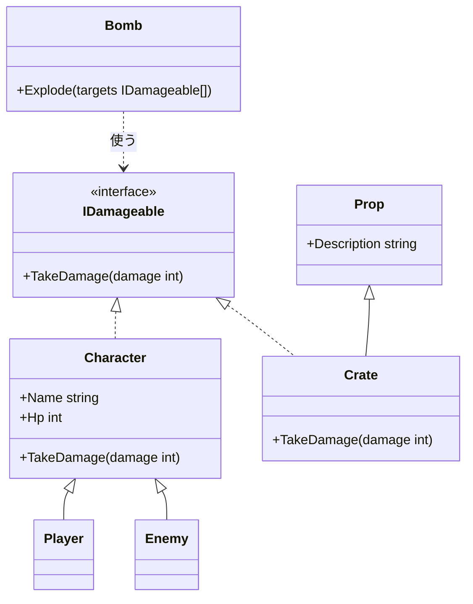

# インターフェイス

継承を使うと、同じ基底クラスを持つクラスを、基底クラスの型でまとめて扱えます。しかし、継承の関係がないクラスどうしは、まとめて扱えません。**インターフェイス**（interface）は、クラスが持つべきメソッドやプロパティの **宣言だけ** をまとめた型です。継承の関係と関係なく、インターフェイスを **実装** したクラスを、インターフェイスの型でまとめて扱えます。このページでは、インターフェイスの宣言と実装、複数のインターフェイスの実装、抽象クラスとの使い分けを学びます。

## 学習目標

このページを読み終えると、以下のことができるようになります。

- 継承だけでは、種類の違うクラスをまとめて扱えない場面を説明できる
- インターフェイスを宣言し、クラスで実装できる
- パラメータや配列の型をインターフェイスにして、実装したクラスのインスタンスを扱える
- 1 つのクラスで、複数のインターフェイスを実装できる
- 抽象クラスとインターフェイスの違いを説明できる

## 前提知識

- [抽象クラスと抽象メソッド](/unity-csharp-learning/csharp/abstract-classes/) を読んでいること

---

## 1. 継承の関係がないクラスをまとめて扱いたい

ゲームに爆弾を登場させます。爆弾が爆発すると、周りにあるものにダメージを与えます。ダメージを受けるのは、プレイヤーや敵だけではありません。木箱も、爆発に巻き込まれると壊れます。

プレイヤーと敵は `Character` の派生クラスなので、`Character` の型の配列にまとめられます。しかし、木箱のクラス `Crate` は、樽や看板と同じ「置物」として、基底クラス `Prop` から派生させています。

```csharp
// ❌ NG: Crate は Character の派生クラスではないので、Character の配列に入れられない（CS0029）
// Character[] targets = { new Player("Alice", 100), new Enemy("Slime", 20), new Crate() };
```

`Crate` を `Character` の派生クラスにすることもできません。

- [継承](/unity-csharp-learning/csharp/inheritance/) で学んだように、直接継承できる基底クラスは 1 つだけです。`Crate` は、すでに `Prop` を継承しています
- 仮に `Prop` をやめて `Character` を継承しても、「木箱はキャラクターの一種」ではありません。木箱には不要な名前や、攻撃のメソッドまで引き継いでしまいます

爆弾にとって大事なのは、相手がキャラクターかどうかではなく、「ダメージを受けられるかどうか」だけです。継承の関係とは別に、「この操作ができる」ことを表す型があれば、それを使ってまとめられます。

---

## 2. インターフェイスを宣言する

「この操作ができる」ことを表す型が、インターフェイスです。インターフェイスには、メソッドやプロパティの宣言だけを書き、本体は書きません。

**書式：[インターフェイスの宣言](https://learn.microsoft.com/dotnet/csharp/language-reference/keywords/interface)**
```
interface インターフェイス名
{
    戻り値の型 メソッド名(パラメータ);
    型 プロパティ名 { get; }
}
```

| 要素 | 説明 |
|---|---|
| `interface` | インターフェイスを宣言するキーワード |
| `インターフェイス名` | `I` で始めるのが慣例（例：`IDamageable`、`IDisposable`） |
| メンバーの宣言 | 本体は書かず、`;` で終える。アクセス修飾子も書かない |

「ダメージを受けられる」ことを表す `IDamageable` を宣言します。

```csharp
interface IDamageable
{
    void TakeDamage(int damage);
}
```

`IDamageable` が決めているのは、「`int` を受け取る `TakeDamage` メソッドを持つ」ことだけです。ダメージを受けたときに何が起きるかは、実装するクラスが決めます。インターフェイスの名前は、`I` の後に「〜できる」を表す `-able` の形容詞を付けることがよくあります（`damageable` は「ダメージを受けられる」）。

---

## 3. インターフェイスを実装する

クラス名の後に `: インターフェイス名` と書くと、そのクラスはインターフェイスを **実装** します。基底クラスを継承するときは、`: 基底クラス名, インターフェイス名` のように、基底クラスを最初に書きます。実装したクラスは、インターフェイスのすべてのメンバーを `public` で定義しなければなりません。

**書式：[インターフェイスの実装](https://learn.microsoft.com/dotnet/csharp/fundamentals/types/interfaces)**
```
class クラス名 : インターフェイス名
{
    // インターフェイスのメンバーを public で定義する
}

class クラス名 : 基底クラス名, インターフェイス名
{
}
```

`Character` と `Crate` に、`IDamageable` を実装します。爆弾 `Bomb` の `Explode` メソッドは、`IDamageable` の型の配列を受け取ります。

```csharp
IDamageable[] targets =
{
    new Player("Alice", 100),
    new Enemy("Slime", 20),
    new Crate()
};

Bomb bomb = new Bomb(30);
bomb.Explode(targets);

interface IDamageable
{
    void TakeDamage(int damage);
}

class Bomb
{
    private int _power;

    public Bomb(int power)
    {
        _power = power;
    }

    public void Explode(IDamageable[] targets)
    {
        Console.WriteLine("爆弾が爆発した");
        foreach (IDamageable target in targets)
        {
            target.TakeDamage(_power);
        }
    }
}

class Character : IDamageable
{
    public string Name { get; }
    public int Hp { get; protected set; }

    public Character(string name, int hp)
    {
        Name = name;
        Hp = hp;
    }

    public void TakeDamage(int damage)
    {
        Hp -= damage;
        if (Hp < 0)
        {
            Hp = 0;
        }
        Console.WriteLine($"{Name} が {damage} ダメージ。残り HP={Hp}");
    }
}

class Player : Character
{
    public Player(string name, int hp) : base(name, hp) { }
}

class Enemy : Character
{
    public Enemy(string name, int hp) : base(name, hp) { }
}

// 置物の基底クラス
class Prop
{
    public string Description { get; }

    public Prop(string description)
    {
        Description = description;
    }
}

class Crate : Prop, IDamageable
{
    private int _durability = 20;

    public Crate() : base("木箱") { }

    public void TakeDamage(int damage)
    {
        _durability -= damage;
        if (_durability <= 0)
        {
            Console.WriteLine($"{Description} が壊れた");
        }
        else
        {
            Console.WriteLine($"{Description} にひびが入った");
        }
    }
}
```

```
爆弾が爆発した
Alice が 30 ダメージ。残り HP=70
Slime が 30 ダメージ。残り HP=0
木箱 が壊れた
```

- `Player` と `Enemy` は、`IDamageable` を実装した `Character` を継承しているので、`IDamageable` として扱えます
- `Crate` は、`Prop` を継承したまま、`IDamageable` も実装しています
- `Bomb` の `Explode` は、パラメータの型が `IDamageable[]` なので、相手が `Character` なのか `Crate` なのかを知りません。知っているのは、どれも `TakeDamage` を持っていることだけです

`target.TakeDamage(_power)` では、[オーバーライドとポリモーフィズム](/unity-csharp-learning/csharp/polymorphism/) と同じく、実体のクラスの `TakeDamage` が実行されます。ダメージを受けられる新しい物（たとえば樽）を追加するときも、`IDamageable` を実装するだけで、`Bomb` を書き換える必要はありません。

クラスとインターフェイスの関係を図にすると、次のようになります。インターフェイスは、継承の枝をまたいで、関係のないクラスに同じ操作を持たせています。



点線の三角の矢印は「インターフェイスを実装する」、実線の三角の矢印は「継承する」ことを表します。`Bomb` は `IDamageable` だけを使い、`Character` や `Crate` には直接関わりません。

インターフェイスのメンバーを 1 つでも定義し忘れると、コンパイルエラー（CS0535）になります。インターフェイスは、「このメンバーを必ず持つ」という約束（契約）を表し、その約束が守られているかをコンパイラーが確かめます。

---

## 4. 複数のインターフェイスを実装する

クラスは、`,` で区切って、複数のインターフェイスを実装できます。基底クラスは 1 つしか継承できませんが、インターフェイスはいくつでも実装できます。

**書式：[基底クラスの継承と、複数のインターフェイスの実装](https://learn.microsoft.com/dotnet/csharp/fundamentals/types/interfaces)**
```
class クラス名 : 基底クラス名, インターフェイス名1, インターフェイス名2
{
}
```

回復の魔法で回復できることを表す `IHealable` を追加し、プレイヤーは回復もできるようにします。`IDamageable` と `Character` は 3 節のものを使い、`Player` を次のように書き換えます。

```csharp
Player player = new Player("Alice", 100);

IDamageable damageable = player;
damageable.TakeDamage(40);

IHealable healable = player;
healable.Heal(25);

interface IHealable
{
    void Heal(int amount);
}

class Player : Character, IHealable
{
    public Player(string name, int hp) : base(name, hp) { }

    public void Heal(int amount)
    {
        Hp += amount;
        Console.WriteLine($"{Name} が {amount} 回復。HP={Hp}");
    }
}
```

```
Alice が 40 ダメージ。残り HP=60
Alice が 25 回復。HP=85
```

`Player` は、`Character` を継承し（それによって `IDamageable` も実装し）、さらに `IHealable` を実装しています。`Player` のインスタンスは、`IDamageable` の型の変数にも、`IHealable` の型の変数にも入れられます。ダメージを与える処理は `IDamageable` として、回復する処理は `IHealable` として、それぞれ必要な操作だけを通して `Player` を扱えます。

---

## 5. 抽象クラスとインターフェイスの違い

| | 抽象クラス | インターフェイス |
|---|---|---|
| 継承・実装できる数 | 1 つだけ | いくつでも |
| フィールド | 持てる | 持てない（CS0525） |
| コンストラクター | 持てる | 持てない |
| メソッドの本体 | 書ける | ふつうは書かない（ワンポイントアドバイスを参照） |
| インスタンスの作成 | できない | できない |
| 表す関係 | 「〜の一種」 | 「〜ができる」 |

抽象クラスは、「共通のデータや処理を持つ、同じ種類のクラスの基底」に向いています。`Shape` のように、名前や `Describe` メソッドなどの共通部分を持たせられます。

インターフェイスは、「種類の違うクラスに、共通の操作を持たせる」のに向いています。キャラクターと木箱のように、継承の関係がないクラスにも同じ操作を持たせられるのが、インターフェイスの強みです。

.NET にも、多くのインターフェイスが用意されています。たとえば、[IDisposable と using](/unity-csharp-learning/csharp/dispose-using/) で学ぶ `IDisposable` は、「後片付けの `Dispose` メソッドを持つ」ことを表すインターフェイスです。

---

## よくあるミス

### インターフェイスのメンバーを実装し忘れる

```csharp
// ❌ NG: IDamageable の TakeDamage を実装していない
// class Barrel : IDamageable  // CS0535
// {
// }
```

### 実装したメンバーに public を付け忘れる

```csharp
// ❌ NG: インターフェイスを実装するメンバーは public にする
// class Barrel : IDamageable
// {
//     void TakeDamage(int damage)  // CS0737
//     {
//     }
// }
```

アクセス修飾子を省略すると `private` になるので、インターフェイスのメンバーの実装として使えません。インターフェイスの型の変数から呼び出せるように、`public` にする必要があります。

---

## ワンポイントアドバイス

### インターフェイスの既定の実装（C# 8 以降）

C# 8 以降では、インターフェイスのメソッドに本体を書いて、**既定の実装** を持たせることもできます。インターフェイスにメソッドを追加したいが、すでにあるクラスをすべて書き換えるのは難しい、という場面のための機能です。ふだんは、インターフェイスには宣言だけを書き、本体は実装するクラスに書きます。

---

## まとめ

- 継承の関係がないクラスは、基底クラスの型ではまとめて扱えない。基底クラスは 1 つしか継承できない
- インターフェイスは、クラスが持つべきメンバーの宣言だけをまとめた型。名前は `I` で始めるのが慣例
- `class クラス名 : インターフェイス名` で実装し、すべてのメンバーを `public` で定義する
- インターフェイスの型の変数・配列・パラメータには、実装したどのクラスのインスタンスも入れられる。呼び出すと、実体のクラスのメソッドが実行される
- クラスは、基底クラスは 1 つだけ継承でき、インターフェイスはいくつでも実装できる
- 抽象クラスは「〜の一種」、インターフェイスは「〜ができる」を表すのに向いている

---

## 理解度チェック

1. インターフェイスが「契約」と呼ばれるのはなぜですか？
2. 1 節で、`Crate` を `Character` の派生クラスにしなかった理由を 2 つ挙げてください。
3. 次のコードを実行すると何が出力されますか？

   ```csharp
   IShape[] shapes = { new Square(3), new Square(5) };
   int total = 0;
   foreach (IShape s in shapes)
   {
       total += s.Area();
   }
   Console.WriteLine(total);

   interface IShape
   {
       int Area();
   }

   class Square : IShape
   {
       private int _side;

       public Square(int side)
       {
           _side = side;
       }

       public int Area()
       {
           return _side * _side;
       }
   }
   ```

4. 抽象クラスとインターフェイスの違いを、2 つ挙げてください。

<details markdown="1">
<summary>解答を見る</summary>

1. インターフェイスを実装したクラスは、宣言されたメンバーを必ず持たなければならず、その約束が守られているかをコンパイラーが確かめるからです。
2. `Crate` はすでに `Prop` を継承していて、基底クラスは 1 つしか継承できないからです。また、木箱はキャラクターの一種ではないので、キャラクターの不要なメンバーまで引き継いでしまうからです。
3. `34` が出力されます。`3 × 3 = 9` と `5 × 5 = 25` の合計です。

   ```
   34
   ```

4. （例）抽象クラスは 1 つしか継承できないが、インターフェイスはいくつでも実装できる。抽象クラスはフィールドやコンストラクターを持てるが、インターフェイスは持てない。

</details>

---

## 次のステップ

[インターフェイスの明示的実装](/unity-csharp-learning/csharp/explicit-interface/) では、複数のインターフェイスに同じ名前のメンバーがあるときに、それぞれ別の実装を用意する方法を学びます。
