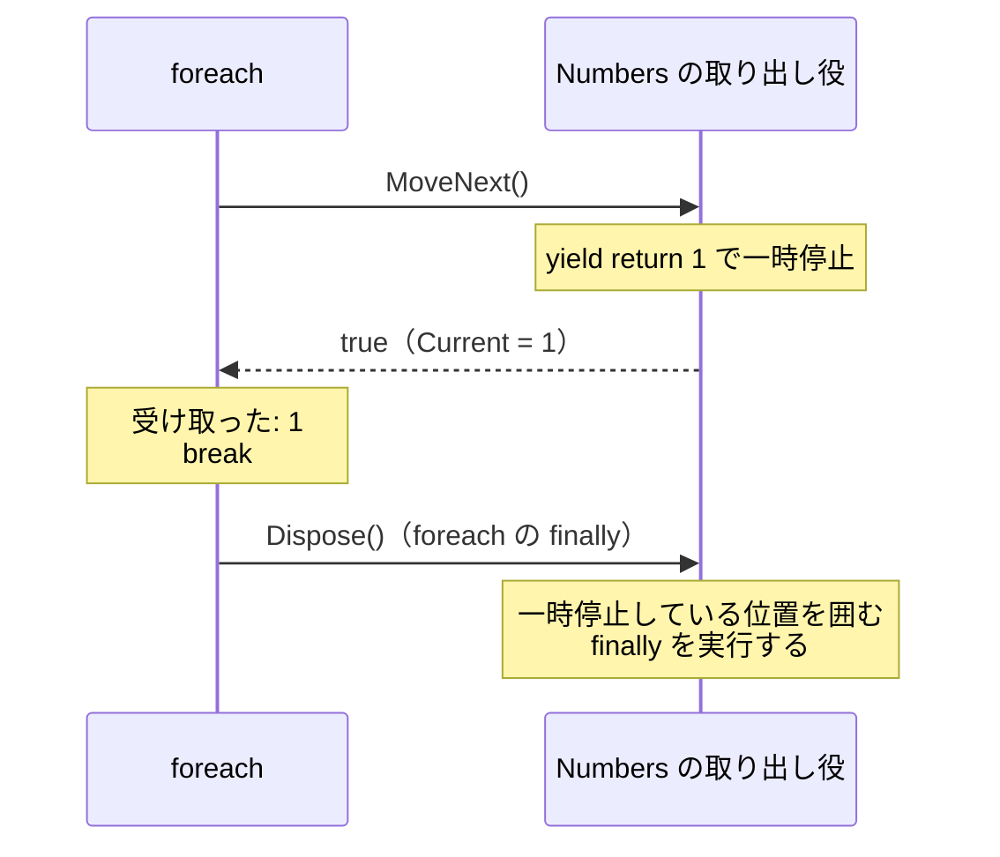

# イテレーターの後片付け（補足）

[IEnumerable\<T\> と foreach の仕組み](/unity-csharp-learning/csharp/ienumerable/) では、`IEnumerator<T>` が `IDisposable` を継承していて、`foreach` が最後に `Dispose` を呼ぶことに触れました。このページでは、`foreach` が `Dispose` を呼ぶ仕組みと、それによって、`foreach` を途中で `break` しても、イテレーターの中の `finally` や `using` による後片付けが確実に実行されることを学びます。

## 学習目標

このページを読み終えると、以下のことができるようになります。

- `foreach` 文が `try` / `finally` と `Dispose` の呼び出しに置き換えられることを説明できる
- `foreach` を途中で抜けたとき、イテレーターの `finally` がいつ実行されるかを説明できる
- イテレーターの中で `using` を使い、要素を返し終えたときや途中でやめたときにリソースを解放できる
- `foreach` を使わずに取り出し役を使うときは、`using` で `Dispose` を呼ぶ必要があることを説明できる

## 前提知識

- [IDisposable と using](/unity-csharp-learning/csharp/dispose-using/) を読んでいること
- [イテレーターと yield return](/unity-csharp-learning/csharp/iterators/) を読んでいること

---

## 1. foreach は最後に Dispose を呼ぶ

[IEnumerable\<T\> と foreach の仕組み](/unity-csharp-learning/csharp/ienumerable/) では、`foreach` 文の置き換えを、`Dispose` を省いて示しました。`Dispose` を含めると、`foreach` 文は、おおまかには次のように置き換えられます。

```csharp
List<string> names = new List<string> { "Alice", "Bob", "Carol" };

IEnumerator<string> enumerator = names.GetEnumerator();
try
{
    while (enumerator.MoveNext())
    {
        string name = enumerator.Current;
        Console.WriteLine(name);
    }
}
finally
{
    enumerator.Dispose();
}
```

```
Alice
Bob
Carol
```

[IDisposable と using](/unity-csharp-learning/csharp/dispose-using/) で学んだ `using` 文の正体と同じ形です。取り出し役の `Dispose` は `finally` の中で呼ばれるので、最後まで取り出したときだけでなく、`break` や `return` で `foreach` を抜けたときも、`foreach` の中で例外が発生したときも、必ず呼ばれます。

`List<T>` の取り出し役のように、後片付けするものがない取り出し役では、`Dispose` は何もしません。`Dispose` が意味を持つのは、次の節で見るイテレーターの取り出し役です。

---

## 2. イテレーターの finally

イテレーターの中に `try` / `finally` を書いたとき、`finally` がいつ実行されるかを確かめます。1 回目の `foreach` は最後まで取り出し、2 回目の `foreach` は最初の要素を受け取ったところで `break` します。

```csharp
foreach (int n in Numbers())
{
    Console.WriteLine($"受け取った: {n}");
}
Console.WriteLine("---");
foreach (int n in Numbers())
{
    Console.WriteLine($"受け取った: {n}");
    if (n == 1)
    {
        break;
    }
}
Console.WriteLine("終了");

IEnumerable<int> Numbers()
{
    try
    {
        yield return 1;
        yield return 2;
    }
    finally
    {
        Console.WriteLine("Numbers の finally");
    }
}
```

```
受け取った: 1
受け取った: 2
Numbers の finally
---
受け取った: 1
Numbers の finally
終了
```

1 回目は、最後の `MoveNext` で `Numbers` が最後まで実行されるので、そのときに `finally` が実行されます。

2 回目は、`Numbers` が `yield return 1` で一時停止したまま、`foreach` が `break` で終わります。このままでは `Numbers` の `finally` に到達しません。そこで、コンパイラーがイテレーターから作る取り出し役の `Dispose` は、一時停止している位置を囲む `finally` を実行するように作られています。`foreach` は `break` で抜けるときに `Dispose` を呼ぶので、`Numbers` の `finally` が実行されてから、`終了` が表示されます。



`foreach` の中で例外が発生したときも同じです。例外が `foreach` を抜ける前に `Dispose` が呼ばれ、イテレーターの `finally` が実行されます。

---

## 3. イテレーターの中の using

イテレーターの中で `using` を使うと、要素を返し終えたとき、または途中でやめたときに、リソースが解放されます。[IDisposable と using](/unity-csharp-learning/csharp/dispose-using/) で学んだように、`using` は `try` / `finally` に置き換えられるので、前の節と同じ仕組みで `Dispose` が呼ばれるからです。

次の `ReadLines` は、ファイルのようなリソースを開いて、1 行ずつ返すイテレーターの代わりです。`A` クラスは、開いたときと `Dispose` されたときにメッセージを表示します。

```csharp
foreach (string line in ReadLines())
{
    Console.WriteLine(line);
    if (line == "2 行目")
    {
        break;
    }
}
Console.WriteLine("終了");

IEnumerable<string> ReadLines()
{
    using A a = new A("a");
    for (int i = 1; i <= 5; i++)
    {
        yield return $"{i} 行目";
    }
}

class A : IDisposable
{
    private string _name;

    public A(string name)
    {
        _name = name;
        Console.WriteLine($"{_name} を開く");
    }

    public void Dispose()
    {
        Console.WriteLine($"{_name}.Dispose");
    }
}
```

```
a を開く
1 行目
2 行目
a.Dispose
終了
```

`2 行目` を受け取ったところで `break` すると、`ReadLines` は一時停止したまま `Dispose` が呼ばれ、`using` 宣言の `a` が解放されます。`ReadLines` の使い手は、リソースのことを知らなくても、`foreach` を使うだけで正しく後片付けされます。

また、`a を開く` が表示されるのは、[イテレーターと yield return](/unity-csharp-learning/csharp/iterators/) で学んだ遅延実行のとおり、`foreach` が最初の `MoveNext` を呼んだときです。`ReadLines()` を呼び出しただけでは、リソースは開かれません。

---

## よくあるミス

### foreach を使わずに取り出し役を使う

`GetEnumerator` で取り出し役を受け取り、`MoveNext` を自分で呼ぶときは、`Dispose` も自分で呼ばなければなりません。呼ばないと、イテレーターの `finally` は実行されません。

```csharp
// ❌ NG: Dispose を呼ばないので、Numbers の finally が実行されない
IEnumerator<int> enumerator = Numbers().GetEnumerator();
enumerator.MoveNext();
Console.WriteLine($"受け取った: {enumerator.Current}");
Console.WriteLine("終了");

IEnumerable<int> Numbers()
{
    try
    {
        yield return 1;
        yield return 2;
    }
    finally
    {
        Console.WriteLine("Numbers の finally");
    }
}
```

```
受け取った: 1
終了
```

`Numbers の finally` は、最後まで表示されません。取り出し役は `IDisposable` なので、`using` 宣言で受け取ります。

```csharp
// ✅ OK: using 宣言で受け取り、スコープの終わりで Dispose を呼ぶ
using IEnumerator<int> enumerator = Numbers().GetEnumerator();
enumerator.MoveNext();
Console.WriteLine($"受け取った: {enumerator.Current}");
Console.WriteLine("終了");

IEnumerable<int> Numbers()
{
    try
    {
        yield return 1;
        yield return 2;
    }
    finally
    {
        Console.WriteLine("Numbers の finally");
    }
}
```

```
受け取った: 1
終了
Numbers の finally
```

できるだけ `foreach` を使い、取り出し役を自分で扱うのは、`foreach` では書けない場合に限ります。

---

## ワンポイントアドバイス

### 非同期版の await foreach

[IAsyncEnumerable と await foreach](/unity-csharp-learning/csharp/async-streams/) で学ぶ `await foreach` も、同じ仕組みで後片付けをします。`Dispose` の代わりに、非同期に後片付けをする `DisposeAsync` を `finally` の中で `await` します。

---

## まとめ

- `foreach` 文は、取り出し役の `Dispose` を `finally` の中で呼ぶ形に置き換えられる。`break`・`return`・例外で抜けたときも `Dispose` が呼ばれる
- イテレーターの取り出し役の `Dispose` は、一時停止している位置を囲む `finally` を実行する
- イテレーターの中の `using` は、要素を返し終えたときか、`foreach` を途中で抜けたときにリソースを解放する
- 取り出し役を自分で扱うときは、`using` で受け取って `Dispose` を呼ぶ

---

## 理解度チェック

1. `foreach` を `break` で抜けたとき、イテレーターの中の `finally` が実行されるのはなぜですか？
2. 次のコードを実行すると何が出力されますか？

   ```csharp
   foreach (int n in Items())
   {
       Console.WriteLine(n);
       if (n == 2)
       {
           break;
       }
   }

   IEnumerable<int> Items()
   {
       try
       {
           for (int i = 1; i <= 3; i++)
           {
               yield return i;
           }
       }
       finally
       {
           Console.WriteLine("後片付け");
       }
   }
   ```

3. イテレーターの取り出し役を `GetEnumerator` で受け取り、`MoveNext` を自分で呼ぶときに注意することは何ですか？

<details markdown="1">
<summary>解答を見る</summary>

1. `foreach` は取り出し役の `Dispose` を `finally` の中で呼ぶので、`break` で抜けたときも `Dispose` が呼ばれるからです。イテレーターの取り出し役の `Dispose` は、一時停止している位置を囲む `finally` を実行します。
2. 次のように出力されます。`2` を受け取ったところで `break` し、`Dispose` によって `Items` の `finally` が実行されます。

   ```
   1
   2
   後片付け
   ```

3. `Dispose` を呼ぶことです。呼ばないと、イテレーターの中の `finally` や `using` による後片付けが実行されません。取り出し役は `using` 宣言で受け取ります。

</details>

---

## 次のステップ

[スレッドの基本](/unity-csharp-learning/csharp/threads/) では、複数の処理を同時に進めるためのスレッドを学びます。
