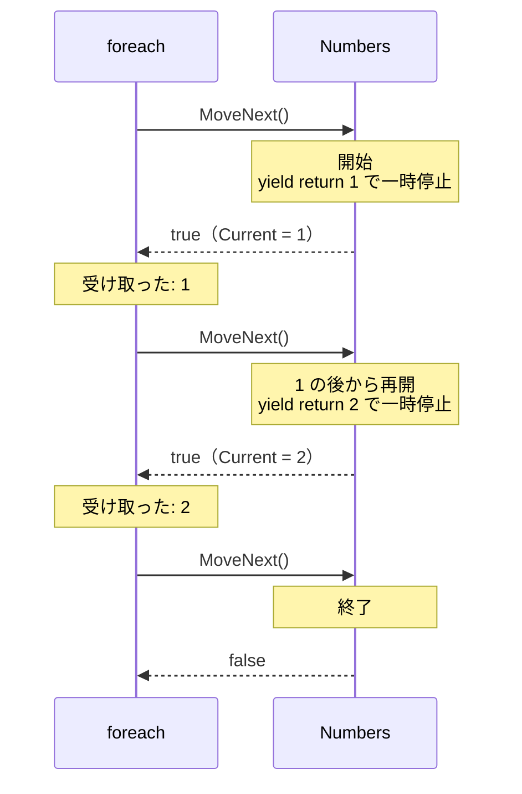
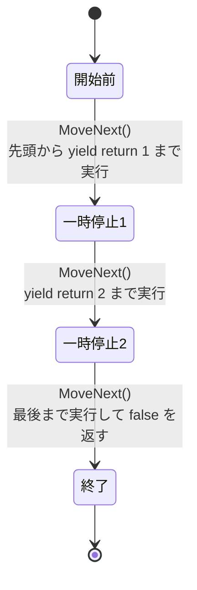

# イテレーターと yield return

**yield return** 文を使うと、`IEnumerable<T>` を返すメソッドを、要素を 1 つずつ返していく形で書けます。このようなメソッドを **イテレーター**（iterator）といいます。[IEnumerable\<T\> と foreach の仕組み](/unity-csharp-learning/csharp/ienumerable/) では取り出し役のクラスを手で書きましたが、イテレーターなら、その取り出し役をコンパイラーが代わりに作ってくれます。このページでは、イテレーターの書き方と、要素を求められるまで実行されないという実行の順序を学びます。

## 学習目標

このページを読み終えると、以下のことができるようになります。

- `yield return` を使って、`IEnumerable<T>` を返すイテレーターを書ける
- イテレーターが、要素を求められるたびに次の `yield return` まで実行されることを説明できる
- `yield break` で、途中で要素の取り出しを終えられる
- コンパイラーがイテレーターを取り出し役のクラスに置き換えることを説明できる

## 前提知識

- [IEnumerable\<T\> と foreach の仕組み](/unity-csharp-learning/csharp/ienumerable/) を読んでいること
- [共変・反変](/unity-csharp-learning/csharp/generic-variance/) を読んでいること

---

## 1. yield return で要素を返す

[IEnumerable\<T\> と foreach の仕組み](/unity-csharp-learning/csharp/ienumerable/) で作った `Countdown` を、イテレーターで書き直します。

**書式：[yield return 文](https://learn.microsoft.com/dotnet/csharp/language-reference/statements/yield)**
```
IEnumerable<T> メソッド名(パラメータ)
{
    yield return T型の値;
}
```

| 要素 | 説明 |
|---|---|
| `IEnumerable<T>` | イテレーターの戻り値の型。`IEnumerator<T>` にすることもできる |
| `yield return 値;` | 要素を 1 つ返す。メソッドは終わらず、次の要素を求められたら、この次の行から再開する |

```csharp
foreach (int n in Countdown(3))
{
    Console.WriteLine(n);
}

IEnumerable<int> Countdown(int from)
{
    for (int i = from; i >= 1; i--)
    {
        yield return i;
    }
}
```

```
3
2
1
```

`Countdown` は、`for` 文で `from` から 1 まで数えながら、`yield return` で数を 1 つずつ返しています。前のページでは 2 つのクラスと 7 つのメンバーが必要でしたが、イテレーターならこれだけで済みます。「今どこまで数えたか」は、ループ変数 `i` がそのまま覚えています。

### GetEnumerator をイテレーターで書く

イテレーターの戻り値の型は `IEnumerator<T>` にもできます。自分のクラスを `foreach` で回せるようにするときは、`GetEnumerator` をイテレーターで書けば、取り出し役のクラスを作らずに済みます。次のコードは、前のコード例とは別のプログラムです。

```csharp
Countdown countdown = new Countdown(3);
foreach (int n in countdown)
{
    Console.WriteLine(n);
}

class Countdown : IEnumerable<int>
{
    private int _from;

    public Countdown(int from)
    {
        _from = from;
    }

    public IEnumerator<int> GetEnumerator()
    {
        for (int i = _from; i >= 1; i--)
        {
            yield return i;
        }
    }

    System.Collections.IEnumerator System.Collections.IEnumerable.GetEnumerator()
    {
        return GetEnumerator();
    }
}
```

```
3
2
1
```

前のページの `CountdownEnumerator` クラスがなくなり、`GetEnumerator` の中身が `for` 文だけになりました。ここでは `using System.Collections;` を書かずに、`System.Collections.IEnumerator` のように名前空間を含めた名前で書いています。

---

## 2. 要素を求められるまで実行されない

イテレーターは、ふつうのメソッドとは実行の順序が違います。次のコードで、`Numbers` の中の処理がいつ実行されるかを確かめます。

```csharp
Console.WriteLine("Numbers を呼び出す");
IEnumerable<int> numbers = Numbers();
Console.WriteLine("foreach を始める");

foreach (int n in numbers)
{
    Console.WriteLine($"受け取った: {n}");
}

IEnumerable<int> Numbers()
{
    Console.WriteLine("  Numbers: 開始");
    yield return 1;
    Console.WriteLine("  Numbers: 1 の後から再開");
    yield return 2;
    Console.WriteLine("  Numbers: 終了");
}
```

```
Numbers を呼び出す
foreach を始める
  Numbers: 開始
受け取った: 1
  Numbers: 1 の後から再開
受け取った: 2
  Numbers: 終了
```

- `Numbers()` を呼び出しても、`Numbers` の中の処理は 1 行も実行されない。取り出し役を持つ `IEnumerable<int>` が返されるだけ
- `foreach` が最初に `MoveNext` を呼ぶと、`Numbers` の先頭から最初の `yield return 1` まで実行し、`1` を `Current` にして一時停止する
- 次の `MoveNext` で、一時停止したところから `yield return 2` まで実行する
- 3 回目の `MoveNext` で、残りを最後まで実行する。`yield return` がないままメソッドの終わりに来たので、`MoveNext` は `false` を返し、`foreach` が終わる

このように、要素が求められるまで処理を後回しにすることを **遅延実行**（deferred execution）といいます。



---

## 3. yield break で終える

途中で要素の取り出しを終えるには、`yield break` 文を使います。`yield break` を実行すると、`MoveNext` は `false` を返し、`foreach` が終わります。

**書式：[yield break 文](https://learn.microsoft.com/dotnet/csharp/language-reference/statements/yield)**
```
yield break;
```

次の `ValidScores` は、点数の配列を先頭から返していき、負の数（入力の終わりの印）が出てきたら、そこで終えます。

```csharp
int[] scores = { 72, 85, -1, 90 };

foreach (int s in ValidScores(scores))
{
    Console.WriteLine(s);
}

IEnumerable<int> ValidScores(int[] values)
{
    foreach (int v in values)
    {
        if (v < 0)
        {
            yield break;
        }
        yield return v;
    }
}
```

```
72
85
```

`-1` が出てきた時点で `yield break` が実行されるので、その後ろの `90` は返されません。

---

## 4. 終わりのないシーケンス

イテレーターは要素を求められた分だけ実行されるので、終わりのない要素の並び（**シーケンス**）も表せます。次の `PowersOfTwo` は、`while (true)` で 2 のべき乗を返し続けます。

```csharp
foreach (int n in PowersOfTwo())
{
    if (n > 100)
    {
        break;
    }
    Console.WriteLine(n);
}

IEnumerable<int> PowersOfTwo()
{
    int value = 1;
    while (true)
    {
        yield return value;
        value *= 2;
    }
}
```

```
1
2
4
8
16
32
64
```

`PowersOfTwo` を配列や `List<int>` を返すメソッドとして書くと、すべての要素を先に作らなければならないので、終わりのない並びは返せません。イテレーターなら、`foreach` が `break` した時点で、それ以上の要素は作られません。どこでやめるかを、要素を作る側ではなく使う側が決められます。

---

## 5. イテレーターの正体

コンパイラーは、イテレーターを、[IEnumerable\<T\> と foreach の仕組み](/unity-csharp-learning/csharp/ienumerable/) で手で書いたような、`IEnumerable<T>` と `IEnumerator<T>` を実装したクラスに置き換えます。このクラスは、次のものをフィールドとして持ちます。

- メソッドのパラメータとローカル変数（1 節の `Countdown` なら `from` と `i`）
- どの `yield return` まで実行したかを表す番号
- 最後に返した値（`Current`）

`MoveNext` が呼ばれると、覚えている番号の位置から次の `yield return` まで実行し、番号と `Current` を更新して `true` を返します。このように、「今どの状態にいるか」を覚えておき、呼ばれるたびに次の状態へ進むオブジェクトを **ステートマシン**（state machine）といいます。前のページで `CountdownEnumerator` の `_current` フィールドを使って自分で管理していた状態を、コンパイラーが管理してくれるのです。



図は、2 節の `Numbers` の状態の移り変わりです。

### IEnumerable\<T\> は共変

[共変・反変](/unity-csharp-learning/csharp/generic-variance/) で学んだ共変のインターフェイスの代表が、`IEnumerable<T>` です。`IEnumerable<T>` は要素を取り出すだけで、要素を入れるメンバーを持たないので、型パラメータに `out` が付いています（`IEnumerable<out T>`）。そのため、`IEnumerable<string>` を `IEnumerable<object>` の変数に代入できます。

```csharp
IEnumerable<string> names = Names();
IEnumerable<object> objects = names;
foreach (object o in objects)
{
    Console.WriteLine(o);
}

IEnumerable<string> Names()
{
    yield return "Alice";
    yield return "Bob";
}
```

```
Alice
Bob
```

---

## よくあるミス

### 列挙するたびに、最初から実行し直される

イテレーターが返した `IEnumerable<T>` を 2 回 `foreach` で回すと、そのたびに `GetEnumerator` が新しい取り出し役を作り、イテレーターは最初から実行し直されます。

```csharp
IEnumerable<int> numbers = Numbers();

foreach (int n in numbers)
{
    Console.WriteLine($"1 回目: {n}");
}
foreach (int n in numbers)
{
    Console.WriteLine($"2 回目: {n}");
}

IEnumerable<int> Numbers()
{
    Console.WriteLine("Numbers: 開始");
    yield return 1;
    yield return 2;
}
```

```
Numbers: 開始
1 回目: 1
1 回目: 2
Numbers: 開始
2 回目: 1
2 回目: 2
```

`Numbers: 開始` が 2 回表示されています。変数 `numbers` に入っているのは要素そのものではなく、「要素の作り方」です。イテレーターの中で時間のかかる処理をしている場合、回すたびにその処理が繰り返されます。何度も使う要素は、一度 `List<T>` に入れてから使います。

### イテレーターで return に値を書く

イテレーターの中では、`return 値;` で値を返すことはできません。要素は `yield return` で返し、途中で終えるときは `yield break` を使います。

```csharp
// ❌ NG: イテレーターで return に値を書くとコンパイルエラーになる（CS1622）
IEnumerable<int> Numbers()
{
    yield return 1;
    return 2;
}
```

---

## ワンポイントアドバイス

### yield return を書けない場所

`catch` を持つ `try` ブロックの中には、`yield return` を書けません（CS1626）。`finally` だけを持つ `try` ブロックの中には書けます。`foreach` を途中で `break` したときにその `finally` がいつ実行されるかは、[IDisposable と using](/unity-csharp-learning/csharp/dispose-using/) で学ぶ `Dispose` と関係があります。

---

## まとめ

- `yield return` を使うメソッドをイテレーターといい、戻り値の型は `IEnumerable<T>` か `IEnumerator<T>` にする
- イテレーターを呼び出しても、中の処理は実行されない。`MoveNext` が呼ばれるたびに、次の `yield return` まで実行して一時停止する（遅延実行）
- `yield break` で、途中で要素の取り出しを終えられる
- 要素を求められた分だけ実行されるので、終わりのないシーケンスも表せる
- コンパイラーは、イテレーターを `IEnumerable<T>` と `IEnumerator<T>` を実装したステートマシンのクラスに置き換える
- イテレーターが返した `IEnumerable<T>` は、回すたびに最初から実行し直される

---

## 理解度チェック

1. 次のコードを実行すると何が出力されますか？

   ```csharp
   foreach (int n in Evens(7))
   {
       Console.Write($"{n} ");
   }
   Console.WriteLine();

   IEnumerable<int> Evens(int max)
   {
       for (int i = 0; ; i += 2)
       {
           if (i > max)
           {
               yield break;
           }
           yield return i;
       }
   }
   ```

2. 次のコードを実行すると何が出力されますか？

   ```csharp
   IEnumerable<int> seq = Make();
   Console.WriteLine("A");
   foreach (int n in seq)
   {
       Console.WriteLine(n);
   }

   IEnumerable<int> Make()
   {
       Console.WriteLine("B");
       yield return 1;
       Console.WriteLine("C");
   }
   ```

3. `Repeat("abc", 3)` を `foreach` で回すと `"abc"` が 3 回取り出されるイテレーター `Repeat` を書いてください。

<details markdown="1">
<summary>解答を見る</summary>

1. `0 2 4 6 ` が出力されます（最後に空白が 1 つ付きます）。`i` が `8` になったとき `8 > 7` なので `yield break` が実行され、取り出しが終わります。
2. 次のように出力されます。`Make()` を呼び出した時点では中の処理は実行されないので、`A` が先に表示されます。`foreach` の最初の `MoveNext` で `B` を表示して `1` を返し、次の `MoveNext` で `C` を表示してから終わります。

   ```
   A
   B
   1
   C
   ```

3. ```csharp
   IEnumerable<string> Repeat(string value, int count)
   {
       for (int i = 0; i < count; i++)
       {
           yield return value;
       }
   }
   ```

</details>

---

## 次のステップ

[値型と参照型](/unity-csharp-learning/csharp/value-reference-types/) では、代入やメソッドの呼び出しでコピーされるものが型によって違うことと、その背景にあるメモリの仕組みを学びます。
