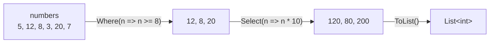

# LINQ の基本

**LINQ**（Language Integrated Query、リンク）は、配列やコレクションの要素を絞り込んだり、変換したり、集計したりする処理を、メソッドの呼び出しとラムダ式で短く書ける仕組みです。`foreach` と `if` と一時的な `List<T>` を組み合わせて書いていた処理が、「何をしたいか」を並べるだけで書けるようになります。このページでは、LINQ の代表的なメソッドである `Where` と `Select` を使って、LINQ の基本的な書き方を学びます。

## 学習目標

このページを読み終えると、以下のことができるようになります。

- `Where` で条件に合う要素を絞り込み、`Select` で要素を変換できる
- LINQ のメソッドが `IEnumerable<T>` の拡張メソッドであることを説明できる
- メソッドチェーンで処理をつなげ、`ToList` や `ToArray` で結果をコレクションにできる
- 配列・`List<T>`・`Dictionary<TKey, TValue>`・文字列に LINQ を使える

## 前提知識

- [イテレーターと yield return](/unity-csharp-learning/csharp/iterators/) を読んでいること
- [拡張メソッド](/unity-csharp-learning/csharp/extension-methods/) を読んでいること
- [ラムダ式](/unity-csharp-learning/csharp/lambda/) を読んでいること
- [タプル](/unity-csharp-learning/csharp/tuples/) を読んでいること

---

## 1. ループで書く絞り込みと変換

次のコードは、数値の配列から 8 以上の数だけを取り出し、それぞれを 10 倍した結果を `List<int>` に集めます。

```csharp
int[] numbers = { 5, 12, 8, 3, 20, 7 };

List<int> result = new List<int>();
foreach (int n in numbers)
{
    if (n >= 8)
    {
        result.Add(n * 10);
    }
}
Console.WriteLine(string.Join(", ", result));
```

```
120, 80, 200
```

このコードがしていることは、「8 以上に絞り込む」と「10 倍に変換する」の 2 つだけです。しかし、コードを読むと、結果を入れる `List<int>` の用意、`foreach` による繰り返し、`if` による判定、`Add` による追加が混ざっていて、何をしたいのかを読み取るのに少し時間がかかります。絞り込みの条件を変えたり、変換を 1 段階増やしたりするたびに、このループを書き換えることになります。

---

## 2. Where と Select

LINQ を使うと、同じ処理を次のように書けます。

```csharp
int[] numbers = { 5, 12, 8, 3, 20, 7 };

IEnumerable<int> large = numbers.Where(n => n >= 8);
IEnumerable<int> scaled = large.Select(n => n * 10);

Console.WriteLine(string.Join(", ", large));
Console.WriteLine(string.Join(", ", scaled));
```

```
12, 8, 20
120, 80, 200
```

`Where` は、条件に合う要素だけを返します。`Select` は、要素を 1 つずつ変換した結果を返します。条件や変換の内容は、[ラムダ式](/unity-csharp-learning/csharp/lambda/) で渡します。

**書式：[Enumerable.Where メソッド](https://learn.microsoft.com/dotnet/api/system.linq.enumerable.where)**
```csharp
public static IEnumerable<TSource> Where<TSource>(this IEnumerable<TSource> source, Func<TSource, bool> predicate);
```

**書式：[Enumerable.Select メソッド](https://learn.microsoft.com/dotnet/api/system.linq.enumerable.select)**
```csharp
public static IEnumerable<TResult> Select<TSource, TResult>(this IEnumerable<TSource> source, Func<TSource, TResult> selector);
```

| パラメータ | 説明 |
|---|---|
| `source` | 元の要素の並び。`this` が付いているので、`numbers.Where(...)` のように、元の並びのメソッドのように呼び出せる |
| `predicate` | 要素を受け取り、残すなら `true` を返すメソッド |
| `selector` | 要素を受け取り、変換した結果を返すメソッド |

### LINQ のメソッドは IEnumerable\<T\> の拡張メソッド

書式を見ると、`Where` と `Select` は、[System.Linq.Enumerable クラス](https://learn.microsoft.com/dotnet/api/system.linq.enumerable) の static メソッドで、最初のパラメータに `this` が付いています。[拡張メソッド](/unity-csharp-learning/csharp/extension-methods/) で学んだように、これは `IEnumerable<TSource>` の拡張メソッドです。そのため、`IEnumerable<T>` を実装しているものなら、何にでも使えます。

`Enumerable` クラスは `System.Linq` 名前空間にあります。このサイトのコード例を実行する環境では、`System.Linq` の `using` ディレクティブがあらかじめ読み込まれているので、何も書かずに使えます。

`Where` と `Select` の戻り値も `IEnumerable<T>` です。[ジェネリックメソッド](/unity-csharp-learning/csharp/generic-methods/) で学んだ型推論によって、`Select(n => n * 10)` の `TResult` は、ラムダ式が返す値の型（`int`）に決まります。

---

## 3. メソッドチェーンと ToList

`Where` も `Select` も `IEnumerable<T>` を返すので、戻り値に続けて次のメソッドを呼べます。このように、メソッドの呼び出しを `.` でつなげて書く書き方を **メソッドチェーン**（method chain）といいます。

結果を `List<T>` や配列として受け取りたいときは、最後に [ToList メソッド](https://learn.microsoft.com/dotnet/api/system.linq.enumerable.tolist) や [ToArray メソッド](https://learn.microsoft.com/dotnet/api/system.linq.enumerable.toarray) を呼びます。

```csharp
int[] numbers = { 5, 12, 8, 3, 20, 7 };

List<int> result = numbers
    .Where(n => n >= 8)
    .Select(n => n * 10)
    .ToList();

Console.WriteLine(string.Join(", ", result));
```

```
120, 80, 200
```

1 節のループと同じ結果です。上から「8 以上に絞り込む」「10 倍にする」「`List<int>` にする」と読めば、何をしているかがそのままわかります。条件や変換を変えるときも、該当する行だけを直せば済みます。



---

## 4. いろいろなコレクションに使う

LINQ のメソッドは `IEnumerable<T>` の拡張メソッドなので、[IEnumerable\<T\> と foreach の仕組み](/unity-csharp-learning/csharp/ienumerable/) で学んだように `IEnumerable<T>` を実装しているものなら、何にでも同じように使えます。

```csharp
List<string> names = new List<string> { "Alice", "Bob", "Carol", "Dave" };
IEnumerable<string> shortNames = names.Where(name => name.Length <= 4);
Console.WriteLine(string.Join(", ", shortNames));

Dictionary<string, int> scores = new Dictionary<string, int>
{
    ["Alice"] = 80,
    ["Bob"] = 65,
    ["Carol"] = 92,
};
IEnumerable<string> passed = scores
    .Where(pair => pair.Value >= 70)
    .Select(pair => pair.Key);
Console.WriteLine(string.Join(", ", passed));

string text = "Hello, World";
IEnumerable<char> upper = text.Where(c => c >= 'A' && c <= 'Z');
Console.WriteLine(string.Join(", ", upper));
```

```
Bob, Dave
Alice, Carol
H, W
```

- `List<string>` の要素は `string` なので、ラムダ式のパラメータ `name` も `string` になる
- `Dictionary<string, int>` の要素は `KeyValuePair<string, int>` なので、`pair.Value` で値を調べ、`pair.Key` でキーに変換している
- `string` は `IEnumerable<char>` を実装しているので、文字を 1 つずつ調べられる

### タプルに変換する

`Select` で、要素を [タプル](/unity-csharp-learning/csharp/tuples/) に変換することもできます。元の値と計算した値を組にして、後の処理に渡したいときに便利です。

```csharp
string[] names = { "Alice", "Bob", "Carol" };

IEnumerable<(string Name, int Length)> pairs = names.Select(name => (name, name.Length));
foreach ((string name, int length) in pairs)
{
    Console.WriteLine($"{name}: {length} 文字");
}
```

```
Alice: 5 文字
Bob: 3 文字
Carol: 5 文字
```

`foreach` の変数の部分にも、タプルの分解を書けます。

---

## よくあるミス

### 戻り値を受け取らない

LINQ のメソッドは、元の配列やコレクションを書き換えません。条件に合う要素や変換した結果は、新しい `IEnumerable<T>` として返されます。戻り値を受け取らずに呼んでも、何も変わりません。

```csharp
// ❌ NG: Where は numbers を書き換えないので、numbers は元のまま
int[] numbers = { 5, 12, 8 };
numbers.Where(n => n >= 8);

// ✅ OK: 戻り値を受け取る
IEnumerable<int> large = numbers.Where(n => n >= 8);
```

---

## ワンポイントアドバイス

### ループと LINQ の使い分け

LINQ は、絞り込みや変換を組み合わせる処理を読みやすく書けます。一方で、`Where` や `Select` を呼ぶたびに、次のページで学ぶ取り出し役などのオブジェクトがヒープに作られ、ラムダ式の呼び出しも加わります。何度も繰り返し実行される、特に速さが求められる処理では、`for` や `foreach` のループのほうが速いことがあります。ふつうは読みやすさを優先して LINQ を使い、性能が問題になったところだけをループに書き換えます。

---

## まとめ

- LINQ は、要素の絞り込み・変換・集計などを、メソッドとラムダ式で書く仕組み
- `Where` は条件に合う要素を、`Select` は要素を変換した結果を返す
- LINQ のメソッドは `System.Linq.Enumerable` クラスにある `IEnumerable<T>` の拡張メソッドなので、`IEnumerable<T>` を実装しているものなら何にでも使える
- LINQ のメソッドは `IEnumerable<T>` を返すので、メソッドチェーンでつなげられる。`ToList` や `ToArray` で結果をコレクションにする
- LINQ のメソッドは元のコレクションを書き換えない。結果は戻り値で受け取る

---

## 理解度チェック

1. 次のコードを実行すると何が出力されますか？

   ```csharp
   int[] values = { 1, 2, 3, 4, 5, 6 };
   List<int> result = values
       .Where(v => v % 2 == 0)
       .Select(v => v * v)
       .ToList();
   Console.WriteLine(string.Join(" ", result));
   ```

2. 自分で作ったクラスのコレクションに `Where` を使えるようにするには、そのクラスが何を実装していればよいですか？
3. `string[] words` から、5 文字以上の単語を大文字に変換した `List<string>` を作るコードを書いてください。文字列を大文字にするには `ToUpper` メソッドを使います。

<details markdown="1">
<summary>解答を見る</summary>

1. `4 16 36` が出力されます。偶数の `2`・`4`・`6` に絞り込み、それぞれを 2 乗しています。
2. `IEnumerable<T>` です。`Where` は `IEnumerable<T>` の拡張メソッドなので、`IEnumerable<T>` を実装していれば使えます。
3. ```csharp
   List<string> result = words
       .Where(w => w.Length >= 5)
       .Select(w => w.ToUpper())
       .ToList();
   ```

</details>

---

## 次のステップ

[遅延実行と即時実行](/unity-csharp-learning/csharp/linq-deferred/) では、`Where` や `Select` がいつ実行されるのかと、それによって起きる落とし穴を学びます。
