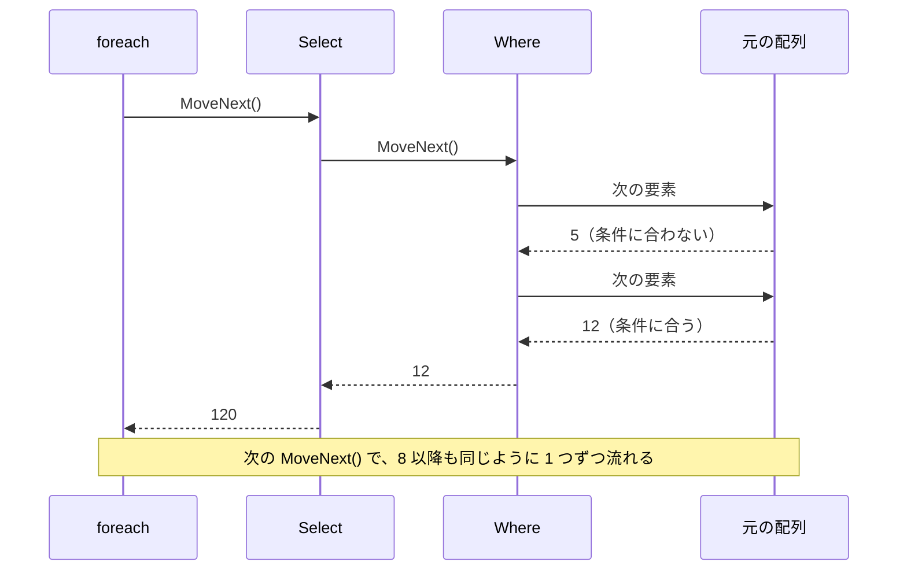

# 遅延実行と即時実行

`Where` や `Select` を呼んでも、その時点では要素は 1 つも調べられません。要素を調べるのは、結果を `foreach` などで回したときです。このように処理を後回しにすることを **遅延実行**（deferred execution）といいます。一方、`ToList` や `Count` は、呼んだ時点ですべての要素を調べます。これを **即時実行**（immediate execution）といいます。このページでは、LINQ の 2 種類の実行のタイミングと、遅延実行によって起きる落とし穴を学びます。

## 学習目標

このページを読み終えると、以下のことができるようになります。

- `Where` や `Select` が、結果を回すまで実行されないことを説明できる
- 遅延実行の結果を回すたびに、元のコレクションの今の要素で実行し直されることを説明できる
- ラムダ式がキャプチャした変数の値が、回したときの値で使われることを説明できる
- `ToList` などで即時実行し、結果を確定できる

## 前提知識

- [LINQ の基本](/unity-csharp-learning/csharp/linq-basics/) を読んでいること
- [イテレーターと yield return](/unity-csharp-learning/csharp/iterators/) を読んでいること
- [変数キャプチャ](/unity-csharp-learning/csharp/variable-capture/) を読んでいること

---

## 1. Where は回すまで実行されない

`Where` に渡すラムダ式にメッセージを表示させて、要素がいつ調べられるかを確かめます。

```csharp
int[] numbers = { 5, 12, 8 };

Console.WriteLine("Where を呼ぶ");
IEnumerable<int> large = numbers.Where(n =>
{
    Console.WriteLine($"  {n} を調べる");
    return n >= 8;
});
Console.WriteLine("foreach を始める");

foreach (int n in large)
{
    Console.WriteLine($"受け取った: {n}");
}
```

```
Where を呼ぶ
foreach を始める
  5 を調べる
  12 を調べる
受け取った: 12
  8 を調べる
受け取った: 8
```

`Where` を呼んだ時点では、`n を調べる` は 1 行も表示されていません。`foreach` が始まってから、要素を 1 つずつ調べ、条件に合った要素を見つけるたびに `foreach` に渡しています。

これは、[イテレーターと yield return](/unity-csharp-learning/csharp/iterators/) で学んだイテレーターと同じ動きです。`Where` が返す `IEnumerable<int>` は、要素そのものではなく「元の並びから、条件に合う要素を取り出す方法」を持ったオブジェクトです。`foreach` が `MoveNext` を呼ぶたびに、元の並びから次の要素を取り出して条件を調べます。

`Where` と `Select` をつなげた場合も、要素は 1 つずつ、`Where` と `Select` を通り抜けていきます。すべての要素を `Where` で絞り込んでから `Select` に渡すわけではありません。



---

## 2. 回すたびに実行し直される

遅延実行の結果は、回すたびに、元のコレクションのその時点の要素で実行し直されます。

```csharp
List<int> numbers = new List<int> { 5, 12, 8 };
IEnumerable<int> large = numbers.Where(n => n >= 8);

Console.WriteLine(string.Join(", ", large));

numbers.Add(30);
Console.WriteLine(string.Join(", ", large));
```

```
12, 8
12, 8, 30
```

`large` を作った後に `numbers` に `30` を追加すると、次に `large` を回したときには `30` も含まれます。`large` は、作った時点の結果を覚えているのではなく、回すたびに `numbers` を調べ直しているからです。

### キャプチャした変数は、回したときの値が使われる

ラムダ式が外側の変数を使っている場合、その変数の値も、回した時点のものが使われます。[変数キャプチャ](/unity-csharp-learning/csharp/variable-capture/) で学んだように、ラムダ式は変数の値ではなく、変数そのものをキャプチャしているからです。

```csharp
int[] numbers = { 5, 12, 8, 3, 20 };
int threshold = 10;

IEnumerable<int> large = numbers.Where(n => n >= threshold);

threshold = 4;
Console.WriteLine(string.Join(", ", large));
```

```
5, 12, 8, 20
```

`Where` を呼んだときの `threshold` は `10` でしたが、回したときには `4` に変わっています。そのため、`4` 以上の要素が取り出されます。

---

## 3. 即時実行で結果を確定する

`ToList` や `ToArray` は、呼んだ時点ですべての要素を取り出して、新しいコレクションを作ります。`Count`・`Sum`・`Max` のように 1 つの値を返すメソッドも、呼んだ時点ですべての要素を調べて答えを返します。これらは即時実行です。

```csharp
List<int> numbers = new List<int> { 5, 12, 8 };
List<int> snapshot = numbers.Where(n => n >= 8).ToList();
int count = numbers.Count(n => n >= 8);

numbers.Add(30);
Console.WriteLine($"snapshot: {string.Join(", ", snapshot)}");
Console.WriteLine($"count: {count}");
Console.WriteLine($"今数えると: {numbers.Count(n => n >= 8)}");
```

```
snapshot: 12, 8
count: 2
今数えると: 3
```

`snapshot` は `ToList` を呼んだ時点の結果を持つ `List<int>` なので、後から `numbers` に追加しても変わりません。[Count メソッド](https://learn.microsoft.com/dotnet/api/system.linq.enumerable.count) に条件を渡すと、条件に合う要素の数を返します。

| 実行のタイミング | 主なメソッド | 戻り値 |
|---|---|---|
| 遅延実行 | `Where`・`Select`・`OrderBy`・`Take`・`Skip`・`Distinct` など | `IEnumerable<T>`（取り出す方法を持ったオブジェクト） |
| 即時実行 | `ToList`・`ToArray`・`ToDictionary`・`Count`・`Sum`・`Max`・`First`・`Any` など | コレクションや 1 つの値 |

おおまかには、`IEnumerable<T>` を返すメソッドは遅延実行、それ以外を返すメソッドは即時実行です。

---

## よくあるミス

### 同じクエリを何度も回す

遅延実行の結果を何度も使うと、そのたびに元の並びを最初から調べ直します。条件を調べた回数を数えてみます。

```csharp
int calls = 0;
int[] numbers = { 5, 12, 8, 3, 20 };

IEnumerable<int> large = numbers.Where(n =>
{
    calls++;
    return n >= 8;
});

Console.WriteLine($"個数: {large.Count()}");
Console.WriteLine($"合計: {large.Sum()}");
Console.WriteLine($"最大: {large.Max()}");
Console.WriteLine($"条件を調べた回数: {calls}");
```

```
個数: 3
合計: 40
最大: 20
条件を調べた回数: 15
```

要素は 5 つなのに、条件が 15 回調べられています。`Count`・`Sum`・`Max` のそれぞれが、`large` を最初から回しているからです。条件の中で時間のかかる処理をしていると、その処理も 3 倍の回数実行されます。

何度も使う結果は、一度 `ToList` で確定させてから使います。

```csharp
int calls = 0;
int[] numbers = { 5, 12, 8, 3, 20 };

List<int> large = numbers.Where(n =>
{
    calls++;
    return n >= 8;
}).ToList();

Console.WriteLine($"個数: {large.Count}");
Console.WriteLine($"合計: {large.Sum()}");
Console.WriteLine($"最大: {large.Max()}");
Console.WriteLine($"条件を調べた回数: {calls}");
```

```
個数: 3
合計: 40
最大: 20
条件を調べた回数: 5
```

`ToList` を呼んだときに 5 回調べただけで、あとは確定した `List<int>` を使っています。

### 問題が起きるのは回したとき

遅延実行では、ラムダ式の中で起きる問題も、回したときに初めて表れます。

```csharp
// ❌ NG: "abc" は数値に変換できないが、Select を呼んだ時点では何も起きない
string[] inputs = { "10", "20", "abc" };

IEnumerable<int> values = inputs.Select(s => int.Parse(s));
Console.WriteLine("Select を呼んだ");

foreach (int v in values)
{
    Console.WriteLine(v);  // 10 と 20 を表示した後、"abc" を変換するときに FormatException が発生する
}
```

`Select` を呼んだ行は問題なく通り、`foreach` で `"abc"` を変換しようとしたところで `FormatException` が発生してプログラムが止まります。問題の原因は `Select` に渡したラムダ式ですが、止まる場所は `foreach` です。クエリを作る場所と回す場所が離れていると、原因を探しにくくなります。

---

## まとめ

- `Where` や `Select` は遅延実行。呼んだ時点では何もせず、結果を回したときに要素を 1 つずつ処理する
- 遅延実行の結果は、回すたびに、元のコレクションのその時点の要素で実行し直される
- ラムダ式がキャプチャした変数は、回した時点の値が使われる
- `ToList`・`ToArray`・`Count`・`Sum` などは即時実行。呼んだ時点ですべての要素を処理する
- 何度も使う結果は `ToList` などで確定させる
- 遅延実行では、ラムダ式の中の問題も回したときに表れる

---

## 理解度チェック

1. 次のコードを実行すると何が出力されますか？

   ```csharp
   List<int> list = new List<int> { 1, 2, 3 };
   IEnumerable<int> query = list.Select(x => x * 10);
   List<int> fixedList = query.ToList();

   list.Add(4);
   Console.WriteLine(query.Count());
   Console.WriteLine(fixedList.Count);
   ```

2. `Where` を呼んだだけで、`foreach` などで一度も回さなかった場合、`Where` に渡したラムダ式は何回呼ばれますか？
3. 遅延実行の結果を `Count`・`Sum`・`Average` の 3 つで使うとき、`ToList` を先に呼んでおくとよいのはなぜですか？

<details markdown="1">
<summary>解答を見る</summary>

1. 次のように出力されます。`query` は遅延実行なので、`Count` を呼んだ時点の `list`（4 要素）で数えます。`fixedList` は `ToList` を呼んだ時点の 3 要素のままです。

   ```
   4
   3
   ```

2. 1 回も呼ばれません。`Where` は遅延実行なので、結果を回すまで要素を調べません。
3. `Count`・`Sum`・`Average` は、それぞれ結果を最初から回すので、元の並びの要素が 3 回ずつ調べ直されるからです。`ToList` で確定させておけば、調べるのは 1 回で済みます。

</details>

---

## 次のステップ

[Where と Select を自作する（補足）](/unity-csharp-learning/csharp/linq-implementation/) では、拡張メソッドとイテレーターを使って `Where` と `Select` を自分で作り、LINQ の仕組みを確かめます。
