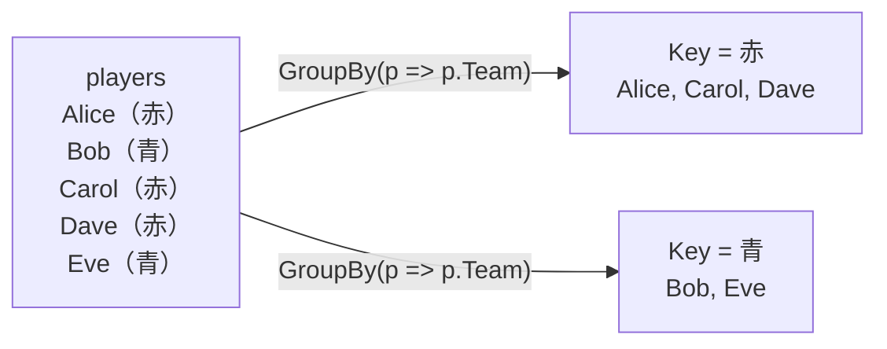

# グループ化と結合

「チームごとの人数」「月ごとの売上」のように、要素をキーごとにまとめて集計したいことがあります。このページでは、要素をキーごとにまとめる `GroupBy`、`Dictionary<TKey, TValue>` を作る `ToDictionary`、入れ子になった並びを平らにする `SelectMany`、2 つの並びをキーで結び付ける `Join` を学びます。結果を表す型として、名前のない型を作る **匿名型** も紹介します。

## 学習目標

このページを読み終えると、以下のことができるようになります。

- `GroupBy` で要素をキーごとにまとめ、グループごとに集計できる
- `ToDictionary` で、並びから `Dictionary<TKey, TValue>` を作れる
- `SelectMany` で、要素ごとの並びを 1 つの並びにまとめられる
- `Join` で、2 つの並びをキーで結び付けられる
- 匿名型で、名前のない型のオブジェクトを作れる

## 前提知識

- [並べ替え・集計・要素の取り出し](/unity-csharp-learning/csharp/linq-aggregation/) を読んでいること
- [Dictionary\<TKey, TValue\>](/unity-csharp-learning/csharp/dictionary/) を読んでいること

---

このページのコード例でも、[並べ替え・集計・要素の取り出し](/unity-csharp-learning/csharp/linq-aggregation/) と同じ `players` を使います。コード例は、特に断りがなければ、この宣言の後に続けて書きます。

```csharp
(string Name, int Score, string Team)[] players =
{
    ("Alice", 80, "赤"),
    ("Bob", 65, "青"),
    ("Carol", 92, "赤"),
    ("Dave", 65, "赤"),
    ("Eve", 78, "青"),
};
```

---

## 1. GroupBy でキーごとにまとめる

[GroupBy メソッド](https://learn.microsoft.com/dotnet/api/system.linq.enumerable.groupby) は、要素をキーの値ごとにまとめた **グループ** の並びを返します。

**書式：[Enumerable.GroupBy メソッド](https://learn.microsoft.com/dotnet/api/system.linq.enumerable.groupby)**
```csharp
public static IEnumerable<IGrouping<TKey, TSource>> GroupBy<TSource, TKey>(this IEnumerable<TSource> source, Func<TSource, TKey> keySelector);
```

| パラメータ | 説明 |
|---|---|
| `keySelector` | 要素を受け取り、どのグループに入れるかを決めるキーを返すメソッド |

1 つ 1 つのグループは、[IGrouping\<TKey, TElement\> インターフェイス](https://learn.microsoft.com/dotnet/api/system.linq.igrouping-2) を実装したオブジェクトです。[Key プロパティ](https://learn.microsoft.com/dotnet/api/system.linq.igrouping-2.key) でグループのキーを読めます。`IGrouping<TKey, TElement>` は `IEnumerable<TElement>` を継承しているので、グループそのものを `foreach` で回すと、そのグループに入った要素が取り出されます。

```csharp
foreach (IGrouping<string, (string Name, int Score, string Team)> group in players.GroupBy(p => p.Team))
{
    Console.WriteLine($"{group.Key} チーム（{group.Count()} 人）");
    foreach (var p in group)
    {
        Console.WriteLine($"  {p.Name} {p.Score}");
    }
}
```

```
赤 チーム（3 人）
  Alice 80
  Carol 92
  Dave 65
青 チーム（2 人）
  Bob 65
  Eve 78
```

チームをキーにして、`赤` と `青` の 2 つのグループができました。グループは、そのキーの要素が最初に出てきた順に並び、グループの中の要素も元の並びの順です。



### グループごとに集計する

グループも `IEnumerable<T>` なので、[並べ替え・集計・要素の取り出し](/unity-csharp-learning/csharp/linq-aggregation/) で学んだ `Count` や `Average` を使えます。`GroupBy` の後に `Select` を続けると、グループごとの集計結果を作れます。

```csharp
var summary = players
    .GroupBy(p => p.Team)
    .Select(g => (Team: g.Key, Count: g.Count(), Average: g.Average(p => p.Score)));

foreach (var s in summary)
{
    Console.WriteLine($"{s.Team}: {s.Count} 人、平均 {s.Average} 点");
}
```

```
赤: 3 人、平均 79 点
青: 2 人、平均 71.5 点
```

グループ `g` ごとに、キーと人数と平均点を持つ [タプル](/unity-csharp-learning/csharp/tuples/) に変換しています。`GroupBy` も遅延実行です。

---

## 2. ToDictionary で Dictionary を作る

[ToDictionary メソッド](https://learn.microsoft.com/dotnet/api/system.linq.enumerable.todictionary) は、要素からキーと値を取り出して、[Dictionary\<TKey, TValue\>](/unity-csharp-learning/csharp/dictionary/) を作ります。即時実行です。

```csharp
Dictionary<string, int> scoreByName = players.ToDictionary(p => p.Name, p => p.Score);
Console.WriteLine(scoreByName["Carol"]);

Dictionary<string, int> countByTeam = players
    .GroupBy(p => p.Team)
    .ToDictionary(g => g.Key, g => g.Count());
Console.WriteLine($"赤: {countByTeam["赤"]}、青: {countByTeam["青"]}");
```

```
92
赤: 3、青: 2
```

1 つ目は、名前をキー、点数を値にした `Dictionary<string, int>` です。何度も名前で点数を探すなら、そのたびに `First` で探すより、一度 `Dictionary` にしてから探すほうが速くなります。2 つ目は、`GroupBy` の結果から、チームごとの人数の `Dictionary` を作っています。

---

## 3. SelectMany で平らにする

要素がそれぞれ配列やコレクションを持っているとき、その中身をすべてつなげて 1 つの並びにしたいことがあります。[SelectMany メソッド](https://learn.microsoft.com/dotnet/api/system.linq.enumerable.selectmany) は、要素ごとに並びを取り出し、それらをつなげた 1 つの並びを返します。次のコードは、`players` を使わない別のプログラムです。

```csharp
(string Team, string[] Members)[] teams =
{
    ("赤", new[] { "Alice", "Carol", "Dave" }),
    ("青", new[] { "Bob", "Eve" }),
};

IEnumerable<string> everyone = teams.SelectMany(t => t.Members);
Console.WriteLine(string.Join(", ", everyone));

IEnumerable<string[]> nested = teams.Select(t => t.Members);
Console.WriteLine(nested.Count());
```

```
Alice, Carol, Dave, Bob, Eve
2
```

`Select(t => t.Members)` の結果は、配列を 2 つ持つ並び（`IEnumerable<string[]>`）です。`SelectMany(t => t.Members)` は、2 つの配列の中身をつなげて、5 つの名前を持つ 1 つの並び（`IEnumerable<string>`）にします。

---

## 4. Join で 2 つの並びを結び付ける

[Join メソッド](https://learn.microsoft.com/dotnet/api/system.linq.enumerable.join) は、2 つの並びから、キーが一致する要素どうしを組にします。次のコードは、`players` と、チームごとのリーダーを表す `leaders` を、チームをキーにして結び付けます。

**書式：[Enumerable.Join メソッド](https://learn.microsoft.com/dotnet/api/system.linq.enumerable.join)**
```csharp
public static IEnumerable<TResult> Join<TOuter, TInner, TKey, TResult>(
    this IEnumerable<TOuter> outer,
    IEnumerable<TInner> inner,
    Func<TOuter, TKey> outerKeySelector,
    Func<TInner, TKey> innerKeySelector,
    Func<TOuter, TInner, TResult> resultSelector);
```

| パラメータ | 説明 |
|---|---|
| `inner` | 結び付けるもう 1 つの並び |
| `outerKeySelector` / `innerKeySelector` | それぞれの要素から、比べるキーを取り出すメソッド |
| `resultSelector` | キーが一致した 2 つの要素から、結果を作るメソッド |

```csharp
(string Team, string Leader)[] leaders =
{
    ("赤", "Carol"),
    ("青", "Eve"),
};

var joined = players.Join(
    leaders,
    p => p.Team,
    l => l.Team,
    (p, l) => (p.Name, p.Team, l.Leader));

foreach (var j in joined)
{
    Console.WriteLine($"{j.Name}（{j.Team}）のリーダーは {j.Leader}");
}
```

```
Alice（赤）のリーダーは Carol
Bob（青）のリーダーは Eve
Carol（赤）のリーダーは Carol
Dave（赤）のリーダーは Carol
Eve（青）のリーダーは Eve
```

`players` の要素ごとに、チームが一致する `leaders` の要素を探し、名前とチームとリーダーのタプルを作っています。

---

## 5. 匿名型

`Select` や `Join` で結果を作るとき、ここまではタプルを使ってきました。LINQ では、**匿名型**（anonymous type）もよく使われます。`new { 名前 = 値, ... }` と書くと、型を宣言しなくても、読み取り専用のプロパティを持つオブジェクトを作れます。型には名前がないので、変数は `var` で宣言します。

**書式：[匿名型](https://learn.microsoft.com/dotnet/csharp/fundamentals/types/anonymous-types)**
```
new { プロパティ名1 = 値1, プロパティ名2 = 値2, ... }
```

```csharp
var cards = players.Select(p => new { p.Name, Rank = p.Score >= 80 ? "A" : "B" });
foreach (var c in cards)
{
    Console.WriteLine($"{c.Name}: {c.Rank}");
}
Console.WriteLine(cards.First());
```

```
Alice: A
Bob: B
Carol: A
Dave: B
Eve: B
{ Name = Alice, Rank = A }
```

`new { p.Name, ... }` のように値だけを書くと、元の名前（`Name`）がそのままプロパティの名前になります。匿名型のオブジェクトを `Console.WriteLine` で表示すると、プロパティの名前と値が表示されます。

匿名型とタプルの違いは、次のとおりです。

| | 匿名型 | タプル |
|---|---|---|
| 種類 | クラス（参照型） | 構造体（値型） |
| 要素 | 読み取り専用のプロパティ | 書き換えられるフィールド |
| 要素の名前 | 型の一部として残る | コンパイル時だけ |
| メソッドの戻り値の型に | 書けない（型に名前がない） | 書ける |

匿名型は型に名前がないので、メソッドの戻り値やパラメータの型に書けません。メソッドの中だけで使う一時的な結果なら匿名型、メソッドから返すならタプル、と使い分けます。

---

## よくあるミス

### ToDictionary で重複するキーを使う

`ToDictionary` のキーが重複すると、[Dictionary\<TKey, TValue\>](/unity-csharp-learning/csharp/dictionary/) の `Add` と同じく `ArgumentException` が発生します。

```csharp
// ❌ NG: 赤チームは 3 人いるので、キー "赤" が重複して ArgumentException が発生する
var x = players.ToDictionary(p => p.Team, p => p.Name);
```

1 つのキーに複数の要素が対応するなら、`GroupBy` でまとめてから `ToDictionary` にします。

---

## ワンポイントアドバイス

### CountBy

.NET 9 以降では、キーごとの個数を求める [CountBy メソッド](https://learn.microsoft.com/dotnet/api/system.linq.enumerable.countby) を使えます。`players.CountBy(p => p.Team)` は、キーと個数を持つ `KeyValuePair<string, int>` の並びを返します。`GroupBy` と `Count` を組み合わせるより、短く書けます。

---

## まとめ

- `GroupBy` は、要素をキーごとにまとめた `IGrouping<TKey, TElement>` の並びを返す。グループの `Key` でキーを読み、グループを回すと要素が取り出せる
- グループも `IEnumerable<T>` なので、`Count` や `Average` でグループごとに集計できる
- `ToDictionary` は、並びから `Dictionary<TKey, TValue>` を作る。キーが重複すると `ArgumentException` が発生する
- `SelectMany` は、要素ごとの並びをつなげて 1 つの並びにする
- `Join` は、2 つの並びからキーが一致する要素どうしを組にする
- 匿名型は `new { ... }` で作る名前のない型。メソッドの中だけで使う一時的な結果に使う

---

## 理解度チェック

1. 次のコードを実行すると何が出力されますか？

   ```csharp
   string[] words = { "apple", "avocado", "banana", "blueberry", "cherry" };
   var groups = words.GroupBy(w => w[0]);
   foreach (var g in groups)
   {
       Console.WriteLine($"{g.Key}: {string.Join(", ", g)}");
   }
   Console.WriteLine(groups.Count());
   ```

2. `players` から、チームごとの最高点を `Dictionary<string, int>` にするコードを書いてください。
3. `Select(t => t.Members)` と `SelectMany(t => t.Members)` の結果の違いを説明してください。

<details markdown="1">
<summary>解答を見る</summary>

1. 次のように出力されます。先頭の文字（`w[0]`）をキーにしてまとめているので、`a`・`b`・`c` の 3 つのグループができます。

   ```
   a: apple, avocado
   b: banana, blueberry
   c: cherry
   3
   ```

2. `GroupBy` でチームごとにまとめ、グループごとの `Max` を値にします。

   ```csharp
   Dictionary<string, int> maxByTeam = players
       .GroupBy(p => p.Team)
       .ToDictionary(g => g.Key, g => g.Max(p => p.Score));
   ```

3. `Select` は、要素ごとの配列をそのまま要素にした「配列の並び」を返します。`SelectMany` は、要素ごとの配列の中身をつなげた、1 つの平らな並びを返します。

</details>

---

## 次のステップ

[クエリ式](/unity-csharp-learning/csharp/linq-query/) では、`from` や `where` などのキーワードを使って、LINQ を文章に近い形で書く方法を学びます。
