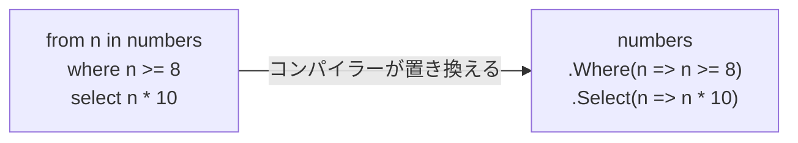

# クエリ式

LINQ には、ここまで使ってきたメソッドを呼ぶ書き方（**メソッド構文**）のほかに、`from`・`where`・`select` などのキーワードを並べて書く **クエリ式**（query expression）があります。クエリ式は、コンパイラーによってメソッド構文の呼び出しに置き換えられます。このページでは、クエリ式の書き方と、メソッド構文との対応を学びます。

## 学習目標

このページを読み終えると、以下のことができるようになります。

- `from`・`where`・`select` で、基本的なクエリ式を書ける
- `orderby`・`group`・`join`・`let` を使ったクエリ式を書ける
- クエリ式がメソッド構文の呼び出しに置き換えられることを説明できる
- クエリ式とメソッド構文を使い分けられる

## 前提知識

- [グループ化と結合](/unity-csharp-learning/csharp/linq-grouping/) を読んでいること

---

## 1. from・where・select

[LINQ の基本](/unity-csharp-learning/csharp/linq-basics/) で書いた「8 以上に絞り込んで 10 倍にする」処理を、クエリ式で書きます。比べるために、メソッド構文でも書いておきます。

```csharp
int[] numbers = { 5, 12, 8, 3, 20, 7 };

IEnumerable<int> query =
    from n in numbers
    where n >= 8
    select n * 10;

IEnumerable<int> method = numbers
    .Where(n => n >= 8)
    .Select(n => n * 10);

Console.WriteLine(string.Join(", ", query));
Console.WriteLine(string.Join(", ", method));
```

```
120, 80, 200
120, 80, 200
```

**書式：[クエリ式](https://learn.microsoft.com/dotnet/csharp/language-reference/keywords/query-keywords)（基本の形）**
```
from 範囲変数 in 元の並び
where 条件
select 結果
```

| 句 | 説明 |
|---|---|
| [from](https://learn.microsoft.com/dotnet/csharp/language-reference/keywords/from-clause) | 元の並びと、要素を表す **範囲変数** の名前を決める。クエリ式は必ず `from` で始まる |
| [where](https://learn.microsoft.com/dotnet/csharp/language-reference/keywords/where-clause) | 条件に合う要素に絞り込む |
| [select](https://learn.microsoft.com/dotnet/csharp/language-reference/keywords/select-clause) | 結果として取り出す値を決める。クエリ式は `select` か `group` で終わる |

範囲変数 `n` は、ラムダ式のパラメータのように、要素を 1 つずつ表します。`where` や `select` の中では、ラムダ式の `=>` を書かずに、`n` を使った式をそのまま書きます。

### クエリ式の正体

コンパイラーは、クエリ式をメソッド構文に置き換えます。1 つ目のクエリ式は、2 つ目のメソッド構文とまったく同じ呼び出しになります。



そのため、クエリ式の結果も、メソッド構文と同じく遅延実行です。クエリ式にだけできることや、クエリ式のほうが速いということはありません。

---

## 2. orderby

並べ替えは [orderby 句](https://learn.microsoft.com/dotnet/csharp/language-reference/keywords/orderby-clause) で書きます。降順にするときはキーの後に `descending` を付け、2 つ目以降のキーは `,` で区切って並べます。ここからのコード例では、[並べ替え・集計・要素の取り出し](/unity-csharp-learning/csharp/linq-aggregation/) と同じ `players` を使います。

```csharp
(string Name, int Score, string Team)[] players =
{
    ("Alice", 80, "赤"),
    ("Bob", 65, "青"),
    ("Carol", 92, "赤"),
    ("Dave", 65, "赤"),
    ("Eve", 78, "青"),
};

var ranking =
    from p in players
    where p.Score >= 70
    orderby p.Score descending, p.Name
    select $"{p.Name}（{p.Score}）";

Console.WriteLine(string.Join(", ", ranking));
```

```
Carol（92）, Alice（80）, Eve（78）
```

`orderby p.Score descending, p.Name` は、`OrderByDescending(p => p.Score).ThenBy(p => p.Name)` に置き換えられます。

---

## 3. group

グループ化は [group 句](https://learn.microsoft.com/dotnet/csharp/language-reference/keywords/group-clause) で書きます。`group 要素 by キー` でグループの並びになります。グループをさらに処理するときは、`into` で名前を付けてから続けます。以降のコード例は、2 節の `players` の宣言の後に続けて書きます。

```csharp
var summary =
    from p in players
    group p by p.Team into g
    select (Team: g.Key, Count: g.Count(), Best: g.Max(p => p.Score));

foreach (var s in summary)
{
    Console.WriteLine($"{s.Team}: {s.Count} 人、最高 {s.Best} 点");
}
```

```
赤: 3 人、最高 92 点
青: 2 人、最高 78 点
```

`group p by p.Team into g` の後では、範囲変数は `p` から、グループを表す `g` に変わります。`g.Count()` や `g.Max(...)` のように、クエリ式の中でもメソッド構文を混ぜて使えます。

---

## 4. join と let

2 つの並びの結合は [join 句](https://learn.microsoft.com/dotnet/csharp/language-reference/keywords/join-clause) で書きます。キーの比較には `==` ではなく `equals` キーワードを使います。

```csharp
(string Team, string Leader)[] leaders =
{
    ("赤", "Carol"),
    ("青", "Eve"),
};

var joined =
    from p in players
    join l in leaders on p.Team equals l.Team
    where p.Name != l.Leader
    select $"{p.Name} → {l.Leader}";

Console.WriteLine(string.Join(", ", joined));
```

```
Alice → Carol, Bob → Eve, Dave → Carol
```

[グループ化と結合](/unity-csharp-learning/csharp/linq-grouping/) の `Join` メソッドでは、キーを取り出すラムダ式を 2 つと、結果を作るラムダ式を並べて渡しました。クエリ式では `join ... on ... equals ...` と書くだけで済み、結合した後に `where` で絞り込むのも自然に書けます。複数の並びを組み合わせる処理は、クエリ式のほうが読みやすくなることが多いです。

### let で途中の値に名前を付ける

[let 句](https://learn.microsoft.com/dotnet/csharp/language-reference/keywords/let-clause) を使うと、途中で計算した値に名前を付けて、後の句で使えます。次のコードは、`players` を使わない別のプログラムです。`ToLower` は、文字列を小文字にしたものを返すメソッドです。

```csharp
string[] names = { "alice", "BOB", "Carol" };

var result =
    from name in names
    let lower = name.ToLower()
    where lower.Length <= 4
    select lower;

Console.WriteLine(string.Join(", ", result));
```

```
bob
```

`let` がなければ、`where name.ToLower().Length <= 4` と `select name.ToLower()` のように、同じ計算を 2 回書くことになります。

---

## 5. クエリ式とメソッド構文の使い分け

| | クエリ式 | メソッド構文 |
|---|---|---|
| 書き方 | キーワードを並べる | メソッドとラムダ式をつなげる |
| 得意なこと | `join`・`let`・複数の `from` など、複数の並びや途中の値を扱う処理 | 短い処理、`Count`・`First`・`ToList` など、クエリ式のキーワードがないメソッドを使う処理 |
| 結果 | コンパイラーがメソッド構文に置き換えるので、同じ | |

`Count`・`Sum`・`First`・`Take`・`Distinct`・`ToList` などには、対応するクエリ式のキーワードがありません。クエリ式の結果にこれらを使うときは、クエリ式を丸かっこで囲んでからメソッドを呼びます。

```csharp
int[] numbers = { 5, 12, 8, 3, 20, 7 };
int count = (from n in numbers where n >= 8 select n).Count();
Console.WriteLine(count);
```

```
3
```

どちらを使っても結果は同じなので、読みやすいほうを選びます。実際のコードでは、メソッド構文のほうが多く使われています。1 つのプログラムの中では、どちらかにそろえておくと読みやすくなります。

---

## よくあるミス

### select を書き忘れる

クエリ式は、必ず `select` か `group` で終わらなければなりません。`where` で絞り込むだけのときも、`select` が必要です。

```csharp
// ❌ NG: select がないのでコンパイルエラーになる（CS0742）
// var q = from n in numbers where n > 1;

// ✅ OK: 要素をそのまま取り出すときも select を書く
// var q = from n in numbers where n > 1 select n;
```

---

## ワンポイントアドバイス

### 複数の from

`from` を 2 つ続けると、1 つ目の並びの要素ごとに、2 つ目の並びを回せます。これは `SelectMany` に置き換えられます。

```csharp
(string Team, string[] Members)[] teams =
{
    ("赤", new[] { "Alice", "Carol" }),
    ("青", new[] { "Bob" }),
};

var q =
    from t in teams
    from m in t.Members
    select $"{m}（{t.Team}）";

Console.WriteLine(string.Join(", ", q));
```

```
Alice（赤）, Carol（赤）, Bob（青）
```

メソッド構文の `SelectMany` で同じことを書くと、チームの名前も結果に含めるために少し複雑になります。このように、外側の要素と内側の要素の両方を使う処理は、クエリ式が得意とするところです。

---

## まとめ

- クエリ式は `from` で始まり、`select` か `group` で終わる。`where` で絞り込み、`orderby` で並べ替える
- `group ... by ... into` でグループ化し、`join ... on ... equals ...` で 2 つの並びを結び付ける
- `let` で、途中の値に名前を付けられる
- クエリ式は、コンパイラーによってメソッド構文の呼び出しに置き換えられる。結果も遅延実行も同じ
- `Count` や `ToList` などキーワードのないメソッドは、クエリ式を丸かっこで囲んでから呼ぶ
- 複数の並びや途中の値を扱うならクエリ式、それ以外はメソッド構文が読みやすいことが多い

---

## 理解度チェック

1. 次のコードを実行すると何が出力されますか？

   ```csharp
   int[] values = { 3, 8, 1, 6, 4 };
   var q =
       from v in values
       where v % 2 == 0
       orderby v descending
       select v / 2;
   Console.WriteLine(string.Join(" ", q));
   ```

2. 次のメソッド構文を、クエリ式で書き直してください。

   ```csharp
   var names = players
       .Where(p => p.Team == "青")
       .OrderBy(p => p.Score)
       .Select(p => p.Name);
   ```

3. クエリ式で書いたほうがメソッド構文より速くなることはありますか？理由も説明してください。

<details markdown="1">
<summary>解答を見る</summary>

1. `4 3 2` が出力されます。偶数の `8`・`6`・`4` に絞り込み、降順に並べてから、それぞれを 2 で割っています。
2. ```csharp
   var names =
       from p in players
       where p.Team == "青"
       orderby p.Score
       select p.Name;
   ```

3. ありません。クエリ式は、コンパイラーによってメソッド構文の呼び出しに置き換えられるので、実行される処理は同じだからです。

</details>

---

## 次のステップ

次の章の [例外の基本](/unity-csharp-learning/csharp/exceptions/) では、処理を続けられなくなったことを知らせる「例外」と、それを受け止める `try` / `catch` を学びます。
