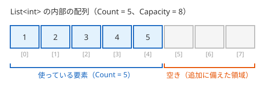

# List\<T\>

**List\<T\>** は、要素の数を後から増やしたり減らしたりできる、配列のようなコレクションです。[ジェネリクスの基本](/unity-csharp-learning/csharp/generics/) で学んだ型パラメータ `T` で要素の型を指定するので、決まった型の要素だけを入れられます。このページでは、`List<T>` の作り方、要素の追加・削除・検索と、要素を追加できる仕組みを学びます。

## 学習目標

このページを読み終えると、以下のことができるようになります。

- 配列では要素を追加しにくい理由を説明できる
- `List<T>` を作り、`Add` で要素を追加し、インデクサで読み書きできる
- `Insert`・`Remove`・`RemoveAt`・`Contains`・`IndexOf` で、要素の挿入・削除・検索ができる
- `Count` と `Capacity` の違いと、`List<T>` が内部の配列を作り直す仕組みを説明できる

## 前提知識

- [Array クラスと配列の性質（補足）](/unity-csharp-learning/csharp/array-class/) を読んでいること
- [インデクサ](/unity-csharp-learning/csharp/indexers/) を読んでいること
- [ジェネリクスの基本](/unity-csharp-learning/csharp/generics/) を読んでいること

---

## 1. 配列に要素を追加するには

配列の長さは、作ったときに決まり、後から変えられません。要素を 1 つ追加したいときは、1 つ長い配列を新しく作り、元の要素をコピーしてから、最後に新しい要素を入れる必要があります。[Array クラスと配列の性質（補足）](/unity-csharp-learning/csharp/array-class/) で学んだ `Array.Copy` を使うと、次のようになります。

```csharp
int[] scores = { 80, 65 };

int[] larger = new int[scores.Length + 1];
Array.Copy(scores, larger, scores.Length);
larger[scores.Length] = 92;
scores = larger;

Console.WriteLine(string.Join(", ", scores));
```

```
80, 65, 92
```

1 つ追加するだけで 4 行が必要です。要素を削除したり、途中に挿入したりするときも、同じように配列を作り直してコピーしなければなりません。要素の数がプログラムの実行中に変わるデータ（買い物かごの商品、画面に出ている敵など）を配列で扱うのは大変です。

.NET には、要素の数が変わるデータを扱うための **コレクション**（collection）が用意されています。`List<T>` は、その中でもっともよく使われるコレクションです。

---

## 2. List\<T\> を作って要素を追加する

[List\<T\> クラス](https://learn.microsoft.com/dotnet/api/system.collections.generic.list-1) は、`T` 型の要素を順番に並べて持つコレクションです。`new List<int>()` のように要素の型を指定して作ると、要素が 1 つもない `List<T>` ができます。

要素を末尾に追加するには、[Add メソッド](https://learn.microsoft.com/dotnet/api/system.collections.generic.list-1.add) を使います。

**書式：[List\<T\>.Add メソッド](https://learn.microsoft.com/dotnet/api/system.collections.generic.list-1.add)**
```csharp
public void Add(T item);
```

| パラメータ | 説明 |
|---|---|
| `item` | 末尾に追加する要素 |

要素の数は [Count プロパティ](https://learn.microsoft.com/dotnet/api/system.collections.generic.list-1.count) で調べます。配列の `Length` に当たるものです。要素は、配列と同じように `scores[1]` のようなインデックスで読み書きできます。[インデクサ](/unity-csharp-learning/csharp/indexers/) で学んだインデクサが、`List<T>` に定義されているからです。

```csharp
List<int> scores = new List<int>();
scores.Add(80);
scores.Add(65);
scores.Add(92);

Console.WriteLine($"Count = {scores.Count}");
Console.WriteLine($"scores[1] = {scores[1]}");

scores[1] = 70;
Console.WriteLine(string.Join(", ", scores));
```

```
Count = 3
scores[1] = 65
80, 70, 92
```

`Add` を呼ぶたびに要素が増え、`Count` が 1 ずつ大きくなります。インデックスは、配列と同じく 0 から始まります。

### 作るときに要素を入れる

作るときに最初の要素を決めておきたいときは、`new List<T>` の後に `{ }` で要素を並べます。この書き方を **コレクション初期化子**（collection initializer）といいます。コンパイラーは、並べた要素ごとに `Add` を呼び出すコードに置き換えます。

```csharp
List<string> names = new List<string> { "Alice", "Bob", "Carol" };
```

---

## 3. 要素の挿入・削除・検索

`List<T>` には、要素を操作するメソッドが多く用意されています。よく使うものは次のとおりです。

| メンバー | 説明 |
|---|---|
| [Insert(index, item)](https://learn.microsoft.com/dotnet/api/system.collections.generic.list-1.insert) | `index` の位置に `item` を挿入する。後ろの要素は 1 つずつ後ろにずれる |
| [Remove(item)](https://learn.microsoft.com/dotnet/api/system.collections.generic.list-1.remove) | `item` と等しい最初の要素を削除する。削除できたら `true`、見つからなければ `false` を返す |
| [RemoveAt(index)](https://learn.microsoft.com/dotnet/api/system.collections.generic.list-1.removeat) | `index` の位置の要素を削除する。後ろの要素は 1 つずつ前にずれる |
| [Contains(item)](https://learn.microsoft.com/dotnet/api/system.collections.generic.list-1.contains) | `item` と等しい要素があれば `true` を返す |
| [IndexOf(item)](https://learn.microsoft.com/dotnet/api/system.collections.generic.list-1.indexof) | `item` と等しい最初の要素のインデックスを返す。見つからなければ `-1` を返す |
| [Clear()](https://learn.microsoft.com/dotnet/api/system.collections.generic.list-1.clear) | すべての要素を削除する |

```csharp
List<string> names = new List<string> { "Alice", "Bob", "Carol", "Bob" };

names.Insert(1, "Dave");
Console.WriteLine(string.Join(", ", names));

bool removed = names.Remove("Bob");
Console.WriteLine($"Remove: {removed} → {string.Join(", ", names)}");

names.RemoveAt(0);
Console.WriteLine($"RemoveAt(0) → {string.Join(", ", names)}");

Console.WriteLine($"Contains(\"Carol\") = {names.Contains("Carol")}");
Console.WriteLine($"IndexOf(\"Bob\") = {names.IndexOf("Bob")}");
Console.WriteLine($"IndexOf(\"Eve\") = {names.IndexOf("Eve")}");
Console.WriteLine($"Remove(\"Eve\") = {names.Remove("Eve")}");

names.Clear();
Console.WriteLine($"Clear → Count = {names.Count}");
```

```
Alice, Dave, Bob, Carol, Bob
Remove: True → Alice, Dave, Carol, Bob
RemoveAt(0) → Dave, Carol, Bob
Contains("Carol") = True
IndexOf("Bob") = 2
IndexOf("Eve") = -1
Remove("Eve") = False
Clear → Count = 0
```

`Remove("Bob")` で削除されたのは、最初に見つかった `Bob` だけです。末尾の `Bob` は残っています。要素を削除したり挿入したりすると、後ろの要素のインデックスが変わることに注意します。

---

## 4. 要素を追加できる仕組み

`List<T>` は、要素を内部の配列に入れています。配列の長さは変えられないのに、なぜ `Add` で要素を追加し続けられるのでしょうか。

`List<T>` の内部の配列は、ふつう、今ある要素の数より長く作られています。内部の配列の長さは [Capacity プロパティ](https://learn.microsoft.com/dotnet/api/system.collections.generic.list-1.capacity) で調べられます。`Count` は使っている要素の数、`Capacity` は追加に備えた空きを含めた内部の配列の長さです。



`Add` は、空きがあれば、その場所に要素を入れるだけです。空きがなくなると、今より長い配列を新しく作り、要素をすべてコピーしてから追加します。1 節で自分で書いた処理を、`List<T>` が代わりに行っているのです。

次のコードは、要素を 1 つずつ追加しながら、`Capacity` が変わったときだけ `Count` と `Capacity` を表示します。

```csharp
List<int> numbers = new List<int>();
int lastCapacity = -1;
for (int i = 1; i <= 20; i++)
{
    numbers.Add(i);
    if (numbers.Capacity != lastCapacity)
    {
        Console.WriteLine($"Count = {numbers.Count}, Capacity = {numbers.Capacity}");
        lastCapacity = numbers.Capacity;
    }
}
```

実行結果の例です。`Capacity` の増え方は .NET の実装によって決まり、バージョンによって変わることがあります。

```
Count = 1, Capacity = 4
Count = 5, Capacity = 8
Count = 9, Capacity = 16
Count = 17, Capacity = 32
```

内部の配列がいっぱいになるたびに、長さが 2 倍の配列に作り直されています。作り直しでは要素をすべてコピーするので時間がかかりますが、長さを 2 倍にしていくため、作り直しが起きるのはたまにだけです。20 個の要素を追加する間に、作り直しは 3 回しか起きていません。

> 💡 **ポイント**: `List<T>` は、[値型と参照型](/unity-csharp-learning/csharp/value-reference-types/) で学ぶ参照型です。配列と同じく、`List<T>` を別の変数に代入しても、コピーされるのは参照だけで、2 つの変数は同じ `List<T>` を指します。

---

## よくあるミス

### foreach の中で要素を削除する

`List<T>` の要素も `foreach` 文で順に取り出せます。しかし、`foreach` で取り出している途中に、同じ `List<T>` の要素を追加したり削除したりすると、例外が発生します。

```csharp
// ❌ NG: foreach の途中で List<T> を変更すると InvalidOperationException が発生する
List<int> numbers = new List<int> { 1, 2, 3, 4 };

foreach (int n in numbers)
{
    if (n % 2 == 0)
    {
        numbers.Remove(n);
    }
}
```

`foreach` は、取り出している最中に `List<T>` が変更されたことを検出すると、[InvalidOperationException](https://learn.microsoft.com/dotnet/api/system.invalidoperationexception) を投げてプログラムを止めます。要素がずれて、取り出しを飛ばしたり二重に取り出したりするのを防ぐためです。

条件に合う要素を削除するときは、`for` 文で末尾から先頭に向かって進みながら `RemoveAt` を使います。末尾から削除すれば、まだ調べていない要素のインデックスはずれません。

```csharp
// ✅ OK: 末尾から先頭に向かって削除する
List<int> numbers = new List<int> { 1, 2, 3, 4 };

for (int i = numbers.Count - 1; i >= 0; i--)
{
    if (numbers[i] % 2 == 0)
    {
        numbers.RemoveAt(i);
    }
}
Console.WriteLine(string.Join(", ", numbers));
```

```
1, 3
```

### Count 以上のインデックスを使う

`Capacity` に空きがあっても、読み書きできるのは `Count` より小さいインデックスだけです。`Count` 以上のインデックスを使うと、[ArgumentOutOfRangeException](https://learn.microsoft.com/dotnet/api/system.argumentoutofrangeexception) が発生します。要素を増やすときは、インデックスで書き込むのではなく `Add` を使います。

---

## ワンポイントアドバイス

### C# 12 のコレクション式

C# 12 以降では、[コレクション式](https://learn.microsoft.com/dotnet/csharp/language-reference/operators/collection-expressions) を使って、`List<int> numbers = [1, 2, 3];` のように、配列と同じ `[ ]` で要素を並べて `List<T>` を作れます。

### 配列と List\<T\> の使い分け

要素の数が決まっていて変わらないデータには配列を、要素の数が実行中に変わるデータには `List<T>` を使います。迷ったときは、要素を追加・削除できる `List<T>` を選ぶと、後から困ることが少なくなります。

---

## まとめ

- 配列の長さは変えられないので、要素を追加するには配列を作り直してコピーする必要がある
- `List<T>` は、要素の数を後から変えられるコレクション。`T` で要素の型を指定する
- `Add` で末尾に追加し、`Count` で要素の数を調べ、インデクサで読み書きする
- `Insert`・`Remove`・`RemoveAt`・`Contains`・`IndexOf`・`Clear` で、挿入・削除・検索ができる
- `List<T>` は内部の配列に要素を入れ、空きがなくなると長い配列に作り直す。`Capacity` は内部の配列の長さ
- `foreach` の途中で `List<T>` を変更すると `InvalidOperationException` が発生する

---

## 理解度チェック

1. `List<T>` の `Count` と `Capacity` の違いを説明してください。
2. 次のコードを実行すると何が出力されますか？

   ```csharp
   List<int> list = new List<int> { 5, 3, 8 };
   list.Add(1);
   list.Remove(3);
   list.Insert(0, 9);
   Console.WriteLine($"{list.Count}: {string.Join(", ", list)}");
   ```

3. `List<int>` から負の数をすべて削除したいとき、`foreach` 文の中で `Remove` を呼ぶと、どうなりますか？代わりにどう書けばよいですか？

<details markdown="1">
<summary>解答を見る</summary>

1. `Count` は、実際に入っている要素の数です。`Capacity` は、要素を入れておく内部の配列の長さで、追加に備えた空きを含みます。`Count` が `Capacity` に達した状態で `Add` すると、長い配列に作り直されます。
2. `4: 9, 5, 8, 1` が出力されます。`{ 5, 3, 8 }` に `1` を追加して `{ 5, 3, 8, 1 }`、`3` を削除して `{ 5, 8, 1 }`、先頭に `9` を挿入して `{ 9, 5, 8, 1 }` になります。
3. `foreach` の途中で `List<T>` を変更したことになるので、`InvalidOperationException` が発生します。`for` 文で末尾から先頭に向かって進み、負の数なら `RemoveAt` で削除します。

   ```csharp
   for (int i = list.Count - 1; i >= 0; i--)
   {
       if (list[i] < 0)
       {
           list.RemoveAt(i);
       }
   }
   ```

</details>

---

## 次のステップ

[Dictionary\<TKey, TValue\>](/unity-csharp-learning/csharp/dictionary/) では、キーを使って値を保存・検索するコレクションを学びます。
