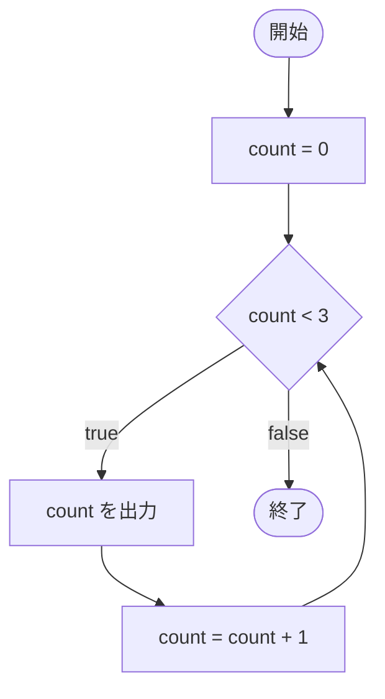
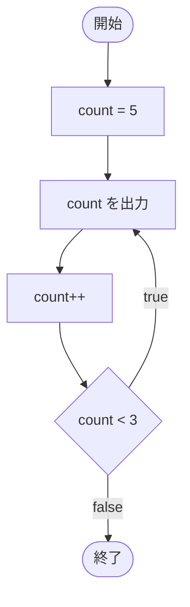
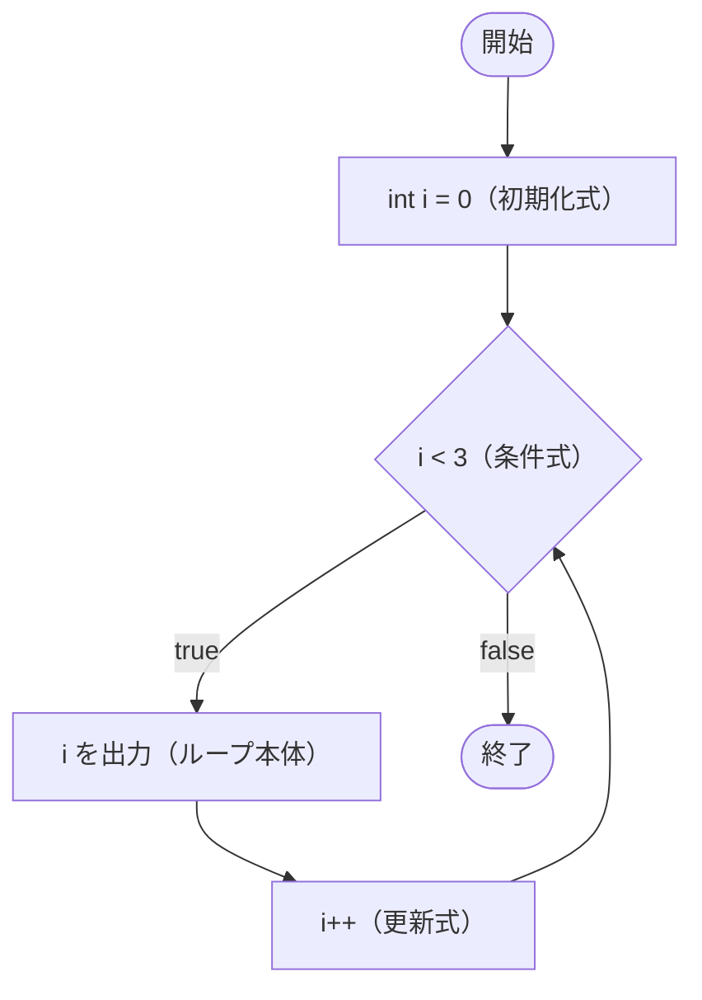
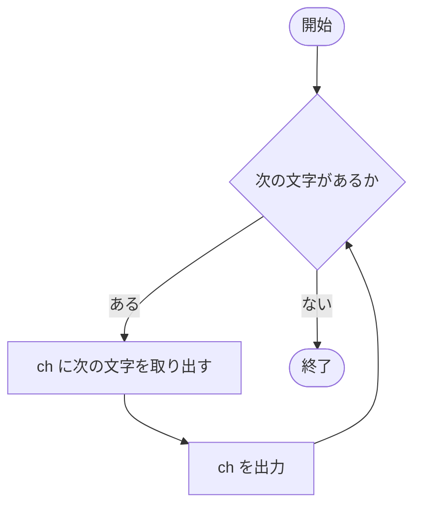

# 反復処理

同じ処理を繰り返し実行することを、**反復処理**（ループ）といいます。C# には、`while`・`do-while`・`for`・`foreach` の 4 種類の繰り返しの文があります。

## 学習目標

このページを読み終えると、以下のことができるようになります。

- `while` 文で、条件が成り立つ間、処理を繰り返せる
- 無限ループが起きる原因を説明できる
- `do-while` 文と `while` 文の違いを説明できる
- `for` 文の 3 つの部分（初期化式・条件式・更新式）を説明し、`for` 文を書ける
- `foreach` 文で、文字列の文字を 1 つずつ取り出せる

## 前提知識

- [条件分岐](/unity-csharp-learning/csharp/conditionals/) を読んでいること

---

## 1. while 文

`if` 文は、条件が成り立つときに処理を **1 回** 実行する文でした。「HP が 0 になるまで攻撃を続ける」「正しい値が入力されるまで入力を求める」のように、条件が成り立つ **間ずっと** 処理を繰り返したいときは、`while` 文を使います。

**書式：[while 文](https://learn.microsoft.com/dotnet/csharp/language-reference/statements/iteration-statements#the-while-statement)**
```
while (条件式)
{
    // 条件式が true の間、繰り返す処理
}
```

| 要素 | 説明 |
|---|---|
| `条件式` | `bool` 型になる式。`true` の間、繰り返しを続ける |
| `{ }` | 繰り返し実行する処理（ループ本体） |

`while` 文は、次の順に実行されます。

1. 条件式を調べる
2. `true` なら、ループ本体を実行して 1 に戻る
3. `false` なら、繰り返しを終えて `while` 文の後へ進む

条件式が最初から `false` なら、ループ本体は 1 回も実行されません。

```csharp
int count = 0;

while (count < 3)
{
    Console.WriteLine($"count={count}");
    count = count + 1;
}
```

```
count=0
count=1
count=2
```

`count` が `0`・`1`・`2` の間は `count < 3` が `true` なので、繰り返しが続きます。`count` が `3` になると `false` になり、繰り返しを終えます。



> 💡 **ポイント**: `count = count + 1` は、`count++` とも書けます。`++` については、[インクリメント・デクリメント（補足）](/unity-csharp-learning/csharp/increment-decrement/) で学びます。

---

## 2. 無限ループ

条件式がずっと `true` のままだと、繰り返しが終わらなくなります。これを **無限ループ** といいます。

よくある原因は、条件式に使う変数を、ループ本体で更新し忘れることです。

```csharp
// ❌ NG: count を更新していないので、count < 3 がずっと true のまま
// int count = 0;
// while (count < 3)
// {
//     Console.WriteLine(count);
// }
```

このコードは `0` を表示し続け、プログラムが止まりません。コンソールアプリなら、`Ctrl` + `C` キーで止められます。条件式に使う変数を、ループ本体で必ず更新しましょう。

条件式に `true` を直接書いた `while (true)` も、無限ループになります。これは、繰り返しの途中で `break` 文を使って抜けることを前提にした書き方です。`break` 文は、[break と continue（補足）](/unity-csharp-learning/csharp/break-and-continue/) で学びます。

---

## 3. do-while 文

`while` 文は、ループ本体の **前** に条件式を調べます。「まず 1 回は必ず実行して、その後で続けるかを決めたい」ときは、`do-while` 文を使います。たとえば、ゲームの結果を表示してから「もう一度遊ぶか」を尋ねる処理は、最初の 1 回を必ず実行します。

**書式：[do-while 文](https://learn.microsoft.com/dotnet/csharp/language-reference/statements/iteration-statements#the-do-statement)**
```
do
{
    // 繰り返す処理
} while (条件式);
```

`while (条件式)` の後の `;` を忘れないようにしましょう。

| | 条件式を調べるタイミング | ループ本体を実行する最小の回数 |
|---|---|---|
| `while` | ループ本体の **前** | 0 回 |
| `do-while` | ループ本体の **後** | 1 回 |

```csharp
int count = 5;

do
{
    Console.WriteLine($"count={count}");
    count++;
} while (count < 3);
```

```
count=5
```

`count` は最初から `5` で、`count < 3` は `false` です。それでも、条件式はループ本体の **後** に調べるので、ループ本体は 1 回実行されます。



---

## 4. for 文

「0 から 9 まで」のように、変数（カウンター）を増やしながら繰り返すときは、`for` 文がよく使われます。カウンターの初期化・条件・更新を 1 行にまとめて書けるので、更新を書き忘れにくくなります。

**書式：[for 文](https://learn.microsoft.com/dotnet/csharp/language-reference/statements/iteration-statements#the-for-statement)**
```
for (初期化式; 条件式; 更新式)
{
    // 繰り返す処理
}
```

| 要素 | 説明 | 実行されるタイミング |
|---|---|---|
| `初期化式` | カウンターの準備（例：`int i = 0`） | 最初に **1 回だけ** |
| `条件式` | `true` の間、繰り返しを続ける | ループ本体の **前** に毎回 |
| `更新式` | カウンターの更新（例：`i++`） | ループ本体の **後** に毎回 |

```csharp
for (int i = 0; i < 3; i++)
{
    Console.WriteLine($"i={i}");
}
```

```
i=0
i=1
i=2
```

実行の流れを追うと、次のようになります。

```
① int i = 0       （初期化式）
② i < 3 → true    （条件式）
③ "i=0" を出力    （ループ本体）
④ i++ → i は 1    （更新式）
② i < 3 → true
③ "i=1" を出力
④ i++ → i は 2
② i < 3 → true
③ "i=2" を出力
④ i++ → i は 3
② i < 3 → false   → 繰り返しを終える
```



初期化式で宣言した変数 `i` は、`for` 文の中でだけ使えます（[ブロック文とスコープ（補足）](/unity-csharp-learning/csharp/block-and-scope/) を参照）。

### for 文と while 文

`for` 文は、`while` 文で書き直せます。次の 2 つのコードは同じ処理です。

```csharp
for (int i = 0; i < 3; i++)
{
    Console.WriteLine(i);
}
```

```
0
1
2
```

```csharp
int i = 0;
while (i < 3)
{
    Console.WriteLine(i);
    i++;
}
```

```
0
1
2
```

決まった回数を数えながら繰り返すときは `for` 文を、回数が前もって決まっていないときは `while` 文を使うのが一般的です。

---

## 5. foreach 文

`for` 文で文字列の文字を順に取り出すには、何文字目かを表す番号（インデックス）を自分で管理する必要があります。「先頭から順に、すべての要素を処理したい」だけなら、`foreach` 文を使うと、番号を管理せずに書けます。

`foreach` 文は、複数の値のまとまり（**コレクション**）から、要素を 1 つずつ取り出して繰り返します。配列などのコレクションは後のページで学びますが、文字列も文字（`char`）の並びなので、`foreach` で 1 文字ずつ取り出せます。

**書式：[foreach 文](https://learn.microsoft.com/dotnet/csharp/language-reference/statements/iteration-statements#the-foreach-statement)**
```
foreach (型 変数名 in コレクション)
{
    // 繰り返す処理
}
```

| 要素 | 説明 |
|---|---|
| `型 変数名` | 取り出した要素を受け取る変数（反復変数）。型の代わりに `var` も書ける |
| `コレクション` | 要素を取り出す元のデータ（文字列、配列など） |

```csharp
string text = "Hello";

foreach (char ch in text)
{
    Console.WriteLine(ch);
}
```

```
H
e
l
l
o
```

`text` の先頭から 1 文字ずつ `ch` に取り出し、すべての文字を処理すると繰り返しを終えます。



配列と組み合わせた `foreach` は、[配列の基礎](/unity-csharp-learning/csharp/arrays/) で学びます。

---

## よくあるミス

### for 文の条件式を間違える

```csharp
for (int i = 0; i > 5; i++)
{
    Console.WriteLine(i);
}
Console.WriteLine("終了");
```

```
終了
```

`i` は `0` から始まるので、最初の `i > 5` が `false` になり、ループ本体は 1 回も実行されません。「5 未満の間」繰り返したいなら、`i < 5` と書きます。

### foreach の反復変数に代入する

```csharp
// ❌ NG: foreach の反復変数は読み取り専用
// string text = "Hello";
// foreach (char ch in text)
// {
//     ch = 'X';  // CS1656
// }
```

`foreach` の反復変数は読み取り専用で、代入できません。

---

## まとめ

- `while` 文は、条件式が `true` の間、ループ本体を繰り返す。条件式はループ本体の前に調べる
- 条件式に使う変数を更新し忘れると、無限ループになる
- `do-while` 文は、条件式をループ本体の後に調べるので、ループ本体は必ず 1 回は実行される
- `for` 文は、初期化式・条件式・更新式を 1 行に書ける。カウンターを使う繰り返しに向いている
- `foreach` 文は、コレクションの要素を 1 つずつ取り出して繰り返す。反復変数は読み取り専用

---

## 理解度チェック

1. 次のコードを実行すると何が出力されますか？

   ```csharp
   int i = 1;
   while (i <= 4)
   {
       Console.WriteLine($"i={i}");
       i += 2;
   }
   ```

2. 次のコードで、ループ本体は何回実行されますか？また、最後の `count` の値はいくつですか？

   ```csharp
   int count = 10;
   do
   {
       count--;
   } while (count > 10);
   Console.WriteLine(count);
   ```

3. `for` 文を使って、`5`・`4`・`3`・`2`・`1` の順に 1 行ずつ出力するコードを書いてください。

<details markdown="1">
<summary>解答を見る</summary>

1. 次のように出力されます。`i += 2` は `i = i + 2` と同じ意味です。`i` は `1`、`3`、`5` と変わり、`5` になると `i <= 4` が `false` になって繰り返しを終えます。

   ```
   i=1
   i=3
   ```

2. 1 回実行され、`count` は `9` になります。最初に `count--` で `9` になり、その後の `count > 10` が `false` なので繰り返しを終えます。

   ```
   9
   ```

3. ```csharp
   for (int i = 5; i >= 1; i--)
   {
       Console.WriteLine(i);
   }
   ```

</details>

---

## 次のステップ

[インクリメント・デクリメント（補足）](/unity-csharp-learning/csharp/increment-decrement/) では、`for` 文の更新式でよく使う `++` と `--`、`+=` などの複合代入演算子を学びます。
