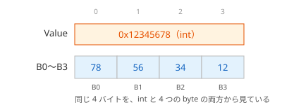

# 構造体のメモリレイアウト（補足）

構造体のフィールドは、メモリ上に決まった規則で並べられます。フィールドの型によっては、フィールドとフィールドの間に使われない領域（**パディング**）が入り、構造体のサイズがフィールドのサイズの合計より大きくなることがあります。このページでは、その規則と、並び方を指定する `StructLayout` 属性を学びます。

## 学習目標

このページを読み終えると、以下のことができるようになります。

- `Unsafe.SizeOf<T>()` で構造体のサイズを調べられる
- アラインメントとパディングによって、構造体のサイズが変わる理由を説明できる
- フィールドの並べ方で、パディングを減らせることを説明できる
- `StructLayout` 属性で、フィールドの並び方を指定できる

## 前提知識

- [構造体](/unity-csharp-learning/csharp/structs/) を読んでいること
- [数値リテラルと型エイリアス（補足）](/unity-csharp-learning/csharp/numeric-literals/) を読んでいること
- [ビット演算](/unity-csharp-learning/csharp/bitwise-operations/) を読んでいること

---

## 1. 構造体のサイズを調べる

`int` や `double` などの組み込みの型のサイズは、[sizeof 演算子](https://learn.microsoft.com/dotnet/csharp/language-reference/operators/sizeof) で調べられます。ただし、自分で定義した構造体に `sizeof` を使うには、`unsafe`（安全でないコード）という特別なコンテキストが必要です。このサイトでは `unsafe` は扱いません。

代わりに、[Unsafe.SizeOf\<T\> メソッド](https://learn.microsoft.com/dotnet/api/system.runtime.compilerservices.unsafe.sizeof) を使います。名前に `Unsafe` と付いていますが、`SizeOf` は型のサイズを返すだけなので、`unsafe` のコンテキストは必要ありません。`System.Runtime.CompilerServices` 名前空間にあるので、ファイルの先頭に `using System.Runtime.CompilerServices;` を書きます。

**書式：[Unsafe.SizeOf\<T\> メソッド](https://learn.microsoft.com/dotnet/api/system.runtime.compilerservices.unsafe.sizeof)**
```csharp
public static int SizeOf<T>();
```

戻り値は、型 `T` の値 1 つが使うメモリのサイズ（バイト数）です。

```csharp
using System.Runtime.CompilerServices;

Console.WriteLine($"int: {Unsafe.SizeOf<int>()}");
Console.WriteLine($"Point: {Unsafe.SizeOf<Point>()}");

struct Point
{
    public int X;
    public int Y;

    public Point(int x, int y)
    {
        X = x;
        Y = y;
    }
}
```

```
int: 4
Point: 8
```

`Point` は 4 バイトの `int` を 2 つ持つので、8 バイトです。構造体の値は、フィールドをメモリ上に並べたものです。

---

## 2. アラインメントとパディング

次の 2 つの構造体は、どちらも `byte`（1 バイト）を 2 つと `int`（4 バイト）を 1 つ持っています。違うのは、フィールドを書いた順序だけです。

```csharp
using System.Runtime.CompilerServices;

Console.WriteLine($"Padded: {Unsafe.SizeOf<Padded>()}");
Console.WriteLine($"Ordered: {Unsafe.SizeOf<Ordered>()}");

struct Padded
{
    public byte A;
    public int B;
    public byte C;

    public Padded(byte a, int b, byte c)
    {
        A = a;
        B = b;
        C = c;
    }
}

struct Ordered
{
    public int B;
    public byte A;
    public byte C;

    public Ordered(int b, byte a, byte c)
    {
        B = b;
        A = a;
        C = c;
    }
}
```

実行結果の例です。サイズは実行環境によって変わることがあります。

```
Padded: 12
Ordered: 8
```

フィールドのサイズの合計はどちらも 6 バイトですが、`Padded` は 12 バイト、`Ordered` は 8 バイトになりました。

CPU は、データのサイズの倍数の位置（アドレス）にあるデータを、効率よく読み書きできます。そのため、`int` のような 4 バイトのフィールドは、構造体の先頭から 4 の倍数の位置に置かれます。この「決まった倍数の位置に置く」ことを **アラインメント**（alignment）といいます。アラインメントを守るために空けた領域が、パディングです。


- `Padded`：`A` の直後の 1 バイト目には `B` を置けないので、3 バイトのパディングを空けて、4 バイト目から `B` を置きます
- どちらの構造体も、サイズが、いちばん大きなフィールドのアラインメント（ここでは `int` の 4）の倍数になるように、最後にパディングが入ります。構造体を配列に並べたときに、どの要素の `B` も 4 の倍数の位置にそろうようにするためです

### フィールドの並べ方

C# で定義した構造体は、ふつう、フィールドを書いた順にメモリに並べられます。サイズの大きいフィールドから順に書くと、パディングが少なくなり、構造体のサイズを小さくできます。

構造体の値は、代入やメソッドの呼び出しのたびにコピーされ、配列ではその数だけ並びます。たくさんの値を扱うときは、サイズの違いが、使うメモリの量やコピーの時間の違いになって表れます。

ただし、参照型のフィールドを含む構造体は、.NET がフィールドの並びを決め直すことがあります。クラスのフィールドも、.NET が並びを決めます。

---

## 3. StructLayout 属性で並び方を指定する

フィールドの並び方は、[StructLayout 属性](https://learn.microsoft.com/dotnet/api/system.runtime.interopservices.structlayoutattribute) で指定できます。`System.Runtime.InteropServices` 名前空間にあるので、ファイルの先頭に `using System.Runtime.InteropServices;` を書きます。

並び方は、[LayoutKind 列挙型](https://learn.microsoft.com/dotnet/api/system.runtime.interopservices.layoutkind) の値で指定します。

| 値 | 並び方 |
|---|---|
| `LayoutKind.Sequential` | 書いた順に並べる。C# の構造体の既定 |
| `LayoutKind.Explicit` | フィールドごとに、先頭からの位置を指定する |
| `LayoutKind.Auto` | .NET が並びを決める。クラスの既定 |

### Pack でパディングをなくす

`Sequential` と一緒に [Pack](https://learn.microsoft.com/dotnet/api/system.runtime.interopservices.structlayoutattribute.pack) を指定すると、アラインメントの上限を変えられます。`Pack = 1` にすると、どのフィールドも 1 の倍数の位置、つまり隙間なく並べられます。

```csharp
using System.Runtime.CompilerServices;
using System.Runtime.InteropServices;

Console.WriteLine($"Packed: {Unsafe.SizeOf<Packed>()}");

[StructLayout(LayoutKind.Sequential, Pack = 1)]
struct Packed
{
    public byte A;
    public int B;
    public byte C;

    public Packed(byte a, int b, byte c)
    {
        A = a;
        B = b;
        C = c;
    }
}
```

実行結果の例です。サイズは実行環境によって変わることがあります。

```
Packed: 6
```

`Padded` と同じ順序のフィールドですが、パディングがなくなり、6 バイトになりました。ただし、`B` は 4 の倍数ではない位置に置かれるので、CPU によっては読み書きが遅くなります。`Pack` は、ファイルの形式など、決まったバイトの並びに合わせる必要があるときに使います。

### Explicit で位置を指定する

`LayoutKind.Explicit` を指定すると、各フィールドの位置を、先頭からのバイト数で [FieldOffset 属性](https://learn.microsoft.com/dotnet/api/system.runtime.interopservices.fieldoffsetattribute) に指定します。複数のフィールドを同じ位置に置くこともできます。

次の `IntBytes` は、`int` の `Value` と、4 つの `byte` を同じ 4 バイトに重ねて置いています。`Value` に書き込んだ値を、1 バイトずつ取り出せます。

```csharp
using System.Runtime.InteropServices;

IntBytes ib = new IntBytes();
ib.Value = 0x12345678;
Console.WriteLine($"{ib.B0:X2} {ib.B1:X2} {ib.B2:X2} {ib.B3:X2}");

[StructLayout(LayoutKind.Explicit)]
struct IntBytes
{
    [FieldOffset(0)] public int Value;
    [FieldOffset(0)] public byte B0;
    [FieldOffset(1)] public byte B1;
    [FieldOffset(2)] public byte B2;
    [FieldOffset(3)] public byte B3;
}
```

実行結果の例です。バイトの順序は実行環境によって変わることがあります。

```
78 56 34 12
```

`{ib.B0:X2}` の `X2` は、値を 2 桁の 16 進数で表示する書式です。書式の書き方は、[文字列リテラルと書式（補足）](/unity-csharp-learning/csharp/string-literals/) で説明しています。



`0x12345678` の下位のバイト `78` が、先頭の `B0` に入っています。整数を下位のバイトから順にメモリに並べる方式を **リトルエンディアン**（little endian）といいます。現在の多くの CPU はリトルエンディアンですが、上位のバイトから並べる **ビッグエンディアン** の環境では、`12 34 56 78` と表示されます。どちらの方式かは、[BitConverter.IsLittleEndian フィールド](https://learn.microsoft.com/dotnet/api/system.bitconverter.islittleendian) で調べられます。

---

## ワンポイントアドバイス

### Marshal.SizeOf との違い

構造体のサイズを返すメソッドには、[Marshal.SizeOf メソッド](https://learn.microsoft.com/dotnet/api/system.runtime.interopservices.marshal.sizeof) もあります。`Marshal.SizeOf` が返すのは、C# 以外の言語で書かれたコード（ネイティブコード）に構造体を渡すときのサイズで、.NET の中で使われるサイズとは異なることがあります。たとえば `bool` は、.NET の中では 1 バイトですが、`Marshal.SizeOf` では 4 バイトとして数えられます。.NET の中でのサイズを知りたいときは、`Unsafe.SizeOf<T>()` を使います。

---

## まとめ

- 構造体のサイズは `Unsafe.SizeOf<T>()` で調べられる
- フィールドは、サイズの倍数の位置に置かれる（アラインメント）。そのために空けた領域をパディングという
- 構造体のサイズは、いちばん大きなフィールドのアラインメントの倍数になる
- C# の構造体は、ふつうフィールドを書いた順に並ぶ。大きいフィールドから順に書くとパディングを減らせる
- `StructLayout` 属性で、パディングをなくしたり（`Pack`）、フィールドの位置を指定したり（`Explicit`）できる

---

## 理解度チェック

1. 構造体のサイズが、フィールドのサイズの合計より大きくなることがあるのはなぜですか？
2. 次の構造体のサイズは何バイトですか？`Unsafe.SizeOf<T>()` で確かめてください。

   ```csharp
   using System.Runtime.CompilerServices;

   Console.WriteLine(Unsafe.SizeOf<Data>());

   struct Data
   {
       public byte A;
       public double B;
       public byte C;

       public Data(byte a, double b, byte c)
       {
           A = a;
           B = b;
           C = c;
       }
   }
   ```

3. 2 の `Data` 構造体のフィールドを並べ替えて、サイズを小さくしてください。

<details markdown="1">
<summary>解答を見る</summary>

1. フィールドをサイズの倍数の位置に置くために、フィールドの間や最後にパディングが入るからです。
2. 多くの環境では `24` が出力されます。`double`（8 バイト）は 8 の倍数の位置に置かれるので、`A` の後に 7 バイトのパディングが入って `B` が 8 バイト目から始まり、`C` の後にも、全体を 8 の倍数にするための 7 バイトのパディングが入ります。

   ```
   24
   ```

3. 大きい `B` を先頭に書くと、`B`（8 バイト）、`A`、`C` の順に並び、最後に 6 バイトのパディングが入って 16 バイトになります。

   ```csharp
   struct Data
   {
       public double B;
       public byte A;
       public byte C;
   }
   ```

</details>

---

## 次のステップ

[null 許容値型](/unity-csharp-learning/csharp/nullable-value-types/) では、値型の変数に「値がない」状態を持たせる方法を学びます。
