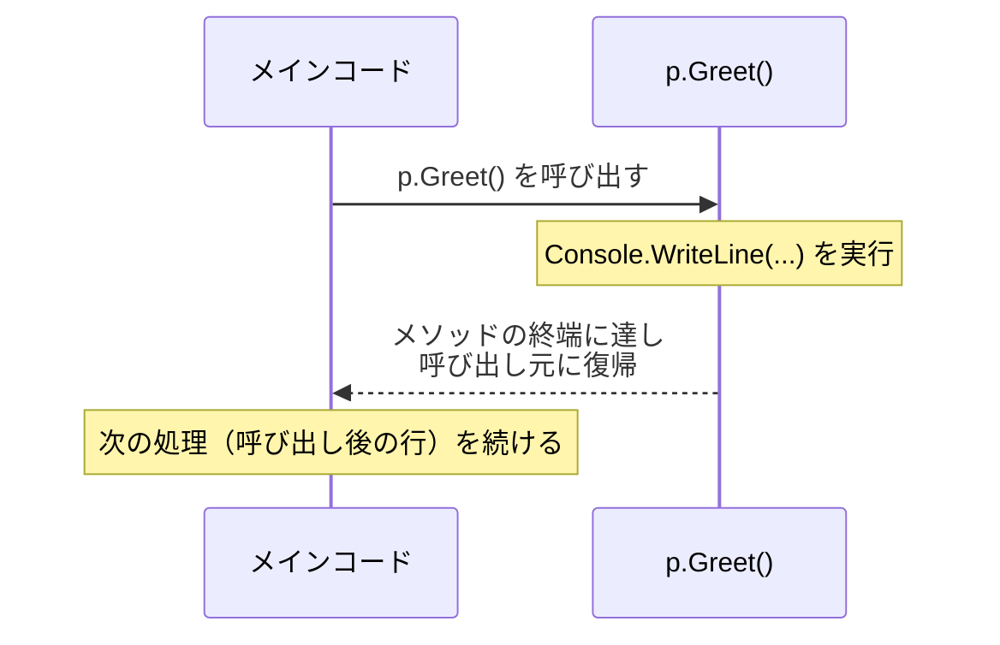
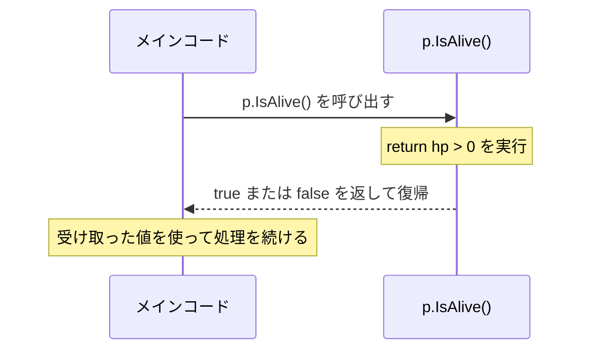

# メソッド

「HP をダメージ分だけ減らす」処理を複数箇所で書くとします。

```csharp
p1.hp = p1.hp - 10;
p2.hp = p2.hp - 10;
```

同じ処理を繰り返し書くのは非効率で、修正漏れの原因にもなります。**メソッド**は処理に名前をつけてクラスに定義する仕組みです。一度書けばどこからでも呼び出して再利用できます。

## 学習目標

- メソッドの定義と呼び出しの違いを説明できる
- 呼び出し→実行→復帰の流れを理解できる
- `void` メソッドを定義して呼び出せる
- パラメータを使って処理に値を渡せる
- 戻り値を使って処理の結果を受け取れる
- シグネチャの概念を理解できる
- オーバーロードで同名メソッドを使い分けられる

## 前提知識

- [クラスとフィールド](/unity-csharp-learning/csharp/classes/) を読んでいること

---

## 1. メソッドを定義する

メソッドはクラスの中に次の形で書きます。

**書式：メソッドの定義**
```
アクセス修飾子  戻り値の型  メソッド名()
{
    処理
}
```

**アクセス修飾子** — 「このメソッドをどこから呼び出せるか」を指定します。詳細は後述するので、まずはどこからでもアクセス可能であることを意味する `public` を使います。

**戻り値の型** — メソッドが「処理の結果として何かを返すか」を指定します。まずは「返さない」ケースから始めましょう。返すものが何もない場合は `void` と書きます（英語で「空」「何もない」という意味）。戻り値については [4. 戻り値](#4-戻り値) で詳しく扱います。

**メソッド名** — このメソッドを呼び出すときに使う名前です。変数と同じように自由に命名できますが、`Run`（実行する）や `Create`（生成する）のように動詞で命名します。

具体的に書くとこうなります。

```csharp
class Player
{
    public string name;
    public int hp;

    public void Greet()
    {
        Console.WriteLine($"こんにちは、{name}です！");
    }
}
```

波かっこ `{ }` の中が**メソッドの本体**です。ここに実行したい処理を書きます。

> ⚠️ **重要**: メソッドを定義しただけでは**何も実行されません**。クラスに「こういう処理を実行できる」という能力を追加したに過ぎず、実際に動かすには「呼び出し」が必要です。

---

## 2. メソッドを呼び出す

メソッドを実行するには、インスタンスに対して `インスタンス.メソッド名()` と書きます。これを**メソッドの呼び出し（コール）**といいます。

**書式：メソッドの呼び出し**
```
インスタンス.メソッド名();
```

```csharp
Player p = new Player();
p.name = "Alice";
p.hp = 100;

Console.WriteLine("--- 呼び出し前 ---");
p.Greet();                         // ← ここで Greet() が実行される
Console.WriteLine("--- 呼び出し後 ---");
```

```
--- 呼び出し前 ---
こんにちは、Aliceです！
--- 呼び出し後 ---
```

呼び出し前後の `Console.WriteLine` を見ると、メソッドが呼ばれた瞬間だけ中の処理が実行され、**終わったら呼び出し元に戻ってくる**ことがわかります。

### 実行の流れ



この「呼び出し → 実行 → 復帰」の流れはすべてのメソッドに共通です。同じメソッドを何度でも呼び出せます。

```csharp
Player p1 = new Player();
p1.name = "Alice";
Player p2 = new Player();
p2.name = "Bob";

p1.Greet();
p2.Greet();
p1.Greet();
```

```
こんにちは、Aliceです！
こんにちは、Bobです！
こんにちは、Aliceです！
```

---

## 3. パラメータ

「10 ダメージ」「25 ダメージ」のように、呼び出すたびに異なる値を処理に渡したいことがあります。**パラメータ**はメソッドの呼び出し元から値を受け取るための「入口」です。

**書式：パラメータありメソッドの定義**
```
アクセス修飾子  戻り値の型  メソッド名(型 パラメータ名1, 型 パラメータ名2, ...)
{
    処理
}
```

**パラメータ名**はメソッド本体の中でその値を使うときに書く名前です。呼び出し側で渡した値がこの名前で受け取れます。**型**はフィールドや変数と同様に `int`・`string` などを指定します。複数受け取るときはカンマで区切って並べます。

まず 1 つのパラメータから見てみましょう。

```csharp
class Player
{
    public string name;
    public int hp;

    public void TakeDamage(int damage)
    {
        hp = hp - damage;
        Console.WriteLine($"{name} が {damage} ダメージを受けた。残りHP={hp}");
    }
}
```

```csharp
Player p = new Player();
p.name = "Alice";
p.hp = 100;
p.TakeDamage(10);   // damage = 10 として実行される
p.TakeDamage(25);   // damage = 25 として実行される
```

```
Alice が 10 ダメージを受けた。残りHP=90
Alice が 25 ダメージを受けた。残りHP=65
```

複数のパラメータの例です。カンマで区切って複数の値を受け取ることができます。

```csharp
class Player
{
    public string name;

    public void Move(int x, int y)
    {
        Console.WriteLine($"{name} が ({x}, {y}) に移動した");
    }
}
```

```csharp
Player p = new Player();
p.name = "Alice";
p.Move(3, 5);    // 1番目の値 3 → x、2番目の値 5 → y に渡る
```

```
Alice が (3, 5) に移動した
```

呼び出し元は**定義されたパラメータの数・型・順番に従って**値を渡す必要があります。数が合わない場合や型が異なる場合はコンパイルエラーになります。

```csharp
p.Move(3);        // ❌ 引数が足りない
p.Move(3, 5, 7);  // ❌ 引数が多すぎる
p.Move("left", 5); // ❌ 1番目は int なのに string を渡している
```

---

## 4. 戻り値

「HP が 0 より大きいか調べて結果を使いたい」「現在のステータスを文字列で取り出したい」など、処理の結果を呼び出し元に返したい場面があります。メソッドが返す値を**戻り値**といいます。

戻り値がある場合は `void` の代わりに**返す値の型**を書き、本体の中で `return` で値を返します。

**書式：return 文**
```
return 値;
```

`return` に達するとその値を呼び出し元に渡してメソッドが終了します。返す型は `int`・`bool`・`string` など、メソッドの定義と一致している必要があります。

`bool` を返す例と `string` を返す例を見てみましょう。

```csharp
class Player
{
    public string name;
    public int hp;
    public int score;

    public bool IsAlive()
    {
        return hp > 0;
    }

    public string GetStatus()
    {
        return $"{name}: HP={hp}, Score={score}";
    }
}
```

```csharp
Player p = new Player();
p.name = "Alice";
p.hp = 100;
p.score = 50;

Console.WriteLine(p.GetStatus());
Console.WriteLine($"生存中={p.IsAlive()}");

p.hp = 0;
Console.WriteLine($"生存中={p.IsAlive()}");
```

```
Alice: HP=100, Score=50
生存中=True
生存中=False
```

`return` に達するとメソッドはそこで終了します。残りのコードは実行されません。`void` メソッドでは `return;`（値なし）で途中終了できます。

### 戻り値がある場合の実行の流れ



---

## 5. シグネチャとオーバーロード

**シグネチャ**とは、メソッドを識別するための「メソッド名＋パラメータの型の並び」のことです。

```
TakeDamage(int)         → シグネチャ: TakeDamage(int)
TakeDamage(int, bool)   → シグネチャ: TakeDamage(int, bool)
```

C# では**同じクラス内にシグネチャが異なるメソッドを複数定義できます**。これを**オーバーロード**と呼びます。たとえば「通常のダメージ計算」と「クリティカルを考慮したダメージ計算」を同じ名前で書き分けられます。

```csharp
class Player
{
    public string name;
    public int hp;

    public void TakeDamage(int damage)
    {
        hp = hp - damage;
        Console.WriteLine($"{name} が {damage} ダメージ。残りHP={hp}");
    }

    public void TakeDamage(int damage, bool critical)
    {
        int actualDamage = critical ? damage * 2 : damage;
        hp = hp - actualDamage;
        Console.WriteLine($"{name} が {actualDamage} ダメージ（クリティカル={critical}）。残りHP={hp}");
    }
}
```

```csharp
Player p = new Player();
p.name = "Alice";
p.hp = 100;

p.TakeDamage(10);
p.TakeDamage(10, true);
```

```
Alice が 10 ダメージ。残りHP=90
Alice が 20 ダメージ（クリティカル=True）。残りHP=70
```

呼び出し時に渡した引数の型と数によって、どのメソッドが実行されるかが自動的に決まります。

> ⚠️ **注意**: 戻り値の型だけが異なるメソッドはオーバーロードになりません（コンパイルエラー）。

---

## まとめ

- **メソッドの定義** — クラスに「この処理を実行できる」能力を追加する。定義しただけでは何も実行されない
- **メソッドの呼び出し** — `インスタンス.メソッド名()` と書いた瞬間に処理が実行される。終端または `return` に達すると呼び出し元に復帰する
- **`void` メソッド** — 戻り値なし。処理を実行するだけのメソッド
- **パラメータ** — メソッドに値を渡すための仕組み。複数定義可
- **戻り値** — `return` でメソッドの実行結果を呼び出し元に返す
- **シグネチャ** — メソッド名＋パラメータの型の並び。メソッドの識別に使われる
- **オーバーロード** — シグネチャが異なる同名メソッドを同じクラスに複数定義すること

---

## 理解度チェック

1. 次のコードの出力結果を答えてください。

   ```csharp
   class Calc
   {
       public int Add(int a, int b)
       {
           return a + b;
       }

       public int Add(int a, int b, int c)
       {
           return a + b + c;
       }
   }

   Calc calc = new Calc();
   Console.WriteLine($"result={calc.Add(3, 4)}");
   Console.WriteLine($"result={calc.Add(1, 2, 3)}");
   ```

2. 次のクラスに `Heal(int amount)` メソッドを追加してください。HP が `maxHp` を超えないよう制限すること。

   ```csharp
   class Player
   {
       public string name;
       public int hp;
       public int maxHp;
   }
   ```

3. （応用）`int` 型と `double` 型のどちらを渡しても面積を返す `Area` メソッドをオーバーロードで定義してください（縦×横の長方形）。

<details markdown="1">
<summary>解答を見る</summary>

1. ```
   result=7
   result=6
   ```
   引数の数が異なるためオーバーロードが選ばれる。

2. ```csharp
   public void Heal(int amount)
   {
       hp = hp + amount;
       if (hp > maxHp) { hp = maxHp; }
   }
   ```

3. ```csharp
   class Shape
   {
       public int Area(int width, int height)
       {
           return width * height;
       }

       public double Area(double width, double height)
       {
           return width * height;
       }
   }
   ```

</details>

---

## 次のステップ

[コンストラクタ](/unity-csharp-learning/csharp/constructors/) では、インスタンス生成時に自動的に呼び出されてフィールドを初期化する仕組みを学びます。
