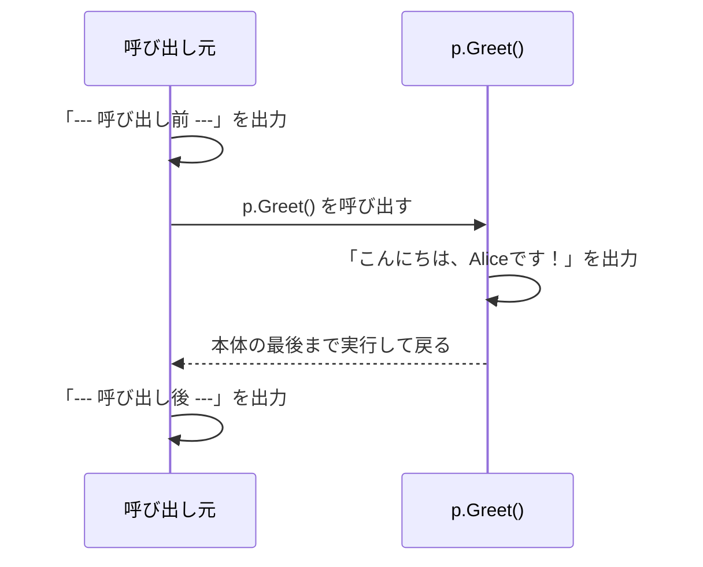
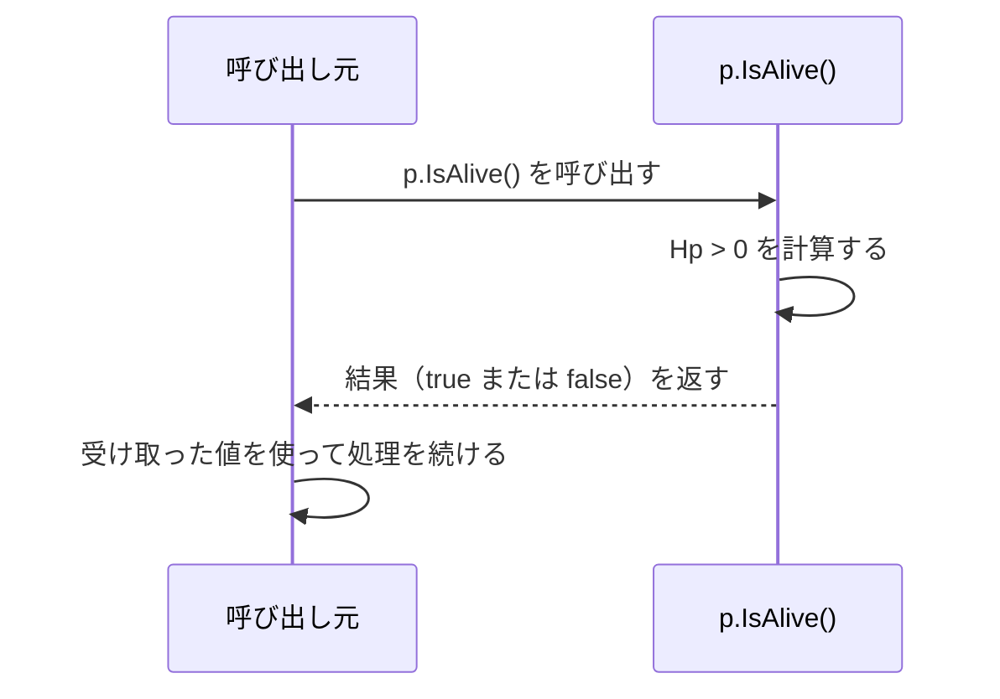

# メソッド

**メソッド**（method）は、処理に名前を付けてクラスに定義したものです。一度定義すれば、名前を書くだけで何度でも呼び出して使えます。このページでは、メソッドの定義と呼び出し、値を受け取るパラメータ、結果を返す戻り値、同じ名前のメソッドを複数定義するオーバーロードを学びます。

## 学習目標

このページを読み終えると、以下のことができるようになります。

- メソッドを定義し、呼び出せる
- メソッドを呼び出すと、処理が実行されて呼び出し元に戻る流れを説明できる
- パラメータで、メソッドに値を渡せる
- 戻り値で、メソッドの結果を受け取れる
- 本体が式 1 つのメソッドを、式形式（`=>`）で書ける
- シグネチャとオーバーロードを説明できる

## 前提知識

- [クラスとフィールド](/unity-csharp-learning/csharp/classes/) を読んでいること

---

## 1. メソッドを定義する

「HP をダメージの分だけ減らす」処理を、いろいろな場所で書くとします。

```csharp
Player p1 = new Player();
p1.Hp = 100;
Player p2 = new Player();
p2.Hp = 80;

p1.Hp = p1.Hp - 10;
p2.Hp = p2.Hp - 10;
Console.WriteLine($"{p1.Hp}, {p2.Hp}");

class Player
{
    public int Hp;
}
```

```
90, 70
```

同じ処理を何度も書くと、手間がかかるうえに、処理を変えたいときにすべての場所を直す必要があります。処理をメソッドとしてクラスに定義しておけば、1 か所を直すだけで済みます。

[メソッド](https://learn.microsoft.com/dotnet/csharp/programming-guide/classes-and-structs/methods) は、クラスの中に次の形で定義します。

**書式：[メソッドの定義](https://learn.microsoft.com/dotnet/csharp/programming-guide/classes-and-structs/methods#method-signatures)**
```
アクセス修飾子 戻り値の型 メソッド名()
{
    // 処理
}
```

| 要素 | 説明 |
|---|---|
| `アクセス修飾子` | メソッドをどこから呼び出せるか。ここでは、クラスの外からも呼び出せる `public` を書く |
| `戻り値の型` | メソッドが結果として返す値の型。何も返さないときは [void](https://learn.microsoft.com/dotnet/csharp/language-reference/keywords/void)（「空」という意味）と書く。戻り値は 4 節で学ぶ |
| `メソッド名` | メソッドの名前。PascalCase で、`Greet`（あいさつする）や `TakeDamage`（ダメージを受ける）のように、動作を表す名前にするのが慣例 |
| `{ }` | メソッドの本体。実行する処理を書く |

```csharp
class Player
{
    public string Name = "";
    public int Hp;

    public void Greet()
    {
        Console.WriteLine($"こんにちは、{Name}です！");
    }
}
```

メソッドの本体では、同じクラスのフィールドを、`Name` のように名前だけで使えます。

メソッドを定義しただけでは、何も実行されません。クラスに「こういう処理ができる」という能力を加えただけです。実行するには、メソッドを **呼び出す** 必要があります。

---

## 2. メソッドを呼び出す

メソッドを呼び出すには、`インスタンス.メソッド名()` と書きます。

**書式：メソッドの呼び出し**
```
インスタンス.メソッド名();
```

```csharp
Player p = new Player();
p.Name = "Alice";

Console.WriteLine("--- 呼び出し前 ---");
p.Greet();
Console.WriteLine("--- 呼び出し後 ---");

class Player
{
    public string Name = "";

    public void Greet()
    {
        Console.WriteLine($"こんにちは、{Name}です！");
    }
}
```

```
--- 呼び出し前 ---
こんにちは、Aliceです！
--- 呼び出し後 ---
```

`p.Greet()` を実行すると、`Greet` の本体の処理が実行されます。本体の最後まで実行すると、呼び出した場所に戻り、次の行から実行が続きます。


```mermaid
sequenceDiagram
    participant C as 呼び出し元
    participant M as p.Greet()
    C->>C: 「--- 呼び出し前 ---」を出力
    C->>M: p.Greet() を呼び出す
    M->>M: 「こんにちは、Aliceです！」を出力
    M-->>C: 本体の最後まで実行して戻る
    C->>C: 「--- 呼び出し後 ---」を出力
```

同じメソッドを、何度でも呼び出せます。メソッドの本体の `Name` は、呼び出したインスタンスのフィールドです。

```csharp
Player p1 = new Player();
p1.Name = "Alice";
Player p2 = new Player();
p2.Name = "Bob";

p1.Greet();
p2.Greet();
p1.Greet();

class Player
{
    public string Name = "";

    public void Greet()
    {
        Console.WriteLine($"こんにちは、{Name}です！");
    }
}
```

```
こんにちは、Aliceです！
こんにちは、Bobです！
こんにちは、Aliceです！
```

`p1.Greet()` では `p1` の `Name`、`p2.Greet()` では `p2` の `Name` が使われます。

---

## 3. パラメータ

「10 ダメージ」「25 ダメージ」のように、呼び出すたびに違う値をメソッドに渡したいことがあります。メソッドが値を受け取るための変数を **パラメータ**（parameter）といいます。

**書式：[パラメータのあるメソッドの定義](https://learn.microsoft.com/dotnet/csharp/programming-guide/classes-and-structs/methods#method-parameters-vs-arguments)**
```
アクセス修飾子 戻り値の型 メソッド名(型 パラメータ名, 型 パラメータ名, ...)
{
    // 処理
}
```

パラメータは、メソッドの本体で使える変数です。複数のパラメータは、`,` で区切って並べます。

```csharp
Player p = new Player();
p.Name = "Alice";
p.Hp = 100;

p.TakeDamage(10);
p.TakeDamage(25);

class Player
{
    public string Name = "";
    public int Hp;

    public void TakeDamage(int damage)
    {
        Hp = Hp - damage;
        Console.WriteLine($"{Name} が {damage} ダメージを受けた。残り HP={Hp}");
    }
}
```

```
Alice が 10 ダメージを受けた。残り HP=90
Alice が 25 ダメージを受けた。残り HP=65
```

`p.TakeDamage(10)` と呼び出すと、パラメータ `damage` に `10` が入った状態で本体が実行されます。呼び出すときに渡す値 `10` を、**引数**（argument）といいます。

パラメータが複数あるときは、引数を `,` で区切って、パラメータと同じ順番に並べます。

```csharp
Player p = new Player();
p.Name = "Alice";
p.Move(3, 5);

class Player
{
    public string Name = "";

    public void Move(int x, int y)
    {
        Console.WriteLine($"{Name} が ({x}, {y}) に移動した");
    }
}
```

```
Alice が (3, 5) に移動した
```

1 つ目の引数 `3` が `x` に、2 つ目の引数 `5` が `y` に入ります。

引数は、パラメータの数・型・順番に合わせて渡す必要があります。合っていないと、コンパイルエラーになります。

```csharp
// ❌ NG: 引数がパラメータと合っていない
// p.Move(3);          // CS7036（引数が足りない）
// p.Move(3, 5, 7);    // CS1501（引数が多すぎる）
// p.Move("left", 5);  // CS1503（1 つ目は int なのに string を渡している）
```

---

## 4. 戻り値

「HP が 0 より大きいか」「今の状態を表す文字列」のように、メソッドで計算した結果を呼び出し元で使いたいことがあります。メソッドが返す値を **戻り値** といいます。

戻り値のあるメソッドでは、`void` の代わりに返す値の型を書き、本体の中で [return 文](https://learn.microsoft.com/dotnet/csharp/language-reference/statements/jump-statements#the-return-statement) を使って値を返します。

**書式：[return 文](https://learn.microsoft.com/dotnet/csharp/language-reference/statements/jump-statements#the-return-statement)**
```
return 式;
```

`return` を実行すると、式の値を呼び出し元に返して、メソッドを終えます。式の型は、メソッドの戻り値の型に合わせます。

```csharp
Player p = new Player();
p.Name = "Alice";
p.Hp = 100;

Console.WriteLine(p.GetStatus());
Console.WriteLine($"生存中={p.IsAlive()}");

p.Hp = 0;
Console.WriteLine($"生存中={p.IsAlive()}");

class Player
{
    public string Name = "";
    public int Hp;

    public bool IsAlive()
    {
        return Hp > 0;
    }

    public string GetStatus()
    {
        return $"{Name}: HP={Hp}";
    }
}
```

```
Alice: HP=100
生存中=True
生存中=False
```

`p.IsAlive()` は、メソッドが返した `bool` の値になります。戻り値のあるメソッドの呼び出しは式なので、`Console.WriteLine` の引数や文字列補間の中に書けます。


```mermaid
sequenceDiagram
    participant C as 呼び出し元
    participant M as p.IsAlive()
    C->>M: p.IsAlive() を呼び出す
    M->>M: Hp > 0 を計算する
    M-->>C: 結果（true または false）を返す
    C->>C: 受け取った値を使って処理を続ける
```

### return でメソッドを途中で終える

`return` を実行すると、その後の処理は実行されずに、メソッドが終わります。戻り値のない `void` のメソッドでも、`return;` と書けば途中で終えられます。

```csharp
Player p = new Player();
p.Hp = 100;

p.TakeDamage(-5);
p.TakeDamage(30);

class Player
{
    public int Hp;

    public void TakeDamage(int damage)
    {
        if (damage < 0)
        {
            Console.WriteLine("ダメージが負なので何もしない");
            return;
        }
        Hp = Hp - damage;
        Console.WriteLine($"残り HP={Hp}");
    }
}
```

```
ダメージが負なので何もしない
残り HP=70
```

---

## 5. 式形式のメソッド

4 節の `IsAlive` や `GetStatus` のように、本体が `return 式;` の 1 行だけのメソッドは、`{ }` と `return` を省略して、`=>` の後に式だけを書けます。これを **式形式のメンバー**（expression-bodied member）といいます。C# 6 以降で使えます。

**書式：[式形式のメソッド](https://learn.microsoft.com/dotnet/csharp/language-reference/operators/lambda-operator#expression-body-definition)**
```
アクセス修飾子 戻り値の型 メソッド名(パラメータ) => 式;
```

| 書き方 | 同じ意味のブロックの書き方 |
|---|---|
| `public bool IsAlive() => Hp > 0;` | `public bool IsAlive() { return Hp > 0; }` |
| `public void Greet() => Console.WriteLine("こんにちは");` | `public void Greet() { Console.WriteLine("こんにちは"); }` |

戻り値のあるメソッドでは、式の値が戻り値になります。`void` のメソッドでは、式を 1 つ実行するだけです。

1 節〜4 節の `Greet`・`IsAlive`・`GetStatus` を、式形式で書きます。

```csharp
Player p = new Player();
p.Name = "Alice";
p.Hp = 100;

p.Greet();
Console.WriteLine(p.GetStatus());
Console.WriteLine($"生存中={p.IsAlive()}");

class Player
{
    public string Name = "";
    public int Hp;

    public void Greet() => Console.WriteLine($"こんにちは、{Name}です！");

    public bool IsAlive() => Hp > 0;

    public string GetStatus() => $"{Name}: HP={Hp}";
}
```

```
こんにちは、Aliceです！
Alice: HP=100
生存中=True
```

`=>` の後に書けるのは、式 1 つだけです。`if` 文や `return` 文のような文は書けません。文を書く必要があるメソッドや、処理が 2 行以上になるメソッドは、これまでどおり `{ }` で書きます。

```csharp
// ❌ NG: => の後に return 文は書けない
// public int F() => return 1;  // CS1525
```

式形式とブロックのどちらで書いても、メソッドの動きは同じです。本体が短い式 1 つのときに、読みやすいほうを選びます。

> 💡 **ポイント**: 同じ `=>` の記号は、[switch 式](/unity-csharp-learning/csharp/switch-expressions/) や [ラムダ式](/unity-csharp-learning/csharp/lambda/) でも使いますが、それぞれ別の文法です。どれも「`=>` の右側が結果（本体）」という点は共通しています。式形式は、メソッドのほかに、[プロパティ](/unity-csharp-learning/csharp/properties/) やコンストラクターなどのメンバーにも使えます。

---

## 6. シグネチャとオーバーロード

メソッドの名前と、パラメータの型の並びをあわせたものを、**シグネチャ**（signature）といいます。

| メソッド | シグネチャ |
|---|---|
| `void TakeDamage(int damage)` | `TakeDamage(int)` |
| `void TakeDamage(int damage, bool critical)` | `TakeDamage(int, bool)` |

同じクラスの中に、名前が同じでシグネチャが違うメソッドを、複数定義できます。これを **オーバーロード**（overload）といいます。呼び出したときの引数の数と型によって、どのメソッドが実行されるかが決まります。

```csharp
Player p = new Player();
p.Name = "Alice";
p.Hp = 100;

p.TakeDamage(10);
p.TakeDamage(10, true);

class Player
{
    public string Name = "";
    public int Hp;

    public void TakeDamage(int damage)
    {
        Hp = Hp - damage;
        Console.WriteLine($"{Name} が {damage} ダメージ。残り HP={Hp}");
    }

    public void TakeDamage(int damage, bool critical)
    {
        int actualDamage = critical ? damage * 2 : damage;
        Hp = Hp - actualDamage;
        Console.WriteLine($"{Name} が {actualDamage} ダメージ（クリティカル={critical}）。残り HP={Hp}");
    }
}
```

```
Alice が 10 ダメージ。残り HP=90
Alice が 20 ダメージ（クリティカル=True）。残り HP=70
```

`p.TakeDamage(10)` では引数が 1 つなので `TakeDamage(int)` が、`p.TakeDamage(10, true)` では `TakeDamage(int, bool)` が実行されます。どのメソッドが選ばれるかの詳しい規則は、[オーバーロード解決](/unity-csharp-learning/csharp/overload-resolution/) で学びます。

---

## よくあるミス

### 戻り値の型だけが違うメソッドを定義する

```csharp
// ❌ NG: 戻り値の型だけが違うメソッドは、オーバーロードできない
// class C
// {
//     public int F() { return 1; }
//     public double F() { return 1.0; }  // CS0111
// }
```

戻り値の型は、シグネチャに含まれません。名前とパラメータの型の並びが同じメソッドは、戻り値の型が違っても、同じシグネチャのメソッドを 2 つ定義したことになり、コンパイルエラーになります。

### 戻り値のあるメソッドで return を書き忘れる

```csharp
// ❌ NG: int を返すメソッドなのに、return がない
// class C
// {
//     public int F()
//     {
//     }  // CS0161
// }
```

戻り値の型が `void` でないメソッドは、どのような道筋で実行しても、最後に必ず `return` で値を返す必要があります。

---

## まとめ

- メソッドは、処理に名前を付けてクラスに定義したもの。定義しただけでは実行されない
- `インスタンス.メソッド名()` で呼び出すと、本体が実行され、終わると呼び出し元に戻る
- パラメータで、メソッドに値を受け取る。呼び出すときに渡す値を引数という
- 戻り値の型を書き、`return` で結果を返す。何も返さないメソッドの戻り値の型は `void`
- `return` を実行すると、メソッドはそこで終わる
- 本体が式 1 つのメソッドは、`=> 式;` の式形式で書ける。戻り値のあるメソッドでは、式の値が戻り値になる
- シグネチャは、メソッド名とパラメータの型の並び。シグネチャが違えば、同じ名前のメソッドを複数定義できる（オーバーロード）

---

## 理解度チェック

1. 次のコードを実行すると何が出力されますか？

   ```csharp
   Calc calc = new Calc();
   Console.WriteLine($"result={calc.Add(3, 4)}");
   Console.WriteLine($"result={calc.Add(1, 2, 3)}");

   class Calc
   {
       public int Add(int a, int b)
       {
           return a + b;
       }

       public int Add(int a, int b, int c)
       {
           return a + b + c;
       }
   }
   ```

2. 次のクラスに、HP を回復する `Heal(int amount)` メソッドを追加してください。回復した後の HP が `MaxHp` を超えないようにします。

   ```csharp
   class Player
   {
       public int Hp;
       public int MaxHp;
   }
   ```

3. （応用）縦と横の長さから長方形の面積を返す `Area` メソッドを、`int` の引数用と `double` の引数用に、オーバーロードで定義してください。

<details markdown="1">
<summary>解答を見る</summary>

1. 次のように出力されます。引数の数によって、呼び出される `Add` が決まります。

   ```
   result=7
   result=6
   ```

2. ```csharp
   Player p = new Player();
   p.MaxHp = 100;
   p.Hp = 80;
   p.Heal(50);
   Console.WriteLine(p.Hp);

   class Player
   {
       public int Hp;
       public int MaxHp;

       public void Heal(int amount)
       {
           Hp = Hp + amount;
           if (Hp > MaxHp)
           {
               Hp = MaxHp;
           }
       }
   }
   ```

   `100` が表示されます。

3. ```csharp
   Shape shape = new Shape();
   Console.WriteLine(shape.Area(3, 4));
   Console.WriteLine(shape.Area(1.5, 2.0));

   class Shape
   {
       public int Area(int width, int height)
       {
           return width * height;
       }

       public double Area(double width, double height)
       {
           return width * height;
       }
   }
   ```

   `12` と `3` が表示されます。

</details>

---

## 次のステップ

[コンストラクター](/unity-csharp-learning/csharp/constructors/) では、インスタンスを作るときに自動的に呼び出され、フィールドを初期化するメソッドを学びます。
