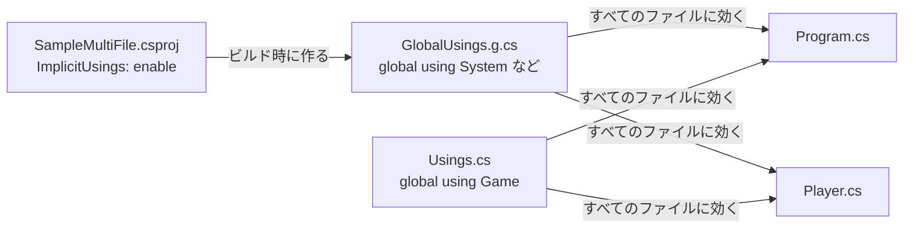

# ファイルの分割と global using

ここまでは、1 つのファイルにすべてのコードを書いてきました。実際のプログラムでは、型ごとにファイルを分けるのが一般的です。このページでは、プロジェクトにファイルを追加して型を分ける方法と、そのときに使う **ファイルスコープの名前空間**（file-scoped namespace）を学びます。プロジェクトのすべてのファイルに効く **global using** と、暗黙的な using ディレクティブの仕組みも説明します。

## 学習目標

このページを読み終えると、以下のことができるようになります。

- プロジェクトにファイルを追加し、別のファイルにある型を使える
- ファイルスコープの名前空間で、ファイルにある型を名前空間に入れられる
- `global using` で、プロジェクトのすべてのファイルに名前空間を読み込める
- 暗黙的な using ディレクティブが、`global using` として作られていることを説明できる
- 暗黙的に読み込む名前空間を、`.csproj` で追加・除外できる

## 前提知識

- [.NET SDK と dotnet CLI](/unity-csharp-learning/csharp/dotnet-sdk/) を読み、プロジェクトを作って実行できること
- [名前空間](/unity-csharp-learning/csharp/namespaces/) を読んでいること

---

## 1. プロジェクトにファイルを追加する

[.NET SDK と dotnet CLI](/unity-csharp-learning/csharp/dotnet-sdk/) で学んだ手順で、コンソールアプリのプロジェクトを作ります。

```powershell
dotnet new console -n SampleMultiFile
```

`SampleMultiFile` フォルダーに、`Player.cs` というファイルを追加して、次のように書きます。

```csharp
class Player
{
    public string Name = "勇者";
}
```

`Program.cs` を、次のように書き換えます。

```csharp
Player p = new Player();
Console.WriteLine(p.Name);
```

`SampleMultiFile` フォルダーで `dotnet run` を実行します。

```
勇者
```

`Program.cs` から、別のファイルにある `Player` を使えました。同じプロジェクトにある `.cs` ファイルは、まとめて 1 つのプログラムとしてコンパイルされるからです。`Player` は名前空間を指定していないので、グローバル名前空間に入っています。

---

## 2. ファイルスコープの名前空間

`Player` を `Game` 名前空間に入れます。[名前空間](/unity-csharp-learning/csharp/namespaces/) で学んだブロック形式でも書けますが、1 つのファイルに 1 つの名前空間を書くときは、ファイルスコープの名前空間が使えます。

**書式：[ファイルスコープの名前空間](https://learn.microsoft.com/dotnet/csharp/language-reference/keywords/namespace)**
```
namespace 名前空間名;

// 型の定義
```

| 要素 | 説明 |
|---|---|
| `namespace 名前空間名;` | ファイルの先頭（`using` ディレクティブの後）に書くと、そのファイルにあるすべての型が、この名前空間に入る |

`{ }` で囲む書き方と違い、`;` で終えます。ファイル全体が 1 つの名前空間に入り、型の定義の字下げが 1 段少なくなります。

`Player.cs` を、次のように書き換えます。

```csharp
namespace Game;

class Player
{
    public string Name = "勇者";
}
```

このまま `dotnet run` を実行すると、`Program.cs` の `Player` が CS0246 のエラーになります。`Player` がグローバル名前空間から `Game` 名前空間に移ったからです。`Program.cs` の先頭に `using Game;` を書きます。

```csharp
using Game;

Player p = new Player();
Console.WriteLine(p.Name);
```

```
勇者
```

`using Game;` が必要なのは、ファイルが分かれているからではなく、`Player` が `Game` 名前空間にあるからです。

> 💡 **ポイント**: 名前空間の名前と、ファイルを置くフォルダーの名前は、一致させる決まりはありません。ただし、`Game/Characters/Enemy.cs` のファイルに `Game.Characters` 名前空間を書くように、フォルダーの構成と名前空間をそろえておくと、型のファイルを探しやすくなります。

---

## 3. global using

`using` ディレクティブの効果は、書いたファイルの中だけです。複数のファイルで同じ名前空間を使うなら、それぞれのファイルに `using` を書く必要があります。

`global` を付けると、1 か所に書くだけで、プロジェクトのすべてのファイルに効果が及びます。

**書式：[global using ディレクティブ](https://learn.microsoft.com/dotnet/csharp/language-reference/keywords/using-directive#the-global-modifier)**
```
global using 名前空間;
```

| 要素 | 説明 |
|---|---|
| `global` | プロジェクトのすべてのファイルに効果を及ぼすことを表す |
| `名前空間` | 読み込む名前空間。`global using static` や `global using` のエイリアスも書ける |

`SampleMultiFile` フォルダーに、`Usings.cs` というファイルを追加します。

```csharp
global using Game;
```

`Program.cs` から `using Game;` を削除します。

```csharp
Player p = new Player();
Console.WriteLine(p.Name);
```

`dotnet run` を実行すると、`using Game;` がなくても `Player` を使えます。

```
勇者
```

`global using` は、どのファイルに書いてもかまいません。ただし、どこに書いたのかがわからなくなりやすいので、`Usings.cs` のような 1 つのファイルにまとめておくのが一般的です。

---

## 4. 暗黙的な using ディレクティブの正体

[名前空間と using ディレクティブ（補足）](/unity-csharp-learning/csharp/using-directives/) で学んだ暗黙的な using ディレクティブは、`global using` で作られています。`.csproj` の `<ImplicitUsings>enable</ImplicitUsings>` が有効なプロジェクトでは、ビルドするときに、`obj/Debug/net10.0/SampleMultiFile.GlobalUsings.g.cs` のようなファイルが自動で作られます。

```csharp
// <auto-generated/>
global using System;
global using System.Collections.Generic;
global using System.IO;
global using System.Linq;
global using System.Net.Http;
global using System.Threading;
global using System.Threading.Tasks;
```

このファイルもプロジェクトのほかのファイルと一緒にコンパイルされるので、すべてのファイルで `Console` や `List<T>` を `using` なしで使えます。



読み込まれる名前空間は、プロジェクトの種類で変わります。たとえば、[ASP.NET Core でサーバーを作る](/unity-csharp-learning/networking/aspnetcore-server/) で使う Web アプリのプロジェクトでは、`Microsoft.AspNetCore.Http` などの名前空間も読み込まれます。種類ごとの一覧は、[.NET プロジェクト SDK の暗黙的な using ディレクティブ](https://learn.microsoft.com/dotnet/core/project-sdk/overview#implicit-using-directives) で確認できます。

---

## 5. .csproj で追加・除外する

暗黙的に読み込む名前空間は、`.csproj` の `<Using>` 要素で追加したり、除外したりできます。`Usings.cs` と同じ効果を `.csproj` で得るので、先に `Usings.cs` を削除します。そのうえで、`SampleMultiFile.csproj` の `</Project>` の前に、次の `<ItemGroup>` を追加します。

```xml
  <ItemGroup>
    <Using Include="Game" />
    <Using Remove="System.Net.Http" />
  </ItemGroup>
```

| 要素 | 説明 |
|---|---|
| `<Using Include="名前空間" />` | 暗黙的に読み込む名前空間に追加する |
| `<Using Remove="名前空間" />` | 暗黙的に読み込む名前空間から除外する |

`dotnet run` を実行すると、`Usings.cs` がなくても `Player` を使えます。

```
勇者
```

`GlobalUsings.g.cs` を開くと、`global using Game;` が加わり、`global using System.Net.Http;` がなくなっています。

---

## よくあるミス

### トップレベルのステートメントと同じファイルに、ファイルスコープの名前空間を書く

```csharp
// ❌ NG: ファイルスコープの名前空間は、ファイルのほかのすべてのメンバーより前に書く
// Console.WriteLine(new Game.Player().Name);
//
// namespace Game;  // CS8956
//
// class Player
// {
//     public string Name = "勇者";
// }
```

ファイルスコープの名前空間は、ファイルの中のすべての型を 1 つの名前空間に入れる書き方なので、ファイルの先頭（`using` ディレクティブの後）に書く必要があります。一方、トップレベルのステートメントは、名前空間の宣言より前に書く必要があります。この 2 つは同じファイルに書けないので、型を別のファイルに分けるか、ブロック形式の名前空間を使います。

### 1 つのファイルに、ファイルスコープの名前空間を 2 つ書く

```csharp
// ❌ NG: ファイルスコープの名前空間は、1 つのファイルに 1 つだけ
// namespace Game;
// namespace Audio;  // CS8954
```

1 つのファイルに複数の名前空間を書きたいときは、ブロック形式を使います。

### global using を、ふつうの using より後に書く

```csharp
// ❌ NG: global using は、ふつうの using ディレクティブより前に書く
// using System.Text;
// global using System.Diagnostics;  // CS8915
```

同じファイルに書くときは、`global using` をすべて先に書きます。

---

## まとめ

- 同じプロジェクトにある `.cs` ファイルは、まとめて 1 つのプログラムとしてコンパイルされる。別のファイルにある型も使える
- `namespace 名前空間名;` のファイルスコープの名前空間で、ファイルにあるすべての型を 1 つの名前空間に入れる。トップレベルのステートメントと同じファイルには書けない
- `using` が必要かどうかは、型の名前空間で決まる。ファイルが分かれているかどうかでは決まらない
- `global using` は、プロジェクトのすべてのファイルに効く
- 暗黙的な using ディレクティブは、`ImplicitUsings` の設定からビルド時に作られる `global using`。読み込む名前空間はプロジェクトの種類で変わり、`.csproj` の `<Using>` で追加・除外できる

---

## 理解度チェック

1. `Enemy.cs` に `class Enemy { }` とだけ書きました。同じプロジェクトの `Program.cs` で、`using` を書かずに `Enemy` を使えますか？ 理由も答えてください。
2. トップレベルのステートメントを書いた `Program.cs` に、`namespace Game;` と書いて `Player` クラスを定義したところ、コンパイルエラーになりました。直し方を 2 つ答えてください。
3. `.csproj` の `<ImplicitUsings>enable</ImplicitUsings>` を `disable` に変えると、`Console.WriteLine("x");` だけの `Program.cs` が CS0103 のエラーになります。理由と、`.csproj` を元に戻さずに直す方法を答えてください。

<details markdown="1">
<summary>解答を見る</summary>

1. 使えます。同じプロジェクトのファイルはまとめてコンパイルされ、名前空間を指定していない `Enemy` はグローバル名前空間に入るので、`using` なしで使えます。
2. `Player` クラスを `Player.cs` などの別のファイルに移し、そのファイルに `namespace Game;` を書きます。または、`Program.cs` のまま、ブロック形式の `namespace Game { }` で `Player` を囲み、トップレベルのステートメントより後ろに書きます（CS8956）。
3. 暗黙的な using ディレクティブが無効になり、`global using System;` が作られなくなるからです。`Program.cs` の先頭に `using System;` を書くか、`Usings.cs` などに `global using System;` を書きます。

</details>

---

## 次のステップ

これで「C# プログラムの構成」のセクションは終わりです。[継承](/unity-csharp-learning/csharp/inheritance/) からは「C# 継承と抽象化」のセクションに進み、既存のクラスのメンバーを引き継いで、新しいクラスを作る仕組みを学びます。
